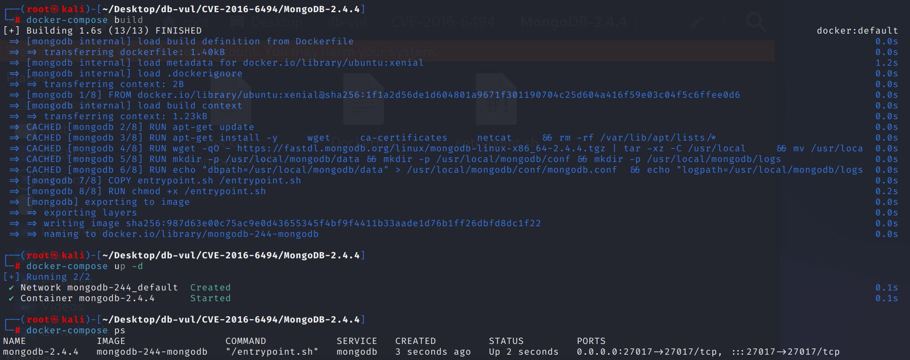
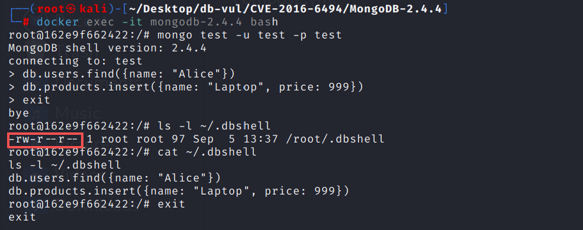

# CVE-2016-6494 CWE-200 MongoDB Information Leak

## Vulnerability Background
- **MongoDB:** A high-performance, open-source, pattern-free document database, and the most popular among NoSQL databases. MongoDB uses a JSON-like BSON format to store data, making data storage and querying very flexible. It supports very loose data structures and can store more complex data types. MongoDB stands out for its powerful query language, which can perform almost all functions similar to single-table queries in relational databases, and supports indexing, making data queries faster.
- **.dbshell file:** MongoDB clients (such as `mongo` or `mongosh`) save the history of commands executed by users in a file named `.dbshell`. This file is usually located in the user's home directory (`~/.dbshell` for Linux/macOS, `%USERPROFILE%\.dbshell` for Windows). This file is used to keep command history between different sessions, making it easy for users to quickly access previously executed commands using the up and down arrow keys.
- **CWE-200 (Exposure of Sensitive Information to an Unauthorized Actor):** "Exposing sensitive information to unauthorized participants." The system does not adequately filter logs, error messages, or API responses for exits, allowing attackers to obtain internal data such as accounts, keys, and paths without authorization, thereby providing a springboard for subsequent intrusions.

## Vulnerability Mechanism
When creating `.dbshell` files, the MongoDB client did not set file permissions correctly, causing the file to be readable by default to all users. This allows local users to read the file without authorization and obtain sensitive information such as database connection strings, usernames, passwords, or executed commands.

## Vulnerability Location
Analysis of MongoDB 2.4.4 source code:

src/mongo/shell/linenoise.cpp file, in line 2628 of the `linenoiseHistorySave()` function, directly uses `fopen(filename, "wt")` to create or overwrite historical files. `fopen()` When creating a new file, file permissions are not explicitly specified; instead, the current `umask` of the process and the system's default creation mode jointly determine the final permissions. In a typical Linux environment, if a user's `umask` is `0022`, the newly created file usually receives `0644` permissions, indicating the file owner can read and write it, and both users in the same group and other local users can read it.

Since `.dbshell` stores historical commands from MongoDB Shell, files may contain database names, collection names, query conditions, join strings, management commands, and even business-sensitive data. Therefore, when `.dbshell` is created with `0644` or similar lenient permissions, local low-privilege users can directly access the historical file, causing sensitive information leaks.

```c++
/* Save the history in the specified file. On success 0 is returned
 * otherwise -1 is returned. */
int linenoiseHistorySave( const char* filename ) {
    FILE* fp = fopen( filename, "wt" );
    if ( fp == NULL ) {
        return -1;
    }

    for ( int j = 0; j < historyLen; ++j ) {
        if ( history[j][0] != '\0' ) {
            fprintf ( fp, "%s\n", history[j] );
        }
    }
    fclose( fp );
    return 0;
}
```

## Remediation
In the POSIX environment, `.dbshell` files are no longer created directly through `fopen()`. Instead, files are created with `open()` and permissions explicitly set to `0600`, followed by `fdopen()` converting the file descriptor into a standard I/O file stream for writing.

```diff
diff --git a/src/mongo/shell/linenoise.cpp b/src/mongo/shell/linenoise.cpp
index f75028c8845a0..8b70214ac5b44 100644
--- a/src/mongo/shell/linenoise.cpp
+++ b/src/mongo/shell/linenoise.cpp
@@ -2762,7 +2762,17 @@ int linenoiseHistorySetMaxLen(int len) {
 /* Save the history in the specified file. On success 0 is returned
  * otherwise -1 is returned. */
 int linenoiseHistorySave(const char* filename) {
-    FILE* fp = fopen(filename, "wt");
+    FILE* fp;
+#if _POSIX_C_SOURCE >= 1 || _XOPEN_SOURCE || _POSIX_SOURCE
+    int fd = open(filename, O_CREAT, S_IRUSR | S_IWUSR);
+    if (fd == -1) {
+        // report errno somehow?
+        return -1;
+    }
+    fp = fdopen(fd, "wt");
+#else
+    fp = fopen(filename, "wt");
+#endif  // _POSIX_C_SOURCE >= 1 || _XOPEN_SOURCE || _POSIX_SOURCE
     if (fp == NULL) {
         return -1;
     }
@@ -2772,7 +2782,7 @@ int linenoiseHistorySave(const char* filename) {
             fprintf(fp, "%s\n", history[j]);
         }
     }
-    fclose(fp);
+    fclose(fp);  // Also causes fd to be closed.
     return 0;
 }
```

## Affected Versions
MongoDB：

-  x to 3.0.14
- 3.2 to 3.2.13
- 3.3 to 3.3.13

## Environment Setup
Start the Docker environment, MongoDB version 2.4.4, administrator admin, password admin, database test and regular user test with readWrite role, password test

```txt
NIST:NVD    Base Score:5.5 MEDIUM    Vector:CVSS:3.0/AV:L/AC:L/PR:L/UI:N/S:U/C:H/I:N/A:N
```

```txt
cpe:2.3:a:mongodb:mongodb:2.4.4:*:*:*:*:*:*:*
```



## Vulnerability Reproduction
1. Enter the container command line

```bash
   docker exec -it mongodb-2.4.4 bash 
   ```

2. Connect to the test database as a test user, with the password set to test

```bash
   mongo test -u test -p test
   ```

3. Perform some random operations

```bash
   db.users.find({name: "Alice"})
   db.products.insert({name: "Laptop", price: 999})
   ```

4. Exit the connection and search for `.dbshell` file in the user's home directory. You can see the file permission is `-rw-r--r--`(644), meaning it is readable by all users, posing an information leakage risk

```bash
   ls -l ~/.dbshell
   ```

5. View the contents of the `.dbshell` file, where you can see that the file contains sensitive information from previous operations, such as database name, collection name, or query statement.

```bash
   cat ~/.dbshell
   ```



## PoC Analysis
The session writes commands to `~/.dbshell` and then shows that the file mode is `0644`. Reading it as another local user demonstrates the confidentiality failure: command history may expose database names, queries, and credentials embedded in connection commands. The issue is local and does not expose the file over MongoDB's network protocol.
## References
[NVD - CVE-2016-6494](https://nvd.nist.gov/vuln/detail/CVE-2016-6494#range-14544159)

[[SERVER-25335\] 0002 umask yields world-readable .dbshell history file - MongoDB Jira](https://jira.mongodb.org/browse/SERVER-25335)

[SERVER-25335 SERVER-26489 avoid group and other permissions when crea… ·  mongodb/mongo@0ee5999](https://github.com/mongodb/mongo/commit/0ee59992ef9627809e2ff13c608a023fc6b8c909)

https://github.com/mongodb/mongo/commit/035cf2afc04988b22cb67f4ebfd77e9b344cb6e0#diff-8f48544f766401ba24ce6542ee11450e7223efd6890b9fafc7219286c5d2f477.diff
