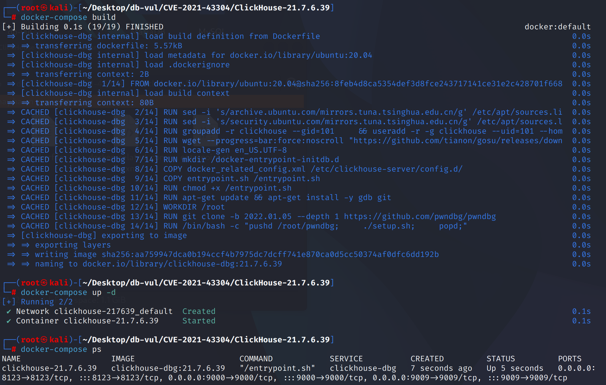
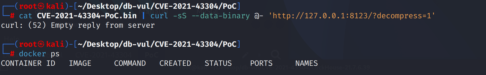
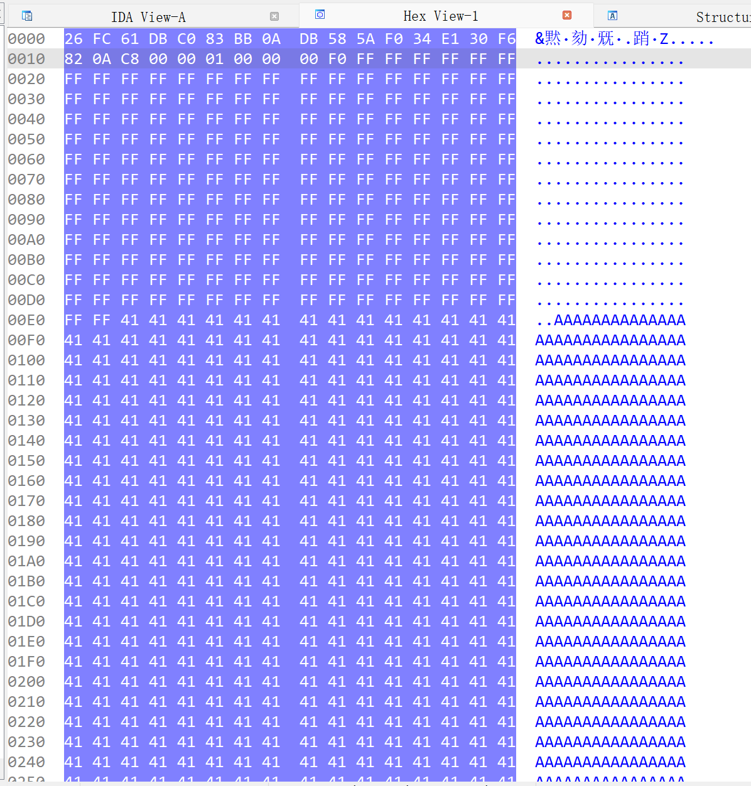

# CVE-2021-43304 CWE-787&122 ClickHouse heap buffer overflow

## Vulnerability Background
- **ClickHouse :** An open-source columnar database management system designed specifically for online analytical processing (OLAP) scenarios, capable of efficiently handling large-scale data queries and analysis tasks. It offers high-performance data compression and parallel computing capabilities, supporting fast queries and real-time analysis of large-scale datasets. ClickHouse's architecture supports distributed computing, allowing it to scale across multiple nodes and provide high availability and fault tolerance in big data environments. Thanks to its fast query performance and scalability, ClickHouse excels in handling big data analytics, log analysis, data warehousing, and other application scenarios.
- **LZ4 :** An efficient compression algorithm designed to provide fast compression and decompression speeds, typically used in high-performance applications. The LZ4 decompression process is based on the LZ77 algorithm, which restores the original data by searching for duplicate byte sequences. It uses sliding window technology to replace duplicate data by searching for byte patterns that have appeared before, thereby achieving compression. LZ4's decompression operation is very fast because it does not require complex calculations but recovers data through simple byte copying and pattern matching, making it especially suitable for real-time data processing and big data analysis applications.

## Vulnerability Mechanism
In the `LZ4::decompressImpl` decompression cycle, the number of copies is not properly verified, especially when handling compressed data, the scope of `wildCopy<copy_amount>` operations is not verified. If input data is maliciously constructed, attackers can control the `copy_amount` to write the data to any position on the heap.

## Vulnerability Location
Analysis of ClickHouse 21.7.6.39 source code:

In the ClickHouse/src/Compression/LZ4_decompress_faster.cpp file, line 415 of the decompressImpl function is a core part implementing the LZ4 decompression algorithm, responsible for extracting and restoring the original data from the compressed data stream.

At line 464, when using wildCopy for copying, it is not ensured that the target buffer `dest` has enough space to store the extracted data. If the decompressed data exceeds `dest_size`, it may cause the decompression process to write data beyond the target buffer to the target buffer, resulting in heap overflow.

```cpp
void NO_INLINE decompressImpl(
     const char * const source,
     char * const dest,
     size_t dest_size)
{
    const UInt8 * ip = reinterpret_cast<const UInt8 *>(source);
    UInt8 * op = reinterpret_cast<UInt8 *>(dest);
    UInt8 * const output_end = op + dest_size;

#if defined(__clang__)
    #pragma nounroll
#endif
    while (true)
    {
        size_t length;

        auto continue_read_length = [&]
        {
            unsigned s;
            do
            {
                s = *ip++;
                length += s;
            } while (unlikely(s == 255));
        };

        /// Get literal length.

        const unsigned token = *ip++;
        length = token >> 4;
        if (length == 0x0F)
            continue_read_length();

        /// Copy literals.

        UInt8 * copy_end = op + length;

// 464 lines **************************8****
        wildCopy<copy_amount>(op, ip, copy_end);    /// Here we can write up to copy_amount - 1 bytes after buffer.

        ip += length;
        op = copy_end;

        if (copy_end >= output_end)
            return;

        /// Get match offset.

        size_t offset = unalignedLoad<UInt16>(ip);
        ip += 2;
        const UInt8 * match = op - offset;

        /// Get match length.

        length = token & 0x0F;
        if (length == 0x0F)
            continue_read_length();
        length += 4;

        copy_end = op + length;
        if (unlikely(offset < copy_amount))
        {
            copyOverlap<copy_amount, use_shuffle>(op, match, offset);
        }
        else
        {
            copy<copy_amount>(op, match);
            match += copy_amount;
        }

        op += copy_amount;

        copy<copy_amount>(op, match);   /// copy_amount + copy_amount - 1 - 4 * 2 bytes after buffer.
        if (length > copy_amount * 2)
            wildCopy<copy_amount>(op + copy_amount, match + copy_amount, copy_end);

        op = copy_end;
    }
}
```

## Remediation

Upgrade to ClickHouse 21.10.2.15 or a later supported release containing commit `08fbab09b023e32db1c4a09dfb161e394492d561`. The decompressor now verifies that length-extension bytes and the rounded `wildCopy` input range remain inside `input_end` before every speculative copy, returning a decompression error instead of reading or writing beyond either buffer.

Until upgraded, do not accept untrusted compressed ClickHouse blocks, restrict the native protocol to trusted clients, and terminate connections that repeatedly submit malformed LZ4 data. Process isolation can limit impact but does not fix the unsafe decompressor.
Add multiple boundary checks to ensure buffer overflow does not occur before `wildCopy<copy_amount>`

```diff
diff --git a/src/Compression/LZ4_decompress_faster.cpp b/src/Compression/LZ4_decompress_faster.cpp
index 28a285f00f4b..bbe3e899620f 100644
--- a/src/Compression/LZ4_decompress_faster.cpp
+++ b/src/Compression/LZ4_decompress_faster.cpp
@@ -450,7 +450,11 @@ bool NO_INLINE decompressImpl(
         const unsigned token = *ip++;
         length = token >> 4;
         if (length == 0x0F)
+        {
+            if (unlikely(ip + 1 >= input_end))
+                return false;
             continue_read_length();
+        }
 
         /// Copy literals.
 
@@ -470,6 +474,9 @@ bool NO_INLINE decompressImpl(
         if (unlikely(copy_end > output_end))
             return false;
 
+        if (unlikely(ip + std::max(copy_amount, static_cast<size_t>(std::ceil(static_cast<double>(length) / copy_amount) * copy_amount)) >= input_end))
+            return false;
+
         wildCopy<copy_amount>(op, ip, copy_end);    /// Here we can write up to copy_amount - 1 bytes after buffer.
 
         if (copy_end == output_end)
@@ -494,7 +501,11 @@ bool NO_INLINE decompressImpl(
 
         length = token & 0x0F;
         if (length == 0x0F)
+        {
+            if (unlikely(ip + 1 >= input_end))
+                return false;
             continue_read_length();
+        }
         length += 4;
 
         /// Copy match within block, that produce overlapping pattern. Match may replicate itself.
```

## Affected Versions
- ClickHouse x excluding to 21.10.2.15

## Environment Setup
Start the Docker environment, ClickHouse version is 21.7.6.39

```txt
NIST:NVD   Base Score:8.8 HIGH   Vector:CVSS:3.1/AV:N/AC:L/PR:N/UI:N/S:U/C:H/I:H/A:H
```

```txt
cpe:2.3:a:apache:solr:21.7.6.39:*:*:*:*:*:*:*
```



## Vulnerability Reproduction
Go to the PoC folder, execute the PoC file, and send a maliciously constructed LZ4 compressed data stream to the local ClickHouse service. You can see that the ClickHouse server has not returned any information (if an error occurs, it will run again). Checking the container status, you can see that no container is running, meaning the ClickHouse server crashed

```bash
cat CVE-2021-43304-PoC.bin | curl -sS --data-binary @- 'http://127.0.0.1:8123/?decompress=1'
```

```bash
docker ps
```



## PoC Analysis
The query content in binary files should be in the following format

```c
struct {    
        uint128_t hash; // Google’s CityHash128    
        uint8_t compress_method;    
        uint32_t size_compressed_without_checksum; // the length (in bytes) of the entire struct (including compressed_data contents) minus the first 16bytes hash field.     
        uint32_t decompressed_size; // the expected decompressed output size     
        char compressed_data[0]; // the compressed data bytes (variable length)};
       }
```

In binary compressed data, "\xff" (repeated 200 times) and "A" (repeated 5100 times) are used. These are arbitrary values. The generated misformatted compressed file uses 200 0xff in the loop within LZ4::d ecompressImpl().



## References
https://nvd.nist.gov/vuln/detail/CVE-2021-43304

[Security Vulnerabilities Found in ClickHouse Open-Source Software](https://jfrog.com/blog/7-rce-and-dos-vulnerabilities-found-in-clickhouse-dbms/)

[clickhouse-lz4-rce/README.md at main · s3nt3/clickhouse-lz4-rce](https://github.com/s3nt3/clickhouse-lz4-rce/blob/main/README.md)

[Fix some issues · ClickHouse/ClickHouse@08fbab0](https://github.com/ClickHouse/ClickHouse/commit/08fbab09b023e32db1c4a09dfb161e394492d561)
