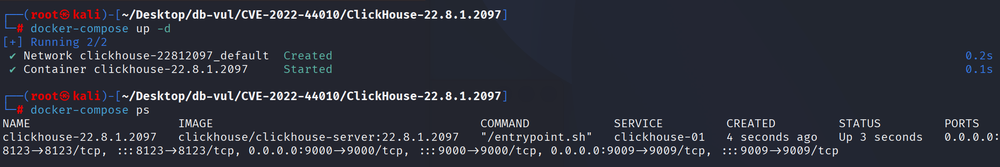
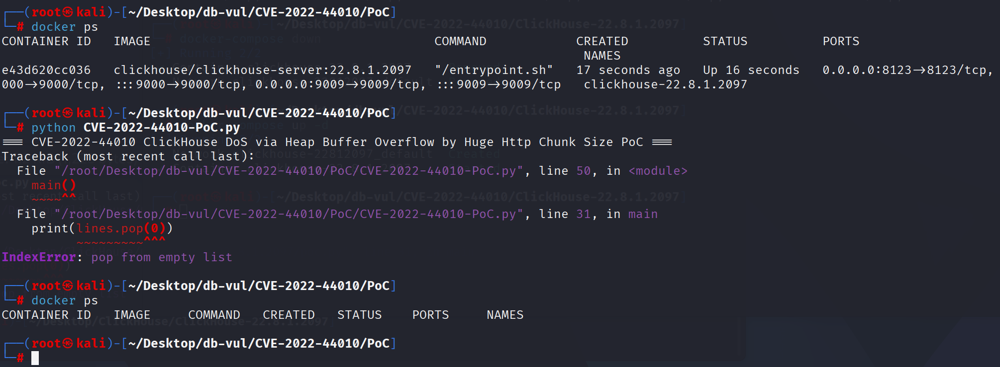

# CVE-2022-44010 CWE-787 ClickHouse heap buffer overflow

## Vulnerability Background
- **ClickHouse :** An open-source columnar database management system designed specifically for online analytical processing (OLAP) scenarios, capable of efficiently handling large-scale data queries and analysis tasks. It offers high-performance data compression and parallel computing capabilities, supporting fast queries and real-time analysis of large-scale datasets. ClickHouse's architecture supports distributed computing, allowing it to scale across multiple nodes and provide high availability and fault tolerance in big data environments. Thanks to its fast query performance and scalability, ClickHouse excels in handling big data analytics, log analysis, data warehousing, and other application scenarios.

## Vulnerability Mechanism
There is no effective limit on block size in HTTP chunked encoding data, causing malicious requests to send exceptionally large block sizes, which can lead to heap buffer overflow and denial-of-service (DoS) attacks.

## Vulnerability Location
Analysis of ClickHouse-22.8.1.2097 source code:

In the ClickHouse/src/IO/HTTPChunkedReadBuffer.cpp file, line 19 `readChunkHeader()` function is used to parse the size of each HTTP chunk, ensuring the chunk size matches the expected size and performing error checks during parsing.

Line 30 only ensures that the block size does not exceed the `size_t` range, but it does not limit the appropriate maximum block size. Without an upper limit. Attackers can send an extremely large legitimate block size that passes checks as long as it is within `size_t` range, but such a large value can cause system crashes or resource exhaustion, triggering denial-of-service (DoS) attacks.

```cpp
size_t HTTPChunkedReadBuffer::readChunkHeader()
{
    if (in->eof())
        throw Exception("Unexpected end of file while reading chunk header of HTTP chunked data", ErrorCodes::UNEXPECTED_END_OF_FILE);

    if (!isHexDigit(*in->position()))
        throw Exception("Unexpected data instead of HTTP chunk header", ErrorCodes::CORRUPTED_DATA);

    size_t res = 0;
    do
    {
        if (common::mulOverflow(res, 16ul, res) || common::addOverflow<size_t>(res, unhex(*in->position()), res))
            throw Exception("Chunk size is out of bounds", ErrorCodes::ARGUMENT_OUT_OF_BOUND);
        ++in->position();
    } while (!in->eof() && isHexDigit(*in->position()));

    /// NOTE: If we want to read any chunk extensions, it should be done here.

    skipToCarriageReturnOrEOF(*in);

    if (in->eof())
        throw Exception("Unexpected end of file while reading chunk header of HTTP chunked data", ErrorCodes::UNEXPECTED_END_OF_FILE);

    assertString("\n", *in);
    return res;
}
```

## Remediation
Modify the constructor of the `HTTPChunkedReadBuffer` class to add a `max_chunk_size_` parameter to specify the maximum allowed block size, so that it can be checked when reading a block.

At the same time, after reading the block header, a new logic is added to check whether the read block size `res` exceeds the preset maximum `max_chunk_size`. If the block size exceeds the limit, a `Exception` exception is thrown, giving an error message `"Chunk size exceeded the limit"`. This error will be reported as a `ErrorCodes::ARGUMENT_OUT_OF_BOUND` error code.

```diff
diff --git a/src/IO/HTTPChunkedReadBuffer.cpp b/src/IO/HTTPChunkedReadBuffer.cpp
index 75827679d0cd..a7841b1180f4 100644
--- a/src/IO/HTTPChunkedReadBuffer.cpp
+++ b/src/IO/HTTPChunkedReadBuffer.cpp
@@ -32,6 +32,9 @@ size_t HTTPChunkedReadBuffer::readChunkHeader()
         ++in->position();
     } while (!in->eof() && isHexDigit(*in->position()));
 
+    if (res > max_chunk_size)
+        throw Exception("Chunk size exceeded the limit", ErrorCodes::ARGUMENT_OUT_OF_BOUND);
+
     /// NOTE: If we want to read any chunk extensions, it should be done here.
 
     skipToCarriageReturnOrEOF(*in);
diff --git a/src/IO/HTTPChunkedReadBuffer.h b/src/IO/HTTPChunkedReadBuffer.h
index 378835cafc0c..68d90e470fa5 100644
--- a/src/IO/HTTPChunkedReadBuffer.h
+++ b/src/IO/HTTPChunkedReadBuffer.h
@@ -10,9 +10,12 @@ namespace DB
 class HTTPChunkedReadBuffer : public BufferWithOwnMemory<ReadBuffer>
 {
 public:
-    explicit HTTPChunkedReadBuffer(std::unique_ptr<ReadBuffer> in_) : in(std::move(in_)) {}
+    explicit HTTPChunkedReadBuffer(std::unique_ptr<ReadBuffer> in_, size_t max_chunk_size_)
+        : max_chunk_size(max_chunk_size_), in(std::move(in_))
+    {}
 
 private:
+    const size_t max_chunk_size;
     std::unique_ptr<ReadBuffer> in;
 
     size_t readChunkHeader();
```

## Affected Versions
ClickHouse

- 22.3 excluding to 22.3.12.19
- 22.6 excluding to 22.6.6.16
- 22.7 excluding to 22.7.4.16
- 22.8 excluding to 22.8.2.11
- 22.9 excluding to 22.9.1.2603

## Environment Setup
Start the Docker environment; ClickHouse version is 22.8.1.2097

```txt
NIST:NVD   Base Score:7.5 HIGH   Vector:CVSS:3.1/AV:N/AC:L/PR:N/UI:N/S:U/C:H/I:H/A:H
```

```txt
cpe:2.3:a:clickhouse:clickhouse:23.10:*:*:*:*:*:*:*
```



## Vulnerability Reproduction
Go into the PoC folder, execute the PoC file, and send a very large load to the local ClickHouse service. You can see that the ClickHouse server has not returned any information (if an error occurs, it will run again). Checking the container status, you can see that no container is running, meaning the ClickHouse server crashed

```bash
python CVE-2022-44010-PoC.py
```

```bash
docker ps
```



## PoC Analysis
The PoC sends an HTTP request whose chunk-size metadata causes ClickHouse to process a block larger than the destination allocation. Loss of the server process after the request confirms the out-of-bounds write and denial-of-service condition; the demonstration does not by itself prove reliable code execution.
## References
https://nvd.nist.gov/vuln/detail/CVE-2022-44010

[fix heap buffer overflow by limiting http chunk size by CheSema · Pull Request #40292 · ClickHouse/ClickHouse](https://github.com/ClickHouse/ClickHouse/pull/40292)

[fix heap buffer overflow by limiting http chunk size by CheSema · Pull Request #40292 · ClickHouse/ClickHouse](https://github.com/ClickHouse/ClickHouse/pull/40292/files)
