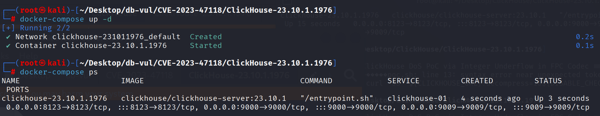
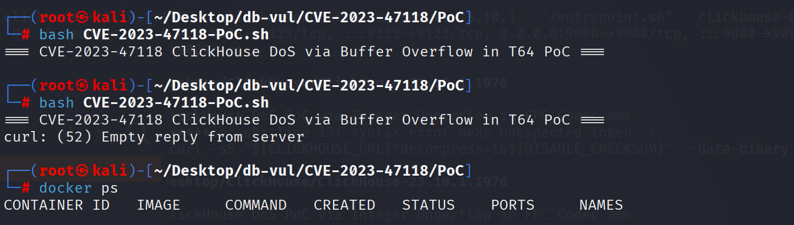

# CVE-2023-47118 CWE-787&122 ClickHouse 缓冲区溢出

## 漏洞背景

- **ClickHouse ：**一个开源的列式数据库管理系统，专为在线分析处理（OLAP）场景设计，能够高效地处理大规模的数据查询和分析任务。它提供了高性能的数据压缩和并行计算能力，支持大规模数据集的快速查询和实时分析。ClickHouse 的架构支持分布式计算，使其能够扩展到多个节点，并在大数据环境中提供高可用性和容错性。由于其快速的查询性能和可伸缩性，ClickHouse 在处理大数据分析、日志分析、数据仓库等应用场景中表现出色。

## 漏洞原理

ClickHouse 的 T64 编解码器在解压缩过程中没有对数据进行充分的边界检查，导致攻击者能够通过发送特制的压缩数据触发堆缓冲区溢出。攻击者可以通过操控压缩数据中的元素数量或数据结构，使得解压后的数据大小与预期不符，进而引发非法的内存访问和溢出，从而导致服务器崩溃或潜在的代码执行风险。

## 漏洞定位

分析 ClickHouse-23.10.1.1976  源码：

在 ClickHouse/src/Compression/CompressionCodecT64.cpp  文件，第 539 行`decompressData`函数用于解压缩通过 T64 编解码器压缩的数据。但是其没有对解压数据元素数量的检查，使得攻击者可以利用特制的压缩数据，绕过解压过程中的错误检查，导致堆缓冲区溢出。

```cpp
// CompressionCodecT64.cpp 文件，第 539 行
void decompressData(const char * src, UInt32 bytes_size, char * dst, UInt32 uncompressed_size)
{
    using MinMaxType = std::conditional_t<is_signed_v<T>, Int64, UInt64>;

    static constexpr const UInt32 matrix_size = 64;
    static constexpr const UInt32 header_size = 2 * sizeof(UInt64);

    if (bytes_size < header_size)
        throw Exception(ErrorCodes::CANNOT_DECOMPRESS, "Cannot decompress, data size {} is less then T64 header",
                        bytes_size);

    if (uncompressed_size % sizeof(T))
        throw Exception(ErrorCodes::CANNOT_DECOMPRESS, "Cannot decompress, unexpected uncompressed size {}",
                        uncompressed_size);

    UInt64 num_elements = uncompressed_size / sizeof(T);
    MinMaxType min;
    MinMaxType max;

    /// Read header
    {
        memcpy(&min, src, sizeof(MinMaxType));
        memcpy(&max, src + 8, sizeof(MinMaxType));
        src += header_size;
        bytes_size -= header_size;
    }

    UInt32 num_bits = getValuableBitsNumber(min, max);
    if (!num_bits)
    {
        T min_value = static_cast<T>(min);
        for (UInt32 i = 0; i < num_elements; ++i, dst += sizeof(T))
            unalignedStore<T>(dst, min_value);
        return;
    }

    UInt32 src_shift = sizeof(UInt64) * num_bits;
    UInt32 dst_shift = sizeof(T) * matrix_size;

    if (!bytes_size || bytes_size % src_shift)
        throw Exception(ErrorCodes::CANNOT_DECOMPRESS, "Cannot decompress, data size {} is not multiplier of {}",
                        bytes_size, toString(src_shift));

    UInt32 num_full = bytes_size / src_shift;
    UInt32 tail = num_elements % matrix_size;
    if (tail)
        --num_full;

    T upper_min = 0;
    T upper_max [[maybe_unused]] = 0;
    T sign_bit [[maybe_unused]] = 0;
    if (num_bits < 64)
        upper_min = static_cast<T>(static_cast<UInt64>(min) >> num_bits << num_bits);

    if constexpr (is_signed_v<T>)
    {
        if (min < 0 && max >= 0 && num_bits < 64)
        {
            sign_bit = static_cast<T>(1ull << (num_bits - 1));
            upper_max = static_cast<T>(static_cast<UInt64>(max) >> num_bits << num_bits);
        }
    }

    T buf[matrix_size];
    for (UInt32 i = 0; i < num_full; ++i)
    {
        reverseTranspose<T, full>(src, buf, num_bits);
        restoreUpperBits(buf, upper_min, upper_max, sign_bit);
        store<T>(buf, dst, matrix_size);
        src += src_shift;
        dst += dst_shift;
    }

    if (tail)
    {
        reverseTranspose<T, full>(src, buf, num_bits, tail);
        restoreUpperBits(buf, upper_min, upper_max, sign_bit, tail);
        store<T>(buf, dst, tail);
    }
}
```

## 漏洞修复


补丁增加了数据一致性检查，用于核对解压后的元素数量与预期值；两者不一致时立即抛出异常。

```diff
diff --git a/src/Compression/CompressionCodecT64.cpp b/src/Compression/CompressionCodecT64.cpp
index 3506c087b54c..832b47bdbd0f 100644
--- a/src/Compression/CompressionCodecT64.cpp
+++ b/src/Compression/CompressionCodecT64.cpp
@@ -66,6 +66,7 @@ namespace ErrorCodes
     extern const int ILLEGAL_SYNTAX_FOR_CODEC_TYPE;
     extern const int ILLEGAL_CODEC_PARAMETER;
     extern const int LOGICAL_ERROR;
+    extern const int INCORRECT_DATA;
 }
 
 namespace
@@ -145,7 +146,7 @@ TypeIndex deserializeTypeId(uint8_t serialized_type_id)
         case MagicNumber::IPv4:         return TypeIndex::IPv4;
     }
 
-    throw Exception(ErrorCodes::LOGICAL_ERROR, "Bad magic number in T64 codec: {}", static_cast<UInt32>(serialized_type_id));
+    throw Exception(ErrorCodes::INCORRECT_DATA, "Bad magic number in T64 codec: {}", static_cast<UInt32>(serialized_type_id));
 }
 
 
@@ -378,13 +379,6 @@ void transpose(const T * src, char * dst, UInt32 num_bits, UInt32 tail = 64)
 
 /// UInt64[N] transposed matrix -> UIntX[64]
 template <typename T, bool full = false>
-#if defined(__s390x__)
-
-/* Compiler Bug for S390x :- https://github.com/llvm/llvm-project/issues/62572
- * Please remove this after the fix is backported
- */
-        __attribute__((noinline))
-#endif
 void reverseTranspose(const char * src, T * buf, UInt32 num_bits, UInt32 tail = 64)
 {
     UInt64 matrix[64] = {};
@@ -544,12 +538,13 @@ void decompressData(const char * src, UInt32 bytes_size, char * dst, UInt32 unco
     static constexpr const UInt32 header_size = 2 * sizeof(UInt64);
 
     if (bytes_size < header_size)
-        throw Exception(ErrorCodes::CANNOT_DECOMPRESS, "Cannot decompress, data size {} is less then T64 header",
+        throw Exception(ErrorCodes::CANNOT_DECOMPRESS, "Cannot decompress, data size ({}) is less than the size of T64 header",
                         bytes_size);
 
     if (uncompressed_size % sizeof(T))
-        throw Exception(ErrorCodes::CANNOT_DECOMPRESS, "Cannot decompress, unexpected uncompressed size {}",
-                        uncompressed_size);
+        throw Exception(ErrorCodes::CANNOT_DECOMPRESS, "Cannot decompress, unexpected uncompressed size ({})"
+                        " isn't a multiple of the data type size ({})",
+                        uncompressed_size, sizeof(T));
 
     UInt64 num_elements = uncompressed_size / sizeof(T);
     MinMaxType min;
@@ -576,14 +571,20 @@ void decompressData(const char * src, UInt32 bytes_size, char * dst, UInt32 unco
     UInt32 dst_shift = sizeof(T) * matrix_size;
 
     if (!bytes_size || bytes_size % src_shift)
-        throw Exception(ErrorCodes::CANNOT_DECOMPRESS, "Cannot decompress, data size {} is not multiplier of {}",
-                        bytes_size, toString(src_shift));
+        throw Exception(ErrorCodes::CANNOT_DECOMPRESS, "Cannot decompress, data size ({}) is not a multiplier of {}",
+                        bytes_size, src_shift);
 
     UInt32 num_full = bytes_size / src_shift;
     UInt32 tail = num_elements % matrix_size;
     if (tail)
         --num_full;
 
+    UInt64 expected = static_cast<UInt64>(num_full) * matrix_size + tail;    /// UInt64 to avoid overflow.
+    if (expected != num_elements)
+        throw Exception(ErrorCodes::CANNOT_DECOMPRESS, "Cannot decompress, the number of elements in the compressed data ({})"
+                        " is not equal to the expected number of elements in the decompressed data ({})",
+                        expected, num_elements);
+
     T upper_min = 0;
     T upper_max [[maybe_unused]] = 0;
     T sign_bit [[maybe_unused]] = 0;
```

## 影响范围


ClickHouse：

- 23.3 系列中早于 23.3.16.7 的版本
- 23.8 系列中早于 23.8.6.16 的版本
- 23.9 系列中早于 23.9.4.11 的版本
- 23.10 系列中早于 23.10.2.13 的版本

## **环境搭建**

启动 Docker 环境，ClickHouse 版本为 23.10.1.1976

```txt
NIST:NVD   Base Score:9.8 CRITICAL   Vector:CVSS:3.1/AV:N/AC:L/PR:N/UI:N/S:U/C:H/I:H/A:H
CNA:GitHub,Inc.   Base Score:7.0 HIGH   Vector:CVSS:3.1/AV:N/AC:H/PR:N/UI:N/S:U/C:L/I:L/A:H
```

```txt
cpe:2.3:a:clickhouse:clickhouse:23.10:*:*:*:*:*:*:*
```



## 漏洞复现

进入 PoC 文件夹，执行 PoC 文件发送一个恶意构造的压缩数据流到本地的 ClickHouse 服务，可以看到 ClickHouse 服务器没有返回任何信息（若报错则再次运行）。查看容器状态，可以看到没有容器运行，即 ClickHouse 服务器崩溃

```bash
bash CVE-2023-47118-PoC.sh
```

```bash
docker ps
```



## PoC分析


提供的二进制文件是格式错误的 T64 压缩块。其声明的元素布局与可用的压缩字节不一致，因此易受攻击的解码器在重建值时会写入堆目标。容器退出是内存损坏的可观察结果。

## 参考链接


https://nvd.nist.gov/vuln/detail/CVE-2023-47118

[Fix buffer overflow in T64 by alexey-milovidov · Pull Request #56434 · ClickHouse/ClickHouse](https://github.com/ClickHouse/ClickHouse/pull/56434)

[Fix buffer overflow in T64 · ClickHouse/ClickHouse@3a4ada3](https://github.com/ClickHouse/ClickHouse/commit/3a4ada3898daf21b1dd393c73a45ad5a89bc0ba3)
