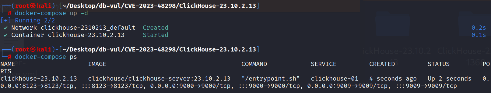
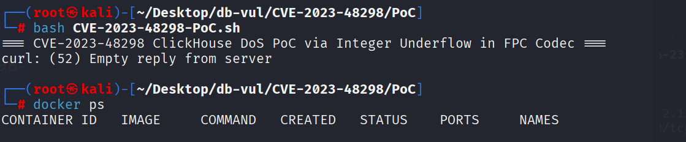

# CVE-2023-48298 CWE-191 ClickHouse 整数溢出

## 漏洞背景

- **ClickHouse ：**一个开源的列式数据库管理系统，专为在线分析处理（OLAP）场景设计，能够高效地处理大规模的数据查询和分析任务。它提供了高性能的数据压缩和并行计算能力，支持大规模数据集的快速查询和实时分析。ClickHouse 的架构支持分布式计算，使其能够扩展到多个节点，并在大数据环境中提供高可用性和容错性。由于其快速的查询性能和可伸缩性，ClickHouse 在处理大数据分析、日志分析、数据仓库等应用场景中表现出色。

## 漏洞原理


ClickHouse 的 FPC 编解码器在解压过程中未充分验证输入数据，尤其缺少对零字节计数的边界检查。攻击者可构造压缩数据，使 `zero_byte_count` 超过 `VALUE_SIZE`，进而导致计算出的 `tail_size` 异常，并可能引发缓冲区越界或非法内存访问，造成程序崩溃或远程代码执行（RCE）。

## 漏洞定位

分析 ClickHouse-23.10.2.13  源码：

在 ClickHouse/src/Compression/CompressionCodecFPC.cpp 文件，第 408 行`decodePair`函数接受一个字节序列 `bytes`，并将其中的压缩数据解码为两个无符号整数 `first` 和 `second`。

第 418 和 419 行在计算解压缩数据中两个值的尾部大小 tail_size1 和 tail_size2 赋值时，虽然有对 bytes.size() 的检查，确保数据大小足够，但对于 tail_size1 和 tail_size2 是否有效并没有单独进行检查。这样，如果零字节计数本身无效（如过大），即使数据大小满足条件，解压缩过程仍然会出现问题。

```cpp
// CompressionCodecFPC.cpp 文件，第 408 行
std::size_t decodePair(std::span<const std::byte> bytes, TUint& first, TUint& second)
    {
        if (bytes.empty()) [[unlikely]]
            throw Exception(ErrorCodes::CANNOT_DECOMPRESS, "Unexpected end of encoded sequence");

        auto zero_byte_count1 = decodeCompressedZeroByteCount(
            std::to_integer<unsigned>(bytes.front() >> 4) & MAX_ZERO_BYTE_COUNT);
        auto zero_byte_count2 = decodeCompressedZeroByteCount(
            std::to_integer<unsigned>(bytes.front()) & MAX_ZERO_BYTE_COUNT);

     // ********** 418 行 **********
        auto tail_size1 = VALUE_SIZE - zero_byte_count1;
        auto tail_size2 = VALUE_SIZE - zero_byte_count2;

        if (bytes.size() < 1 + tail_size1 + tail_size2) [[unlikely]]
            throw Exception(ErrorCodes::CANNOT_DECOMPRESS, "Unexpected end of encoded sequence");

        TUint value1 = 0;
        TUint value2 = 0;

        std::memcpy(valueTail(value1, zero_byte_count1), bytes.data() + 1, tail_size1);
        std::memcpy(valueTail(value2, zero_byte_count2), bytes.data() + 1 + tail_size1, tail_size2);

        auto is_dfcm_predictor1 = std::to_integer<unsigned char>(bytes.front() & DFCM_BIT_1) != 0;
        auto is_dfcm_predictor2 = std::to_integer<unsigned char>(bytes.front() & DFCM_BIT_2) != 0;
        first = decompressValue(value1, is_dfcm_predictor1);
        second = decompressValue(value2, is_dfcm_predictor2);

        return 1 + tail_size1 + tail_size2;
    }
```

## 漏洞修复


升级到包含提交 `a089e6181024a8f48e2e415de8033cca2fa98f50`（拉取请求 56795）的 ClickHouse 版本，或更高的维护版本。修复后的 FPC 解码器使用经过校验的无符号值计算编码尾部大小，并在执行减法或复制前，根据剩余输入长度检查相关数值，从而避免整数下溢和越界读取。

升级前，应阻止不受信任的客户端提交 FPC 压缩数据，并仅允许受信任的应用程序执行插入操作和访问原生协议。查询限制或内存限制无法修复畸形压缩块触发的算术错误。

补丁在 `FPCOperation` 类的 `decodePair` 函数中增加了零字节计数校验。

```diff
diff --git a/src/Compression/CompressionCodecFPC.cpp b/src/Compression/CompressionCodecFPC.cpp
index 506093bbe49c..ec8efa0fb38a 100644
--- a/src/Compression/CompressionCodecFPC.cpp
+++ b/src/Compression/CompressionCodecFPC.cpp
@@ -405,27 +405,35 @@ class FPCOperation
         return decompressed;
     }
 
-    std::size_t decodePair(std::span<const std::byte> bytes, TUint& first, TUint& second)
+    size_t decodePair(std::span<const std::byte> bytes, TUInt & first, TUInt & second)
     {
         if (bytes.empty()) [[unlikely]]
             throw Exception(ErrorCodes::CANNOT_DECOMPRESS, "Unexpected end of encoded sequence");
 
-        auto zero_byte_count1 = decodeCompressedZeroByteCount(
-            std::to_integer<unsigned>(bytes.front() >> 4) & MAX_ZERO_BYTE_COUNT);
-        auto zero_byte_count2 = decodeCompressedZeroByteCount(
-            std::to_integer<unsigned>(bytes.front()) & MAX_ZERO_BYTE_COUNT);
+        UInt32 zero_byte_count1 = decodeCompressedZeroByteCount(
+            std::to_integer<UInt32>(bytes.front() >> 4) & MAX_ZERO_BYTE_COUNT);
+        UInt32 zero_byte_count2 = decodeCompressedZeroByteCount(
+            std::to_integer<UInt32>(bytes.front()) & MAX_ZERO_BYTE_COUNT);
 
-        auto tail_size1 = VALUE_SIZE - zero_byte_count1;
-        auto tail_size2 = VALUE_SIZE - zero_byte_count2;
+        if (zero_byte_count1 > VALUE_SIZE || zero_byte_count2 > VALUE_SIZE) [[unlikely]]
+            throw Exception(ErrorCodes::CANNOT_DECOMPRESS, "Invalid compressed data");
+
+        size_t tail_size1 = VALUE_SIZE - zero_byte_count1;
+        size_t tail_size2 = VALUE_SIZE - zero_byte_count2;
+
+        size_t expected_size = 0;
+        if (__builtin_add_overflow(tail_size1, tail_size2, &expected_size)
+            || __builtin_add_overflow(expected_size, 1, &expected_size)) [[unlikely]]
+            throw Exception(ErrorCodes::CANNOT_DECOMPRESS, "Invalid compressed data");
 
-        if (bytes.size() < 1 + tail_size1 + tail_size2) [[unlikely]]
+        if (bytes.size() < expected_size) [[unlikely]]
             throw Exception(ErrorCodes::CANNOT_DECOMPRESS, "Unexpected end of encoded sequence");
 
-        TUint value1 = 0;
-        TUint value2 = 0;
+        TUInt value1 = 0;
+        TUInt value2 = 0;
 
-        std::memcpy(valueTail(value1, zero_byte_count1), bytes.data() + 1, tail_size1);
-        std::memcpy(valueTail(value2, zero_byte_count2), bytes.data() + 1 + tail_size1, tail_size2);
+        memcpy(valueTail(value1, zero_byte_count1), bytes.data() + 1, tail_size1);
+        memcpy(valueTail(value2, zero_byte_count2), bytes.data() + 1 + tail_size1, tail_size2);
 
         auto is_dfcm_predictor1 = std::to_integer<unsigned char>(bytes.front() & DFCM_BIT_1) != 0;
         auto is_dfcm_predictor2 = std::to_integer<unsigned char>(bytes.front() & DFCM_BIT_2) != 0;
```

## 影响范围


- ClickHouse Cloud 23.9.2.47475 之前
- ClickHouse 23.10.x 23.10.4.25 之前
- ClickHouse 23.3.x 23.3.17.13 之前
- ClickHouse 23.8.x 23.8.7.24 之前
- ClickHouse 23.9.x 23.9.5.29 之前

## **环境搭建**

启动 Docker 环境，ClickHouse 版本为 23.10.2.13

```txt
NIST:NVD   Base Score:7.5 HIGH   Vector:CVSS:3.1/AV:N/AC:L/PR:N/UI:N/S:U/C:H/I:H/A:H
CNA:GitHub,Inc.   Base Score: 5.9 MEDIUM   Vector:CVSS:3.1/AV:N/AC:H/PR:N/UI:N/S:U/C:L/I:L/A:H
```

```txt
cpe:2.3:a:clickhouse:clickhouse:23.10.2.13:*:*:*:*:*:*:*
```



## 漏洞复现

进入 PoC 文件夹，执行 PoC 文件发送一个恶意构造的压缩数据流到本地的 ClickHouse 服务，可以看到 ClickHouse 服务器没有返回任何信息（若报错则再次运行）。查看容器状态，可以看到没有容器运行，即 ClickHouse 服务器崩溃

```bash
bash CVE-2023-48298-PoC.sh
```

```bash
docker ps
```



## PoC分析


精心设计的 FPC 流对无效的零字节计数进行编码。在存在漏洞的解码器中，该计数超过 `VALUE_SIZE`，导致计算出的尾部长度下溢，并导致无效的内存复制。 PoC 建立了可远程触发的崩溃；它没有建立可靠的远程代码执行。

## 参考链接


https://nvd.nist.gov/vuln/detail/CVE-2023-48298

[Fix crash in FPC codec by alexey-milovidov · Pull Request #56795 · ClickHouse/ClickHouse](https://github.com/ClickHouse/ClickHouse/pull/56795)

[Fix crash in FPC codec · ClickHouse/ClickHouse@a089e61](https://github.com/ClickHouse/ClickHouse/commit/a089e6181024a8f48e2e415de8033cca2fa98f50)
