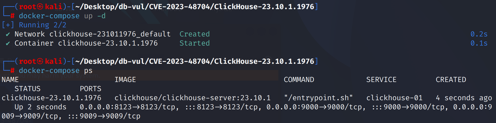
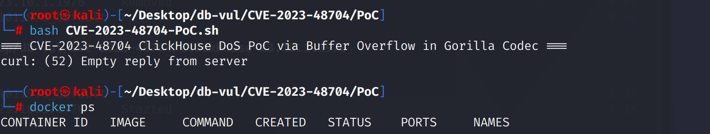

# CVE-2023-48704 CWE-787&120&122 ClickHouse 缓冲区溢出

## 漏洞背景

- **ClickHouse ：**一个开源的列式数据库管理系统，专为在线分析处理（OLAP）场景设计，能够高效地处理大规模的数据查询和分析任务。它提供了高性能的数据压缩和并行计算能力，支持大规模数据集的快速查询和实时分析。ClickHouse 的架构支持分布式计算，使其能够扩展到多个节点，并在大数据环境中提供高可用性和容错性。由于其快速的查询性能和可伸缩性，ClickHouse 在处理大数据分析、日志分析、数据仓库等应用场景中表现出色。
- **Gorilla 编解码器：**一种高效的压缩算法，专门用于时间序列数据的存储，尤其适用于存储大量的浮点数或整数数据。其核心思想是通过 差值编码 和 浮动位编码 来减少数据的存储空间。在差值编码中，算法存储的是连续数据点之间的差值而非原始数据，这对于变化不大的数据尤为有效，能够显著减少存储空间。浮动位编码则通过对数据值进行位级微调，进一步压缩数据大小。Gorilla 编解码器特别适合处理具有时间序列性质的数据，例如监控数据、日志记录和传感器输出等，使得存储更加紧凑且查询时解压效率高。

## 漏洞原理


ClickHouse 的 Gorilla 编解码器在解压过程中未充分检查目标缓冲区大小。攻击者可借助恶意压缩数据影响解压范围，覆盖或访问目标缓冲区之外的内存。这类越界访问可能导致服务器崩溃、内存损坏，甚至造成恶意代码执行。

## 漏洞定位

分析 ClickHouse-23.10.1.1976  源码：

在 ClickHouse//src/Compression/CompressionCodecGorilla.cpp 文件负责 Gorilla 编解码器的压缩与解压缩操作。

第 267 行`decompressDataForType`函数没有对 `dest` 的大小进行检查，只是从源数据中解压数据并存储到 `dest`。

第 410 行`doDecompressData`函数没有对`bytes_to_skip`和解压数据的长度，如果 `bytes_to_skip` 过大，`memcpy(dest, &source[2], bytes_to_skip)` 将会尝试复制超出源缓冲区的数据，这就会导致 缓冲区溢出。假设 `uncompressed_size` 是由攻击者提供的，并且它不合适地设置，可能会导致 `bytes_to_skip` 计算出一个不正确的值。这种不正确的跳过字节数可能会使后续的内存访问越界，读取或写入无效内存，造成崩溃或数据破坏。

```cpp
void CompressionCodecGorilla::doDecompressData(const char * source, UInt32 source_size, char * dest, UInt32 uncompressed_size) const
{
    if (source_size < 2)
        throw Exception(ErrorCodes::CANNOT_DECOMPRESS, "Cannot decompress. File has wrong header");

    UInt8 bytes_size = source[0];

    if (bytes_size == 0)
        throw Exception(ErrorCodes::CANNOT_DECOMPRESS, "Cannot decompress. File has wrong header");

    UInt8 bytes_to_skip = uncompressed_size % bytes_size;

    if (static_cast<UInt32>(2 + bytes_to_skip) > source_size)
        throw Exception(ErrorCodes::CANNOT_DECOMPRESS, "Cannot decompress. File has wrong header");

    memcpy(dest, &source[2], bytes_to_skip);
    UInt32 source_size_no_header = source_size - bytes_to_skip - 2;
    switch (bytes_size) // NOLINT(bugprone-switch-missing-default-case)
    {
    case 1:
        decompressDataForType<UInt8>(&source[2 + bytes_to_skip], source_size_no_header, &dest[bytes_to_skip]);
        break;
    case 2:
        decompressDataForType<UInt16>(&source[2 + bytes_to_skip], source_size_no_header, &dest[bytes_to_skip]);
        break;
    case 4:
        decompressDataForType<UInt32>(&source[2 + bytes_to_skip], source_size_no_header, &dest[bytes_to_skip]);
        break;
    case 8:
        decompressDataForType<UInt64>(&source[2 + bytes_to_skip], source_size_no_header, &dest[bytes_to_skip]);
        break;
    }
}
```

## 漏洞修复


`decompressDataForType`：新增 `dest_size` 参数表示目标缓冲区大小，并增加目标范围检查，防止越界访问。

`doDecompressData`：解压前检查 `bytes_to_skip` 是否小于解压后总大小 `uncompressed_size`，防止异常的跳过字节数导致解压失败或程序崩溃。

```diff
diff --git a/src/Compression/CompressionCodecGorilla.cpp b/src/Compression/CompressionCodecGorilla.cpp
index a41a3d1fe8eb..d2d96f3f9754 100644
--- a/src/Compression/CompressionCodecGorilla.cpp
+++ b/src/Compression/CompressionCodecGorilla.cpp
@@ -264,9 +264,10 @@ UInt32 compressDataForType(const char * source, UInt32 source_size, char * dest,
 }
 
 template <typename T>
-void decompressDataForType(const char * source, UInt32 source_size, char * dest)
+void decompressDataForType(const char * source, UInt32 source_size, char * dest, UInt32 dest_size)
 {
     const char * const source_end = source + source_size;
+    const char * const dest_end = dest + dest_size;
 
     if (source + sizeof(UInt32) > source_end)
         return;
@@ -280,6 +281,9 @@ void decompressDataForType(const char * source, UInt32 source_size, char * dest)
     if (source + sizeof(T) > source_end || items_count < 1)
         return;
 
+    if (dest + items_count * sizeof(T) > dest_end)
+        throw Exception(ErrorCodes::CANNOT_DECOMPRESS, "Cannot decompress Gorilla-encoded data: corrupted input data.");
+
     prev_value = unalignedLoadLittleEndian<T>(source);
     unalignedStoreLittleEndian<T>(dest, prev_value);
 
@@ -422,22 +426,28 @@ void CompressionCodecGorilla::doDecompressData(const char * source, UInt32 sourc
     if (static_cast<UInt32>(2 + bytes_to_skip) > source_size)
         throw Exception(ErrorCodes::CANNOT_DECOMPRESS, "Cannot decompress Gorilla-encoded data. File has wrong header");
 
+    if (bytes_to_skip >= uncompressed_size)
+        throw Exception(ErrorCodes::CANNOT_DECOMPRESS, "Cannot decompress Gorilla-encoded data. File has wrong header");
+
     memcpy(dest, &source[2], bytes_to_skip);
     UInt32 source_size_no_header = source_size - bytes_to_skip - 2;
+    UInt32 uncompressed_size_left = uncompressed_size - bytes_to_skip;
     switch (bytes_size) // NOLINT(bugprone-switch-missing-default-case)
     {
     case 1:
-        decompressDataForType<UInt8>(&source[2 + bytes_to_skip], source_size_no_header, &dest[bytes_to_skip]);
+        decompressDataForType<UInt8>(&source[2 + bytes_to_skip], source_size_no_header, &dest[bytes_to_skip], uncompressed_size_left);
         break;
     case 2:
-        decompressDataForType<UInt16>(&source[2 + bytes_to_skip], source_size_no_header, &dest[bytes_to_skip]);
+        decompressDataForType<UInt16>(&source[2 + bytes_to_skip], source_size_no_header, &dest[bytes_to_skip], uncompressed_size_left);
         break;
     case 4:
-        decompressDataForType<UInt32>(&source[2 + bytes_to_skip], source_size_no_header, &dest[bytes_to_skip]);
+        decompressDataForType<UInt32>(&source[2 + bytes_to_skip], source_size_no_header, &dest[bytes_to_skip], uncompressed_size_left);
         break;
     case 8:
-        decompressDataForType<UInt64>(&source[2 + bytes_to_skip], source_size_no_header, &dest[bytes_to_skip]);
+        decompressDataForType<UInt64>(&source[2 + bytes_to_skip], source_size_no_header, &dest[bytes_to_skip], uncompressed_size_left);
         break;
+    default:
+        throw Exception(ErrorCodes::CANNOT_DECOMPRESS, "Cannot decompress Gorilla-encoded data. File has wrong header");
     }
 }
```

## 影响范围


- ClickHouse Cloud 23.9.2.47551 之前
- ClickHouse 23.10.x 23.10.5.20 之前
- ClickHouse 23.3.x 23.3.18.15 之前
- ClickHouse 23.8.x 23.8.8.20 之前
- ClickHouse 23.9.x 23.9.6.20 之前

## **环境搭建**

启动 Docker 环境，ClickHouse 版本为 23.10.1.1976 

```txt
NIST:NVD   Base Score:7.5 HIGH   Vector:CVSS:3.1/AV:N/AC:L/PR:N/UI:N/S:U/C:H/I:H/A:H
CNA:GitHub,Inc.   Base Score: 7.0 HIGH Vector:CVSS:3.1/AV:N/AC:H/PR:N/UI:N/S:U/C:L/I:L/A:H
```

```txt
cpe:2.3:a:clickhouse:clickhouse:23.10:*:*:*:*:*:*:*
```



## 漏洞复现

进入 PoC 文件夹，执行 PoC 文件发送一个恶意构造的压缩数据流到本地的 ClickHouse 服务，可以看到 ClickHouse 服务器没有返回任何信息（若报错则再次运行）。查看容器状态，可以看到没有容器运行，即 ClickHouse 服务器崩溃

```bash
bash CVE-2023-48704-PoC.sh
```

```bash
docker ps
```



## PoC分析


PoC 提交格式错误的 Gorilla 压缩块，其解码输出超出调用者提供的目标缓冲区。易受攻击的解码器在没有进行足够的输出绑定检查的情况下继续写入，从而损坏相邻内存并终止服务器。崩溃是确定性的；代码执行仍然依赖于构建和内存布局条件。

## 参考链接


https://nvd.nist.gov/vuln/detail/CVE-2023-48704

[Fix buffer overflow in Gorilla codec by evillique · Pull Request #57107 · ClickHouse/ClickHouse](https://github.com/ClickHouse/ClickHouse/pull/57107/files)
