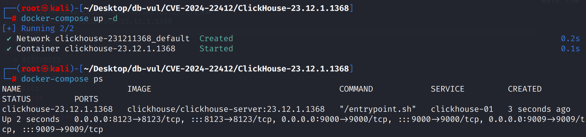
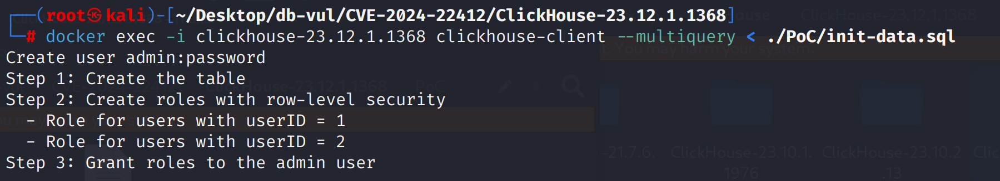
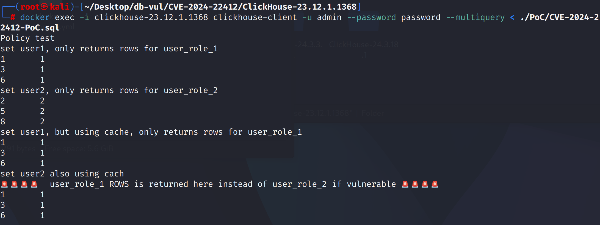

# CVE-2024-22412 CWE-863 ClickHouse Access Control Bypass

## Vulnerability Background
- **ClickHouse :** An open-source columnar database management system designed specifically for online analytical processing (OLAP) scenarios, capable of efficiently handling large-scale data queries and analysis tasks. It offers high-performance data compression and parallel computing capabilities, supporting fast queries and real-time analysis of large-scale datasets. ClickHouse's architecture supports distributed computing, allowing it to scale across multiple nodes and provide high availability and fault tolerance in big data environments. Thanks to its fast query performance and scalability, ClickHouse excels in handling big data analytics, log analysis, data warehousing, and other application scenarios.

## Vulnerability Mechanism
 ClickHouse's query caching mechanism fails to properly respect role-based access control. When query caches generate cache keys based solely on usernames, users of different roles may share the same cache entries, bypassing access controls and accessing data that should not have been viewed. Attackers can exploit this vulnerability by guessing queries to access sensitive information.

## Vulnerability Location
Analysis of the ClickHouse-23.12.1.1368 source code:

In the ClickHouse/src/Interpreters/Cache/QueryCache.cpp file

Line 501, The cache key in the QueryCache::createWriter function only contains the username (`user_name`), which causes users of different roles to share the same cached entry, thus bypassing role access control.

```cpp
// QueryCache.cpp Document, line 501
QueryCache::Writer QueryCache::createWriter(const Key & key, std::chrono::milliseconds min_query_runtime, bool squash_partial_results, size_t max_block_size, size_t max_query_cache_size_in_bytes_quota, size_t max_query_cache_entries_quota)
{
    //Includes only username key.user_name **********
    cache.setQuotaForUser(key.user_name, max_query_cache_size_in_bytes_quota, max_query_cache_entries_quota);

    std::lock_guard lock(mutex);
    return Writer(cache, key, max_entry_size_in_bytes, max_entry_size_in_rows, min_query_runtime, squash_partial_results, max_block_size);
}
```

## Remediation

Upgrade to a patched release: ClickHouse 24.1.1.2048 or later, 23.12.6.19 or later, 23.8.12.13 or later, or 23.3.22.3 or later. ClickHouse Cloud was patched in 24.0.2.54535. The query-cache key and access checks now include the stable user ID and current roles instead of relying on the user name alone.

If upgrading immediately is not possible, disable the query cache when an application switches roles dynamically. The vendor also recommends using separate users for distinct roles rather than switching roles on one user while query caching is enabled.

```diff
diff --git a/src/Interpreters/Cache/QueryCache.cpp b/src/Interpreters/Cache/QueryCache.cpp
index 1e8fdeb1b5db..c187c5c1fa6e 100644
--- a/src/Interpreters/Cache/QueryCache.cpp
+++ b/src/Interpreters/Cache/QueryCache.cpp
@@ -129,13 +129,12 @@ String queryStringFromAST(ASTPtr ast)
 QueryCache::Key::Key(
     ASTPtr ast_,
     Block header_,
-    const String & user_name_, std::optional<UUID> user_id_, const std::vector<UUID> & current_user_roles_,
+    std::optional<UUID> user_id_, const std::vector<UUID> & current_user_roles_,
     bool is_shared_,
     std::chrono::time_point<std::chrono::system_clock> expires_at_,
     bool is_compressed_)
     : ast(removeQueryCacheSettings(ast_))
     , header(header_)
-    , user_name(user_name_)
     , user_id(user_id_)
     , current_user_roles(current_user_roles_)
     , is_shared(is_shared_)
@@ -145,8 +144,8 @@ QueryCache::Key::Key(
 {
 }
 
-QueryCache::Key::Key(ASTPtr ast_, const String & user_name_, std::optional<UUID> user_id_, const std::vector<UUID> & current_user_roles_)
-    : QueryCache::Key(ast_, {}, user_name_, user_id_, current_user_roles_, false, std::chrono::system_clock::from_time_t(1), false) /// dummy values for everything != AST or user name
+QueryCache::Key::Key(ASTPtr ast_, std::optional<UUID> user_id_, const std::vector<UUID> & current_user_roles_)
+    : QueryCache::Key(ast_, {}, user_id_, current_user_roles_, false, std::chrono::system_clock::from_time_t(1), false) /// dummy values for everything != AST or user name
 {
 }
 
@@ -404,10 +403,9 @@ QueryCache::Reader::Reader(Cache & cache_, const Key & key, const std::lock_guar
     const auto & entry_key = entry->key;
     const auto & entry_mapped = entry->mapped;
 
-    const bool is_same_user_name = (entry_key.user_name == key.user_name);
     const bool is_same_user_id = ((!entry_key.user_id.has_value() && !key.user_id.has_value()) || (entry_key.user_id.has_value() && key.user_id.has_value() && *entry_key.user_id == *key.user_id));
     const bool is_same_current_user_roles = (entry_key.current_user_roles == key.current_user_roles);
-    if (!entry_key.is_shared && (!is_same_user_name || !is_same_user_id || !is_same_current_user_roles))
+    if (!entry_key.is_shared && (!is_same_user_id || !is_same_current_user_roles))
     {
         LOG_TRACE(logger, "Inaccessible query result found for query {}", doubleQuoteString(key.query_string));
         return;
@@ -509,7 +507,7 @@ QueryCache::Writer QueryCache::createWriter(const Key & key, std::chrono::millis
     /// Update the per-user cache quotas with the values stored in the query context. This happens per query which writes into the query
     /// cache. Obviously, this is overkill but I could find the good place to hook into which is called when the settings profiles in
     /// users.xml change.
-    cache.setQuotaForUser(key.user_name, max_query_cache_size_in_bytes_quota, max_query_cache_entries_quota);
+    cache.setQuotaForUser(key.user_id, max_query_cache_size_in_bytes_quota, max_query_cache_entries_quota);
 
     std::lock_guard lock(mutex);
     return Writer(cache, key, max_entry_size_in_bytes, max_entry_size_in_rows, min_query_runtime, squash_partial_results, max_block_size);
```

## Affected Versions

- ClickHouse 24.x before 24.1.1.2048
- ClickHouse 23.12.x before 23.12.6.19
- ClickHouse 23.8.x before 23.8.12.13
- ClickHouse 23.3.x before 23.3.22.3
- ClickHouse Cloud before 24.0.2.54535

## Environment Setup
Start the Docker environment; ClickHouse version is 23.12.1.1368

```txt
CNA:GitHub,Inc.  Base Score:2.4 LOW Vector:CVSS:3.1/AV:N/AC:H/PR:N/UI:N/S:U/C:L/I:L/A:H
```

```txt
cpe:2.3:a:clickhouse:clickhouse:23.12.1.1368:*:*:*:*:*:*:*
```



## Vulnerability Reproduction
1. Enter the container command line to connect to ClickHouse and execute the data initialization script

```bash
   docker exec -i clickhouse-23.12.1.1368 clickhouse-client --multiquery < ./PoC/init-data.sql
   ```



2. Using the user information created in the initialization script to connect to ClickHouse and execute PoC code, you can see that when querying via cache, user2 successfully retrieves data belonging to user1, achieving access control bypass

```bash
   docker exec -i clickhouse-23.12.1.1368 clickhouse-client -u admin --password password --multiquery < ./PoC/CVE-2024-22412-PoC.sql
   ```



## PoC Analysis
The initialization script creates users with different effective roles and data visibility. One user first populates the query cache; the second user then issues the same query under a different role and receives the first user's cached result. This demonstrates that the vulnerable cache key failed to include all authorization context.
## References
[NVD - CVE-2024-22412](https://nvd.nist.gov/vuln/detail/CVE-2024-22412)

[CVE-2024-22412 - Behind the bug, a classic caching problem in the ClickHouse query cache](https://blog.runreveal.com/cve-2024-22412-behind-the-bug-a-classic-caching-problem-in-the-clickhouse-query-cache/)

[Flush cached result when user switch role · Issue #58054 · ClickHouse/ClickHouse](https://github.com/ClickHouse/ClickHouse/issues/58054)

[Improve isolation of query cache entries under re-created users or role switches by rschu1ze · Pull Request #58611 · ClickHouse/ClickHouse](https://github.com/ClickHouse/ClickHouse/pull/58611/files#diff-3577554d4a0893fd7235a7e517b06bea30340386294a9d49df6a3246209de854)
