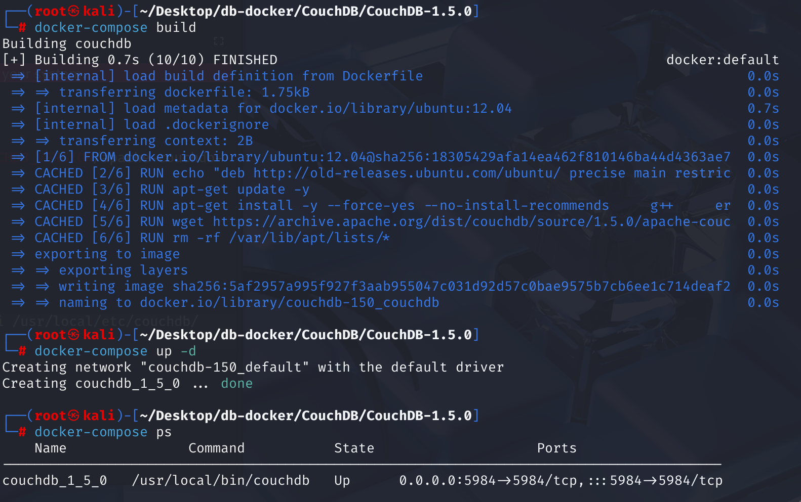
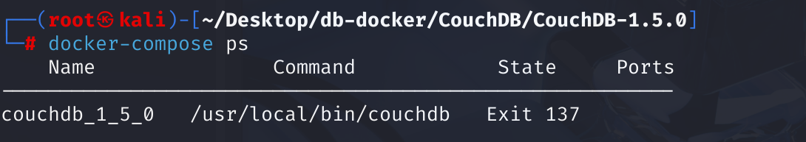

# CVE-2014-2668 CWE-20 CouchDB DoS

## Vulnerability Background
- **CouchDB :** An open-source database project led by the Apache Software Foundation, a document-oriented NoSQL database. It uses JSON documents to store data, supports Multi-Version Concurrency Control (MVCC), and offers powerful data synchronization capabilities, making it easy to sync data across multiple devices, making it ideal for building distributed applications. CouchDB also offers flexible query functionality, allowing users to query documents using JavaScript Query Language, and it also supports full-text search and views for processing and analyzing data.
- **/_uuids:** In Apache CouchDB, `/_uuids` is a built-in API endpoint whose main function is to generate one or more universal unique identifiers (UUIDs) on demand. These UUIDs are typically used as `_id` fields in CouchDB documents to ensure each document has a unique identifier within the database (even in distributed environments). Clients can obtain UUIDs by sending GET requests to the endpoint, or specify the number of UUIDs to generate via `count` parameters. For example, a request `/_uuids?count=5` will return a JSON object containing five new UUIDs. This feature simplifies the process of creating unique document IDs within the application.
- **CWE-20 (Improper Input Validation):** "Improper Input Validation," when software receives data from external sources (such as user input, network data, files, etc.) but fails to sufficiently and correctly verify whether the data meets the expected format, type, length, scope, or content, or fails to clean up potentially malicious content. Such incomplete or improper authentication can lead to various security issues, such as buffer overflow, injection attacks (like SQL injection, cross-site scripting XSS), path traversal, denial of service, and even allowing attackers to control program flow or access unauthorized resources.

## Vulnerability Mechanism
 In Apache CouchDB 1.5.0 and earlier `/_uuids` `count` query parameters in handlers can accept unreasonably large values. When CouchDB tries to fulfill a request generating a large number of UUIDs, even with just one malicious GET request, the CouchDB server becomes unresponsive and can actually "crash" or crash.

**Failure to limit request parameters (CWE-20)--> generates a large number of UUIDs causing resource exhaustion --> Denial of Service (DoS) attacks**

## Vulnerability Location
In the CouchDB 1.5.0 source code

In the src\couchdb\couch_httpd_misc_handlers.erl file, line 107, `handle_uuids_req` function is used to handle `GET /_uuids` requests. This function generates a specified number of UUIDs and returns them to the client. However, the value of the `count` parameter is not restricted, allowing attackers to request large numbers of UUIDs, consuming server resources and causing denial-of-service (DoS) attacks.

```erlang
handle_uuids_req(#httpd{method='GET'}=Req) ->
    Count = list_to_integer(couch_httpd:qs_value(Req, "count", "1")),
    UUIDs = [couch_uuids:new() || _ <- lists:seq(1, Count)],
    Etag = couch_httpd:make_etag(UUIDs),
    couch_httpd:etag_respond(Req, Etag, fun() ->
        CacheBustingHeaders = [
            {"Date", couch_util:rfc1123_date()},
            {"Cache-Control", "no-cache"},
            % Past date, ON PURPOSE!
            {"Expires", "Fri, 01 Jan 1990 00:00:00 GMT"},
            {"Pragma", "no-cache"},
            {"ETag", Etag}
        ],
        send_json(Req, 200, CacheBustingHeaders, {[{<<"uuids">>, UUIDs}]})
    end);
```

## Remediation
Add the `max_count = 1000` option (UUID configuration) to the etc/couchdb/default.ini.tpl.in file to allow limiting the number of UUIDs requested by the /_uuids processor in a single request.

At the same time, the `handle_uuids_req` function adds checks for `count` values in request parameters to limit the number of generated UUIDs and prevent potential resource exhaustion attacks.

```erlang
handle_uuids_req(#httpd{method='GET'}=Req) ->
    Max = list_to_integer(couch_config:get("uuids","max_count","1000")),
    Count = list_to_integer(couch_httpd:qs_value(Req, "count", "1")),
    case Count > Max of
        true -> throw({forbidden, <<"count parameter too large">>});
        false -> ok
    end,
    UUIDs = [couch_uuids:new() || _ <- lists:seq(1, Count)],
    Etag = couch_httpd:make_etag(UUIDs),
    couch_httpd:etag_respond(Req, Etag, fun() ->
        CacheBustingHeaders = [
            {"Date", couch_util:rfc1123_date()},
            {"Cache-Control", "no-cache"},
            % Past date, ON PURPOSE!
            {"Expires", "Fri, 01 Jan 1990 00:00:00 GMT"},
            {"Pragma", "no-cache"},
            {"ETag", Etag}
        ],
        send_json(Req, 200, CacheBustingHeaders, {[{<<"uuids">>, UUIDs}]})
    end);
```

## Affected Versions
Apache CouchDB versions 1.3.1, 1.4.0, and 1.5.0 and earlier

## Environment Setup
Start the Docker environment, CouchDB version is 1.5.0



## Vulnerability Reproduction
1. Use the `curl` command to send a GET request to the CouchDB `/_uuids` endpoint, set the `count` parameter to 9, and successfully obtain 9 UUIDs, indicating that the CouchDB 1.5.0 instance is running normally and the `_uuids` interface is available.

However, if you specify an extremely large value in the `count` parameter and wait for a while, you get a `curl: (52) Empty reply from server` error, which usually means the client successfully connected to the server, but the server has not returned any data.

```bash
curl http://127.0.0.1:5984/_uuids?count=99999999999999999999999999999999999999999999999999999999999999999999999
```


2. Check the status of the CouchDB container and find an `Exit 137` error. This usually means the container was forcibly terminated by the system, mainly due to insufficient memory (OOM) or receiving a `SIGKILL` signal. Successfully implemented DoS attacks.



## PoC Analysis

```http
http://<target-ip>:<target-port>/_uuids?count=99999999999999999999999999999999999999999999999999999999999999999999999
```

A request is sent to the /_uuids interface of the CouchDB service running on the target computer (default port 5984), asking it to generate a large number of UUIDs. The CouchDB server attempts to allocate massive memory and CPU resources to generate the UUIDs for this massive request. Due to rapid resource depletion, servers are likely to become unresponsive, suspended, or even completely crash, resulting in **Denial of Service (DoS)**.

## References
[NVD - CVE-2014-2668](https://nvd.nist.gov/vuln/detail/CVE-2014-2668)

[Apache CouchDB 1.5.0 - 'uuids' Denial of Service - Multiple dos Exploit](https://www.exploit-db.com/exploits/32519)

[2.7. CVE-2014-2668: Denial of Service (CPU and memory consumption) caused by /_uuids count parameter — Apache CouchDB® 3.3 Documentation - CouchDB Database](https://couchdb-docs.apache.ac.cn/en/stable/cve/2014-2668.html)

[1.13. 1.5.x Branch — Apache CouchDB® 3.5 Documentation --- 1.13. 1.5.x Branch — Apache CouchDB® 3.5 Documentation](https://docs.couchdb.org/en/stable/whatsnew/1.5.html#release-1-5-1)

https://github.com/apache/couchdb/compare/1.5.0...1.5.1#diff-65df74b3875d7ffa71d97f92ff6cac104fe844d8658932cf1af8bccf6078b9ce
