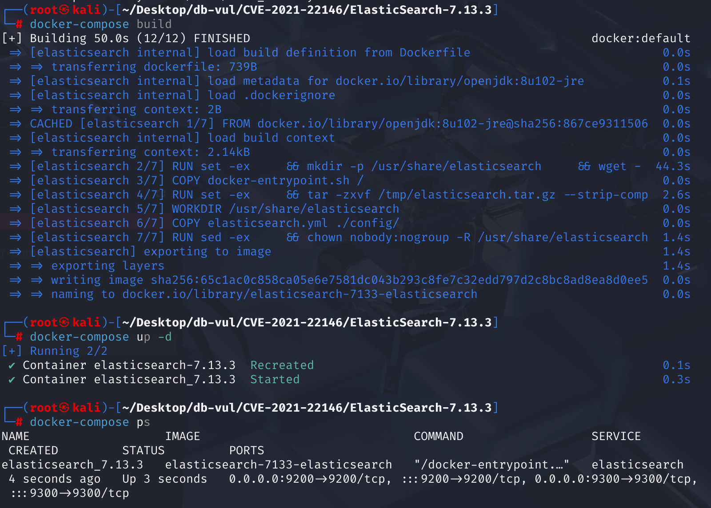
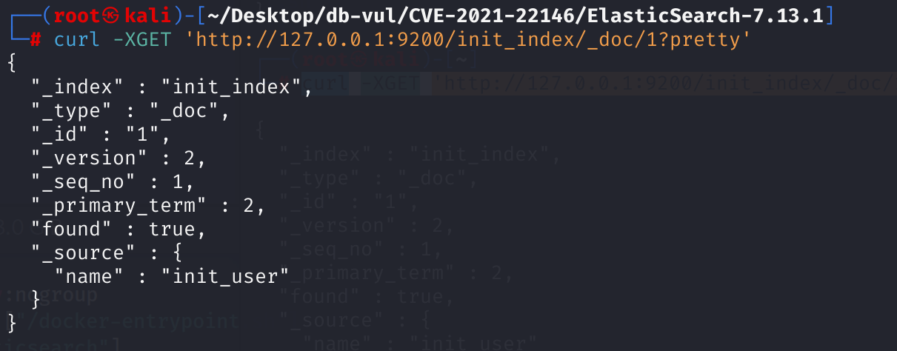
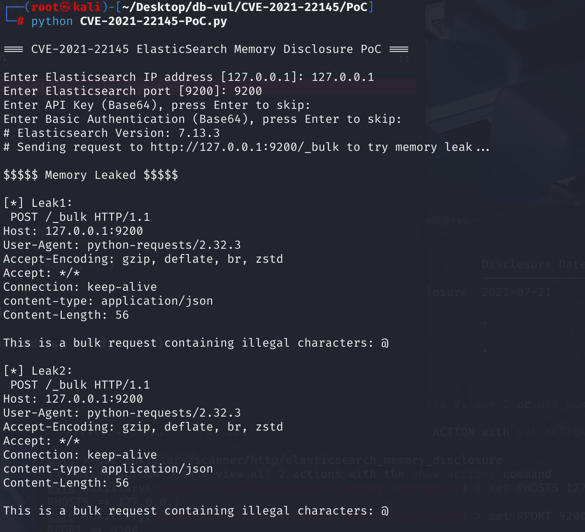

# CVE-2021-22145 CWE-125/CWE-200 Elasticsearch 内存信息泄露

## 漏洞背景

**Elasticsearch：** 一款开源的分布式 RESTful 搜索与分析引擎，也可用作可扩展的数据存储和向量数据库。它支持实时搜索、多租户、分布式索引与存储，并以字段结构灵活的 JSON 文档保存数据。Elasticsearch 擅长全文检索和复杂搜索，常用于日志分析、站内搜索等场景，也可通过增加节点扩展集群；但在事务完整性和数据更新一致性方面通常弱于传统关系型数据库。

## 漏洞原理


Elasticsearch 7.10.0 至 7.13.3 的错误报告流程存在信息泄露问题。能够向 Elasticsearch 提交任意查询的用户可发送畸形请求，使错误消息包含复用缓冲区中先前使用过的部分数据。这些残留内容可能包括 Elasticsearch 文档或身份验证信息。

处理 `_bulk` 接口请求时，Elasticsearch 会逐行解析请求正文，预期格式为 `action_and_meta_data\n` 加可选的 `source\n`，即多行 JSON。若请求正文包含无效或无法解析的数据（例如 `@\n`），Elasticsearch 会抛出异常。在构造错误响应时，部分底层实现（如 `JsonXContentParser.nextToken`）会把解析失败时使用的原始缓冲区内容直接写入异常字符串。

## 漏洞定位


Elasticsearch 7.13.3 使用 Jackson Core 2.10.4，问题源于 Jackson 对 JSON 解析错误的处理方式。

1. Jackson Core 2.10.4

在 `src/main/java/com/fasterxml/jackson/core/JsonLocation.java` 文件中，第 169 行的 `_appendSourceDesc` 方法会截取一小段发生 JSON 解析错误时的原始数据，并将其附加到最终异常信息中。第 **201** 和 **205** 行通过 `_append` 从字符数组（`ch`）中提取片段，追加到正在构造的错误消息字符串（`sb`），再更新剩余字符计数。

其中，`String` 构造函数的第二个参数被硬编码为 `0`，表示始终从数组索引 0 开始读取。正确做法应从**当前解析位置**（即错误发生位置）截取数据；这里忽略了实际偏移量，错误地读取缓冲区开头的数据，这正是漏洞所在。

```java
 protected StringBuilder _appendSourceDesc(StringBuilder sb)
    {
        final Object srcRef = _sourceRef;

        if (srcRef == null) {
            sb.append("UNKNOWN");
            return sb;
        }
        // First, figure out what name to use as source type
        Class<?> srcType = (srcRef instanceof Class<?>) ?
                ((Class<?>) srcRef) : srcRef.getClass();
        String tn = srcType.getName();
        // standard JDK types without package
        if (tn.startsWith("java.")) {
            tn = srcType.getSimpleName();
        } else if (srcRef instanceof byte[]) { // then some other special cases
            tn = "byte[]";
        } else if (srcRef instanceof char[]) {
            tn = "char[]";
        }
        sb.append('(').append(tn).append(')');
        // and then, include (part of) contents for selected types:
        int len;
        String charStr = " chars";

        if (srcRef instanceof CharSequence) {
            CharSequence cs = (CharSequence) srcRef;
            len = cs.length();
            len -= _append(sb, cs.subSequence(0, Math.min(len, MAX_CONTENT_SNIPPET)).toString());
        } else if (srcRef instanceof char[]) {
            char[] ch = (char[]) srcRef;
            len = ch.length;
// 201 lines ********** intercept the original data causing the error and attach it to the final exception message ******** vulnerability point*******
            len -= _append(sb, new String(ch, 0, Math.min(len, MAX_CONTENT_SNIPPET)));
        } else if (srcRef instanceof byte[]) {
            byte[] b = (byte[]) srcRef;
            int maxLen = Math.min(b.length, MAX_CONTENT_SNIPPET);
// 205 lines ********** extract the original data that caused the error and attach it to the final exception message ******** vulnerability point*******
            _append(sb, new String(b, 0, maxLen, Charset.forName("UTF-8")));
            len = b.length - maxLen;
            charStr = " bytes";
        } else {
            len = 0;
        }
        if (len > 0) {
            sb.append("[truncated ").append(len).append(charStr).append(']');
        }
        return sb;
    }
```

在 `src/main/java/com/fasterxml/jackson/core/JsonFactory.java` 文件中，第 1025 行的 `createParser` 方法会接收包括初始偏移量 `offset` 在内的必要参数，并据此创建用于处理指定字节数组片段的 `JsonParser` 实例。

```java
@Override
public JsonParser createParser(byte[] data, int offset, int len) throws IOException, JsonParseException {
    IOContext ctxt = _createContext(data, true);
    // [JACKSON-512]: allow wrapping with InputDecorator
    if (_inputDecorator != null) {
        InputStream in = _inputDecorator.decorate(ctxt, data, offset, len);
        if (in != null) {
            return _createParser(in, ctxt);
        }
    }
    return _createParser(data, offset, len, ctxt);
}
```

`createParser` 负责初始化解析器，`_appendSourceDesc` 则在解析出错时生成源数据说明。调用 `JsonFactory.createParser(byte[] data, int offset, int len)` 后，如果解析失败，异常消息本应只包含指定逻辑载荷中的片段；但 `_appendSourceDesc` 忽略了 `offset`，始终从索引 `0` 开始读取。

2. Elasticsearch 7.13.3

在 `libs/x-content/src/main/java/org/elasticsearch/common/xcontent/json/JsonXContent.java` 文件中，`JsonXContent` 类将 XContent 接口定义的解析器、生成器等操作交给底层 Jackson 库处理。第 89 行调用了 Jackson 中存在缺陷的方法。Elasticsearch 基于 Netty 的网络层接收到的数据块可能只是较大字节缓冲区的一部分，因此上层会调用 `createParser` 并显式传入偏移量和长度，要求它仅解析指定片段；`JsonXContent` 将这些参数原样传递给 `jsonFactory.createParser(data, offset, length)`。

```java
    @Override
public XContentParser createParser(NamedXContentRegistry xContentRegistry,
        DeprecationHandler deprecationHandler, byte[] data, int offset, int length) throws IOException {
    return new JsonXContentParser(xContentRegistry, deprecationHandler, jsonFactory.createParser(data, offset, length));
}
```

**总结：**

遇到畸形 JSON 时，Jackson 会生成包含部分源数据的错误消息以便调试。但该库错误地从内部缓冲区起始位置读取数据，而不是从当前输入片段的正确偏移量开始读取。

向受影响的 Elasticsearch 节点发送畸形查询时，会依次发生以下过程：

1. Elasticsearch 使用从缓冲池中取得的缓冲区处理恶意请求。
2. 该缓冲区可能残留先前请求处理过的敏感数据，例如用户文档片段或 Base64 编码的身份验证信息。
3. 请求交由 Jackson 解析后，因格式错误而解析失败并抛出异常。
4. 生成异常消息时触发 Jackson 缺陷，从缓冲区开头读取一段数据，并将其写入返回给用户的错误消息。
5. 攻击者由此获得本不应暴露的缓冲区残留数据。

## 漏洞修复


将 Elasticsearch 7.10.0 至 7.13.3 升级到 Elasticsearch 7.13.4 或更高版本。Elastic 安全公告将底层问题识别为越界读取（CWE-125），CVE 记录则将其影响归类为敏感信息泄露（CWE-200）；因此，本文档原有的 CWE-209 标签并不准确。

在依赖项层面，Jackson 的修复引入了 `com.fasterxml.jackson.core.io.ContentReference`，用于携带原始数据源及其逻辑 `offset` 和 `length`。生成错误消息时只读取当前有效输入片段，不再从复用的底层缓冲区开头取值。

在升级之前，限制提交任意查询或格式错误的批量请求的能力，使 Elasticsearch 远离不受信任的网络，并避免向不受信任的客户端返回详细的解析器异常。这些控制减少了暴露，但不会从重用的缓冲区中删除残留数据。

## 影响范围


- Elasticsearch 7.10.0 至 7.13.3

- Jackson Core 2.0.0（含）至 2.13.0（不含）

- 任何能够发送请求（无论是否授权）的用户都可能触发此漏洞。
- 泄露的内容是不可预测的，依赖于内存中的残留数据，这可能会暴露敏感信息。

## 环境搭建

1. 启动 Docker 环境，ElasticSearch 版本为 7.13.3

   

2. 由于7.x 以后默认只支持 _doc 作为类型，甚至可以省略类型。Docker 环境中已创建一个索引为 init_index、类型为 _doc、文档 ID 为 1 的文档，并设置字段 name 为 init_user。使用以下命令查看文档的信息，若报错则等待一段时候后再发送请求，直到成功返回结果。

   ```bash
   curl -XGET 'http://127.0.0.1:9200/init_index/_doc/1?pretty'
   ```

   

## 漏洞复现


针对 Elasticsearch 7.13.3 运行随附的 PoC。该脚本先填充请求缓冲区，再提交畸形 `_bulk` 载荷，并检查 `error.reason` 中是否出现畸形 JSON 片段之外的字节：

```bash
python CVE-2021-22145-PoC.py
```

由于缓冲区复用具有不确定性，可能需要多次尝试。若响应只包含当前请求的数据，只能证明触发了错误处理路径，不能证明泄露了其他用户的数据。

## PoC分析

运行 PoC 文件，输入 ElasticSearch 运行的 IP 和端口，用于 Docker 环境为设置 API key 和认证，直接回车跳过。运行后会发送含有“格式非法”的 bulk 请求，可以看到提取的返回的错误信息中包含了请求头和请求体。

```bash
python CVE-2021-22145-PoC.py
```

这个 PoC 解析 Elasticsearch 错误响应 error.reason 中携带的内存数据。通过 PoC 发了一个只包含信息： This is a bulk request containing illegal characters: @\n 的请求体，@\n 会被 Elasticsearch 认为“格式非法”的 bulk 请求，所以它返回错误信息。但错误信息里还把刚才发的请求头和请求体内容（即 This is a bulk request containing illegal characters: @\n ）给回显了出来。这说明**目标服务器确实将内存缓冲区中之前使用过的数据包含到了错误信息中**，说明内存泄漏漏洞成功触发了。但是当前泄露的内存内容比较有限，只是请求本身的数据，并没有更多敏感信息。



## 参考链接


[NVD - CVE-2021-22145](https://nvd.nist.gov/vuln/detail/CVE-2021-22145)

[Generation of Error Message Containing Sensitive Information in Elasticsearch · CVE-2021-22145 · GitHub Advisory Database](https://github.com/advisories/GHSA-q394-h7f5-7f44)

[ElasticSearch 7.13.3 - Memory disclosure - Multiple webapps Exploit](https://www.exploit-db.com/exploits/50149)

[Leaking memory via source code snippets in JsonLocation · Proposal · FasterXML/jackson-core --- Memory Disclosure via Source Snippet in JsonLocation · Advisory · FasterXML/jackson-core](https://github.com/FasterXML/jackson-core/security/advisories/GHSA-wf8f-6423-gfxg)

[Start work on solving #652, #658 · FasterXML/jackson-core@b89098e](https://github.com/FasterXML/jackson-core/commit/b89098e400be712102f6bee5393e8af259bf7737#diff-25952435e08ee17b1c05e47d14e602231876f290f25482816cf95483b1855d04)
