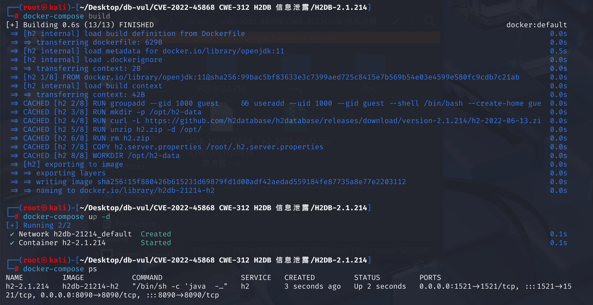
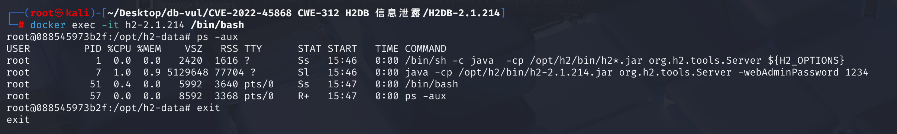

# CVE-2022-45868 CWE-312 H2DB information leak

## Vulnerability Background
**Status note:** The CVE describes local disclosure of a clear-text administrator password supplied with the `-webAdminPassword` command-line option. H2 disputes that this is a product vulnerability because secrets should not be passed on a process command line, but H2 nevertheless removed clear-text support in 2.2.220.

## Vulnerability Mechanism
In H2 Database Engine before 2.2.220, the web-based management console can be started using the `-webAdminPassword` CLI option, which accepts the console password in clear text. A local user who can list another process's arguments may therefore recover the password. This is a local credential-exposure condition, not a remote disclosure by the H2 Console itself.

## Vulnerability Location
1. On line **346** of the **h2/src/main/org/h2/server/web/WebServer.java** file, the Web Admin Console can set the administrator password via the CLI parameter -webAdminPassword

```java
else if (Tool.isOption(a, "-webAdminPassword")) {
	setAdminPassword(args[++i]);
}
```

2. Trace the `setAdminPassword` function. At line **924** of the file, this method first checks whether the password is `null` or an empty string. If so, set `adminPassword` to `null` and return. Next, if the password is 128 characters long, try converting it to a byte array and return. Otherwise, the method generates a 32-byte random salt value and uses the SHA-256 algorithm to hash the password and salt value, producing a 64-byte result, combining the salt and hash values, and finally assigning the result to the `adminPassword`.

```java
void setAdminPassword(String password) {
     if (password == null || password.isEmpty()) {
         adminPassword = null;
         return;
     }
     if (password.length() == 128) {
         try {
             adminPassword = StringUtils.convertHexToBytes(password);
             return;
         } catch (Exception ex) {}
     }
     byte[] salt = MathUtils.secureRandomBytes(32);
     byte[] hash = SHA256.getHashWithSalt(password.getBytes(StandardCharsets.UTF_8), salt);
     byte[] total = Arrays.copyOf(salt, 64);
     System.arraycopy(hash, 0, total, 32, 32);
     adminPassword = total;
 }
```

This method does not enforce password length; the plaintext password entered by the user will be received and processed. However, the fixed code requires the password length to be 128; otherwise, an exception will be thrown. This ensures that only valid password hashes generated using `encodeAdminPassword` methods are accepted, enhancing system security and consistency.

## Remediation

Upgrade to H2 2.2.220 or later and apply the behavior introduced by pull request 3833. The patched implementation no longer accepts a clear-text `webAdminPassword`: configuration and programmatic startup must use a salted password hash, while the command-line `main()` entry point rejects this option.

Generate the hash with the supported H2 helper instead of placing a password directly in a command line or configuration file. Rotate any administrator password that may have appeared in process listings, shell history, service definitions, CI logs, or configuration backups. Restrict the H2 Console to localhost or a trusted management network and protect it with network-layer authentication.

## Affected Versions
\>= 1.4.198, < 2.2.220

## Environment Setup
1. In the docker-compose.yml file, set the value of the webAdminPassword parameter to 1234 via the environment variable


2. Launch the Docker environment running H2DB v2.1.214



## Vulnerability Reproduction
1. Enter the container command line

```bash
docker exec -it h2-2.1.214 /bin/bash
```

2. Enter the following command in the command line. You will see that one process is owned by the root user, and the password `1234` of the Web Management Console is directly exposed in the command line.

```bash
ps -aux
```



## PoC Analysis
Enter the running `h2-2.1.214` container as a `guest` user, execute the `ps -aux` command, and list all running processes in the container along with their details

```bash
docker exec --user guest h2-2.1.214 ps -aux
```

## References
[H2 issue #3686: CVE-2022-45868 password exposure (vendor dispute)](https://github.com/h2database/h2database/issues/3686)

[Sonatype CVE Feed - sonatype-2022-6243](https://sites.google.com/sonatype.com/vulnerabilities/sonatype-2022-6243)

[H2 Password Exposure in Databases · CVE-2022-45868 Vulnerability · GitHub Advisory Database --- Password exposure in H2 Database · CVE-2022-45868 · GitHub Advisory Database](https://github.com/advisories/GHSA-22wj-vf5f-wrvj)

[Prohibited use of plain text webAdminPassword values, forced use of hash values (initiated by katzyn) · Submit request #3833 · h2database/h2database --- Disallow plain webAdminPassword values to force usage of hashes by katzyn · Pull Request #3833 · h2database/h2database](https://github.com/h2database/h2database/pull/3833)

[Merge pull request #3833 from katzyn/password · h2database/h2database@581ed18](https://github.com/h2database/h2database/commit/581ed18ff9d6b3761d851620ed88a3994a351a0d#diff-f47def0628b95350112ca74edd9ba338b2b58a3563363961114c987953a67941)
