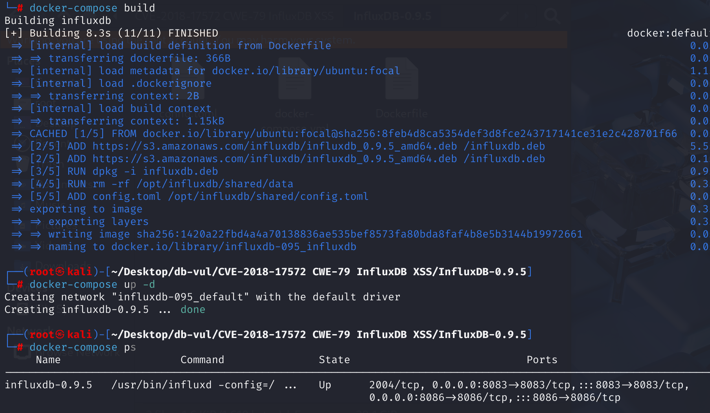
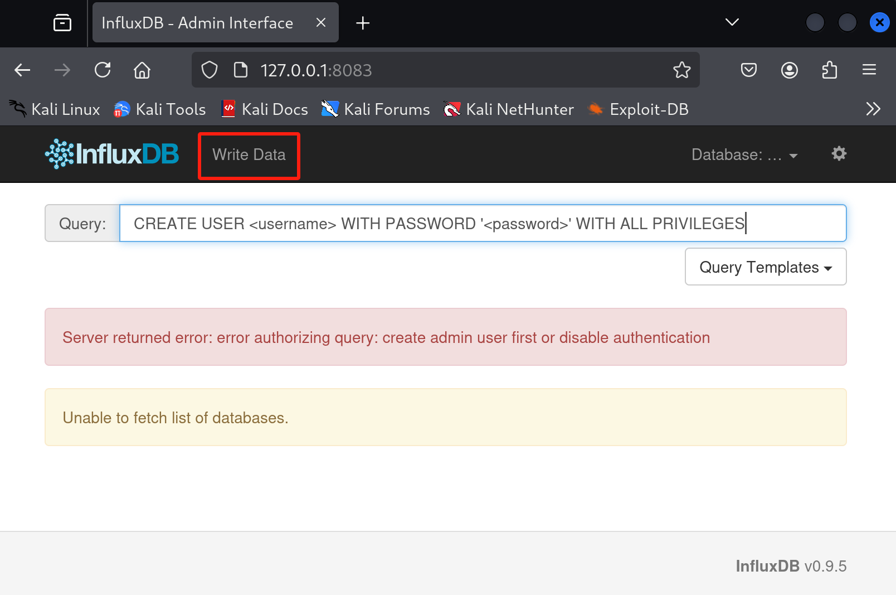
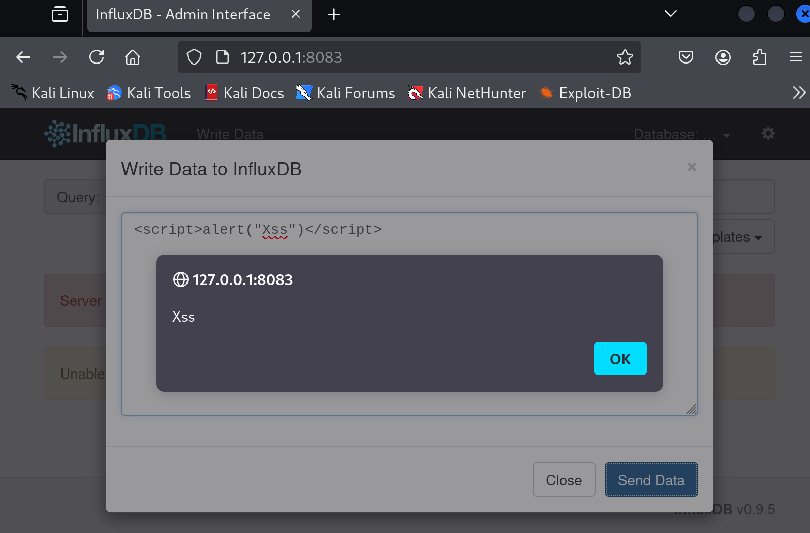

# CVE-2018-17572 CWE-79 InfluxDB XSS

## Vulnerability Background
InfluxDB 0.9.5 and earlier included an administrative web interface on port 8083. The interface's Write Data view rendered part of an unsuccessful line-protocol submission into the page without adequate HTML escaping, allowing attacker-controlled markup or script to execute in an administrator's browser.
## Vulnerability Mechanism
InfluxDB version <= 0.9.5 provides Reflected XSS in the management panel via the write data module.

## Vulnerability Location
1. On line 167 of the shared\admin\index.html file, you can find the HTML interface code for the Write Data module, where the `id` of the submit button is `action-send`.

```html
   <!-- Modal -->
    <div class="modal fade" id="myModal" tabindex="-1" role="dialog" aria-labelledby="myModalLabel">
      <div class="modal-dialog" role="document">
        <div class="modal-content">
          <div class="modal-header">
            <button type="button" class="close" data-dismiss="modal" aria-label="Close"><span aria-hidden="true">&times;</span></button>
            <h4 class="modal-title" id="myModalLabel">Write Data to InfluxDB</h4>
          </div>
          <div class="modal-body">
              <form>
                  <div class="form-group">
                      <textarea class="form-control" id="content-data"></textarea>
                  </div>
              </form>
              <div class="alert alert-danger" role="alert" id="modal-error"></div>
              <div class="alert alert-success" role="alert" id="modal-success"></div>
          </div>
          <div class="modal-footer">
            <button type="button" class="btn btn-default" data-dismiss="modal">Close</button>
            <button type="button" class="btn btn-primary" id="action-send">Send Data</button>
          </div>
        </div>
      </div>
    </div>
```

2. According to the `id` of the submit button in the Write Data module, locate it to the JS code processing section, at line **432** of the **shared\admin\js\admin.js** file. When a user clicks the send button (`id="action-send"`), a click event handler function is triggered. In this function, the data entered by the user in the text area (`id="content-data"`) is retrieved through `$("textarea#content-data").val()` and saved to the variable `data`. Then, this code uses jQuery's `$.post` method to send data to the InfluxDB server for write operations.

Based on the error message displayed after the bounce code, locate it to line **441**, and call the `showModalError` function to handle and display the error message

```js
// When the user clicks the send button, the data entered by the user is retrieved and sent to the server
// load the Write Data modal
$("button#action-send").click(function (e) {
    var data = $("textarea#content-data").val(); // Retrieves user input data and saves it to variable data

    var startTime = new Date().getTime();
    var write = $.post(connectionString() + "/write?db=" + currentlySelectedDatabase, data, function() {
    });

    write.fail(function (e) {
        if (e.status == 400) {
            showModalError("Failed to write: " + e.responseText)
        }
        else {
            showModalError("Failed to contact server: " + e.statusText)
        }
    });

    write.done(function (data) {
        var endTime = new Date().getTime();
        var elapsed = endTime - startTime;
        showModalSuccess("Write succeeded. (" + elapsed + "ms)");
    });
});
```

3. The `showModalError` function in line **91** is used to display error messages in the Write Data modal box. When calling the `showModalError` function, first call `hideModalSuccess` to hide the success message, then use jQuery's `.html()` method to wrap the error message (message parameter) inside `<p>` the tag and inserted into the `div#modal-error` and display the element.

```cpp
// show errors within the Write Data modal
var showModalError = function(message) {
    hideModalSuccess();

    $("div#modal-error").html("<p>" + message + "</p>").show();
}
```

Because strings are inserted directly using the `.html()` method, if the `message` contains malicious JavaScript code, it may be parsed and executed by the browser, triggering a reflection XSS attack.
 For example, if an attacker passes `<script>alert("XSS")</script>`, the script will be executed in a modal box.

## Remediation

Upgrade to InfluxDB 0.9.6-rc1, 0.9.6, or a later supported release. The corrected Write Data interface does not insert attacker-controlled request data into the page as executable HTML; untrusted values must be rendered with text-safe DOM APIs or context-appropriate HTML escaping.

If the legacy administration interface cannot be upgraded immediately, disable or remove it, restrict it to trusted administrators, and place it behind a reverse proxy that enforces authentication and a restrictive Content Security Policy. Do not rely on input blacklists alone, because valid HTML and JavaScript payloads have many equivalent encodings.

## Affected Versions
<= 0.9.5

## Environment Setup
Launch the Docker environment; influxdb version is 0.9.5



## Vulnerability Reproduction
1. Access port 8083 and join the influxdb homepage



2. Select the Write Data module, enter the command, and you will see the script bounce successfully, with an error `Failed to write: unable to parse '': missing fields`

```javascript
<script>alert("Xss")</script>
```



## PoC Analysis

```javascript
<script>alert("Xss")</script>
```

This code belongs to the **Reflected XSS** attack, which will pop up a prompt box containing the Xss field

## References
[influxdb-docker/Dockerfile at master · torkelo/influxdb-docker](https://github.com/torkelo/influxdb-docker/blob/master/Dockerfile)

[gist:1cb84f1f2d8ce993fd7b2d1366d35f48](https://gist.github.com/Raghavrao29/1cb84f1f2d8ce993fd7b2d1366d35f48)

[InfluxDB Reflected Cross-site Scripting · CVE-2018-17572 · GitHub Advisory Database](https://github.com/advisories/GHSA-w55x-q3gv-px85)
